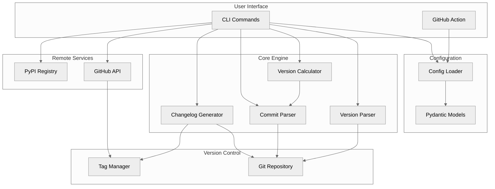
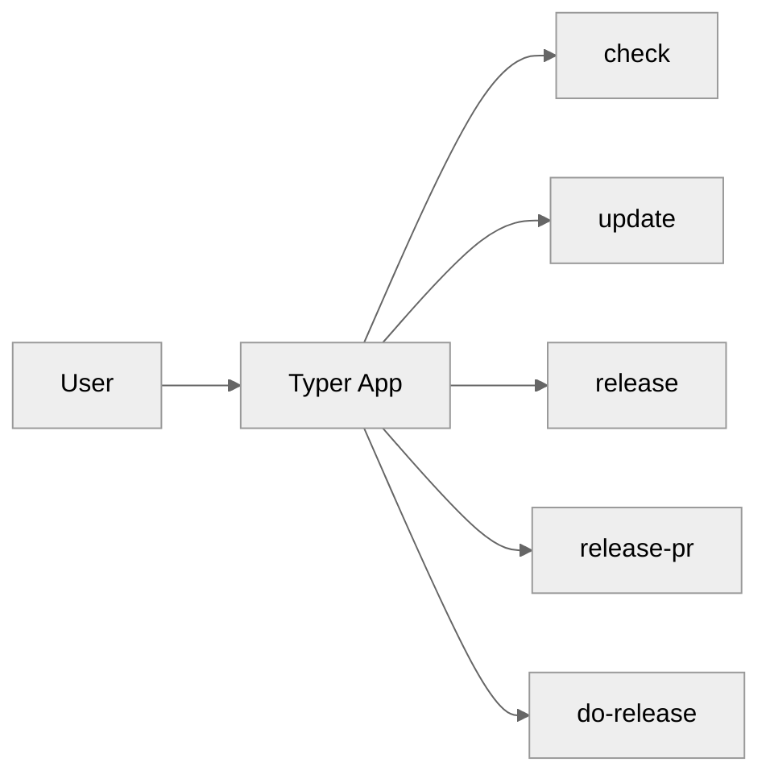
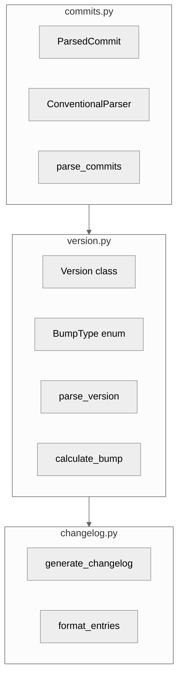
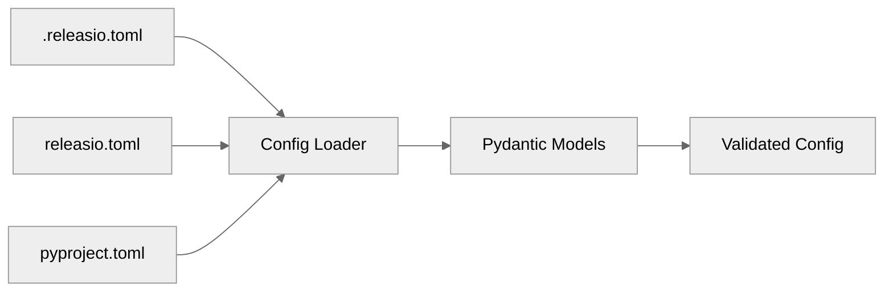

# System Overview

:material-view-dashboard: High-level architecture of releasio.

---

## Component Architecture



---

## Directory Structure

```
src/releasio/
├── cli/                  # Command-line interface
│   ├── app.py           # Typer app setup
│   ├── check.py         # check command
│   ├── update.py        # update command
│   ├── release.py       # release command
│   ├── release_pr.py    # release-pr command
│   └── do_release.py    # do-release command
│
├── core/                 # Business logic
│   ├── version.py       # Version parsing and bumping
│   ├── commits.py       # Commit parsing
│   ├── changelog.py     # Changelog generation
│   └── version_files.py # Version file management
│
├── config/               # Configuration handling
│   ├── loader.py        # Config file discovery
│   └── models.py        # Pydantic config models
│
├── vcs/                  # Version control
│   └── git.py           # Git operations
│
├── forge/                # Forge integrations
│   └── github.py        # GitHub API client
│
├── publish/              # Publishing
│   └── pypi.py          # PyPI publishing
│
└── exceptions.py         # Custom exceptions
```

---

## Core Components

### CLI Layer (`cli/`)

The CLI layer handles user interaction:



**Responsibilities:**

- Parse command-line arguments
- Validate inputs
- Display formatted output (Rich)
- Orchestrate core operations

### Core Layer (`core/`)

The core layer contains all business logic:



**Responsibilities:**

- Parse commit messages
- Calculate version bumps
- Generate changelogs
- Manage version files

### Config Layer (`config/`)

Configuration loading and validation:



**Priority order:**

1. `.releasio.toml` (highest)
2. `releasio.toml`
3. `pyproject.toml` under `[tool.releasio]`

### VCS Layer (`vcs/`)

Git operations abstraction:

```python
class GitRepository:
    def get_commits_since_tag(self, tag: str) -> list[Commit]
    def get_latest_tag(self) -> str | None
    def create_tag(self, tag: str, message: str) -> None
    def push(self, ref: str) -> None
```

### Forge Layer (`forge/`)

GitHub integration:

```python
class GitHubClient:
    def create_release(self, tag: str, body: str) -> Release
    def create_pull_request(self, title: str, body: str) -> PullRequest
    def upload_assets(self, release_id: int, files: list[Path]) -> None
```

### Publish Layer (`publish/`)

PyPI publishing:

```python
class PyPIPublisher:
    def build(self) -> None
    def publish(self, trusted: bool = True) -> None
    def validate(self) -> bool
```

---

## Key Classes

### Version

```python
@dataclass(frozen=True)
class Version:
    major: int
    minor: int
    patch: int
    pre_release: str | None = None
    pre_release_num: int | None = None

    def bump(self, bump_type: BumpType) -> Version:
        ...

    def __str__(self) -> str:
        ...
```

### ParsedCommit

```python
@dataclass(frozen=True, slots=True)
class ParsedCommit:
    commit: Commit
    commit_type: str | None
    scope: str | None
    description: str
    body: str | None
    is_breaking: bool
    is_conventional: bool
```

### ReleasePyConfig

```python
class ReleasePyConfig(BaseModel):
    default_branch: str = "main"
    version: VersionConfig = VersionConfig()
    changelog: ChangelogConfig = ChangelogConfig()
    commits: CommitsConfig = CommitsConfig()
    github: GitHubConfig = GitHubConfig()
    publish: PublishConfig = PublishConfig()
    hooks: HooksConfig = HooksConfig()
```

---

## Design Patterns

### Strategy Pattern

Different changelog generators:

```python
class ChangelogGenerator(Protocol):
    def generate(self, commits: list[ParsedCommit]) -> str:
        ...

class NativeGenerator:
    def generate(self, commits: list[ParsedCommit]) -> str:
        ...

class GitCliffGenerator:
    def generate(self, commits: list[ParsedCommit]) -> str:
        ...
```

### Factory Pattern

Build tool selection:

```python
def get_publisher(tool: str) -> Publisher:
    match tool:
        case "uv":
            return UvPublisher()
        case "poetry":
            return PoetryPublisher()
        case "pdm":
            return PdmPublisher()
```

### Repository Pattern

Git operations:

```python
class GitRepository:
    def __init__(self, path: Path):
        self.path = path

    def get_commits(self) -> list[Commit]:
        ...

    def get_tags(self) -> list[str]:
        ...
```

---

## Error Handling

Custom exception hierarchy:

```python
class ReleaseError(Exception):
    """Base exception for releasio."""

class ConfigError(ReleaseError):
    """Configuration-related errors."""

class GitError(ReleaseError):
    """Git operation errors."""

class PublishError(ReleaseError):
    """Publishing errors."""

class GitHubError(ReleaseError):
    """GitHub API errors."""
```

---

## Testing Strategy

```
tests/
├── unit/              # Fast, isolated tests
│   ├── test_version.py
│   ├── test_commits.py
│   └── test_changelog.py
├── integration/       # Tests with real Git
│   ├── test_cli.py
│   └── test_workflow.py
└── conftest.py        # Shared fixtures
```

### Test Fixtures

```python
@pytest.fixture
def git_repo(tmp_path: Path) -> GitRepository:
    """Create a temporary Git repository."""
    subprocess.run(["git", "init"], cwd=tmp_path)
    return GitRepository(tmp_path)

@pytest.fixture
def sample_config() -> ReleasePyConfig:
    """Create a sample configuration."""
    return ReleasePyConfig()
```

---

## See Also

- [Data Flow](data-flow.md) - How data moves through the system
- [Contributing](../contributing/index.md) - Development guide
- [API Reference](../reference/index.md) - Code documentation
