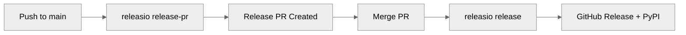

---
hide:
  - navigation
  - toc
---

# releasio

<p align="center">
  
</p>

<p align="center">
  <strong>Automated releases for Python projects</strong><br>
  <em>Version bumping, changelog generation, and PyPI publishing powered by conventional commits</em>
</p>

<p align="center">
  <a href="https://pypi.org/project/releasio/"></a>
  <a href="https://pypi.org/project/releasio/"></a>
  <a href="https://github.com/mikeleppane/releasio/blob/main/LICENSE"></a>
</p>

<p align="center">
  <a href="getting-started/quickstart.md" class="md-button md-button--primary">Get Started</a>
  <a href="https://github.com/mikeleppane/releasio" class="md-button">View on GitHub</a>
</p>

---

## Features

<div class="grid cards" markdown>

-   :material-source-pull: **Release PR Workflow**

    ---

    Automatically creates and maintains release PRs with version bumps and changelogs.
    Merge to release.

    [:octicons-arrow-right-24: Learn more](github/actions/index.md)

-   :material-format-list-checks: **Conventional Commits**

    ---

    Automatic version bumping based on commit types. `feat:` bumps minor,
    `fix:` bumps patch, `!` bumps major.

    [:octicons-arrow-right-24: Commit format](user-guide/commits/format.md)

-   :material-file-document-edit: **Beautiful Changelogs**

    ---

    Professional changelog generation with git-cliff. PR links, author attribution,
    and customizable templates.

    [:octicons-arrow-right-24: Changelog guide](user-guide/changelog/index.md)

-   :material-cog-outline: **Zero Configuration**

    ---

    Works out of the box with sensible defaults. Just run `releasio check`
    to see what would happen.

    [:octicons-arrow-right-24: Configuration](user-guide/configuration/index.md)

-   :material-github: **GitHub Actions**

    ---

    Native GitHub Actions support with trusted publishing (OIDC).
    No API tokens required for PyPI.

    [:octicons-arrow-right-24: Actions setup](github/actions/minimal.md)

-   :material-package-variant: **PyPI Publishing**

    ---

    Build and publish to PyPI with uv, poetry, pdm, or twine.
    Supports trusted publishing and private registries.

    [:octicons-arrow-right-24: Publishing guide](publishing/pypi.md)

</div>

---

## How It Works



1. **Push commits** to your main branch using [conventional commit](user-guide/commits/format.md) messages
2. **releasio release-pr** automatically creates a release PR with:
    - Version bump based on commit types
    - Updated changelog
    - All changes ready to review
3. **Merge the PR** to trigger the release
4. **releasio release** creates a GitHub release and publishes to PyPI

---

## Quick Start

### Installation

```bash
pip install releasio
```

!!! note "Requirement"
    releasio requires [git-cliff](https://git-cliff.org/) for changelog generation.
    Install it via your package manager or `cargo install git-cliff`.

### Preview a Release

```bash
releasio check
```

This shows what would happen without making any changes:

- The calculated next version
- Commits that would be included
- Changelog preview

### Create a Release PR

```bash
releasio release-pr --execute
```

Creates or updates a release PR with version bump and changelog.

### Full Release

```bash
releasio do-release --execute
```

Does everything in one command: updates version, generates changelog,
commits, tags, and publishes.

[:octicons-arrow-right-24: Full getting started guide](getting-started/quickstart.md)

---

## Version Bumping Rules

releasio follows [Semantic Versioning](https://semver.org/) with automatic detection:

| Commit Type | Version Bump | Example |
|-------------|--------------|---------|
| `feat:` | Minor (0.1.0 → 0.2.0) | `feat: add new feature` |
| `fix:` | Patch (0.1.0 → 0.1.1) | `fix: resolve bug` |
| `feat!:` or `BREAKING CHANGE:` | Major (0.1.0 → 1.0.0) | `feat!: redesign API` |
| `docs:`, `chore:`, etc. | Patch | `docs: update readme` |

!!! tip "Pre-1.0.0 Behavior"
    Before version 1.0.0, breaking changes bump minor instead of major,
    following common semver conventions for unstable APIs.

---

## GitHub Actions Integration

=== "Minimal Workflow"

    ```yaml
    name: Release

    on:
      push:
        branches: [main]

    permissions:
      contents: write
      pull-requests: write
      id-token: write

    jobs:
      release-pr:
        if: "!startsWith(github.event.head_commit.message, 'chore(release):')"
        runs-on: ubuntu-latest
        steps:
          - uses: actions/checkout@v4
            with:
              fetch-depth: 0

          - uses: mikeleppane/releasio@v2
            with:
              command: release-pr
              github-token: ${{ secrets.GITHUB_TOKEN }}

      release:
        if: startsWith(github.event.head_commit.message, 'chore(release):')
        runs-on: ubuntu-latest
        steps:
          - uses: actions/checkout@v4
            with:
              fetch-depth: 0

          - uses: mikeleppane/releasio@v2
            with:
              command: release
              github-token: ${{ secrets.GITHUB_TOKEN }}
    ```

=== "Manual Release"

    ```yaml
    name: Release

    on:
      workflow_dispatch:
        inputs:
          command:
            type: choice
            options: [check, release-pr, do-release]
          execute:
            type: boolean
            default: false

    jobs:
      release:
        runs-on: ubuntu-latest
        steps:
          - uses: actions/checkout@v4
            with:
              fetch-depth: 0

          - uses: mikeleppane/releasio@v2
            with:
              command: ${{ inputs.command }}
              execute: ${{ inputs.execute }}
              github-token: ${{ secrets.GITHUB_TOKEN }}
    ```

[:octicons-arrow-right-24: Complete GitHub Actions guide](github/actions/index.md)

---

## Configuration

releasio works with zero configuration, but you can customize everything:

=== ".releasio.toml"

    ```toml
    default_branch = "main"

    [version]
    tag_prefix = "v"

    [changelog]
    path = "CHANGELOG.md"

    [commits]
    types_minor = ["feat"]
    types_patch = ["fix", "perf", "docs"]

    [github]
    release_pr_branch = "release"
    release_pr_labels = ["release"]

    [publish]
    tool = "uv"
    ```

=== "pyproject.toml"

    ```toml
    [tool.releasio]
    default_branch = "main"

    [tool.releasio.version]
    tag_prefix = "v"

    [tool.releasio.changelog]
    path = "CHANGELOG.md"
    ```

[:octicons-arrow-right-24: Full configuration reference](user-guide/configuration/reference.md)
