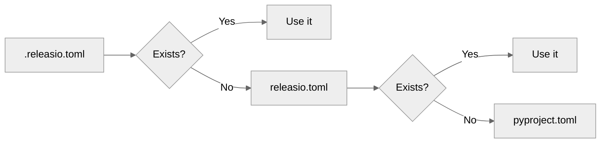

# Configuration Files

releasio supports multiple configuration file formats.

---

## Supported Files

### `.releasio.toml` (Recommended)

Dedicated configuration file with highest priority.

```toml title=".releasio.toml"
default_branch = "main"

[version]
tag_prefix = "v"

[changelog]
path = "CHANGELOG.md"
```

!!! tip "Use This When"
    - You want configuration separate from `pyproject.toml`
    - You prefer a hidden file (dotfile)
    - You have complex configuration

### `releasio.toml`

Visible configuration file.

```toml title="releasio.toml"
default_branch = "main"

[version]
tag_prefix = "v"
```

!!! tip "Use This When"
    - You want visible configuration
    - Other tools use dotfiles and you want distinction

### `pyproject.toml`

Configuration under `[tool.releasio]` section.

```toml title="pyproject.toml"
[tool.releasio]
default_branch = "main"

[tool.releasio.version]
tag_prefix = "v"

[tool.releasio.changelog]
path = "CHANGELOG.md"
```

!!! tip "Use This When"
    - You want all Python config in one file
    - You have simple configuration
    - You're already using pyproject.toml

---

## Priority Order

When multiple files exist, releasio uses this priority:



| Priority | File | Notes |
|----------|------|-------|
| 1 | `.releasio.toml` | Highest priority |
| 2 | `releasio.toml` | Second priority |
| 3 | `pyproject.toml` | Fallback |

!!! warning "No Merging"
    Only **one** configuration source is used.
    Files are not merged together.

---

## Format Differences

### Standalone Files

Use top-level keys directly:

```toml title=".releasio.toml"
default_branch = "main"

[version]
tag_prefix = "v"

[changelog]
path = "CHANGELOG.md"
```

### pyproject.toml

Requires `[tool.releasio]` prefix:

```toml title="pyproject.toml"
[tool.releasio]
default_branch = "main"

[tool.releasio.version]
tag_prefix = "v"

[tool.releasio.changelog]
path = "CHANGELOG.md"
```

---

## Required: pyproject.toml

Even when using `.releasio.toml`, **pyproject.toml is always required** for:

- Project name
- Current version
- Build system configuration

```toml title="pyproject.toml (always needed)"
[project]
name = "my-project"
version = "1.0.0"

[build-system]
requires = ["hatchling"]
build-backend = "hatchling.build"
```

---

## Example Structure

```
my-project/
├── .releasio.toml      # Release configuration
├── pyproject.toml      # Project metadata
├── src/
│   └── my_project/
│       └── __init__.py
└── CHANGELOG.md
```

---

## Validation

releasio validates configuration on load:

```bash
# Configuration errors are shown immediately
releasio check
```

Unknown keys cause errors (thanks to Pydantic's strict mode):

```
Error: Unknown configuration key 'unknwon_key' in [version]
```

This catches typos early!
