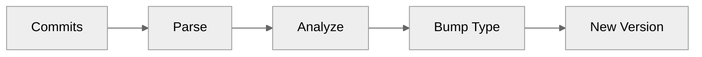

# Version Management

:material-tag: Automatic semantic versioning based on your commits.

---

## Overview

releasio automatically determines the next version by analyzing your commit history:



---

## How It Works

### Commit Analysis

releasio scans commits since the last release:

```bash
# Example commits
feat: add user dashboard       # Minor bump
fix: resolve login issue       # Patch bump
docs: update README            # Patch bump
feat!: redesign API           # Major bump
```

### Version Calculation

| Commit Type | Version Bump | Example |
|-------------|--------------|---------|
| `feat!` or `BREAKING CHANGE` | **Major** | 1.0.0 → 2.0.0 |
| `feat` | Minor | 1.0.0 → 1.1.0 |
| `fix`, `docs`, `perf`, etc. | Patch | 1.0.0 → 1.0.1 |

The **highest** bump type wins:

```
fix: bug fix           → patch
feat: new feature      → minor (wins)
docs: documentation    → patch
─────────────────────────────────
Result: Minor bump
```

---

## Version Sources

releasio detects your current version from:

| Source | Priority | Example |
|--------|----------|---------|
| Git tags | Highest | `v1.2.3` |
| `pyproject.toml` | Medium | `version = "1.2.3"` |
| Version files | Lower | `__version__ = "1.2.3"` |

### Tag Format

Configure the tag prefix:

```toml title=".releasio.toml"
[version]
tag_prefix = "v"  # Tags: v1.0.0, v1.1.0
```

---

## Configuration

### Basic Options

```toml title=".releasio.toml"
[version]
# Tag prefix (default: "v")
tag_prefix = "v"

# Initial version for new projects
initial_version = "0.1.0"

# Auto-detect version files
auto_detect_version_files = true
```

### Commit Type Mapping

```toml title=".releasio.toml"
[commits]
# Types that trigger minor bumps
types_minor = ["feat"]

# Types that trigger patch bumps
types_patch = ["fix", "perf", "docs", "refactor", "style", "test", "build", "ci"]
```

---

## Sections

<div class="grid cards" markdown>

-   :material-semantic-web:{ .lg .middle } **Semantic Versioning**

    ---

    Understand version bump rules

    [:octicons-arrow-right-24: SemVer Guide](semver.md)

-   :material-alpha:{ .lg .middle } **Pre-releases**

    ---

    Alpha, beta, and RC versions

    [:octicons-arrow-right-24: Pre-releases](pre-releases.md)

-   :material-file-code:{ .lg .middle } **Version Files**

    ---

    Manage `__version__` and other files

    [:octicons-arrow-right-24: Version Files](version-files.md)

</div>

---

## Quick Examples

### Check Next Version

```bash
releasio check
```

Output:
```
📌 Current: v1.2.3
🚀 Next:    v1.3.0 (minor bump)
```

### Force Specific Version

```bash
releasio update --version 2.0.0 --execute
```

### Pre-release Version

```bash
releasio do-release --prerelease beta --execute
```
```
v1.2.3 → v1.3.0-beta.1
```

---

## See Also

- [Conventional Commits](../commits/index.md) - Commit format
- [Changelog Generation](../changelog/index.md) - Release notes
- [Configuration Reference](../configuration/reference.md) - All options
