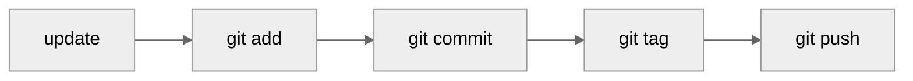

# releasio update

:material-pencil: Update version and changelog files locally without creating commits or PRs.

---

## Usage

```bash
releasio update [PATH] [OPTIONS]
```

## Description

The `update` command modifies your project files locally:

- Updates `version` in `pyproject.toml`
- Generates/updates `CHANGELOG.md`
- Updates any configured version files

Use this when you want fine-grained control over the release process.

---

## Arguments

| Argument | Type | Default | Description |
|----------|------|---------|-------------|
| `PATH` | Path | `.` | Project directory path |

---

## Options

| Option | Short | Description |
|--------|-------|-------------|
| `--execute` | | Apply changes (default: dry-run) |
| `--version` | | Override calculated version |
| `--prerelease` | | Create pre-release (alpha, beta, rc) |
| `--verbose` | `-v` | Show detailed output |

---

## Examples

### Preview Changes (Dry-Run)

```bash
releasio update
```

Shows what files would be modified without making changes.

### Apply Changes

```bash
releasio update --execute
```

Actually modifies the files.

### Force Specific Version

```bash
releasio update --execute --version 2.0.0
```

Override the calculated version with a specific one.

### Create Pre-Release

```bash
releasio update --execute --prerelease alpha
```

Creates a pre-release version like `1.2.0-alpha.1`.

---

## Files Modified

| File | Change |
|------|--------|
| `pyproject.toml` | `version` field updated |
| `CHANGELOG.md` | New entries added |
| Version files | If configured in `version_files` |

---

## Workflow



After `update`, you manually:

1. Review the changes
2. Commit with a message
3. Tag the release
4. Push to remote

!!! tip "Prefer release-pr"
    For most workflows, [`release-pr`](release-pr.md) is easier as it handles
    commits and PR creation automatically.

---

## See Also

- [check](check.md) - Preview without changes
- [release-pr](release-pr.md) - Create release PR (recommended)
- [do-release](do-release.md) - Complete workflow
