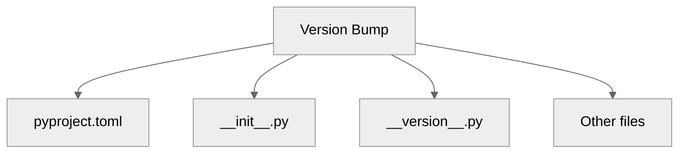

# Version Files

:material-file-code: Manage version numbers across your project files.

---

## Overview

releasio automatically updates version numbers in multiple locations:



---

## Default Behavior

### pyproject.toml

releasio always updates the version in `pyproject.toml`:

```toml title="pyproject.toml"
[project]
name = "my-package"
version = "1.2.3"  # ← Updated automatically
```

For Poetry projects:

```toml title="pyproject.toml"
[tool.poetry]
name = "my-package"
version = "1.2.3"  # ← Updated automatically
```

---

## Auto-Detection

releasio can automatically find and update version files:

```toml title=".releasio.toml"
[version]
auto_detect_version_files = true
```

### Detected Patterns

| File | Pattern |
|------|---------|
| `__init__.py` | `__version__ = "1.2.3"` |
| `__version__.py` | `__version__ = "1.2.3"` |
| `version.py` | `__version__ = "1.2.3"` |
| `_version.py` | `__version__ = "1.2.3"` |

### Detection Locations

releasio searches in:

1. Package root (`src/package/`)
2. Project root
3. Common subdirectories

---

## Manual Configuration

Specify version files explicitly:

```toml title=".releasio.toml"
[version]
auto_detect_version_files = false

[[version.files]]
path = "src/mypackage/__init__.py"
pattern = '__version__ = "{version}"'

[[version.files]]
path = "src/mypackage/version.py"
pattern = 'VERSION = "{version}"'
```

### Pattern Syntax

Use `{version}` as placeholder:

```toml
# Standard Python
pattern = '__version__ = "{version}"'

# With single quotes
pattern = "__version__ = '{version}'"

# Tuple format
pattern = 'VERSION = ({major}, {minor}, {patch})'

# Custom variable
pattern = 'PACKAGE_VERSION = "{version}"'
```

---

## Common Patterns

### Package `__init__.py`

```python title="src/mypackage/__init__.py"
"""My awesome package."""

__version__ = "1.2.3"
__author__ = "Your Name"
```

```toml title=".releasio.toml"
[[version.files]]
path = "src/mypackage/__init__.py"
pattern = '__version__ = "{version}"'
```

### Dedicated Version File

```python title="src/mypackage/_version.py"
"""Version information."""

__version__ = "1.2.3"
VERSION = __version__
VERSION_TUPLE = (1, 2, 3)
```

```toml title=".releasio.toml"
[[version.files]]
path = "src/mypackage/_version.py"
pattern = '__version__ = "{version}"'
```

### Multiple Variables

For files with multiple version references:

```toml title=".releasio.toml"
[[version.files]]
path = "src/mypackage/version.py"
patterns = [
    '__version__ = "{version}"',
    'VERSION = "{version}"',
]
```

---

## Lock File Updates

Update lock files when version changes:

```toml title=".releasio.toml"
[version]
update_lock_file = true
```

This runs:

| Tool | Command |
|------|---------|
| uv | `uv lock` |
| Poetry | `poetry lock --no-update` |
| PDM | `pdm lock` |

---

## Version Sources

### Reading Current Version

releasio determines the current version from:

1. **Git tags** (highest priority)
   ```bash
   git tag -l "v*" --sort=-version:refname | head -1
   ```

2. **pyproject.toml**
   ```toml
   [project]
   version = "1.2.3"
   ```

3. **Version files**
   ```python
   __version__ = "1.2.3"
   ```

### Priority Order

```
Git tag v1.2.3
    ↓ (if exists)
Use tag version
    ↓ (if not)
Read pyproject.toml
    ↓ (if not)
Read __init__.py
```

---

## Dynamic Versions

Some build backends support dynamic versions:

### Hatchling

```toml title="pyproject.toml"
[project]
dynamic = ["version"]

[tool.hatch.version]
path = "src/mypackage/__init__.py"
```

releasio updates the source file:

```toml title=".releasio.toml"
[[version.files]]
path = "src/mypackage/__init__.py"
pattern = '__version__ = "{version}"'
```

### Setuptools-scm

For projects using setuptools-scm, releasio creates git tags:

```toml title="pyproject.toml"
[project]
dynamic = ["version"]

[tool.setuptools_scm]
```

No version files needed - version comes from git tags.

---

## Non-Python Files

Update version in other file types:

### JSON Files

```toml title=".releasio.toml"
[[version.files]]
path = "package.json"
pattern = '"version": "{version}"'
```

### YAML Files

```toml title=".releasio.toml"
[[version.files]]
path = "config.yaml"
pattern = 'version: {version}'
```

### Markdown

```toml title=".releasio.toml"
[[version.files]]
path = "docs/version.md"
pattern = 'Current version: {version}'
```

---

## Validation

releasio validates version consistency:

```bash
releasio check
```

Output:
```
⚠️ Version mismatch detected:
   pyproject.toml: 1.2.3
   __init__.py:    1.2.2

Run 'releasio update --execute' to synchronize.
```

---

## Troubleshooting

### Version Not Updated

```
Warning: Could not update version in src/mypackage/__init__.py
```

**Causes**:

1. Pattern doesn't match file content
2. File path is incorrect
3. File permissions

**Solution**: Verify pattern matches exactly:

```bash
# Check current content
grep "__version__" src/mypackage/__init__.py

# Compare with pattern
# Pattern: __version__ = "{version}"
# File:    __version__ = "1.2.3"
```

### Multiple Matches

```
Warning: Multiple matches for pattern in file
```

**Solution**: Use a more specific pattern:

```toml
# Too broad
pattern = '"{version}"'

# More specific
pattern = '__version__ = "{version}"'
```

### Encoding Issues

```
Error: Could not read file (encoding error)
```

**Solution**: Ensure UTF-8 encoding:

```python
# Add to file
# -*- coding: utf-8 -*-
```

---

## Best Practices

### Do

- [x] Keep version in one source of truth
- [x] Use `pyproject.toml` as primary
- [x] Enable auto-detection for common patterns
- [x] Use dynamic versions when possible

### Don't

- [ ] Manually edit version numbers
- [ ] Have conflicting versions across files
- [ ] Use complex patterns that might break
- [ ] Forget to commit version changes

---

## See Also

- [Semantic Versioning](semver.md) - Version bump rules
- [Pre-releases](pre-releases.md) - Alpha/beta versions
- [Configuration Reference](../configuration/reference.md) - All options
