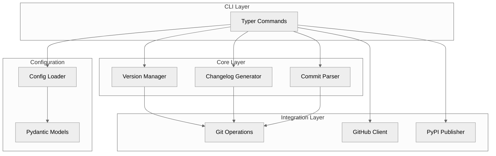

# Architecture

:material-sitemap: Understanding releasio's internal design.

---

## Overview

releasio is designed with clean separation of concerns:



---

## Sections

<div class="grid cards" markdown>

-   :material-view-dashboard:{ .lg .middle } **System Overview**

    ---

    High-level architecture and component relationships

    [:octicons-arrow-right-24: Overview](overview.md)

-   :material-transit-connection-variant:{ .lg .middle } **Data Flow**

    ---

    How data moves through the system

    [:octicons-arrow-right-24: Data Flow](data-flow.md)

</div>

---

## Design Principles

### 1. Separation of Concerns

Each layer has a specific responsibility:

| Layer | Responsibility |
|-------|----------------|
| CLI | User interaction, argument parsing |
| Core | Business logic, version calculation |
| Integration | External systems (Git, GitHub, PyPI) |
| Config | Configuration loading and validation |

### 2. Immutability

Core data structures are immutable:

```python
@dataclass(frozen=True, slots=True)
class ParsedCommit:
    commit: Commit
    commit_type: str | None
    description: str
    is_breaking: bool
```

### 3. Dependency Injection

Components receive dependencies, making them testable:

```python
def calculate_next_version(
    repo: GitRepository,
    config: ReleasePyConfig,
) -> Version:
    ...
```

### 4. Fail-Safe Defaults

Everything works with zero configuration:

```python
class VersionConfig(BaseModel):
    tag_prefix: str = "v"
    initial_version: str = "0.1.0"
```

---

## Technology Stack

| Component | Technology |
|-----------|------------|
| CLI Framework | Typer + Rich |
| Configuration | Pydantic v2 |
| Git Operations | GitPython / subprocess |
| GitHub API | httpx |
| Changelog | Native + git-cliff |
| Publishing | uv / poetry / pdm |
| Testing | pytest |

---

## See Also

- [Contributing](../contributing/index.md) - Development guide
- [API Reference](../reference/index.md) - Code documentation
