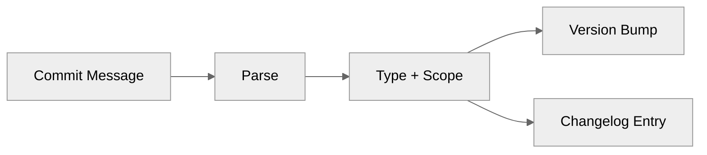

# Conventional Commits

:material-source-commit: Structured commit messages for automatic releases.

---

## Overview

releasio uses [Conventional Commits](https://www.conventionalcommits.org/) to:

- **Determine version bumps** automatically
- **Generate changelogs** from commit messages
- **Categorize changes** by type



---

## Commit Format

```
<type>[optional scope]: <description>

[optional body]

[optional footer(s)]
```

### Examples

```bash
# Simple feature
feat: add user authentication

# With scope
fix(api): handle null response

# Breaking change
feat!: redesign authentication flow

# With body and footer
feat(auth): add OAuth2 support

Implements OAuth2 authentication using the authorization code flow.
Supports Google, GitHub, and Microsoft providers.

BREAKING CHANGE: Legacy API key authentication has been removed.
Closes #123
```

---

## Commit Types

| Type | Description | Version Bump |
|------|-------------|--------------|
| `feat` | New feature | Minor |
| `fix` | Bug fix | Patch |
| `docs` | Documentation only | Patch |
| `style` | Code style (formatting) | Patch |
| `refactor` | Code refactoring | Patch |
| `perf` | Performance improvement | Patch |
| `test` | Adding tests | Patch |
| `build` | Build system changes | Patch |
| `ci` | CI/CD changes | Patch |
| `chore` | Maintenance tasks | No bump |

---

## Breaking Changes

Mark breaking changes with:

### Exclamation Mark

```bash
feat!: remove deprecated API
fix!: change error response format
refactor!: rename core modules
```

### BREAKING CHANGE Footer

```bash
git commit -m "feat: update authentication

BREAKING CHANGE: JWT tokens are now required for all endpoints.
API keys are no longer supported."
```

Both trigger a **major** version bump.

---

## Scopes

Scopes provide additional context:

```bash
feat(api): add user endpoint
fix(ui): resolve button alignment
docs(readme): update installation steps
```

### Common Scopes

| Scope | Use For |
|-------|---------|
| `api` | API changes |
| `ui` | User interface |
| `cli` | Command-line interface |
| `core` | Core functionality |
| `auth` | Authentication |
| `db` | Database |
| `docs` | Documentation |
| `deps` | Dependencies |

---

## Configuration

### Customize Bump Rules

```toml title=".releasio.toml"
[commits]
# Types that trigger minor bumps
types_minor = ["feat"]

# Types that trigger patch bumps
types_patch = ["fix", "perf", "docs", "refactor"]

# Types to ignore
types_ignore = ["chore", "ci", "style", "test"]
```

### Breaking Change Patterns

```toml title=".releasio.toml"
[commits]
breaking_patterns = [
    "BREAKING CHANGE:",
    "BREAKING:",
]
```

---

## Sections

<div class="grid cards" markdown>

-   :material-format-text:{ .lg .middle } **Format Reference**

    ---

    Complete format specification

    [:octicons-arrow-right-24: Format](format.md)

-   :material-code-braces:{ .lg .middle } **Custom Parsers**

    ---

    Parse non-conventional commits

    [:octicons-arrow-right-24: Custom Parsers](custom-parsers.md)

</div>

---

## Quick Reference

### Valid Commits

```bash
✓ feat: add new feature
✓ fix(api): resolve null error
✓ feat!: breaking change
✓ docs: update readme
✓ refactor(core): simplify logic
```

### Invalid Commits

```bash
✗ Add new feature          # No type
✗ FEAT: add feature        # Uppercase type
✗ feat add feature         # Missing colon
✗ feat:add feature         # Missing space
```

---

## See Also

- [Semantic Versioning](../versioning/semver.md) - Version bump rules
- [Changelog Generation](../changelog/index.md) - Release notes
- [Configuration Reference](../configuration/reference.md) - All options
