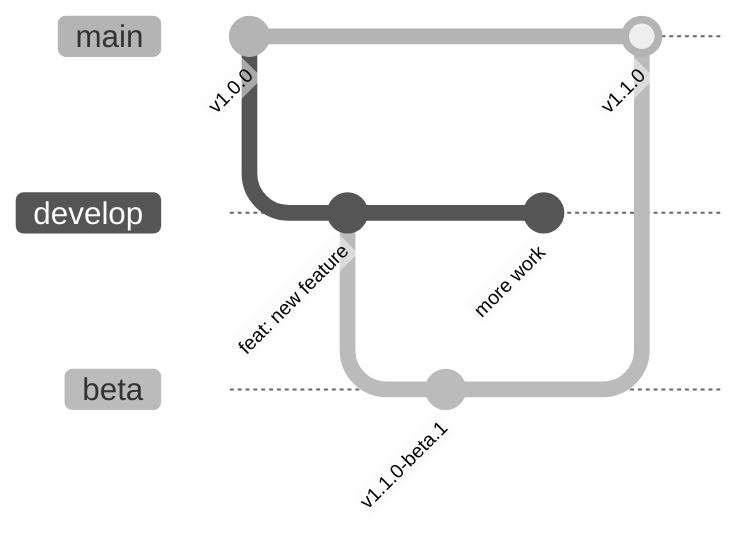

# Multi-branch Releases

:material-source-branch: Release different version types from different branches.

---

## Overview

Multi-branch releases allow you to maintain multiple release channels:



---

## Use Cases

| Channel | Branch | Version | Audience |
|---------|--------|---------|----------|
| Stable | `main` | `1.0.0` | All users |
| Beta | `beta` | `1.0.0-beta.1` | Early adopters |
| Alpha | `develop` | `1.0.0-alpha.1` | Developers |
| Nightly | `nightly` | `1.0.0-dev.20240115` | CI testing |

---

## Configuration

### Basic Setup

```toml title=".releasio.toml"
default_branch = "main"

[branches.main]
match = "main"
prerelease = false

[branches.beta]
match = "beta"
prerelease = true
prerelease_token = "beta"

[branches.develop]
match = "develop"
prerelease = true
prerelease_token = "alpha"
```

### Branch Configuration Options

| Option | Description | Default |
|--------|-------------|---------|
| `match` | Branch name pattern | Required |
| `prerelease` | Whether to create pre-releases | `false` |
| `prerelease_token` | Pre-release identifier | `"alpha"` |
| `tag_prefix` | Override tag prefix | Global setting |
| `publish` | Enable/disable publishing | `true` |

---

## Version Flow

### From Stable (main)

```
Commits: feat: new feature
Current: v1.0.0
Result:  v1.1.0
```

### From Beta

```
Commits: feat: new feature
Current: v1.0.0
Result:  v1.1.0-beta.1

Next commit:
Current: v1.1.0-beta.1
Result:  v1.1.0-beta.2
```

### From Develop

```
Commits: feat: new feature
Current: v1.0.0
Result:  v1.1.0-alpha.1
```

---

## Workflow Examples

### Separate Workflows

```yaml title=".github/workflows/release-stable.yml"
name: Release Stable

on:
  push:
    branches: [main]

jobs:
  release:
    if: startsWith(github.event.head_commit.message, 'chore(release):')
    runs-on: ubuntu-latest
    steps:
      - uses: actions/checkout@v4
        with:
          fetch-depth: 0

      - uses: mikeleppane/releasio@v2
        with:
          command: release
          dry-run: 'false'
          github-token: ${{ secrets.GITHUB_TOKEN }}
```

```yaml title=".github/workflows/release-beta.yml"
name: Release Beta

on:
  push:
    branches: [beta]

jobs:
  release:
    runs-on: ubuntu-latest
    steps:
      - uses: actions/checkout@v4
        with:
          fetch-depth: 0

      - uses: mikeleppane/releasio@v2
        with:
          command: do-release
          execute: 'true'
          prerelease: beta
          github-token: ${{ secrets.GITHUB_TOKEN }}
```

### Unified Workflow

```yaml title=".github/workflows/release.yml"
name: Release

on:
  push:
    branches: [main, beta, develop]

jobs:
  release:
    runs-on: ubuntu-latest
    steps:
      - uses: actions/checkout@v4
        with:
          fetch-depth: 0

      - name: Determine release type
        id: release-type
        run: |
          if [[ "${{ github.ref }}" == "refs/heads/main" ]]; then
            echo "prerelease=" >> $GITHUB_OUTPUT
          elif [[ "${{ github.ref }}" == "refs/heads/beta" ]]; then
            echo "prerelease=beta" >> $GITHUB_OUTPUT
          else
            echo "prerelease=alpha" >> $GITHUB_OUTPUT
          fi

      - uses: mikeleppane/releasio@v2
        with:
          command: do-release
          execute: 'true'
          prerelease: ${{ steps.release-type.outputs.prerelease }}
          github-token: ${{ secrets.GITHUB_TOKEN }}
```

---

## Advanced Patterns

### Pattern Matching

```toml title=".releasio.toml"
# Match multiple branches
[branches.release]
match = "release/*"
prerelease = false

# Match with regex
[branches.feature]
match = "feature/.*"
prerelease = true
prerelease_token = "dev"
publish = false  # Don't publish features
```

### Disable Publishing

For development branches, skip PyPI:

```toml title=".releasio.toml"
[branches.develop]
match = "develop"
prerelease = true
prerelease_token = "dev"
publish = false  # Only create GitHub pre-release
```

### Custom Tag Prefix

Different prefixes per branch:

```toml title=".releasio.toml"
[branches.main]
match = "main"
tag_prefix = "v"

[branches.beta]
match = "beta"
tag_prefix = "v"
prerelease_token = "beta"
```

---

## Release Flow

### Recommended Flow

```
1. Development happens on feature branches
2. Features merge to develop → alpha releases
3. develop merges to beta → beta releases
4. beta merges to main → stable releases
```

### Git Flow Example

```bash
# Feature development
git checkout -b feature/user-auth develop
git commit -m "feat: add authentication"
git checkout develop && git merge feature/user-auth
# → v1.1.0-alpha.1

# Ready for beta testing
git checkout beta && git merge develop
# → v1.1.0-beta.1

# Ready for production
git checkout main && git merge beta
# → v1.1.0
```

---

## Channel Promotion

### Beta to Stable

When ready to release stable from beta:

```bash
# Merge beta into main
git checkout main
git merge beta

# Release command creates stable version
releasio release --execute
```

### Skip Pre-release

To release stable directly:

```bash
releasio do-release --execute
# No --prerelease flag = stable release
```

---

## PyPI Considerations

### Separate Package Names

For very different versions, consider separate packages:

```toml title="pyproject.toml (main)"
[project]
name = "mypackage"
```

```toml title="pyproject.toml (beta)"
[project]
name = "mypackage-beta"
```

### Same Package

More commonly, use the same package with pre-release versions:

```bash
# Users install stable by default
pip install mypackage

# Opt-in to pre-releases
pip install --pre mypackage
pip install mypackage==1.1.0b1
```

---

## GitHub Release Settings

Pre-releases on GitHub:

- Not marked as "Latest"
- Displayed with a badge
- Can be set as draft

```toml title=".releasio.toml"
[github]
draft_releases = false  # Or true for review first

[branches.beta]
match = "beta"
prerelease = true
```

---

## Troubleshooting

### Wrong Branch Detected

```
Warning: Could not determine branch configuration
```

**Solution**: Verify branch pattern matches:

```bash
git branch --show-current
# Compare with match pattern in config
```

### Version Conflicts

```
Error: Tag v1.1.0-beta.1 already exists
```

**Solution**: Ensure branches don't create conflicting versions:

- Use unique pre-release tokens
- Don't overlap version ranges

### PyPI Version Ordering

PyPI orders versions by PEP 440:

```
1.0.0 < 1.1.0a1 < 1.1.0b1 < 1.1.0rc1 < 1.1.0
```

This is correct - pre-releases come before stable.

---

## Best Practices

### Do

- [x] Use clear branch naming
- [x] Keep pre-release tokens distinct
- [x] Merge in order: develop → beta → main
- [x] Test on lower channels first

### Don't

- [ ] Release stable from develop directly
- [ ] Skip beta testing for major changes
- [ ] Use ambiguous branch patterns
- [ ] Forget to merge stable back to develop

---

## See Also

- [Pre-releases](../user-guide/versioning/pre-releases.md) - Version formats
- [GitHub Actions](../github/actions/index.md) - CI/CD setup
- [Configuration Reference](../user-guide/configuration/reference.md) - All options
