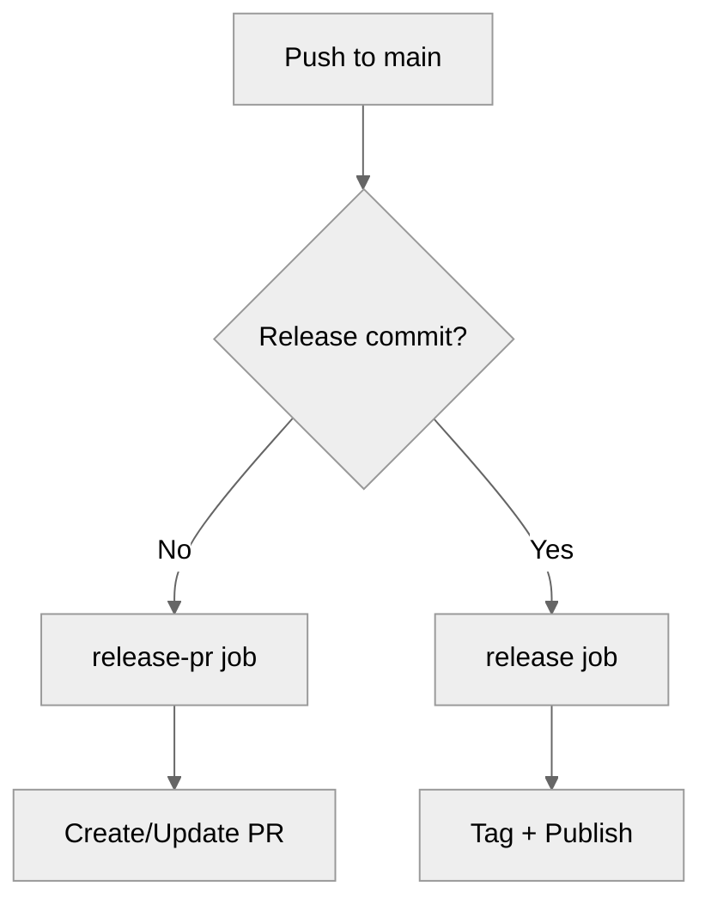

# Minimal Workflow

A simple two-job workflow for automated releases.

---

## Complete Workflow

```yaml title=".github/workflows/release.yml"
name: Release

on:
  push:
    branches: [main]

permissions:
  contents: write
  pull-requests: write
  id-token: write

jobs:
  # Create release PR on every push (except release commits)
  release-pr:
    if: "!startsWith(github.event.head_commit.message, 'chore(release):')"
    runs-on: ubuntu-latest
    steps:
      - uses: actions/checkout@v4
        with:
          fetch-depth: 0

      - uses: mikeleppane/releasio@v2
        with:
          command: release-pr
          github-token: ${{ secrets.GITHUB_TOKEN }}

  # Release when PR is merged (detected by commit message)
  release:
    if: startsWith(github.event.head_commit.message, 'chore(release):')
    runs-on: ubuntu-latest
    steps:
      - uses: actions/checkout@v4
        with:
          fetch-depth: 0

      - uses: mikeleppane/releasio@v2
        with:
          command: release
          github-token: ${{ secrets.GITHUB_TOKEN }}
```

---

## How It Works



### Flow

1. **Push feature commits** → `release-pr` creates/updates a release PR
2. **Merge the PR** → Creates a `chore(release):` commit
3. **Release commit detected** → `release` job creates tag and publishes

---

## Key Points

### `fetch-depth: 0`

Required for releasio to access full git history:

```yaml
- uses: actions/checkout@v4
  with:
    fetch-depth: 0  # Required!
```

### Commit Detection

The workflow uses commit message prefix to detect release PRs:

```yaml
# Skip release PR creation for release commits
if: "!startsWith(github.event.head_commit.message, 'chore(release):')"

# Only release on release commits
if: startsWith(github.event.head_commit.message, 'chore(release):')
```

### Permissions

All three permissions are required:

```yaml
permissions:
  contents: write       # Tags and releases
  pull-requests: write  # PR creation
  id-token: write       # PyPI trusted publishing
```

---

## Enabling PR Creation

1. Go to **Settings** → **Actions** → **General**
2. Scroll to "Workflow permissions"
3. Enable "Allow GitHub Actions to create and approve pull requests"

---

## Next Steps

- [Full Workflow](full-workflow.md) - Add manual triggers
- [Action Reference](reference.md) - All options
- [Trusted Publishing](../trusted-publishing.md) - PyPI OIDC setup
