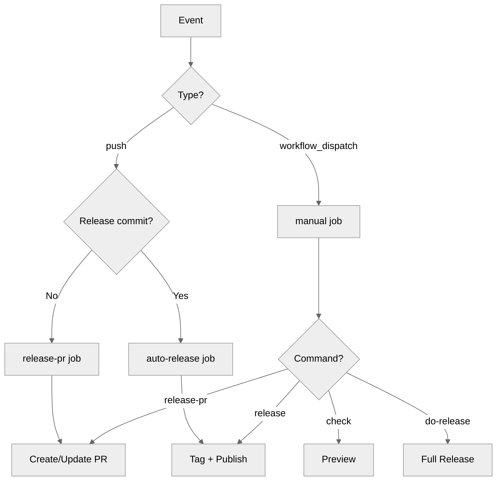

# Full Workflow

Extended workflow with manual triggers and all options.

---

## Complete Workflow

```yaml title=".github/workflows/release.yml"
name: Release

on:
  # Automatic on push
  push:
    branches: [main]

  # Manual trigger
  workflow_dispatch:
    inputs:
      command:
        description: 'Command to run'
        required: true
        type: choice
        options:
          - check
          - release-pr
          - release
          - do-release
        default: check
      execute:
        description: 'Execute changes (not dry-run)'
        required: true
        type: boolean
        default: false
      skip-publish:
        description: 'Skip PyPI publishing'
        type: boolean
        default: false

permissions:
  contents: write
  pull-requests: write
  id-token: write

jobs:
  # Auto-create release PR on push (skip release commits)
  release-pr:
    name: Create Release PR
    if: |
      github.event_name == 'push' &&
      !startsWith(github.event.head_commit.message, 'chore(release):')
    runs-on: ubuntu-latest
    steps:
      - uses: actions/checkout@v4
        with:
          fetch-depth: 0

      - name: Create Release PR
        uses: mikeleppane/releasio@v2
        with:
          command: release-pr
          github-token: ${{ secrets.GITHUB_TOKEN }}

  # Auto-release when release PR is merged
  auto-release:
    name: Auto Release
    if: |
      github.event_name == 'push' &&
      startsWith(github.event.head_commit.message, 'chore(release):')
    runs-on: ubuntu-latest
    steps:
      - uses: actions/checkout@v4
        with:
          fetch-depth: 0

      - name: Release
        uses: mikeleppane/releasio@v2
        with:
          command: release
          github-token: ${{ secrets.GITHUB_TOKEN }}

  # Manual workflow
  manual:
    name: Manual Release
    if: github.event_name == 'workflow_dispatch'
    runs-on: ubuntu-latest
    steps:
      - uses: actions/checkout@v4
        with:
          fetch-depth: 0

      - name: Run releasio
        uses: mikeleppane/releasio@v2
        with:
          command: ${{ inputs.command }}
          execute: ${{ inputs.execute }}
          dry-run: ${{ inputs.execute == false }}
          skip-publish: ${{ inputs.skip-publish }}
          github-token: ${{ secrets.GITHUB_TOKEN }}
```

---

## Manual Triggers

### Running Manually

1. Go to **Actions** → **Release**
2. Click **Run workflow**
3. Select options:
   - **Command**: What to run
   - **Execute**: Whether to apply changes
   - **Skip publish**: Skip PyPI

### Use Cases

| Command | Execute | Use Case |
|---------|---------|----------|
| `check` | N/A | Preview upcoming release |
| `release-pr` | `true` | Create release PR now |
| `do-release` | `true` | Complete release bypassing PR |
| `release` | `true` | Publish existing version |

---

## Job Breakdown

### `release-pr` Job

Runs on every push to main (except release commits):

- Creates or updates release PR
- Skips if already a release commit (prevents loops)

### `auto-release` Job

Runs when release PR is merged:

- Detects `chore(release):` commit prefix
- Creates tag and GitHub release
- Publishes to PyPI

### `manual` Job

Runs on manual trigger:

- Full control over command and options
- Dry-run by default for safety

---

## Workflow Diagram



---

## Customization Options

### Skip Publishing

```yaml
- uses: mikeleppane/releasio@v2
  with:
    command: release
    skip-publish: 'true'
    github-token: ${{ secrets.GITHUB_TOKEN }}
```

### Use Specific Python Version

```yaml
- uses: mikeleppane/releasio@v2
  with:
    command: release-pr
    python-version: '3.12'
    github-token: ${{ secrets.GITHUB_TOKEN }}
```

### Pre-release

```yaml
- uses: mikeleppane/releasio@v2
  with:
    command: do-release
    execute: 'true'
    prerelease: beta
    github-token: ${{ secrets.GITHUB_TOKEN }}
```

---

## See Also

- [Action Reference](reference.md) - All inputs and outputs
- [Trusted Publishing](../trusted-publishing.md) - PyPI OIDC setup
