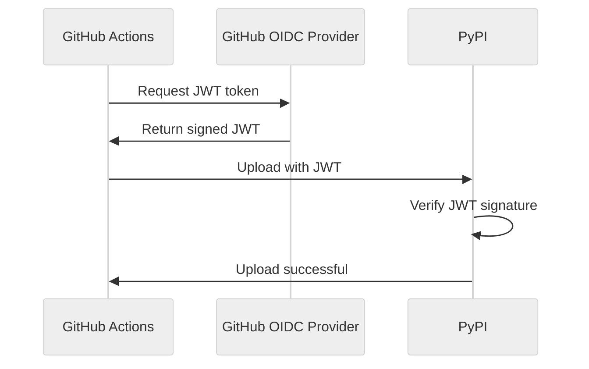

# Trusted Publishing

:material-shield-check: Secure, token-free publishing to PyPI using OpenID Connect (OIDC).

---

## What is Trusted Publishing?

Trusted publishing eliminates the need for PyPI API tokens by using **OpenID Connect (OIDC)** to authenticate directly between GitHub Actions and PyPI.



### Benefits

| Feature | API Token | Trusted Publishing |
|---------|-----------|-------------------|
| Secret management | Required | None |
| Token rotation | Manual | Automatic |
| Scope | Account-wide | Per-project |
| Audit trail | Limited | Full GitHub context |
| Security | Good | Better |

---

## Setup Guide

### Step 1: Configure PyPI

1. Go to [pypi.org](https://pypi.org) and log in
2. Navigate to your project → **Manage** → **Publishing**
3. Add a new **trusted publisher**:

| Field | Value | Description |
|-------|-------|-------------|
| Owner | `your-username` | GitHub org or username |
| Repository | `your-repo` | Repository name |
| Workflow | `release.yml` | Workflow filename |
| Environment | `release` *(optional)* | GitHub environment |

!!! tip "Use Environments for Extra Security"
    Adding a GitHub environment enables:

    - Required reviewers before publishing
    - Branch protection rules
    - Deployment logs and history

### Step 2: Configure GitHub Workflow

Set the required permissions:

```yaml title=".github/workflows/release.yml" hl_lines="6-8"
name: Release

on:
  push:
    branches: [main]

permissions:
  contents: write       # Create tags and releases
  pull-requests: write  # Create release PRs
  id-token: write       # Request OIDC tokens

jobs:
  release:
    runs-on: ubuntu-latest
    # Optional: use environment for extra protection
    environment: release
    steps:
      - uses: actions/checkout@v4
        with:
          fetch-depth: 0

      - uses: mikeleppane/releasio@v2
        with:
          command: release
          dry-run: 'false'
          github-token: ${{ secrets.GITHUB_TOKEN }}
```

### Step 3: Configure releasio

Enable trusted publishing in your configuration:

=== ".releasio.toml"

    ```toml
    [publish]
    trusted_publishing = true
    ```

=== "pyproject.toml"

    ```toml
    [tool.releasio.publish]
    trusted_publishing = true
    ```

That's it! No `PYPI_TOKEN` secret needed.

---

## How It Works

### Authentication Flow

1. **GitHub Action runs** on your repository
2. **OIDC token requested** from GitHub's identity provider
3. **Token contains claims** about the workflow:
   - Repository owner and name
   - Workflow filename
   - Git ref and SHA
   - Environment (if configured)
4. **PyPI validates** the token against your trusted publisher config
5. **Upload proceeds** if all claims match

### Token Claims

The OIDC token includes these claims that PyPI verifies:

```json
{
  "sub": "repo:owner/repo:ref:refs/heads/main",
  "repository": "owner/repo",
  "repository_owner": "owner",
  "job_workflow_ref": "owner/repo/.github/workflows/release.yml@refs/heads/main",
  "environment": "release"
}
```

---

## Environments

Using GitHub environments adds an extra layer of security.

### Creating an Environment

1. Go to **Settings** → **Environments**
2. Click **New environment**
3. Name it `release`
4. Configure protection rules:

```yaml
# Optional protection rules
Required reviewers: true
Wait timer: 0 minutes
Deployment branches: main only
```

### Using in Workflow

```yaml hl_lines="3"
jobs:
  release:
    environment: release
    runs-on: ubuntu-latest
    steps:
      # ...
```

!!! warning "Environment Name Must Match"
    The environment name in your workflow must exactly match what you configured on PyPI.

---

## TestPyPI Setup

For testing, configure trusted publishing on TestPyPI too.

### Configure TestPyPI

1. Go to [test.pypi.org](https://test.pypi.org)
2. Add trusted publisher with same settings

### Workflow for TestPyPI

```yaml title=".github/workflows/test-release.yml"
name: Test Release

on:
  push:
    branches: [develop]

permissions:
  id-token: write
  contents: read

jobs:
  test-publish:
    runs-on: ubuntu-latest
    steps:
      - uses: actions/checkout@v4
        with:
          fetch-depth: 0

      - uses: mikeleppane/releasio@v2
        with:
          command: release
          dry-run: 'false'
          github-token: ${{ secrets.GITHUB_TOKEN }}
        env:
          # Point to TestPyPI
          RELEASIO_PUBLISH_REGISTRY: https://test.pypi.org/legacy/
```

Or configure in your config file:

```toml title=".releasio.toml"
[publish]
registry = "https://test.pypi.org/legacy/"
trusted_publishing = true
```

---

## Troubleshooting

### Common Issues

#### "Token request failed"

```
Error: OIDC token request failed
```

**Solution**: Ensure `id-token: write` permission is set:

```yaml
permissions:
  id-token: write
```

#### "Publisher not found"

```
Error: No matching trusted publisher found
```

**Checklist**:

- [ ] Owner name matches exactly (case-sensitive)
- [ ] Repository name matches exactly
- [ ] Workflow filename matches (e.g., `release.yml`)
- [ ] Environment name matches (if configured)
- [ ] Publishing from correct branch

#### "Pending publisher"

If your project is new, you can set up trusted publishing *before* the first upload:

1. Go to PyPI → **Your projects** → **Publishing**
2. Add **Pending Publisher** with your details
3. First successful upload creates the project

---

## Fallback to API Token

If you can't use trusted publishing, you can still use API tokens:

```yaml
- uses: mikeleppane/releasio@v2
  with:
    command: release
    dry-run: 'false'
    github-token: ${{ secrets.GITHUB_TOKEN }}
    pypi-token: ${{ secrets.PYPI_TOKEN }}
```

Configure in releasio:

```toml title=".releasio.toml"
[publish]
trusted_publishing = false
```

!!! note "Token Precedence"
    If both `trusted_publishing = true` and a `pypi-token` is provided,
    releasio will prefer trusted publishing.

---

## Security Best Practices

### Do

- [x] Use environments for production releases
- [x] Require reviewers for the release environment
- [x] Limit trusted publisher to specific branches
- [x] Monitor PyPI security logs

### Don't

- [ ] Share OIDC tokens in logs
- [ ] Use trusted publishing for forks
- [ ] Skip branch protection rules
- [ ] Ignore failed validation errors

---

## See Also

- [PyPI Trusted Publishing Docs](https://docs.pypi.org/trusted-publishers/)
- [GitHub OIDC Docs](https://docs.github.com/en/actions/deployment/security-hardening-your-deployments/about-security-hardening-with-openid-connect)
- [Full Workflow](actions/full-workflow.md)
- [Action Reference](actions/reference.md)
