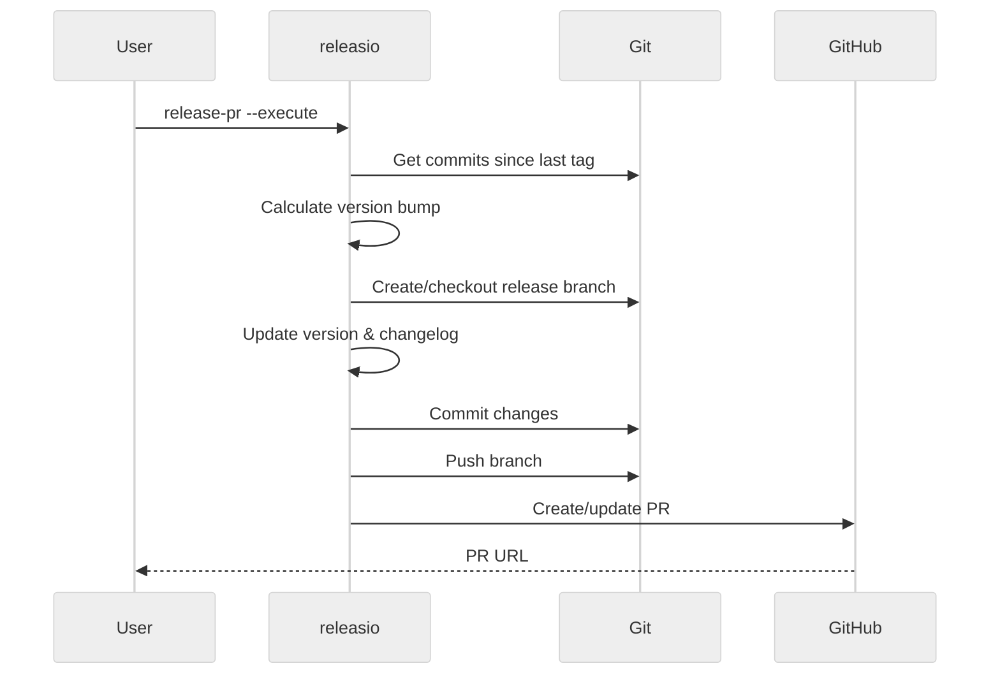

# releasio release-pr

:material-pull-request: Create or update a release pull request with version bump and changelog.

---

## Usage

```bash
releasio release-pr [PATH] [OPTIONS]
```

## Description

The `release-pr` command automates the release preparation:

1. **Calculates** the next version from commits
2. **Updates** `pyproject.toml` and `CHANGELOG.md`
3. **Commits** changes to a release branch
4. **Creates** or updates a pull request

This is the **recommended** way to prepare releases.

---

## Arguments

| Argument | Type | Default | Description |
|----------|------|---------|-------------|
| `PATH` | Path | `.` | Project directory path |

---

## Options

| Option | Description |
|--------|-------------|
| `--execute` | Actually create the PR (default: dry-run) |
| `--verbose` | Show detailed output |

---

## Examples

### Preview (Dry-Run)

```bash
releasio release-pr
```

Shows what the PR would look like without creating it.

### Create the PR

```bash
releasio release-pr --execute
```

??? example "Example Output"

    ```
    ╭─ Release PR ─────────────────────────────────────────────╮
    │                                                          │
    │  📦 Project: my-project                                  │
    │  🔄 Version: 1.2.0 → 1.3.0                               │
    │                                                          │
    │  ✅ Updated pyproject.toml                               │
    │  ✅ Updated CHANGELOG.md                                 │
    │  ✅ Created commit                                       │
    │  ✅ Pushed to releasio/release                           │
    │  ✅ Created PR #42                                       │
    │                                                          │
    │  🔗 https://github.com/user/repo/pull/42                 │
    │                                                          │
    ╰──────────────────────────────────────────────────────────╯
    ```

---

## How It Works



---

## Configuration

Customize the release PR in your config:

```toml title=".releasio.toml"
[github]
release_pr_branch = "releasio/release"  # Branch name
release_pr_labels = ["release"]          # PR labels
```

---

## GitHub Actions

Automate release PR creation:

```yaml title=".github/workflows/release.yml"
name: Release

on:
  push:
    branches: [main]

jobs:
  release-pr:
    # Skip if this is already a release commit
    if: "!startsWith(github.event.head_commit.message, 'chore(release):')"
    runs-on: ubuntu-latest
    steps:
      - uses: actions/checkout@v4
        with:
          fetch-depth: 0

      - uses: mikeleppane/releasio@v2
        with:
          command: release-pr
          github-token: ${{ secrets.GITHUB_TOKEN }}
```

!!! tip "Automatic Updates"
    The action automatically updates the PR when new commits are pushed to main.

---

## See Also

- [release](release.md) - Publish after merging
- [GitHub Actions](../../github/actions/index.md) - Automate releases
