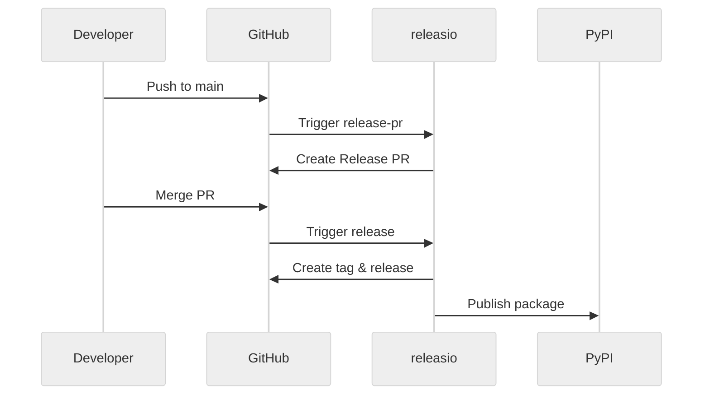

# GitHub Integration

releasio integrates seamlessly with GitHub for automated releases.

---

## Features

<div class="grid cards" markdown>

-   :material-github:{ .lg .middle } **GitHub Actions**

    ---

    Automate releases with native GitHub Actions support

    [:octicons-arrow-right-24: Actions Guide](actions/index.md)

-   :material-shield-lock:{ .lg .middle } **Trusted Publishing**

    ---

    Publish to PyPI without API tokens using OIDC

    [:octicons-arrow-right-24: Setup Guide](trusted-publishing.md)

-   :material-file-upload:{ .lg .middle } **Release Assets**

    ---

    Upload files to GitHub releases automatically

    [:octicons-arrow-right-24: Assets Guide](release-assets.md)

</div>

---

## Quick Setup

### 1. Create Workflow

```yaml title=".github/workflows/release.yml"
name: Release

on:
  push:
    branches: [main]

permissions:
  contents: write
  pull-requests: write
  id-token: write

jobs:
  release-pr:
    if: "!startsWith(github.event.head_commit.message, 'chore(release):')"
    runs-on: ubuntu-latest
    steps:
      - uses: actions/checkout@v4
        with:
          fetch-depth: 0

      - uses: mikeleppane/releasio@v2
        with:
          command: release-pr
          github-token: ${{ secrets.GITHUB_TOKEN }}

  release:
    if: startsWith(github.event.head_commit.message, 'chore(release):')
    runs-on: ubuntu-latest
    steps:
      - uses: actions/checkout@v4
        with:
          fetch-depth: 0

      - uses: mikeleppane/releasio@v2
        with:
          command: release
          github-token: ${{ secrets.GITHUB_TOKEN }}
```

### 2. Enable Repository Settings

1. Go to **Settings** → **Actions** → **General**
2. Enable "Allow GitHub Actions to create and approve pull requests"

### 3. Set Up Trusted Publishing (Optional)

1. Go to [PyPI](https://pypi.org) → Your project → **Publishing**
2. Add a trusted publisher with your repository details

That's it! Push to main and releasio handles the rest.

---

## How It Works


