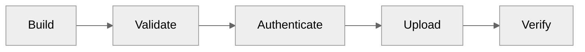

# Publishing

:material-upload: Publish your Python packages to PyPI and other registries.

---

## Overview

releasio automates the entire publishing workflow:



1. **Build** - Create wheel and source distributions
2. **Validate** - Check package integrity
3. **Authenticate** - Use OIDC or API token
4. **Upload** - Publish to PyPI
5. **Verify** - Confirm successful upload

---

## Quick Start

### Minimal Setup

releasio works with zero publishing configuration:

```yaml title=".github/workflows/release.yml"
permissions:
  id-token: write  # For trusted publishing

jobs:
  release:
    runs-on: ubuntu-latest
    steps:
      - uses: mikeleppane/releasio@v2
        with:
          command: release
          dry-run: 'false'
          github-token: ${{ secrets.GITHUB_TOKEN }}
```

This uses:

- [x] **uv** as the default build tool
- [x] **Trusted publishing** (OIDC) for authentication
- [x] **PyPI** as the default registry

---

## Authentication Methods

### Trusted Publishing (Recommended)

No tokens needed - authenticate directly with PyPI:

```toml title=".releasio.toml"
[publish]
trusted_publishing = true
```

[:octicons-arrow-right-24: Trusted Publishing Guide](../github/trusted-publishing.md)

### API Token

Traditional token-based authentication:

```yaml
- uses: mikeleppane/releasio@v2
  with:
    command: release
    pypi-token: ${{ secrets.PYPI_TOKEN }}
```

```toml title=".releasio.toml"
[publish]
trusted_publishing = false
```

---

## Build Tools

releasio supports multiple Python build tools:

| Tool | Config | Build Command | Publish Command |
|------|--------|---------------|-----------------|
| **uv** | Default | `uv build` | `uv publish` |
| **poetry** | `tool = "poetry"` | `poetry build` | `poetry publish` |
| **pdm** | `tool = "pdm"` | `pdm build` | `pdm publish` |

[:octicons-arrow-right-24: Build Tools Guide](build-tools.md)

---

## Configuration

### Basic Options

```toml title=".releasio.toml"
[publish]
# Build tool: uv, poetry, pdm
tool = "uv"

# Enable/disable PyPI publishing
enabled = true

# Use trusted publishing (OIDC)
trusted_publishing = true
```

### Full Options

```toml title=".releasio.toml"
[publish]
tool = "uv"
enabled = true
trusted_publishing = true

# Validate package before publishing
validate_before_publish = true

# Custom registry (TestPyPI, private registry)
registry = "https://upload.pypi.org/legacy/"
```

---

## Registries

### PyPI (Default)

```toml
[publish]
registry = "https://upload.pypi.org/legacy/"
```

### TestPyPI

```toml
[publish]
registry = "https://test.pypi.org/legacy/"
```

### Private Registry

```toml
[publish]
registry = "https://pypi.mycompany.com/simple/"
trusted_publishing = false  # Usually need token for private
```

---

## Skip Publishing

To only create GitHub releases without PyPI:

```toml title=".releasio.toml"
[publish]
enabled = false
```

Or use the CLI flag:

```yaml
- uses: mikeleppane/releasio@v2
  with:
    command: release
    skip-publish: 'true'
```

---

## Sections

<div class="grid cards" markdown>

-   :material-package-up:{ .lg .middle } **PyPI Publishing**

    ---

    Complete guide to publishing on PyPI

    [:octicons-arrow-right-24: PyPI Guide](pypi.md)

-   :material-hammer-wrench:{ .lg .middle } **Build Tools**

    ---

    Configure uv, poetry, or pdm

    [:octicons-arrow-right-24: Build Tools](build-tools.md)

</div>

---

## See Also

- [Trusted Publishing](../github/trusted-publishing.md) - OIDC authentication
- [Release Assets](../github/release-assets.md) - Upload to GitHub releases
- [Full Workflow](../github/actions/full-workflow.md) - Complete CI/CD setup
