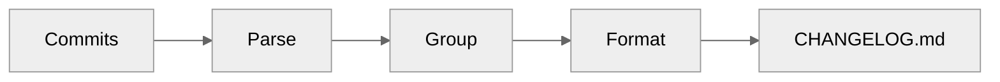

# Changelog Generation

:material-file-document-edit: Automatic release notes from your commits.

---

## Overview

releasio generates beautiful changelogs from your commit history:



---

## Example Output

```markdown title="CHANGELOG.md"
# Changelog

## [1.2.0] - 2024-01-15

### Features
- Add user dashboard (#42)
- Support dark mode (#45)

### Bug Fixes
- Resolve login timeout (#43)
- Fix email validation (#44)

### Documentation
- Update installation guide (#46)
```

---

## Configuration

### Basic Setup

```toml title=".releasio.toml"
[changelog]
path = "CHANGELOG.md"
```

### Full Options

```toml title=".releasio.toml"
[changelog]
# Output file
path = "CHANGELOG.md"

# Show commit authors
show_authors = true

# Show commit hashes
show_commit_hash = true

# Highlight first-time contributors
show_first_time_contributors = true
first_contributor_badge = "🎉 First contribution!"

# Include dependency updates
include_dependency_updates = true
```

---

## Section Headers

Customize how commits are grouped:

```toml title=".releasio.toml"
[changelog.section_headers]
breaking = "⚠️ Breaking Changes"
feat = "✨ Features"
fix = "🐛 Bug Fixes"
perf = "⚡ Performance"
docs = "📚 Documentation"
refactor = "♻️ Refactoring"
```

### Default Sections

| Commit Type | Default Header |
|-------------|----------------|
| Breaking | Breaking Changes |
| `feat` | Features |
| `fix` | Bug Fixes |
| `docs` | Documentation |
| `perf` | Performance |
| `refactor` | Refactoring |
| `test` | Testing |
| `build` | Build |
| `ci` | CI/CD |

---

## Changelog Engines

### Native Generator (Default)

releasio includes a built-in changelog generator:

- Fast and reliable
- No external dependencies
- Conventional commit support

### git-cliff Integration

For advanced customization, use [git-cliff](https://git-cliff.org/):

```toml title=".releasio.toml"
[changelog]
engine = "git-cliff"
```

[:octicons-arrow-right-24: git-cliff Guide](git-cliff.md)

---

## Features

### Author Attribution

```toml
[changelog]
show_authors = true
```

Output:
```markdown
- Add user dashboard (#42) by @username
```

### Commit Links

```toml
[changelog]
show_commit_hash = true
```

Output:
```markdown
- Add user dashboard ([abc123](https://github.com/user/repo/commit/abc123))
```

### First-Time Contributors

```toml
[changelog]
show_first_time_contributors = true
first_contributor_badge = "🎉"
```

Output:
```markdown
- Add user dashboard (#42) by @newuser 🎉
```

---

## Sections

<div class="grid cards" markdown>

-   :material-palette:{ .lg .middle } **Templates**

    ---

    Customize changelog format

    [:octicons-arrow-right-24: Templates](templates.md)

-   :material-cliff:{ .lg .middle } **git-cliff**

    ---

    Advanced changelog generation

    [:octicons-arrow-right-24: git-cliff](git-cliff.md)

</div>

---

## Preview Changes

Before generating, preview what will be added:

```bash
releasio check
```

Output:
```
📝 Changelog Preview:

## [1.2.0] - 2024-01-15

### Features
- Add user dashboard (#42)

### Bug Fixes
- Resolve login timeout (#43)
```

---

## See Also

- [Conventional Commits](../commits/index.md) - Commit format
- [Configuration Reference](../configuration/reference.md) - All options
- [Version Management](../versioning/index.md) - Version bumping
