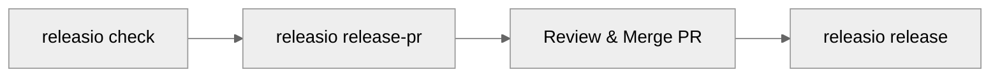

# CLI Commands

releasio provides a powerful command-line interface for managing releases.

---

## Command Overview

| Command | Description | Modifies Files |
|---------|-------------|----------------|
| [`check`](check.md) | Preview what would happen | :material-close: No |
| [`update`](update.md) | Update version and changelog | :material-check: Yes |
| [`release-pr`](release-pr.md) | Create/update release PR | :material-check: Yes |
| [`release`](release.md) | Tag and publish release | :material-check: Yes |
| [`do-release`](do-release.md) | Complete release workflow | :material-check: Yes |
| [`check-pr`](check-pr.md) | Validate PR title | :material-close: No |
| [`init`](init.md) | Initialize configuration | :material-check: Yes |

---

## Global Options

All commands support these options:

| Option | Short | Description |
|--------|-------|-------------|
| `--help` | `-h` | Show help message |
| `--version` | | Show releasio version |
| `--verbose` | `-v` | Enable verbose output |

---

## Typical Workflows

### Preview → Release PR → Merge → Publish



This is the recommended workflow for most projects:

1. **Preview** with `check` to see upcoming changes
2. **Create PR** with `release-pr` for review
3. **Merge** the PR after approval
4. **Publish** with `release` after merge

### One-Command Release

```bash
releasio do-release --execute
```

For simpler workflows, `do-release` combines everything:

- Update version and changelog
- Commit changes
- Create and push tag
- Publish to PyPI

---

## Dry-Run Mode

By default, commands that modify files run in **dry-run mode**:

```bash
# Shows what would happen (dry-run)
releasio release-pr

# Actually executes
releasio release-pr --execute
```

!!! tip "Safe by Default"
    Commands never make changes unless you explicitly pass `--execute`.
    Always preview first!

---

## Exit Codes

| Code | Meaning |
|------|---------|
| `0` | Success |
| `1` | Error occurred |
| `2` | Invalid arguments |

---

## Command Details

<div class="grid cards" markdown>

-   :material-eye:{ .lg .middle } **check**

    Preview release without changes

    [:octicons-arrow-right-24: Details](check.md)

-   :material-pencil:{ .lg .middle } **update**

    Update version and changelog locally

    [:octicons-arrow-right-24: Details](update.md)

-   :material-pull-request:{ .lg .middle } **release-pr**

    Create or update release PR

    [:octicons-arrow-right-24: Details](release-pr.md)

-   :material-tag:{ .lg .middle } **release**

    Tag and publish release

    [:octicons-arrow-right-24: Details](release.md)

-   :material-rocket-launch:{ .lg .middle } **do-release**

    Complete release workflow

    [:octicons-arrow-right-24: Details](do-release.md)

-   :material-check-circle:{ .lg .middle } **check-pr**

    Validate PR title format

    [:octicons-arrow-right-24: Details](check-pr.md)

</div>
