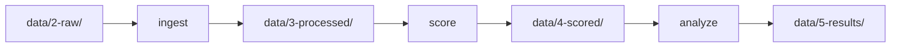

# Command Line Interface

The RetroCast CLI provides a unified interface for standardizing, scoring, and analyzing retrosynthesis predictions.

!!! info "Two modes of operation"

    **Project Mode**
    Structured workflow for reproducible benchmarking of multiple models
    
    **Ad-Hoc Mode**  
    Direct commands for processing individual files without configuration

## Installation

=== "uv (recommended)"

    ```bash
    uv tool install retrocast
    ```
    
    or, optionally, if you want to create plots during analysis:
    
    ```bash
    uv tool install "retrocast[viz]"
    ```

=== "pip"

    ```bash
    pip install retrocast
    ```
    
    or, optionally, if you want to create plots during analysis:
    
    ```bash
    uv tool install "retrocast[viz]"
    ```

Verify installation:

```bash
retrocast --version
```

## Ad-Hoc Workflow

!!! tip "When to use ad-hoc mode"

    Use these commands to process single files immediately without setting up a project directory. Great for:
    
    - Quick experiments
    - One-off evaluations
    - Testing new adapters

### `adapt` - Convert Raw Predictions

Convert raw output from a supported model into the standardized RetroCast format.

```bash
retrocast adapt \
  --input raw_predictions.json.gz \
  --adapter aizynth \ # (1)!
  --output standardized_routes.json.gz \
  --benchmark benchmark.json.gz  # (2)!
```

1. See available adapters with `retrocast list-adapters`
2. Optional: Ensures target IDs match exactly

**Supported adapters:** `aizynth`, `dms`, `retrostar`, `synplanner`, `syntheseus`, `askcos`, `retrochimera`, `dreamretro`, `multistepttl`, `synllama`, `paroutes`

### `score-file` - Evaluate Routes

Evaluate standardized routes against a stock file.

```bash
retrocast score-file \
  --benchmark benchmark.json.gz \
  --routes standardized_routes.json.gz \
  --stock stock_smiles.txt \ # (1)!
  --output scores.json.gz \
  --model-name "My-Experiment"
```

1. Text file with one canonical SMILES per line

**Output:** JSON file with boolean flags (`is_solved`, `matches_ground_truth`, etc.)

### `create-benchmark` - Generate Benchmarks

Generate a benchmark definition file from a simple list of SMILES strings.

```bash
retrocast create-benchmark \
  --input targets.txt \ # (1)!
  --name "custom-benchmark" \
  --stock-name "zinc-stock" \
  --output custom-benchmark.json.gz
```

1. Text file or CSV with SMILES strings

---

## Project Workflow

!!! success "Recommended for research"

    For large-scale evaluations, use project mode for:
    
    - Reproducible benchmarking
    - Multiple models comparison
    - Cryptographic audit trail
    - Automated manifest tracking

### `init` - Initialize Project

Generate a default configuration file and directory structure:

```bash
retrocast init
```

**Creates:**

- `retrocast-config.yaml` - Model configuration
- `data/` directory structure

### Configuration

Edit `retrocast-config.yaml` to register your models:

```yaml title="retrocast-config.yaml"
models:
  dms-explorer: # (1)!
    adapter: dms # (2)!
    raw_results_filename: predictions.json # (3)!
    sampling: # (4)!
      strategy: top-k
      k: 50
```

1. Model identifier (used in CLI commands)
2. Adapter type (see `retrocast list-adapters`)
3. Expected filename in `data/2-raw/<model>/<benchmark>/`
4. Optional: Limit routes per target

??? example "Advanced configuration"

    ```yaml
    models:
      my-model:
        adapter: aizynth
        raw_results_filename: results.json.gz
        sampling:
          strategy: top-k
          k: 100
        # Custom metadata
        metadata:
          version: "2.0"
          training_data: "USPTO-50k"
    ```

### The Pipeline



### `ingest` - Standardize Routes

Transforms raw model outputs into standardized `Route` objects.

```bash
retrocast ingest \
  --model dms-explorer \
  --dataset paroutes-n1 \
  --anonymize \  # (1)!
  --ignore-stereo  # (2)!
```

1. Optional: Hashes the model name for blind review
2. Optional: Strip stereochemistry during SMILES canonicalization

**Input:** `data/2-raw/<model>/<dataset>/<raw_results_filename>`  
**Output:** `data/3-processed/<model>/<dataset>/routes.json.gz`

**Operations:**

- Parse raw format via adapter
- Canonicalize SMILES (optionally ignoring stereochemistry with `--ignore-stereo`)
- Deduplicate routes
- Apply sampling strategy (if configured)

!!! warning "Stereochemistry-agnostic processing"

    The `--ignore-stereo` flag removes stereochemical information during canonicalization. This is useful for model developers who want to isolate whether their model struggles specifically with stereochemistry or has broader issues with reaction prediction and stock termination.
    
    **Not recommended for production evaluation** - stereochemistry is critical for experimental chemistry.

### `score` - Evaluate Routes

Evaluates processed routes against benchmark stock.

```bash
retrocast score \
  --model dms-explorer \
  --dataset paroutes-n1 \
  --stock-override zinc-stock \  # (1)!
  --ignore-stereo  # (2)!
```

1. Optional: Override default benchmark stock
2. Optional: Perform stereochemistry-agnostic matching by dropping stereochemistry from InChIKeys

**Input:** `data/3-processed/<model>/<dataset>/routes.json.gz`  
**Output:** `data/4-scored/<model>/<dataset>/<stock>/scores.json.gz`

**Annotations added:**

- `is_solved` - All leaves in stock
- `matches_ground_truth` - Route matches reference (with optional stereochemistry-agnostic matching via `--ignore-stereo`)
- `length` - Number of steps
- `is_convergent` - Contains convergent reactions

!!! warning "Stereochemistry-agnostic evaluation"

    The `--ignore-stereo` flag enables stereochemistry-agnostic evaluation. When enabled, molecules that differ only in stereochemistry are treated as identical during scoring. This allows model developers to calculate Top-K accuracy metrics focused on molecular connectivity rather than stereochemical correctness.
    
    **Use case:** Helps distinguish between stereochemistry-specific issues and fundamental retrosynthesis planning problems.
    
    **Not recommended for production evaluation** - stereochemistry is critical for experimental chemistry.

### `analyze` - Generate Reports

Aggregates scores into statistical reports with confidence intervals.

```bash
retrocast analyze \
  --model dms-explorer \
  --dataset paroutes-n1 \
  --make-plots \  # (1)!
  --top-k 1 5 10 50  # (2)!
```

1. Generates interactive HTML visualizations
2. Customizes K values (default: 1, 3, 5, 10, 20, 50, 100)

**Input:** `data/4-scored/<model>/<dataset>/<stock>/scores.json.gz`  
**Output:** `data/5-results/<dataset>/<model>/`

- `report.md` - Statistical summary
- `*.html` - Interactive plots (if `--make-plots`)

**Metrics computed:**

- Overall Solvability with 95% CI (bootstrap)
- Top-K accuracy (K ∈ {1, 3, 5, 10, ...})
- Stratified performance by route length
- Ground truth match rate

---

## Verification & Auditing

!!! info "Cryptographic audit trail"

    RetroCast generates a `manifest.json` for every file it creates, tracking:
    
    - Input file SHA256 hashes
    - Command parameters
    - Output file hashes
    - Timestamp and RetroCast version

### `verify` - Check Data Integrity

Verify the integrity of your data pipeline:

```bash
retrocast verify \
  --target data/5-results/paroutes-n1/dms-explorer \
  --deep  # (1)!
```

1. Optional: Recursively verify entire dependency graph

**Verification modes:**

=== "Standard Check"

    Verifies that the file on disk matches the SHA256 hash in its manifest.
    
    ```bash
    retrocast verify --target data/4-scored/model/dataset/
    ```

=== "Deep Check"

    Recursively verifies the entire dependency graph:
    
    ```
    Analyze → Score → Ingest → Raw
    ```
    
    Ensures logical consistency across the pipeline.
    
    ```bash
    retrocast verify --target data/5-results/model/dataset/ --deep
    ```

**What it detects:**

- :warning: Data corruption
- :warning: Manual file tampering
- :warning: Out-of-order execution
- :warning: Hash mismatches

---

## Helper Commands

### `list` - Show Configured Models

Lists all models in `retrocast-config.yaml`:

```bash
retrocast list
```

**Output:**

```
Configured models:
  - dms-explorer (adapter: dms)
  - aizynthfinder-mcts (adapter: aizynth)
  - retro-star (adapter: retrostar)
```

### `list-adapters` - Show Available Adapters

Lists all built-in adapters:

```bash
retrocast list-adapters
```

**Output:**

```
Available adapters:
  - aizynth: AiZynthFinder (bipartite graph)
  - dms: DirectMultiStep (recursive dict)
  - retrostar: Retro* (precursor map)
  - synplanner: SynPlanner (bipartite graph)
  - syntheseus: Syntheseus (bipartite graph)
  - askcos: ASKCOS (custom format)
  - retrochimera: RetroChimera (precursor map)
  - dreamretro: DreamRetro (precursor map)
  - multistepttl: MultiStepTTL (custom format)
  - synllama: SynLlama (precursor map)
  - paroutes: PaRoutes (reference format)
```

### `info` - Show Model Details

Display configuration details for a specific model:

```bash
retrocast info --model dms-explorer
```

**Output:**

```yaml
Model: dms-explorer
  Adapter: dms
  Raw results filename: predictions.json
  Sampling:
    Strategy: top-k
    K: 50
```

---

## Command Reference

### Quick Lookup

| Command | Purpose | Input | Output |
|:--------|:--------|:------|:-------|
| `init` | Initialize project | - | `retrocast-config.yaml` |
| `adapt` | Convert raw → standardized | Raw predictions | Route objects |
| `score-file` | Evaluate routes | Routes + stock | Scored routes |
| `create-benchmark` | Generate benchmark | SMILES list | Benchmark JSON |
| `ingest` | Standardize (project mode) | `data/2-raw/` | `data/3-processed/` |
| `score` | Evaluate (project mode) | `data/3-processed/` | `data/4-scored/` |
| `analyze` | Generate report | `data/4-scored/` | `data/5-results/` |
| `verify` | Audit integrity | Manifest files | Validation report |
| `list` | Show models | `retrocast-config.yaml` | Model list |
| `list-adapters` | Show adapters | - | Adapter list |
| `info` | Show model config | Model name | Config details |

### Advanced Options

#### Stereochemistry Control

Both `ingest` and `score` commands support the `--ignore-stereo` flag for stereochemistry-agnostic processing:

| Command | Flag | Purpose | Use Case |
|:--------|:-----|:--------|:---------|
| `ingest` | `--ignore-stereo` | Strip stereochemistry during canonicalization | Analyze stock termination rate/solvability without stereochemical constraints |
| `score` | `--ignore-stereo` | Perform stereochemistry-agnostic matching | Calculate Top-K accuracy independent of stereochemistry |

!!! note "For model developers"

    The `--ignore-stereo` flag is primarily useful for model development and diagnostic purposes. It allows you to determine whether prediction errors stem from stereochemical confusion or more fundamental retrosynthetic planning issues.
    
    **Not recommended for evaluating production models** - stereochemistry is critical for experimental chemistry.
