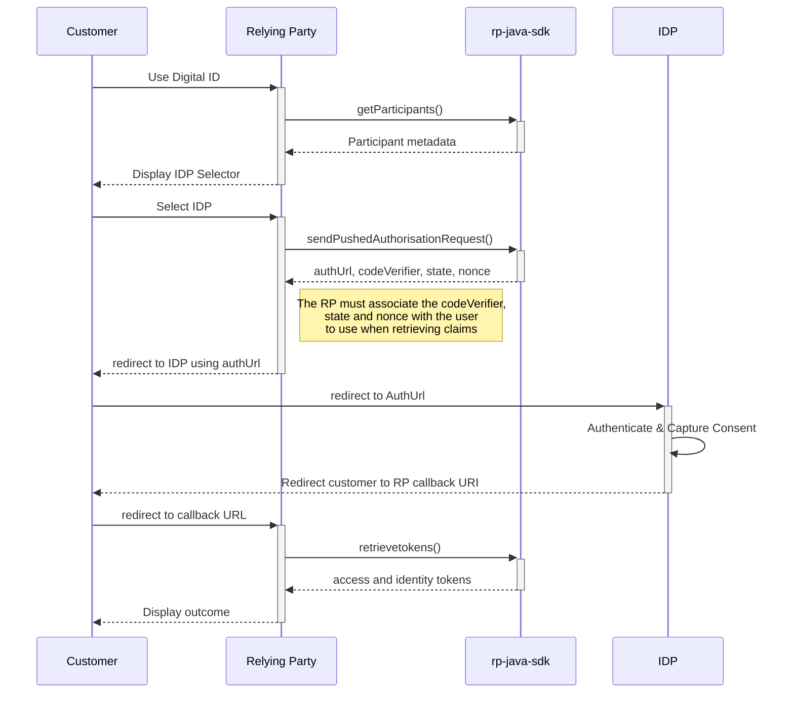

# Python SDK for Relying Parties

[](https://github.com/connectid-tools/rp-python-sdk/actions/workflows/build.yml)

rp-python-sdk is an SDK that allows Relying Parties to easily integrate with the Digital Identity ecosystem 
using the Python programming language.

# Getting Started

You will need a Python 3.12 (or greater).

- [pyenv/pyenv-virtualenv](#pyenvpyenv-virtualenv)
- [poetry](#poetry)
- [reference](#reference)

## pyenv/pyenv-virtualenv

- make sure `pyenv` is installed
- make sure `pyenv-virtualenv` is installed
- install python `3.12`, for example `3.12.0`
  ```bash
  pyenv install 3.12.0
  ```
- create a virtual environment
  ```bash
  pyenv virtualenv 3.12.0 rp-python-sdk
  ```
- activate the virtual environment
  ```bash
  pyenv activate rp-python-sdk
  ```
(if this fails, add the following to .zshrc):

```bash
eval "$(pyenv init -)"
eval "$(pyenv virtualenv-init -)"
```

- make sure `pip` and `setuptools` are up-to-date
  ```bash
  pip install --upgrade pip setuptools
  ```

## poetry

- install poetry
  ```bash
  pip install --upgrade poetry
  ```
- install the application runtime dependencies
  ```bash
  poetry install --only main
  ```
- install the application test dependencies
  ```bash
  poetry install --with test
  ```
- install the application dev, test dependencies
  ```bash
  poetry install --with test,dev
  ```
- install the dependencies but not the current project
  ```bash
  poetry install --no-root --with test,dev
  ```

## running tests

Set RP_SAMPLE_APP_TOKEN environment variable. The value can be obtained from the [ConnectID Docs Portal](https://docs.connectid.com.au/docs/relying-parties/getting-started/).
```shell
export RP_SAMPLE_APP_TOKEN=<your token>
```

To run all the test, you can execute the following:

```bash
poetry run pytest
```

To run a selection of the tests, for example, run all the unit tests:

```bash
poetry run pytest -v -m "not conformance"
```

To only run the Conformance test, execute the following:

```bash
poetry run pytest -v -m conformance
```

## pre-commit

This project use `pre-commit`. A `.pre-commit-config.yaml` is included.

Run `pre-commit install` to install the Git hooks.


## reference

- poetry
  - [Installation](https://python-poetry.org/docs/#installation)
  - [Installing poetry manually](https://python-poetry.org/docs/#installing-manually)
  - [Managing dependencies](https://python-poetry.org/docs/managing-dependencies/)
- pre-commit
  - [Installation](https://pre-commit.com/#install)
  - [Usage](https://pre-commit.com/#usage)
  - [Supported hooks](https://pre-commit.com/hooks.html)

## certificates

At the moment, there's a challenge to get the certificate loading to work well. This results in the following error:

`[SSL: CERTIFICATE_VERIFY_FAILED] certificate verify failed: unable to get local issuer certificate (_ssl.c:1000)')`

To fix this, you can run the following command:

`ln -s ~/.pyenv/versions/3.12.0/envs/python-template-3-12/lib/python3.12/site-packages/certifi/cacert.pem cert.pem`

And combine the `[connectid-sandbox-ca.pem](certs%2Fconnectid-sandbox-ca.pem)` with the `cert.pem` output.

# Process Overview Sequence Diagram

The expected interactions between the Relying Party and RP Connector as part of a standard flow are shown in the diagram below.

The key steps are:

* Retrieve the list of Participants so the user can be prompted to choose their identity provider (IDP)
* Send a Pushed Authorisation Request (PAR) to the selected IDP with the requested claims and redirect the user to their IDP
* Use the callback querystring to retrieve the access token and identity token with the claims the user has consented to share



# SDK Operations

The expected usage and key points for each of the main SDK operations is described in detail below.

## get_participants

This allows the list of Identity Providers within the scheme to be retrieved, so that the Relying Party can display them
to the user and allow the user to choose which Identity Provider they will use to prove their identity.

Note that by default the SDK is configured to only return Identity Providers that are fully certified. If you wish to test
one of the uncertified Identity Providers you will need to set the `include_uncertified_participants` configuration
option to `true`. (This should only be done in a test environment, and should never be done in production.)

You may also set the `required_claims` and `required_participant_certifications` configuration options to filter
the list of IDPs returned based on the needs of your use case (eg: if you require IDPs to be TDIF certified).

```python
from rp_python_sdk.relying_party_client_sdk import RelyingPartyClientSdk
from rp_python_sdk.sdk_config import SdkConfig, CustomConfig


client = RelyingPartyClientSdk(
  config=SdkConfig(
    signing_key="the actual signing key here",
    transport_key='certs/transport.key',
    transport_pem='certs/transport.pem',
    signing_pem='certs/signing.pem',
    ca_pem='certs/connectid-sandbox-ca-with-root-certs.pem',
    application_redirect_uri='https://tpp.localhost/cb',
    registry_participants_uri='https://data.directory.sandbox.connectid.com.au/participants',
    client_id='https://rp.directory.sandbox.connectid.com.au/openid_relying_party/280518db-9807-4824-b080-324d94b45f6a',
    signing_kid='1X8udt28NY8NiSS8OJFvabv63K5igyFx5pM5ajKlMx8',
    custom_config=CustomConfig(
      enable_auto_compliance_verification=False
    )
  ),
)

participants = client.get_participants()
```

The response will contain List of Organisations and their Authorisation Server, with an object structure similar to below.

They key fields of interest are:

* `CustomerFriendlyName` - this is the name of the Bank to display to the customer
* `CustomerFriendlyLogoUri` - this is a logo for the Bank that can be displayed alongside the bank name
* `AuthorisationServerId` - this uniquely identifies the authorisation server. It will be needed as part of the next call
  in the flow to identify the Authorisation Server to send the PAR to.

Note that in the response there may be:

* multiple organisations - each Bank will be its own organisation
* multiple authorisation servers per bank - a Bank may have different authorisation servers for its different brands (or potentially
  to differentiate Business Banking from Retail Banking).

<!--
TO DO: Suggest further instructions such as: The IDP selector needs to present all authorisation servers from all active organisations (status='Active')
-->

```json
    [
      {
        "Status": "Active",
        "OrgDomainRoleClaims": [],
        "AuthorisationServers": [
          {
            "PayloadSigningCertLocationUri": "https://auth.bank4.directory.sandbox.connectid.com.au/na",
            "ParentAuthorisationServerId": null,
            "OpenIDDiscoveryDocument": "https://auth.bank4.directory.sandbox.connectid.com.au/.well-known/openid-configuration",
            "CustomerFriendlyName": "Bank W",
            "CustomerFriendlyDescription": "Bank4",
            "TermsOfServiceUri": null,
            "ApiResources": [],
            "AutoRegistrationSupported": true,
            "CustomerFriendlyLogoUri": "https://static.relyingparty.net/BankW.svg",
            "SupportsDCR": false,
            "AuthorisationServerCertifications": [],
            "SupportsCiba": false,
            "DeveloperPortalUri": null,
            "NotificationWebhookAddedDate": null,
            "AuthorisationServerId": "cde44c30-9138-4b58-ba50-221833d14319"
          },
          {
            "PayloadSigningCertLocationUri": "https://auth.bank3.directory.sandbox.connectid.com.au/na",
            "ParentAuthorisationServerId": null,
            "OpenIDDiscoveryDocument": "https://auth.bank3.directory.sandbox.connectid.com.au/.well-known/openid-configuration",
            "CustomerFriendlyName": "Bank N",
            "CustomerFriendlyDescription": "Bank3",
            "TermsOfServiceUri": null,
            "ApiResources": [],
            "AutoRegistrationSupported": true,
            "CustomerFriendlyLogoUri": "https://static.relyingparty.net/BankN.svg",
            "SupportsDCR": false,
            "AuthorisationServerCertifications": [],
            "SupportsCiba": false,
            "DeveloperPortalUri": null,
            "NotificationWebhookAddedDate": null,
            "AuthorisationServerId": "22c2d67e-4d95-414a-b51a-ca863e9d691d"
          }
        ],
        "OrgDomainClaims": [],
        "Size": null,
        "RegistrationId": null,
        "OrganisationId": "ed63c5b4-4dcb-4867-bd8b-e2b04a0ab04b",
        "City": "Banksville",
        "Postcode": "4103",
        "AddressLine2": "Bank Town",
        "RegisteredName": "RefBank",
        "AddressLine1": "1 Reference Bank Street",
        "LegalEntityName": "Reference Bank",
        "OrganisationName": "Reference Banks",
        "Country": "AU",
        "RegistrationNumber": "ABN 123 456 7890",
        "CreatedOn": "2021-12-14T23:09:03.581Z",
        "Tag": null,
        "ParentOrganisationReference": "",
        "CompanyRegister": "ABN",
        "CountryOfRegistration": "AU"
      },
      {
        "Status": "Active",
        "OrgDomainRoleClaims": [],
        "AuthorisationServers": [
          {
            "PayloadSigningCertLocationUri": "https://mtls.partner.idp.test.commbank.com.au/pf/JWKS",
            "ParentAuthorisationServerId": null,
            "OpenIDDiscoveryDocument": "https://mtls.partner.idp.test.commbank.com.au/.well-known/openid-configuration",
            "CustomerFriendlyName": "Commonwealth Bank",
            "CustomerFriendlyDescription": "Test IDP for CBA",
            "TermsOfServiceUri": null,
            "ApiResources": [],
            "AutoRegistrationSupported": true,
            "CustomerFriendlyLogoUri": "https://www.commbank.com.au/test.svg",
            "SupportsDCR": false,
            "AuthorisationServerCertifications": [],
            "SupportsCiba": false,
            "DeveloperPortalUri": null,
            "NotificationWebhookAddedDate": null,
            "AuthorisationServerId": "355df9aa-bf8f-4cec-aa4d-78b10356762e"
          }
        ],
        "OrgDomainClaims": [],
        "Size": null,
        "RegistrationId": "",
        "OrganisationId": "adf2af89-2782-4058-86d9-ff3a9068e4a5",
        "City": "Sydney",
        "Postcode": "2000",
        "AddressLine2": "201 Sussex Street",
        "RegisteredName": "Commonwealth Bank of Australia",
        "AddressLine1": "Ground Floor Tower 1",
        "LegalEntityName": "Commonwealth Bank of Australia",
        "OrganisationName": "Commonwealth Bank of Australia",
        "Country": "AU",
        "RegistrationNumber": "ABN 48 123 123 124",
        "CreatedOn": "2022-03-14T00:42:29.202Z",
        "Tag": null,
        "ParentOrganisationReference": "",
        "CompanyRegister": "ABN",
        "CountryOfRegistration": "AU"
      }
    ]
```

## get_fallback_provider_participants()

This allows the list of Fallback Identity Providers (ie: manual document based verification) within the scheme to be retrieved,
so that the Relying Party can use them as a fallback option if the user does not have a relationship
with one of the identity providers. Note that there is only expected to be a single Fallback Provider authorisation
server for the Scheme.

It is expected that clients will only use this method if they are building their own IDP selector and need to
identify the scheme Fallback Identity Provider.

Note that there is only expected to be a single Fallback Provider for the scheme (so only one participant with one
auth server should be returned here).

```python
participants = client.get_fallback_provider_participants()
```

The response will contain a list of Organisations and their Authorisation Servers, with the same return type as for `get_participants()`.

## send_pushed_authorisation_request(authorisation_server_id, essential_claims, voluntary_claims, purpose)

This sends a Pushed Authorisation Request to the specified Identity Server requesting the list of supplied claims.
`send_pushed_authorisation_request(authorisation_server_id)` requests a default list of essential claims:
`"name", "given_name", "middle_name", "family_name", "phone_number", "email", "address", "birthdate", "txn"`.
The response will include the `authUrl` which is the URL that the user needs to be redirected to, so they can complete the authorisation process.

Function parameters are:

* `authorisationServerId` - identifies the authorisation server to send the PAR to
* `essentialClaims` - a set of the essential identity claim names that are to be retrieved for the user. Note that permitted claim names
  are defined in section 6 of the [Digital ID Identity Assurance Profile](https://docs.sandbox.connectid.com.au/docs/network-documentation/technical-specifications/) specification.
* `voluntaryClaims` - a set of the voluntary identity claim names that are to be retrieved for the user. Note that permitted claim names
  are defined in section 6 of the [Digital ID Identity Assurance Profile](https://docs.sandbox.connectid.com.au/docs/network-documentation/technical-specifications/) specification.
* `purpose` - the purpose to be displayed to the consumer on the IDP consent screen to indicate why their data is being requested to be shared. If not supplied, the default purpose configured in the SDK config will be used.

The method will return a `PARResponse` with properties for: `authUrl`, `code_verifier`, `state`, `nonce`, `xFapiInteractionId`. The properties represent:

* `authUrl` - the URL that the user agent must be redirected to in order to complete the authorisation process with their Identity Provider
* `xFapiInteractionId` - a unique identifier for this interaction with the Authorisation Server, that was sent in the `x-fapi-interaction-id` request
  header to the server. Intended as a correlation id for diagnosing issues between the client and the authorisation server.

The `codeVerifier`, `state` and `nonce` are all associated with this specific PAR and are required when retrieving the
token claims when the user has authorised the request. You must securely associate these with your user request
so that you can use them on the subsequent call.

## retrieve_tokens(authorisation_server_id, callback_queries, code_verifier, state, nonce)

This retrieves the access and identity token containing the claims that the user has consented to share with the
Relying Party. It uses the authorisation code provided in the callback from the IDP and exchanges this for the access and
identity token with the claims. The tokens are then returned to the API caller.

The required function parameters are:

* `authorisationServerId` - identifies the authorisation server providing the user information
* `callbackQueries` - a `CallbackBody` that contains the query string parameters returned in the callback from the Authorisation Server
* `codeVerifier` - from the response to the PAR for this identity request
* `state` - from the response to the PAR for this identity request
* `nonce` - from the response to the PAR for this identity request

The method will return a `Tokenset` that contains the access_token and id_token with the requested claims along
with a unique `x-fapi-interaction-id` that was used for this request to the authorisation server.

## Conformance test

An automated conformance test has been added. To execute the conformance test, a token is required,
which can be created on the [OpenID Foundation conformance suite](https://www.certification.openid.net/tokens.html) page.

This token needs to be set as an environment variable named `CONFORMANCE_API_TOKEN`, for example:

```bash
export CONFORMANCE_API_TOKEN=<token here>
```

After this, running `poetry run pytest -v -m conformance` will run the conformance test, and produce a test report.

The test results are also available on GitHub after a successful merge to the main branch.

## Publishing

### Prerequisites

To publish a new version of this library, do the following:

Setup poetry with a pypi token:
`poetry config pypi-token.pypi pypi-.......`

You can get a token from the [PyPi account page](https://pypi.org/manage/account/).

### To publish

To publish the library, run:

```
poetry build
poetry publish
```

## Release Notes

### 1.1.7 (Jan 9, 2026)
- Security fix: Updated urllib3 to 2.6.3 to address high severity vulnerability (CVE-2026-21441)

### 1.1.6 (Dec 8, 2025)
- Security fix: Updated urllib3 to 2.6.0 to address high severity vulnerability (CVE-2025-66471)

### 1.1.5 (Nov 21, 2025)
- Security fix: Updated joserfc from 1.4.0 to 1.4.2 to address high severity vulnerability

### 1.1.4 (Oct 13, 2025)
- Updated dependencies

### 1.1.3 (Sep 24, 2025)
- Updated major version dependencies (cffi to v2.0.0, cryptography to v46.0.0)

### 1.1.2 (Sep 24, 2025)
- Updated dependencies

### 1.1.1 (Jul 7, 2025)
- Bugfix release to support manual providers
- Updated dependencies

### 1.1.0 (Mar 14, 2025)
- Implement user agent logging

### 0.11.0 (Nov 29, 2024)
- Update to use Authorisation Server issuer attribute as `aud` value when retrieving tokens

### 0.10.0 (Oct 24, 2024)
- JWT signature verification for id_token in the retrieve_tokens step

### 0.9.0 (Oct 18, 2024)
- Added support for Python 3.13
- Added support for `payment` ApiResources
- Updated all dependencies

### 0.8.0 (Sep 3, 2024)
- Breaking change: When `essential_claims` was empty it used the `default_claims` list. That logic has been removed.

```python
def send_pushed_authorisation_request(config: SdkConfig,
                                      authorisation_server_id: str,
                                      essential_claims: set[str],
                                      voluntary_claims: set[str],
                                      purpose: str) -> PARResponse:
    # this has been removed
    if len(essential_claims) == 0:
        essential_claims = default_claims
    ...
```

### 0.7.1 (June 28, 2024)
- Made `scope` field optional in accordance with rfc-6749

### 0.7.0 (June 14, 2024)
- Changed purpose field to allow 3 to 300 characters (up from 50)

### 0.6.0 (May 17, 2024)
- Removed logging configuration (see [PR #11](https://github.com/connectid-tools/rp-python-sdk/pull/11))

### 0.5.0 (April 16, 2024)
- Changed license to Proprietary

### 0.4.0 (April 16, 2024)
- Published to PyPi

### 0.3.0 (April 5, 2024)
- Added participant / auth server filtering

### 0.2.0 (March 30, 2024)
- Implemented all endpoints

### 0.1.0 (March 27, 2024)
- Initial version
