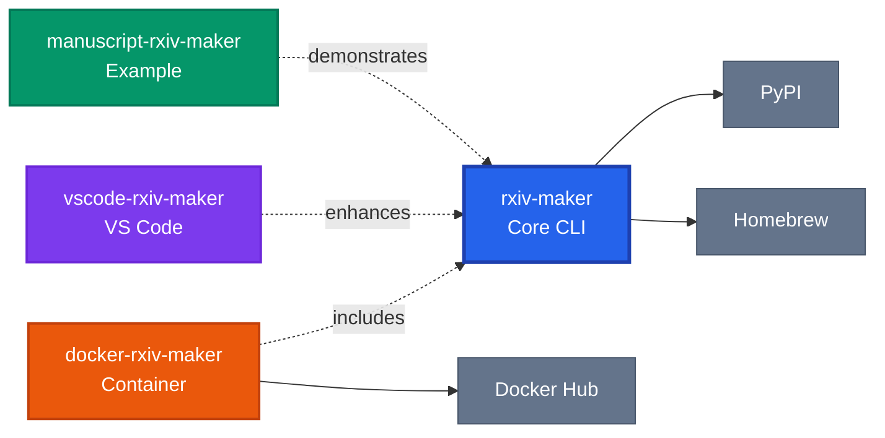

[](https://doi.org/10.48550/arXiv.2508.00836)
[](https://github.com/henriqueslab/rxiv-maker/blob/main/LICENSE)
[](https://github.com/HenriquesLab/rxiv-maker/stargazers)

# Rxiv-Maker


**Write scientific preprints in Markdown. Generate publication-ready PDFs efficiently.**

> **💡 Best Experience:** Use the [VS Code Extension](https://marketplace.visualstudio.com/items?itemName=HenriquesLab.rxiv-maker) for syntax highlighting and citations.

Rxiv-Maker converts enhanced Markdown into professional PDFs with automated figure generation, citation management, and LaTeX typesetting. While LaTeX installation is required, users don't need to write LaTeX code directly.

## ✨ Why Rxiv-Maker?

- **Write in Markdown**: Focus on content, not LaTeX formatting
- **Automated Figures**: Python/R scripts become publication figures
- **Smart Citations**: BibTeX integration with cross-references and DOI resolution
- **Dual Output**: Generate both PDF and DOCX from the same source
- **Git-Friendly**: Version control for manuscripts and figures
- **Reproducible**: All figures generated from code
- **arXiv Ready**: Generate submission packages automatically
- **Track Changes**: Visual diff between manuscript versions

## 🚀 Installation

<details>
<summary>🍎 <strong>macOS</strong> (Recommended - includes LaTeX automatically)</summary>

```bash
brew tap henriqueslab/formulas
brew install rxiv-maker
rxiv check-installation
```

**Upgrade:**
```bash
brew upgrade rxiv-maker
```

> **📖 [Homebrew Formula](https://github.com/HenriquesLab/homebrew-formulas)** - Includes Python, LaTeX (MacTeX), and all dependencies

</details>

<details>
<summary>🐧 <strong>Linux / Windows (WSL)</strong></summary>

**Using pipx (recommended):**
```bash
pipx install rxiv-maker
rxiv check-installation
```

**Using uv (faster alternative):**
```bash
uv tool install rxiv-maker
rxiv check-installation
```

**Requirements:**
- **Python 3.11+**: For rxiv-maker CLI and figure generation
- **LaTeX Distribution**: Install via system package manager
  - **Ubuntu/Debian**: `sudo apt install texlive-latex-recommended`
  - **Fedora/RHEL**: `sudo dnf install texlive-latex`

**Upgrade:**
```bash
pipx upgrade rxiv-maker  # or: uv tool upgrade rxiv-maker
```

</details>

> **📖 Need help?** See the [complete installation guide](https://rxiv-maker.henriqueslab.org/getting-started/installation/) for detailed platform-specific instructions.

## 🔥 Quick Start

**Get your first PDF quickly:**

```bash
# Create manuscript
rxiv init my-paper
cd my-paper

# Generate PDF
rxiv pdf
```

**Or explore the complete example manuscript:**

```bash
# Clone the official example with one command
rxiv get-rxiv-preprint
cd manuscript-rxiv-maker/MANUSCRIPT

# Generate PDF
rxiv pdf
```

**🎯 [Getting Started Guide](https://rxiv-maker.henriqueslab.org/getting-started/first-manuscript/)**

## 🏆 Key Features

### 🎨 **Enhanced Markdown**
- Scientific cross-references (`@fig:plot`, `@eq:formula`)
- Auto-numbered figures, tables, and equations
- Mathematical notation with LaTeX math
- Code blocks with syntax highlighting
- Markdown comments (`<!-- note -->`) for TODOs and notes

### 📊 **Automated Figures & Data Analysis**
- Execute Python/R scripts during PDF generation
- **🐍 NEW: Jupyter-like executable Python code blocks**
- Real-time data analysis with `{{py:exec}}` and `{{py:get variable}}`
- Matplotlib, ggplot2, and custom visualizations
- Version-controlled figure code and analysis modules

### 📚 **Citation Management**
- BibTeX integration with `[@citation]` syntax
- Automatic bibliography generation
- **Multiple citation styles**: Choose between numbered `[1, 2]` or author-date `(Smith, 2024)` citations
- **Configurable author name formatting**: Format bibliography as `Smith, J.A.` or `Smith, John A.` or `John A. Smith`
- **Inline DOI resolution**: Paste DOIs directly in text `10.1038/...` and auto-convert to citations
- CrossRef/DataCite DOI validation and metadata fetching

> 📖 **Learn more**: [Quick Reference Cheat-Sheet](https://rxiv-maker.henriqueslab.org/getting-started/quick-reference/)

### 🔧 **Developer Experience**
- Modern CLI with rich output and progress bars
- Consistent environments with package management
- Git-friendly workflow with meaningful diffs
- Comprehensive validation and error reporting

## 🌟 Example Manuscript

> **💡 Get this complete example instantly:**
> ```bash
> rxiv get-rxiv-preprint
> ```
> This clones [manuscript-rxiv-maker](https://github.com/HenriquesLab/manuscript-rxiv-maker) with all features demonstrated.

**Input Markdown:**
```markdown
## Introduction

Recent advances in microscopy have enabled new insights into
cellular dynamics [@smith2023; @jones2024].


{#fig:results}

Our analysis (Figure @fig:results) shows significant improvement
over previous methods. Statistical analysis revealed p < 0.001.
```

**Output:** Professional PDF with auto-numbered figures, formatted citations, and LaTeX typesetting.

> **💡 See the complete working example:**
> `rxiv get-rxiv-preprint` - clones [manuscript-rxiv-maker](https://github.com/HenriquesLab/manuscript-rxiv-maker) with advanced features including Python execution, DOI auto-resolution, and dynamic data integration.

## 📖 Documentation

### For Users
Visit our **[official documentation website](https://rxiv-maker.henriqueslab.org)** for comprehensive guides:
- **[Installation Guide](https://rxiv-maker.henriqueslab.org/getting-started/installation/)** - Setup for all platforms
- **[First Manuscript Tutorial](https://rxiv-maker.henriqueslab.org/getting-started/first-manuscript/)** - 5-minute walkthrough
- **[User Guide](https://rxiv-maker.henriqueslab.org/guides/)** - Complete features and workflows
- **[CLI Reference](https://rxiv-maker.henriqueslab.org/api/)** - All commands and options
- **[Troubleshooting](https://rxiv-maker.henriqueslab.org/community/troubleshooting/)** - Solutions to common issues

### For Developers
- **[CONTRIBUTING.md](CONTRIBUTING.md)** - Contribution guidelines
- **[CI-LOCAL-TESTING.md](CI-LOCAL-TESTING.md)** - Local CI workflow testing
- **[Developer Docs](docs/)** - Technical documentation and API details

## 🎯 Use Cases

<details>
<summary>📄 <strong>Research Preprints, Reproducible Figures, and Collaborative Workflows</strong></summary>

### 📄 **Research Preprints**
- arXiv preprints with automated submission packages
- bioRxiv and other preprint servers with professional formatting
- Conference papers with consistent styling

### 📊 **Preprint Features**
- **Reproducible figures** generated from Python/R scripts
- **Live data integration** that updates with analysis changes
- **Professional formatting** optimized for preprint servers

### 🎓 **Preprint Workflows**
- **arXiv submissions** with cross-references and mathematical notation
- **Collaborative preprint writing** with version control
- **Supplementary materials** with automated generation

</details>

## 🏃‍♀️ Ecosystem & Workflows

**Three ways to use rxiv-maker:**
- 🖥️ **Local Installation**: Install directly on your system (recommended)
- 🐳 **Docker**: Pre-configured container with all dependencies
- ☁️ **Cloud**: GitHub Actions or Google Colab for browser-based editing

<details>
<summary>🔗 <strong>Ecosystem</strong> - Related repositories and tools</summary>

### Ecosystem Overview



### Related Repositories

| Repository | Purpose | Access |
|------------|---------|--------|
| **[rxiv-maker](https://github.com/HenriquesLab/rxiv-maker)** | Main CLI tool and Python package | `brew install rxiv-maker` |
| **[docker-rxiv-maker](https://github.com/HenriquesLab/docker-rxiv-maker)** | Pre-configured container with LaTeX + dependencies | `docker pull henriqueslab/rxiv-maker-base` |
| **[manuscript-rxiv-maker](https://github.com/HenriquesLab/manuscript-rxiv-maker)** | Complete example (published as arXiv:2508.00836) | `rxiv get-rxiv-preprint` |
| **[vscode-rxiv-maker](https://github.com/HenriquesLab/vscode-rxiv-maker)** | VS Code extension with syntax highlighting | VS Code Marketplace |
| **[Documentation](https://rxiv-maker.henriqueslab.org)** | User guides, API reference, tutorials | Visit website |

</details>

## 🚀 Quick Commands

**Essential commands to get started:**

```bash
rxiv init my-paper       # Create new manuscript
rxiv pdf                 # Generate PDF
rxiv validate           # Check manuscript quality
rxiv upgrade            # Upgrade to latest version
```

<details>
<summary>📋 <strong>Complete Command Reference</strong> - Repository management, export options, and advanced workflows</summary>

### Core Commands
```bash
rxiv init my-paper          # Create new manuscript
rxiv get-rxiv-preprint     # Clone complete example manuscript
rxiv pdf                    # Generate PDF
rxiv docx                   # Export to DOCX for collaborative review
rxiv validate              # Check manuscript quality
rxiv arxiv                 # Prepare arXiv submission
rxiv track-changes v1 v2   # Visual version comparison
```

### Repository Management
```bash
# Initial setup
rxiv repo-init             # Interactive setup
rxiv config                # Interactive configuration menu

# Create and manage repositories
rxiv create-repo my-paper  # Create new manuscript repository (with GitHub integration)
rxiv repos                 # List all manuscript repositories
rxiv repos-search          # Search and clone from GitHub

# Configuration
rxiv config set-repo-parent-dir ~/manuscripts
rxiv config set-repo-org YourGitHubOrg
rxiv config --non-interactive  # Show current settings
```

### Maintenance
```bash
# Upgrade commands (auto-detects Homebrew, pip, uv, pipx)
rxiv upgrade                 # Interactive upgrade with confirmation
rxiv upgrade --yes           # Upgrade without confirmation
rxiv upgrade --check-only    # Check for updates only

# Changelog and version information
rxiv changelog               # View changelog and release notes
rxiv changelog --recent 5    # View last 5 versions
```

> **💡 CI/Automation Note:** All interactive commands support non-interactive mode or configuration files for use in CI/CD pipelines and automated workflows. Use `--non-interactive` flag or configure via `~/.rxiv-maker/config` for non-TTY environments.

**📖 [Complete CLI Reference](https://rxiv-maker.henriqueslab.org/getting-started/quick-reference/)** - Full command documentation with examples and options.

</details>

## 📚 Publications Using Rxiv-Maker

| Publication | Authors | Venue | DOI |
|-------------|---------|-------|-----|
| Rxiv-Maker: an automated template engine for streamlined scientific publications | BM Saraiva et al. | arXiv (2025) | [10.48550/arXiv.2508.00836](https://doi.org/10.48550/arXiv.2508.00836) |
| Customizable FDM-based zebrafish embryo mold for live imaging | MX Rivera Pineda et al. | bioRxiv (2025) | [10.1101/2025.11.24.689779](https://doi.org/10.1101/2025.11.24.689779) |
| mAIcrobe: an open-source framework for high-throughput bacterial image analysis | AD Brito et al. | bioRxiv (2025) | [10.1101/2025.10.21.683709](https://doi.org/10.1101/2025.10.21.683709) |
| Filopodome proteomics identifies CCT8 as a MYO10 interactor critical for filopodia functions | A Popović et al. | bioRxiv (2025) | [10.64898/2025.12.03.691809](https://doi.org/10.64898/2025.12.03.691809) |

**📸 [View Publication Previews](https://rxiv-maker.henriqueslab.org/examples/showcase/)** - See manuscript thumbnails and access preprints

> **Using Rxiv-Maker for your research?** Submit your publication via [GitHub Issue](https://github.com/HenriquesLab/rxiv-maker/issues/new?template=publication_submission.yml)

## 🤝 Community

- **💬 [GitHub Discussions](https://github.com/henriqueslab/rxiv-maker/discussions)** - Ask questions, share tips
- **🐛 [Issues](https://github.com/henriqueslab/rxiv-maker/issues)** - Report bugs, request features
- **📚 [Example Manuscript](https://github.com/HenriquesLab/manuscript-rxiv-maker)** - Clone instantly: `rxiv get-rxiv-preprint`
- **🧪 [Google Colab](https://colab.research.google.com/github/HenriquesLab/rxiv-maker/blob/main/notebooks/rxiv_maker_colab.ipynb)** - Try without installing

## 🏗️ Contributing

We welcome contributions! Whether it's:

- 🐛 Bug reports and fixes
- ✨ New features and improvements  
- 📖 Documentation enhancements
- 🧪 Testing and validation

**Quick contributor setup:**
```bash
git clone https://github.com/henriqueslab/rxiv-maker.git
cd rxiv-maker
pip install -e ".[dev]"
pre-commit install
```

## 📄 Citation

If Rxiv-Maker helps your research, please cite:

```bibtex
@misc{saraiva_2025_rxivmaker,
  title={Rxiv-Maker: an automated template engine for streamlined scientific publications}, 
  author={Bruno M. Saraiva and António D. Brito and Guillaume Jaquemet and Ricardo Henriques},
  year={2025},
  eprint={2508.00836},
  archivePrefix={arXiv},
  url={https://arxiv.org/abs/2508.00836}
}
```

## 📜 License

MIT License - see [LICENSE](LICENSE) for details.

---

<div align="center">

**🔬 From [Jacquemet](https://github.com/guijacquemet) and [Henriques](https://github.com/HenriquesLab) Labs**

*"Because science is hard enough without fighting with LaTeX."*

**[🚀 Start Writing](https://rxiv-maker.henriqueslab.org/getting-started/first-manuscript/)** | **[📚 User Guide](https://rxiv-maker.henriqueslab.org/guides/)** | **[⚙️ CLI Reference](https://rxiv-maker.henriqueslab.org/getting-started/quick-reference/)**

</div>
