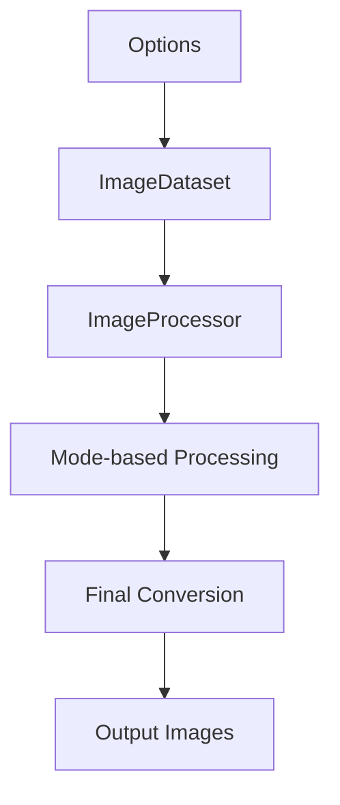

```text
   ███████╗██╗  ██╗██╗███╗  ██╗██╗███████╗██████╗
   ██╔════╝██║  ██║██║████╗ ██║██║██╔════╝██╔══██╗
   ███████╗███████║██║██╔██╗██║██║█████╗  ██████╔╝
   ╚════██║██╔══██║██║██║╚████║██║██╔══╝  ██╔══██╗
   ███████║██║  ██║██║██║ ╚███║██║███████╗██║  ██║
   ╚══════╝╚═╝  ╚═╝╚═╝╚═╝  ╚══╝╚═╝╚══════╝╚═╝  ╚═╝
```

[](LICENSE)
[]()
[](https://pypi.org/project/shinier/)
---

# Documentation

## 📋 Table of Contents

1. [Overview](#overview)
2. [Package Architecture](#package-architecture)
3. [MATLAB vs Python Differences](#matlab-vs-python-differences)
4. [Detailed Processing Modes](#detailed-processing-modes)
5. [Main Classes](#main-classes)
6. [Visualization Functions](#visualization-functions)
7. [Implemented Algorithms](#implemented-algorithms)
8. [Memory Management and Performance](#memory-management-and-performance)
9. [Testing and Validation](#testing-and-validation)

---

<a id="overview"></a>
## 🎯 Overview

**SHINIER** is a modern Python implementation of the **SHINE** (Spectrum, Histogram, and Intensity Normalization, Equalization, and Refinements) toolbox, originally developed in MATLAB by [Willenbockel et al. (2010)](https://doi.org/10.3758/BRM.42.3.671). This new version implemented new options (e.g., color management, dithering and [Coltuc, Bolon & Chassery (2006)](https://www.cin.ufpe.br/~if751/projetos/artigos/Exact%20Histogram%20Specification.pdf) exact histogram specification algorithm) and refined the previous ones.

**Reference** : [Willenbockel, V., Sadr, J., Fiset, D., Horne, G. O., Gosselin, F., & Tanaka, J. W. (2010). Controlling low-level image properties: The SHINE toolbox. *Behavior Research Methods*, 42(3), 671-684.](https://doi.org/10.3758/BRM.42.3.671)

### Main Objectives
- **Compatibility**: Maintain compatibility with the original MATLAB implementation
- **Performance**: Optimize performance for large datasets
- **Extensibility**: Object-oriented architecture for easy extensions
- **Precision**: Reduce rounding errors in multi-step calculations

---

<a id="package-architecture"></a>
## 🏗️ Package Architecture

### Module Structure

```
shinier/src
├── color                # Color-space conversion
│   └── ...
├── __init__.py          # Package entry point
├── base.py              # Customized Pydantic base-model
├── ImageDataset.py      # Image collection management
├── ImageListIO.py       # Image file input/output
├── ImageProcessor.py    # Main image processing
├── Options.py           # Parameter configuration
├── SHINIER.py          # Command-line interface
└── utils.py            # Utility functions and MATLAB operators
```

### Processing Flow



---

<a id="matlab-vs-python-differences"></a>
## 🔬 MATLAB vs Python Differences

### 1. **Rounding Operators**

#### MATLAB `round()`
```matlab
>> round([2.5, 3.5, -2.5, -3.5])
ans = [3, 4, -3, -4]
```
- Rounds **away from zero** (round-away-from-zero)
- Deterministic behavior for values exactly halfway

#### Python `numpy.round()` - IEEE 754 Standard
```python
>>> np.round([2.5, 3.5, -2.5, -3.5])
array([2., 4., -2., -4.])
```
- Rounds **to nearest even** (round-half-to-even, "Bankers' Rounding")
- **IEEE 754-2019 Standard** compliant (recommended default for binary formats)
- **Statistically unbiased** for large datasets
- **Reduces cumulative rounding errors** in iterative computations

#### SHINIER Solution - Compatibility vs Standards
```python
class MatlabOperators:
    @staticmethod
    def round(x):
        """Simulates MATLAB's rounding behavior for compatibility"""
        return np.sign(x) * np.ceil(np.floor(np.abs(x) * 2) / 2)
```

**Scientific Rationale:**

While SHINIER provides MATLAB-compatible rounding for **legacy compatibility**, the **IEEE 754-2019 standard** recommends round-half-to-even because:

1. **Statistical Unbiasedness**: Round-half-to-even produces unbiased results when rounding large datasets
2. **Error Minimization**: Reduces cumulative rounding errors in iterative algorithms
3. **Industry Standard**: Used by most modern computing systems (Python, R, Julia, etc.)
4. **Numerical Stability**: Better performance in floating-point arithmetic

**References:**
- [**IEEE 754-2019**](https://ieeexplore.ieee.org/document/8766229): "IEEE Standard for Floating-Point Arithmetic"
- [**Goldberg, D. (1991)**](https://docs.oracle.com/cd/E19957-01/806-3568/ncg_goldberg.html): "What Every Computer Scientist Should Know About Floating-Point Arithmetic"
- [**Kahan, W. (1996)**](https://people.eecs.berkeley.edu/~wkahan/ieee754status/IEEE754.PDF): "IEEE Standard 754 for Binary Floating-Point Arithmetic"

**Recommendation**: Use `legacy_mode=False` (default) for scientifically robust results, `legacy_mode=True` only for MATLAB compatibility validation.

### 2. **Integer Type Conversion**

#### MATLAB `uint8()`
```matlab
>> uint8([2.5, 3.5, -2.5, 255.5])
ans = [3, 4, 0, 255]
```
- Rounds to nearest integer
- **Clips** values between [0, 255]

#### Python `numpy.astype('uint8')`
```python
>>> np.array([2.5, 3.5, -2.5, 256, 257]).astype('uint8')
array([2, 3, 254, 0, 1], dtype=uint8)
```
- **Truncates** decimal values
- **Wrap-around** behavior for out-of-range values

#### SHINIER Solution
```python
@staticmethod
def uint8(x):
    """Replicates MATLAB's uint8 behavior"""
    return np.uint8(np.clip(MatlabOperators.round(x), 0, 255))
```

### 3. **Standard Deviation Calculation**

#### MATLAB `std2()`
```matlab
>> A = rand(100, 100);
>> std2(A)
ans = 0.287630126526993
```
- Uses **N-1** divisor (unbiased estimator)

#### Python `numpy.std()` - Statistical Best Practice
```python
>>> A = np.random.rand(100, 100)
>>> np.std(A)
0.28761574466111084
```
- Uses **N** divisor (biased estimator) by default
- **Population standard deviation** (mathematically correct for complete populations)
- **Consistent with most statistical software** (R, Julia, etc.)

#### SHINIER Solution - Scientific Flexibility
```python
@staticmethod
def std2(x):
    """Replicates MATLAB's std2 function for compatibility"""
    return np.std(x, ddof=1)  # ddof=1 for N-1 (sample std)
```

**Statistical Rationale:**

The choice between N and N-1 divisors depends on the **statistical context**:

- **N divisor**: Population standard deviation (when you have the complete population)
- **N-1 divisor**: Sample standard deviation (when estimating population from sample)

**SHINIER Approach**: Provides both options through `ddof` parameter, allowing users to choose based on their statistical requirements.

### 4. **RGB to Grayscale Conversion**

#### MATLAB `rgb2gray()` - Legacy Standard
```matlab
% Uses Rec.ITU-R BT.601-7 (SD monitors)
Y' = 0.299 * R + 0.587 * G + 0.114 * B
```
- **Rec.ITU-R BT.601-7**: Standard-Definition television (1982)
- **Legacy standard** optimized for CRT monitors

#### SHINIER `rgb2gray()` - Modern Standards Support
```python
def rgb2gray(image, recommendation='rec709'):
    """RGB to grayscale conversion with multiple luma coefficient standards"""
    rgb_luma_coefficients = {
        'equal': [0.333, 0.333, 0.333],  # Equal weighting (not perceptually accurate)
        'rec601': [0.298936021293775, 0.587043074451121, 0.114020904255103],  # SD legacy
        'rec709': [0.2126, 0.7152, 0.0722],  # HD standard (recommended)
        'rec2020': [0.2627, 0.6780, 0.0593]   # UHD standard
    }
    weights = rgb_luma_coefficients[recommendation]
    return np.dot(image.astype(np.float64), weights)
```

**Scientific Rationale:**

Different luma coefficients are optimized for different **display technologies** and **viewing conditions**:

- **Rec.ITU-R BT.601**: **Legacy compatibility** for SD displays
- **Rec.ITU-R BT.709**: **Recommended default** for modern displays (HD, 4K)
- **Rec.ITU-R BT.2020**: **Future-proof** for UHD/HDR displays

**References:**
- [**Poynton, Charles (1997)**](https://poynton.ca/PDFs/ColorFAQ.pdf): "Frequently Asked Questions about Color"
- [**ITU-R BT.601-7 (2011)**](https://www.itu.int/dms_pubrec/itu-r/rec/bt/R-REC-BT.601-7-201103-I!!PDF-E.pdf): "Studio encoding parameters of digital television for standard 4:3 and wide-screen 16:9 aspect ratios"
- [**ITU-R BT.709-6 (2015)**](https://www.itu.int/dms_pubrec/itu-r/rec/bt/r-rec-bt.709-6-201506-i!!pdf-e.pdf): "Parameter values for the HDTV standards for production and international programme exchange"
- [**ITU-R BT.2020-2 (2015)**](https://www.itu.int/dms_pubrec/itu-r/rec/bt/r-rec-bt.2020-2-201510-i!!pdf-e.pdf): "Parameter values for ultra-high definition television systems"

**SHINIER Advantage**: Provides **multiple standards** allowing users to choose the most appropriate for their display technology and research context. 

**WARNING AND REMINDER**: Ajusting for the luminance transfer functions implemented in image-capturing devices 
and the precise calibration of display monitors are essential for accurate visual stimuli presentation.

---

<a id="detailed-processing-modes"></a>
## ⚙️ Detailed Processing Modes

### Mode 1: Luminance Matching Only
```python
mode = 1  # lum_match only
```
**Algorithm:**
- If `target_lum` is None or equals `(0, 0)`: compute target parameters from the dataset
  - `mean` = average of image means
  - `std`  = average of image standard deviations
- Otherwise (when `target_lum=(mean, std)` is provided): use it directly as the target
- Apply linear rescaling per image: `new_pixel = (pixel - mean) * (target_std/std) + target_mean`

**Specific Parameters:**
- `target_lum`: Optional tuple `(mean, std)` where `mean ∈ [0, 255]` and `std ∈ [0, +∞)`. If omitted or `(0, 0)`, dataset averages are used
- `safe_lum_match`: If True, automatically adjusts `(target_mean, target_std)` to keep all pixel values within [0, 255] (values may differ slightly from the requested target)

### Mode 2: Histogram Matching Only
```python
mode = 2  # hist_match only
```
**Available Algorithms:**
- **Exact specification** (`hist_specification=0`): [Coltuc, Bolon & Chassery (2006)]((https://www.cin.ufpe.br/~if751/projetos/artigos/Exact%20Histogram%20Specification.pdf)) algorithm
- **Specification with noise** (`hist_specification=1`): Legacy version with noise addition

**SSIM Optimization:**
- `hist_optim=1`: SSIM-based optimization ([Avanaki, 2009](https://link.springer.com/article/10.1007/s10043-009-0119-z)))
- `hist_iterations`: Number of iterations (default: 10)
- `step_size`: Step size (default: 34)

### Mode 3: Spatial Frequency Matching Only
```python
mode = 3  # sf_match only
```
**Match spatial frequencies of input images to a target rotational spectrum.** 

**Algorithm (summary):**
1) Convert images to float [0,255] (H×W×C) and prepare optional masks/bit-depth.
2) Build the target rotational magnitude spectrum (provided or averaged from inputs).
3) For each image, compute FFT, replace the radial magnitude profile with the target while preserving phase, then inverse FFT.
4) Apply rescaling per `options.rescaling` (0 none, 1 per-image, 2 global, 3 average) and clip to valid range.
5) Store float255 outputs and optionally log/plot spectral diagnostics.

---

### Mode 4: Spectrum Matching Only
```python
mode = 4  # spec_match only
```
**Match the full magnitude spectrum of images to a target spectrum (2D magnitude, not only rotational average).**

**Algorithm (summary):**
1) Convert images to float [0,255] (H×W×C) and consider masks if provided.
2) Build the target 2D magnitude spectrum (provided or element-wise average of input magnitudes).
3) For each image, compute FFT, replace the full magnitude by the target while preserving phase, then inverse FFT.
4) Apply rescaling per `options.rescaling` and clip to the valid intensity range.
5) Store float255 outputs and optionally log or visualize spectrum-related diagnostics.

### Composite Modes (5-8)

#### Mode 5: Histogram + Spatial Frequency
```python
mode = 5  # hist_match → sf_match
```

#### Mode 6: Histogram + Spectrum
```python
mode = 6  # hist_match → spec_match
```

#### Mode 7: Spatial Frequency + Histogram
```python
mode = 7  # sf_match → hist_match
```

#### Mode 8: Spectrum + Histogram (Recommended)
```python
mode = 8  # spec_match → hist_match
```

**High Numerical Precision:**
- Composite modes use temporary floating-point precision
- Reduces rounding errors in multi-step calculations

### Mode 9: Dithering Only
```python
mode = 9  # only dithering
```

---

<a id="main-classes"></a>
## 🏛️ Main Classes
### `ColorConverter`
Encapsulates color-space conversions for Rec.601/709/2020 systems.
```python
class ColorConverter:
    standard: Literal["rec601", "rec709", "rec2020"] = "rec709"
    gamma: float = 2.4
    white_point: np.ndarray = Field(default_factory=lambda: WHITE_D65.copy())
    M_RGB2XYZ: np.ndarray = Field(default_factory=lambda: M_RGB2XYZ_709.copy())
    M_XYZ2RGB: np.ndarray = Field(default_factory=lambda: np.linalg.inv(M_RGB2XYZ_709))
```

### `Options`
Centralized configuration class for all processing parameters.

```python
class Options:
    # --- I/O ---
    input_folder: Optional[Path] = Field(default=REPO_ROOT / "INPUT")
    output_folder: Path = Field(default=REPO_ROOT / "OUTPUT")

    # --- Masks ---
    masks_folder: Optional[Path] = Field(default=None)
    whole_image: Literal[1, 2, 3] = 1
    background: Union[conint(ge=0, le=255), Literal[300]] = 300

    # --- Mode ---
    mode: Literal[1, 2, 3, 4, 5, 6, 7, 8, 9] = 8
    seed: Optional[int] = None
    legacy_mode: bool = False
    iterations: conint(ge=1) = 2

    # --- Color ---
    as_gray: bool = False
    linear_luminance: bool = False
    rec_standard: Literal[1, 2, 3] = 2

    # --- Dithering / Memory ---
    dithering: Literal[0, 1, 2] = 1
    conserve_memory: bool = True

    # --- Luminance ---
    safe_lum_match: bool = False
    target_lum: Tuple[conint(ge=0, le=255), confloat(ge=0)] = (0, 0)

    # --- Histogram ---
    hist_optim: bool = False
    hist_specification: Optional[Literal[1, 2, 3, 4]] = 4
    hist_iterations: conint(ge=1) = 10
    target_hist: Optional[Union[np.ndarray, Literal["equal", "unit_test"]]] = Field(default=None)

    # --- Fourier ---
    rescaling: Optional[Literal[0, 1, 2, 3]] = 2
    target_spectrum: Optional[Union[np.ndarray, Literal["unit_test"]]] = Field(default=None)

    # --- Misc ---
    verbose: Literal[-1, 0, 1, 2, 3] = 0
```

### `ImageDataset`
Management of image and mask collections with state tracking.

```python
class ImageDataset:
    # --- User-provided / externally settable attributes ---
    images: Optional[Union[ImageListIO, ImageListType]] = None
    masks: Optional[Union[ImageListIO, ImageListType]] = None
    options: Options = Field(default_factory=Options)

    # --- Internally constructed / derived attributes ---
    processing_logs: List[str] = Field(default_factory=list)
    n_images: Optional[int] = None
    n_masks: Optional[int] = None
    images_name: Optional[List[str]] = None
    masks_name: Optional[List[str]] = None

    magnitudes: Optional[ImageListIO] = None
    phases: Optional[ImageListIO] = None
    buffer: Optional[ImageListIO] = None
    buffer_other: Optional[ImageListIO] = None
```

### `ImageProcessor`
Main image processing class.

```python
class ImageProcessor:
    # --- Public attributes ---
    dataset: ImageDataset
    options: Optional[Options] = None
    verbose: Literal[-1, 0, 1, 2, 3] = 0
    log: List[str] = Field(default_factory=list)
    validation: List[dict] = Field(default_factory=list)
    ssim_results: List[dict] = Field(default_factory=list)
    ssim_data: List[dict] = Field(default_factory=list)
    seed: Optional[int] = None
    bool_masks: List = Field(default_factory=list)
    from_cli: bool = Field(default=False)
    from_unit_test: bool = Field(default=False)
    from_validation_test: bool = Field(default=False)

    # --- Private attributes ---
    _dataset_map: dict = PrivateAttr(default_factory=dict)
    _mode2processing_steps: dict = PrivateAttr(default_factory=dict)
    _fct_name2process_name: dict = PrivateAttr(default_factory=dict)
    _iter_num: int = PrivateAttr(default=0)
    _processing_steps: List[str] = PrivateAttr(default_factory=list)
    _n_steps: int = PrivateAttr(default=0)
    _step: int = PrivateAttr(default=0)
    _processing_function: Optional[str] = PrivateAttr(default=None)
    _processed_image: Optional[str] = PrivateAttr(default=None)
    _processed_channel: Optional[int] = PrivateAttr(default=None)
    _log_param: dict = PrivateAttr(default_factory=dict)
    _is_last_operation: bool = PrivateAttr(default=False)
    _sum_bool_masks: List = PrivateAttr(default_factory=list)
    _complete: bool = PrivateAttr(default=False)
    _rec_standard: str = PrivateAttr(default="rec709")
    _target_lum: Optional[List[Tuple[float, float]]] = PrivateAttr(default=None)
    _target_hist: Optional[np.ndarray] = PrivateAttr(default=None)
    _target_spectrum: Optional[np.ndarray] = PrivateAttr(default=None)
    _target_sf: Optional[np.ndarray] = PrivateAttr(default=None)
    _final_buffer: Optional[ImageListIO] = PrivateAttr(default=None)
    _initial_buffer: Optional[ImageListIO] = PrivateAttr(default=None)
```

---

<a id="visualization-functions"></a>
## Visualization Functions

```python
def imhist_plot(
    img: np.ndarray,
    bins: int = 256,
    figsize=(8, 6),
    dpi=100,
    title: Optional[str] = None,
    target_hist: Optional[np.ndarray] = None,
    binary_mask: Optional[np.ndarray] = None,
    descriptives: bool = False,
    ax: Optional[plt.Axes] = None,
    show_normalized_rmse: bool = False,
) -> Tuple[plt.Figure, Tuple[Any, Any, Any]]:
    """Displays an image with its histogram and optional descriptive statistics."""

def spectrum_plot(
        spectrum: np.ndarray,
        cmap: str = "gray",
        log: bool = True,
        gamma: float = 1.0,
        ax: Optional[plt.Axes] = None,
        with_colorbar: bool = True,
        colorbar_label: str = 'log(1 + |F|) (stretched)'
    ) -> Union[plt.Figure, plt.Axes]:
    """Display a Fourier magnitude spectrum with optional log and gamma scaling."""
    
def sf_plot(
        image: np.ndarray, 
        sf_p: Optional[np.ndarray], 
        target_sf: Optional[np.ndarray], 
        ax: Optional[plt.axis] = None
) -> Union[plt.Figure, plt.Axes]:
    """Spatial frequency profile plotting"""

def show_processing_overview(processor: ImageProcessor, img_idx: int = 0, show_figure: bool = True) -> plt.Figure:
    """Display before/after images and diagnostics for all processing steps in one figure.
```

---

<a id="implemented-algorithms"></a>
## 🧮 Implemented Algorithms

### 1. Exact Histogram Specification
**Reference:** [Coltuc, D., Bolon, P., & Chassery, J. M. (2006). Exact histogram specification. *IEEE Transactions on Image Processing*, 15(5), 1143-1152.](https://www.cin.ufpe.br/~if751/projetos/artigos/Exact%20Histogram%20Specification.pdf)

**Algorithm:**
1. Calculate cumulative distribution function (CDF) of source image
2. Calculate CDF of target histogram
3. Create mapping table based on CDFs
4. Apply mapping pixel by pixel

### 2. SSIM Optimization for Histogram
**Reference:** [Avanaki, A. N. (2009). Exact histogram specification for digital images using a variational approach. *Journal of Visual Communication and Image Representation*, 20(7), 505-515.](https://link.springer.com/article/10.1007/s10043-009-0119-z)

**Algorithm:**
1. Initial calculation of target histogram
2. Successive iterations with SSIM-based adjustment
3. Step size optimization for fast convergence

### 3. Floyd-Steinberg Dithering
**Reference:** Floyd, R. W., & Steinberg, L. (1976). An adaptive algorithm for spatial grey scale.

**Algorithm:**
1. Sequential image traversal (left to right, top to bottom)
2. Calculate quantization error for each pixel
3. Distribute error to neighboring pixels with different weights.

### 4. Noisy Bit Dithering
**Reference:** [Allard, R., & Faubert, J. (2008). The noisy-bit method for digital halftoning. *Journal of the Optical Society of America A*, 25(8), 1980-1989.](https://link.springer.com/article/10.3758/BRM.40.3.735)

**Algorithm:**
1. Add controlled noise to each pixel
2. Quantize with rounding
3. Preserve overall image structure

---

<a id="memory-management-and-performance"></a>
## 💾 Memory Management and Performance

### Memory Conservation Mode (`conserve_memory=True`)

**Operation:**
1. Create temporary directory `/tmp/shinier-<pid>/`
2. Save images as `.npy` format in temporary directory
3. Load only one image in memory at a time
4. Automatic cleanup at end of processing

**Advantages:**
- Significant RAM usage reduction
- Ability to process very large datasets
- Automatic temporary file management

**Implementation Code:**
```python
class ImageListIO:
    def __init__(self, input_data, conserve_memory=True, ...):
        if conserve_memory:
            self._setup_temp_storage()
            self._save_to_temp(input_data)
        else:
            self._load_all_images(input_data)
```

---

<a id="testing-and-validation"></a>
## 🧪 Testing and Validation

### Unit Tests

**Tested Components:**
- `Options`: Parameter validation
- `ImageListIO`: Image loading/saving
- `ImageDataset`: Collection management
- `ImageProcessor`: Image processing

**Test Images:**
- Noise-generated images for testing
- Binary masks for figure-ground separation
- Reference images for validation

### MATLAB Validation

**TODO**

---

## 📚 Usage Examples

- [See](documentation/demos.ipynb) `demos.ipynb` [in the documentation folder for](documentation/demos.ipynb):
  - Coding usage
  - Interactive CLI usage

Examples in here have been intentionally minimized; please open the demos for more examples.

---

## 🔧 Troubleshooting and Optimization

### Common Issues

**1. Out-of-range values in luminance matching**
```python
# Solution: Enable safety mode
options = Options(
    safe_lum_match=True,  # Automatically adjusts parameters
    mode=1
)
```

**2. Excessive memory usage**
```python
# Solution: Enable memory conservation
options = Options(
    conserve_memory=True,  # Load one image at a time
    mode=8
)
```

**3. Results different from MATLAB**
```python
# Solution: Enable legacy mode
options = Options(
    legacy_mode=True,  # Uses exact MATLAB algorithms
    mode=8
)
```
**Recommendations:**
- **The SHINIER, the better. Legacy doesn't mean it's ideal.**

**4. Composite modes (5-8) not achieving perfect matching for both histogram and Fourier simultaneously**
```python
# Solution: Increase iterations for composite modes
options = Options(
    mode=8,  # Spectrum + Histogram
    iterations=5,
)
```

**Scientific Rationale:**
Composite modes (5-8) apply **two sequential transformations** (e.g., spectrum matching followed by histogram matching). Because each transformation modifies the image in ways that can partially undo the effects of the other, a **single pass rarely yields convergence**. As detailed in the original [SHINE documentation](documentation/papers/Controlling%20low-level%20image%20properties:%20The%20SHINE%20toolbox.pdf), **iterative application** of both steps allows the algorithm to progressively minimize residual discrepancies between the desired luminance distribution and spectral amplitude structure.

1. **Sequential Processing**: Each cycle compensates for the distortions introduced by the preceding transformation (e.g., histogram adjustment altering spectral power).
2. **Convergence**: Repeated alternation drives both properties toward their joint target values.
3. **Iterative Refinement**: After several iterations (typically 5), the process reaches a stable equilibrium where further refinement yields negligible improvement.

---

<p align="center">
  <strong>Code developed by Nicolas Dupuis-Roy and Mathias Salvas-Hébert </strong><br>
  <em>Version 0.1.0 - Complete technical documentation</em>
</p>