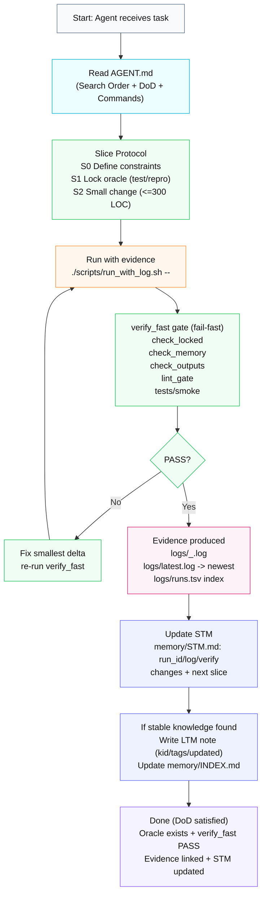
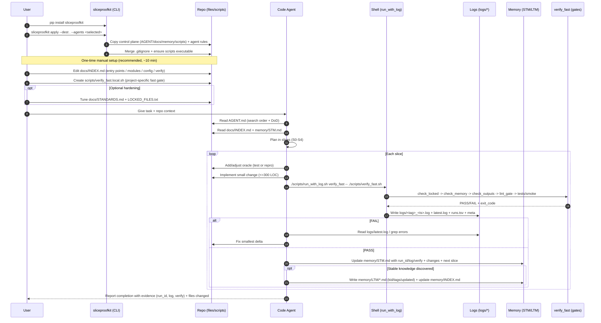

# sliceproofkit

A small, opinionated **control-plane kit** for code agents:

- **Slice refactors** (small, verifiable changes)
- **Fail-fast gates** (stop regressions early)
- **Evidence-driven runs** via **timestamped logs** (grep-friendly)

> Think of it as “repo-native muscle memory” for you + your code agent: what to read first, how to validate, where evidence lives, and how to persist knowledge across tasks.

---

## Why

If you’ve ever had a code agent:

- refactor too much → features disappear / bugs reappear
- “fix” via silent fallbacks → problems get hidden until later
- leave progress only in chat → nothing is grep-able next time

…then you don’t need a smarter agent. You need a **workflow that constrains the agent**.

sliceproofkit installs that workflow into your repo as **files + scripts**.

---

## Quick start

### Install

```bash
pip install sliceproofkit
# or (no env pollution)
uvx sliceproofkit --help
````

### Apply to a repo

```bash
sliceproofkit apply --dest . --agents all
# or pick some
sliceproofkit apply --dest . --agents antigravity,trae,cursor
# from this repo (no install)
sliceproofkit apply --kit src/sliceproofkit/kit --dest . --agents all
```

### List supported agents

```bash
sliceproofkit list-agents
```

### Run anything with evidence logs

```bash
./scripts/run_with_log.sh smoke -- echo "hello"
./scripts/grep_logs.sh "hello"
```

### Run the fail-fast gate

```bash
./scripts/run_with_log.sh verify_fast -- ./scripts/verify_fast.sh
```

---

## One-time manual setup (recommended, ~10 minutes)

The kit provides the **control plane**, but your repo must define two “facts” for maximum agent speed:

### 1) Fill `docs/INDEX.md`

This is the **repo navigation map**. Minimal fill is enough:

* entry points (CLI / main / service)
* how to run locally
* where config lives (path + format)
* key modules (domain/infra/utils)

### 2) Create `scripts/verify_fast.local.sh`

Most real repos have custom commands (monorepo, Makefile, just, tox/nox, etc.).
Create a local fast gate and make it executable:

```bash
cat > scripts/verify_fast.local.sh << 'EOF'
#!/usr/bin/env bash
set -euo pipefail

# Example (edit to match your repo)
# python -m compileall -q .
# ruff check .
# pytest -q

echo "TODO: define your project fast gate"
exit 2
EOF

chmod +x scripts/verify_fast.local.sh
```

`verify_fast.sh` will prefer `verify_fast.local.sh` if present.

> Optional but valuable: tune `docs/STANDARDS.md` (architecture boundaries + “don’t change these contracts”) and `LOCKED_FILES.txt`.

---

## How it works

### Flow



---

## User ↔ Agent interaction 



---

## What gets installed into your repo

### Common control plane

* `AGENT.md` — read-first entrypoint (search order, DoD, commands)
* `docs/` — standards, logging spec, ADR templates, repo index
* `memory/` — STM + LTM conventions (grep-first)
* `scripts/` — run-with-log, grep logs, verify gates, locked-files check
* `.gitignore` snippet is merged (logs/ etc.)

### Evidence logs

* `logs/<tag>_YYYYMMDD_HHMMSS.log` (one log per run)
* `logs/latest.log` (symlink/copy to newest log)
* `logs/runs.tsv` (index)

---

## Supported agents

Agents are applied via `--agents` (comma-separated) or `all`.

Current templates include:

* `antigravity`
* `trae`
* `cursor`
* `continue`
* `cline`
* `copilot`
* `claude_code`
* `windsurf`
* `aider`
* `iflow-cli`
* `codebuddy`

> Add a new agent:
>
> 1. Create `src/sliceproofkit/kit/agents/<agent_name>/...`
> 2. Add it to `src/sliceproofkit/kit/manifest.yaml`
> 3. Done — the apply tool discovers it automatically

---

## Lint gate: what it checks

`verify_fast` is a layered, fail-fast gate:

1. **Locked files**: prevent accidental edits to repo contracts (`LOCKED_FILES.txt`)
2. **Memory format**: STM/LTM must stay grep-able (headers, required keys)
3. **Outputs format**: ADR/INDEX must include evidence fields, etc.
4. **Lint gate**: stack-aware lint/format/typecheck (and/or your local override)
5. **Tests/smoke**: minimal sanity checks

Your job is to define what “fast enough + strict enough” means for your repo
(via `scripts/verify_fast.local.sh`).

---

## CLI reference

```bash
sliceproofkit --help
sliceproofkit list-agents
sliceproofkit apply --dest <repo_path> --agents all
sliceproofkit apply --dest <repo_path> --agents antigravity,trae,cursor --force
```

---

## Contributing

PRs welcome—especially:

* better stack autodetection for `verify_fast`
* more agent rule templates
* stronger “evidence formatting” gates that stay simple & grep-friendly

---

## License

MIT
