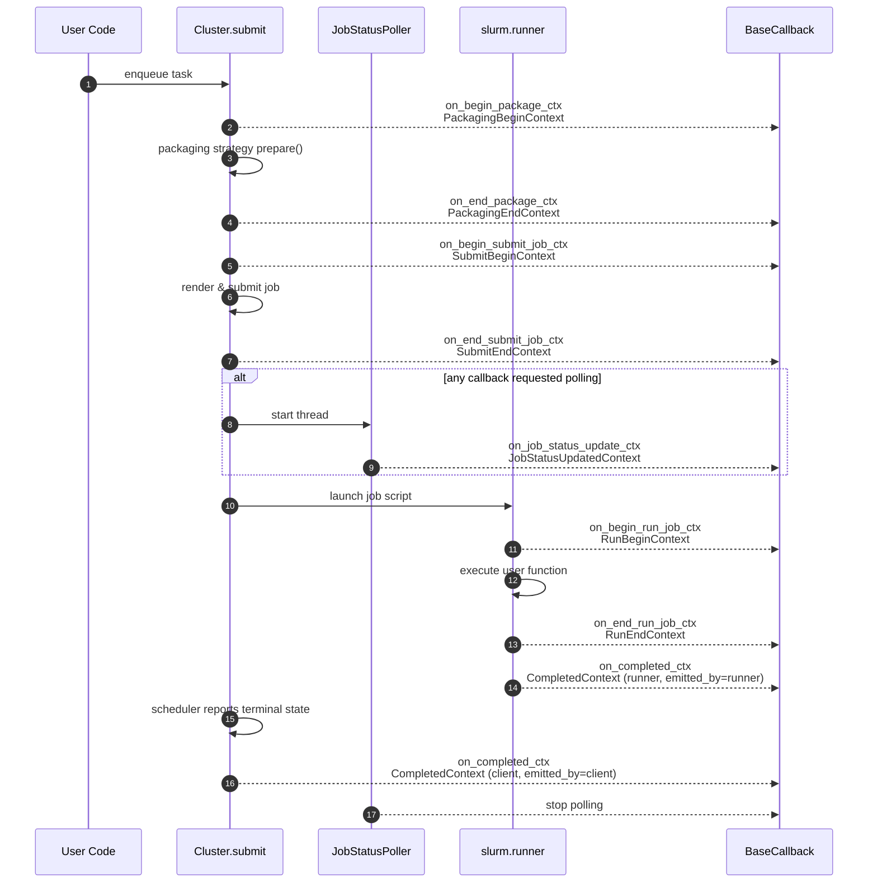

# Architecture: Callbacks

This document explains how callback handling currently works in the SDK. The goal is to describe real behavior of the codebase (`slurm/callbacks/callbacks.py`, `slurm/cluster.py`, and runner/packaging integration), serving as the canonical “as-built” reference.

## Key types

- `BaseCallback`: abstract class defining no-op methods for each lifecycle hook. Users extend it and override selected methods.
  - Context dataclasses:
      - `PackagingBeginContext` / `PackagingEndContext`: emitted around packaging strategy selection and preparation.
      - `SubmitBeginContext` / `SubmitEndContext`: surround job script rendering and submission.
      - `RunBeginContext` / `RunEndContext`: issued inside the job runner (process executing the task payload) with environment metadata, timing, and the resolved `JobContext` when available.
      - `JobStatusUpdatedContext`: produced by the SDK-managed poller on the client, carrying scheduler snapshots.
      - `CompletedContext`: emitted on both runner and client when the job reaches a terminal state. The runner-side emission also carries the `JobContext` snapshot.
  - `ExecutionLocus` hints determine whether a hook fires on the client, the runner, or both. Per-callback overrides live in `execution_loci`.
  - `poll_interval_secs` opt a callback into the shared polling thread; zero/`None` disables polling for that callback.
- Callbacks that require runner-side hooks (`on_begin_run_job_ctx`, `on_end_run_job_ctx`, `on_completed_ctx` with runner locus) are pickled and shipped alongside the job metadata. Pure client callbacks stay local.

## Lifecycle hooks

**Packaging**

1. `Cluster.submit` builds the packaging strategy.
2. Before calling `prepare`, each callback receives `on_begin_package_ctx` with the task and raw packaging config.
3. After successful preparation, `on_end_package_ctx` is invoked with the strategy instance (or result data).

**Submission**

1. Immediately before rendering and submitting, callbacks get `on_begin_submit_job_ctx` containing the effective SBATCH options, generated `pre_submission_id`, and target job directory.
2. After `backend.submit_job` returns, `on_end_submit_job_ctx` fires with the created `Job`, remote job id, and directory info. Exceptions raised by callbacks are suppressed to avoid breaking critical flow.

**Run & completion**

1. Inside the runner trampoline, `on_begin_run_job_ctx` runs before the user function executes. The context now includes hostname, interpreter, working directory, an environment snapshot, and the lazily constructed `JobContext`.
2. After the function returns (or raises), `on_end_run_job_ctx` fires with success/failure, stdout/stderr paths, timing, traceback data when applicable, and the same `JobContext` reference.
3. The runner immediately emits `on_completed_ctx` with a `CompletedContext` that captures the same diagnostics (including `JobContext`); the client receives its own `CompletedContext` once the scheduler reports a terminal state.

**Polling**

When at least one callback sets `poll_interval_secs`, `Cluster` starts a single `_JobStatusPoller` thread per job. Every poll produces a `JobStatusUpdatedContext` and rate-limited calls to `on_job_status_update_ctx`. The poller automatically ends when the job is terminal and triggers the client-side `CompletedContext` emission.

## Serialization and execution

- Callbacks supplied to `Cluster` are only pickled when they declare runner-side work (`requires_runner_transport()` returns `True`). Pure client callbacks stay in-process.
- When a callback is marked for runner transport the SDK still attempts to pickle it, so unpicklable state (open file handles, live threads) should be avoided.

## Error handling

- Callback invocations inside packaging and submission are wrapped in `try/except` blocks; errors are logged and ignored.
- Runner-stage callbacks propagate exceptions, causing job execution to surface failures (typical behavior when running on the remote node).
- No retry or backoff mechanism exists today. Implementers should keep callbacks idempotent.

## Extension points

- `slurm.callbacks.callbacks.LoggerCallback` and `BenchmarkCallback` demonstrate simple baseline implementations using the standard logging module.
- Users can register multiple callbacks; they execute in order of registration.
- Per-callback `execution_loci` make it easy to route hooks to the appropriate side. `poll_interval_secs` gives callbacks a polling cadence without bespoke threads. `requires_pickling = False` can be set to pin a callback to the client even if it has runner hooks.
