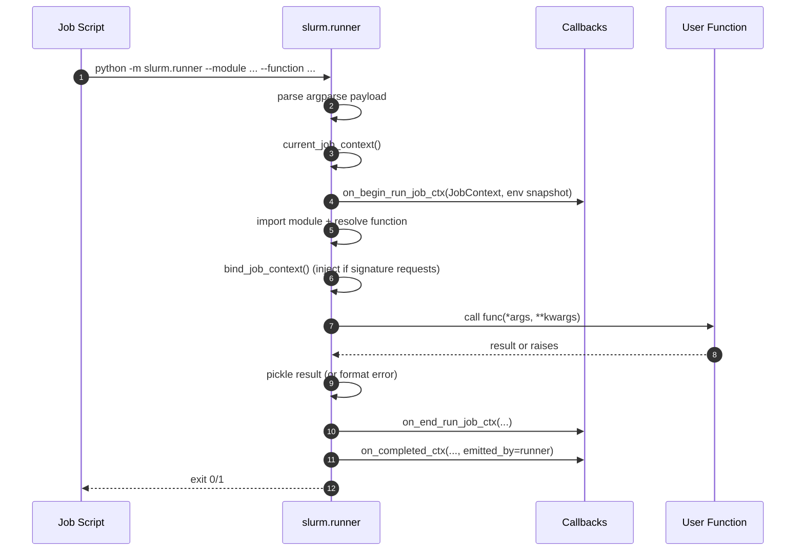
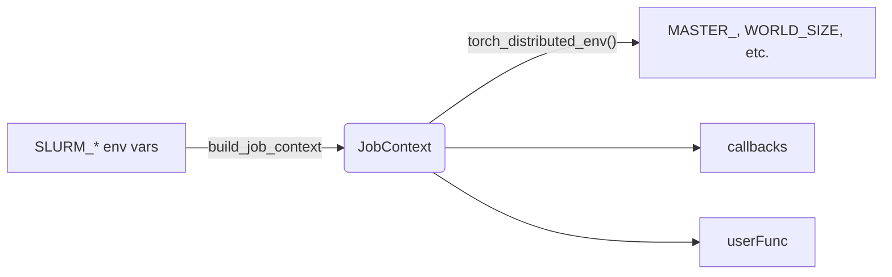

# Architecture: Runner

This document describes how `slurm.runner` executes a task that was submitted to
a SLURM cluster, why the runner is structured the way it is, and how the new
`JobContext` flows into user code and callbacks.

## Responsibilities at a glance

The runner is launched from the rendered job script via `python -m slurm.runner`.
It acts as a small trampoline with four major responsibilities:

1. **Deserialize submission artefacts** – load pickled args/kwargs and any
   callbacks that require runner-side execution.
2. **Reconstruct runtime metadata** – derive a `JobContext` from `SLURM_*`
   environment variables so distributed launchers (e.g. `torchrun`) can be
   bootstrapped without additional plumbing.
3. **Execute the user function** – import the target module/function, inject the
   context if requested by the signature, and run the task code.
4. **Report lifecycle events** – emit runner-side callbacks (`RunBeginContext`,
   `RunEndContext`, `CompletedContext`) and persist the pickled result or
   exception detail.

The runner deliberately avoids talking to the scheduler or touching SSH. Those
concerns are handled by the client side (`Cluster`) and the backend abstraction.
Keeping the runner focused on in-process execution makes it easy to reason about
and test.

## Startup flow

### Command-line contract

The sbatch script renders the runner invocation with:

- `--module`/`--function`: dotted path to import the user function.
- `--args-file`, `--kwargs-file`: base64-decoded pickles containing the original
  positional/keyword arguments chosen by the submitter.
- `--callbacks-file`: pickled callback instances that require runner transport.
- `--job-dir`, `--stdout-path`, `--stderr-path`, `--pre-submission-id`: metadata
  used in callback contexts and logging.

There is intentionally **no** context JSON argument anymore. All metadata comes
from the environment at runtime, which keeps the job script simpler and avoids a
pre-execution dependency on `scontrol`.

### Deserialisation

Upon startup the runner base64-decodes the pickled arguments and callbacks.
Only callbacks that requested runner transport (`requires_runner_transport`) are
sent, so most UI integrations remain purely client-side.

## JobContext lifecycle

`JobContext` is the primary feature exposed to distributed workloads. The
runner calls `current_job_context()`, which lazily builds a context from the
current environment:

- Hostnames are expanded from `SLURM_NODELIST`/`SLURM_STEP_NODELIST`.
- Ranks come from `SLURM_PROCID`, `SLURM_LOCALID`, `SLURM_NODEID`.
- World size, per-node concurrency, and GPU counts come from the relevant
  scheduler variables.
- Rendezvous address defaults to the first hostname (unless `MASTER_ADDR` is
  already defined). Rendezvous port falls back to `SLURM_SRUN_COMM_PORT` or the
  common `29500` default.

### Signature-based injection

Before invoking the user function the runner inspects its signature. If any
parameter is named `job`, or is annotated with `JobContext` (optionally inside
`Optional[...]`/`Union[...]`), `bind_job_context` inserts the context:

- Keyword-only parameter → `kwargs['job'] = context` (unless already provided).
- Positional parameter → context is inserted into the positional tuple at the
  correct index when the caller did not supply a value.

This keeps the decorator API clean—no flags or configuration are required. Local
invocations continue to work because the runner injection only happens on the
actual cluster execution.

### Helper for torchrun

`JobContext.torch_distributed_env()` returns an environment mapping that can be
directly fed to `os.environ.update()` before invoking `torchrun`. This ensures we
cover the PyTorch elastic documentation out of the box without inventing a new
abstraction.

## Callback participation

Runner-side callbacks receive the same context objects as the user function:

- `RunBeginContext.job_context` – emitted right before the function call, with
  hostname, interpreter metadata, and the `JobContext`.
- `RunEndContext.job_context` – emitted after the function returns or raises.
- `CompletedContext.job_context` – emitted immediately on the runner and later
  again on the client when the scheduler reports the terminal state.

This alignment keeps the Rich preflight example and other UIs in sync with what
user code sees, and eliminates the need for ad-hoc environment parsing inside
callbacks.

## Packaging integration

The runner is agnostic to how the environment was prepared. Packaging strategies
(wheel, container, none) inject shell commands before the runner invocation and
wrap the `python -m slurm.runner` command when necessary (`ContainerPackaging`
adds `srun --container-image ...`). By the time the runner starts, `PYTHONPATH`
and `PY_EXEC` are already configured, so the trampoline focuses purely on Python
execution.

## Error handling and exit states

- User function raised → stack trace is captured, `RunEndContext` is emitted with
  `status="failure"`, and `CompletedContext` carries the error metadata. The
  runner exits with status `1` so SLURM marks the job as failed.
- User function succeeded → result pickle is written to the designated path,
  callbacks see `status="success"`, and the runner exits `0`.
- Callback failures are caught and logged to avoid masking the primary task
  outcome.

## Design rationale

- **Environment-derived context** keeps the runtime resilient inside containers
  (no reliance on `scontrol`). It also matches how PyTorch elastic documentation
  expects SLURM launches to work.
- **Signature inspection** allows incremental adoption—only tasks that opt-in by
  adding the `task` parameter receive the context. There is no risk of breaking
  existing call sites.
- **Trampoline process** decouples submission from execution. The client can
  evolve (new packaging strategies, callbacks) without redeploying user code on
  the cluster nodes, and the runner stays small enough to audit and test.
- **Callback symmetry**—providing the same context to user code and callbacks—
  ensures UIs and telemetry can be built with the same information that user
  code uses for distributed orchestration.

Combined, these design choices make the runner predictable, testable, and
suitable for distributed ML workflows without reintroducing the fragility of the
older sbatch-sidecar approach.
