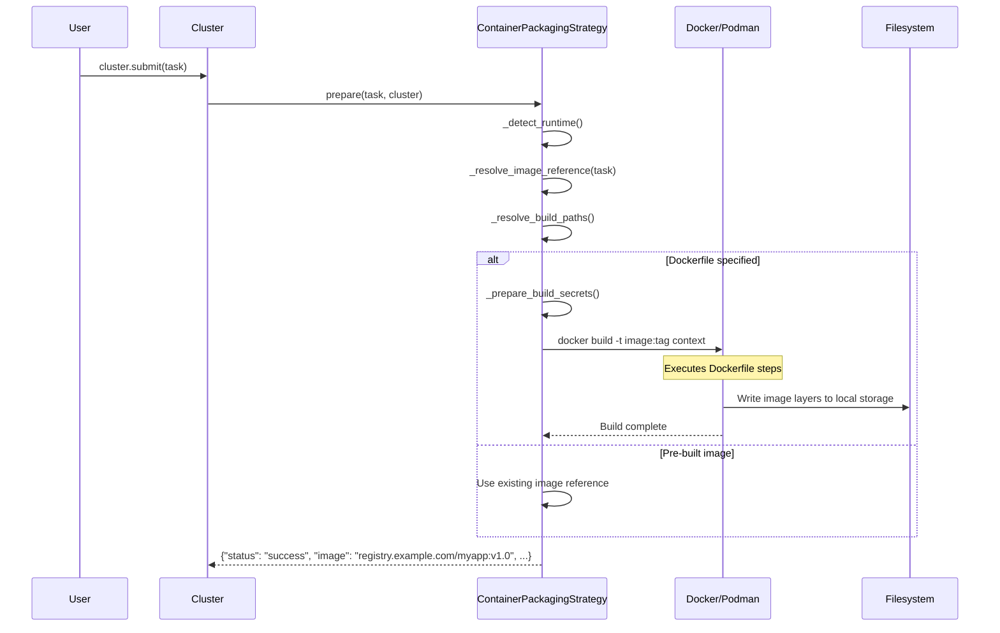
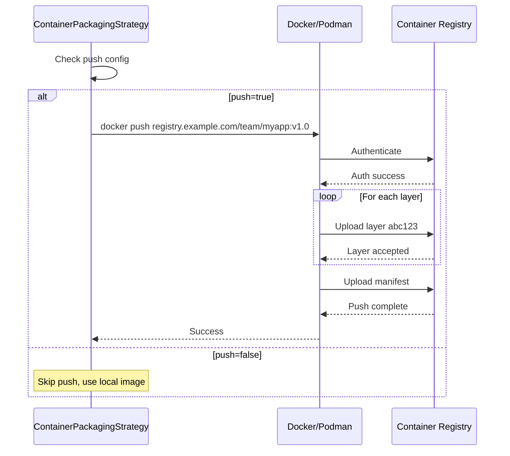
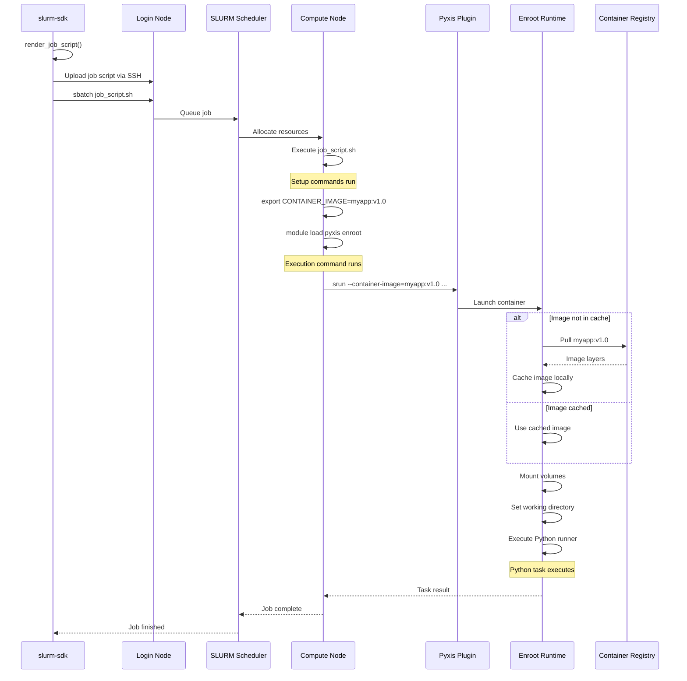
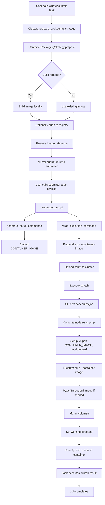

# Container Launch Architecture

## Overview

The slurm-sdk container packaging strategy enables reproducible execution of Python tasks in containerized environments on Slurm clusters. This document describes the complete lifecycle: how containers are built locally, pushed to registries, and launched on compute nodes using Pyxis/Enroot.

## Table of Contents

1. [Glossary](#glossary)
2. [Architecture Overview](#architecture-overview)
3. [Container Versioning and Reproducibility](#container-versioning-and-reproducibility)
4. [Build Phase](#build-phase)
5. [Push Phase](#push-phase)
6. [Launch Phase](#launch-phase)
7. [Execution Flow](#execution-flow)
8. [Configuration Reference](#configuration-reference)

## Glossary

### Core Terms

- **Container Runtime**: Docker or Podman, used locally to build and push container images
- **Container Image**: An immutable filesystem snapshot containing application code, dependencies, and runtime environment
- **Image Tag**: Version identifier for a container image (e.g., `v1.2.3`, `latest`)
- **Image Reference**: Fully qualified image name including registry, repository, and tag (e.g., `registry.example.com/team/myapp:v1.0`)
- **Container Registry**: Central repository for storing and distributing container images (e.g., Docker Hub, Harbor, AWS ECR)
- **Build Context**: Directory containing files needed for the Docker build process
- **Dockerfile**: Text file containing instructions to build a container image

### Slurm/HPC Terms

- **Pyxis**: Slurm plugin that integrates container runtimes with Slurm job scheduling
- **Enroot**: Container runtime optimized for HPC environments, used by Pyxis to execute containers
- **srun**: Slurm command to execute tasks, enhanced by Pyxis to support `--container-image`
- **sbatch**: Slurm command to submit batch jobs
- **Compute Node**: Worker machine in the cluster where jobs execute
- **Login Node**: Cluster entry point where users connect and submit jobs

### SDK Terms

- **Packaging Strategy**: Plugin system for deploying code to the cluster (wheel, container, none, inherit)
- **Pre-submission ID**: Unique identifier for a job before SLURM assigns a job ID
- **Job Directory**: Remote directory containing job artifacts (scripts, results, logs)
- **Mount Spec**: Configuration for mounting host filesystems into containers

## Architecture Overview

The container packaging strategy follows a three-phase lifecycle:

```mermaid
graph LR
    subgraph "Developer Machine"
        A[Task Definition] --> B["cluster.submit()"]
        B --> C["ContainerPackagingStrategy.prepare()"]
    end
    
    subgraph "Build Phase"
        C --> D{Dockerfile specified?}
        D -->|Yes| E[Build Image Locally]
        D -->|No| F[Use Existing Image]
        E --> G[Tag Image]
        F --> G
    end
    
    subgraph "Push Phase"
        G --> H{push=true?}
        H -->|Yes| I[Push to Registry]
        H -->|No| J[Skip Push]
        I --> K[Image Reference]
        J --> K
    end
    
    subgraph "Submission Phase"
        K --> L[Generate Job Script]
        L --> M[Embed Image Reference]
        M --> N[Submit to SLURM]
    end
    
    subgraph "Compute Node"
        N --> O[sbatch starts job]
        O --> P[srun --container-image]
        P --> Q[Pyxis/Enroot pulls image]
        Q --> R[Execute in Container]
    end
```



## Container Versioning and Reproducibility

### Image Tag Resolution

The SDK resolves container image tags at **prepare time**, ensuring reproducibility:

1. **Explicit Image with Tag**: If you specify `image = "myapp:v1.2.3"`, that exact tag is used
2. **Image without Tag**: If you specify `image = "myapp"`, the `tag` config (default `"latest"`) is appended
3. **Build from Dockerfile**: If you specify `dockerfile` and `name = "myapp"`, the image is tagged as `name:tag`
4. **Auto-generated Name**: If building without `name`, a unique name is generated: `slurm-task-{function_name}-{uuid}`

```python
# src/slurm/packaging/container.py:558-580
def _resolve_image_reference(self, task: Union["SlurmTask", Callable]) -> str:
    if self.image:
        image_ref = self.image
    else:
        base_name = self.image_name
        if not base_name:
            task_name = getattr(task, "name", None)
            if not task_name:
                task_name = getattr(getattr(task, "func", task), "__name__", "task")
            safe_task_name = re.sub(r"[^a-z0-9_.-]+", "-", task_name.lower())
            unique_suffix = uuid.uuid4().hex[:8]
            base_name = f"slurm-task-{safe_task_name}-{unique_suffix}"
        image_ref = base_name

    if ":" not in image_ref:
        image_ref = f"{image_ref}:{self.tag}"

    if self.registry:
        registry_prefix = self.registry.rstrip("/")
        image_ref = f"{registry_prefix}/{image_ref.lstrip('/')}"

    return image_ref
```

### Reproducibility Guarantees

**Key Principle**: The resolved image reference is hardcoded into the SLURM job script at submission time.

This means:
- ✅ Jobs always use the exact image version that existed when submitted
- ✅ Re-running old jobs uses the same environment (if the image still exists in registry)
- ✅ No "floating" tags—`latest` is resolved to whatever `latest` meant at submission time
- ✅ Workflows with multiple tasks use consistent environments across all subtasks

**Example**: If you submit with `tag = "latest"` which currently points to version `abc123`, your job will use `myapp:latest`. If the registry later updates `latest` to `def456`, your already-submitted job still runs with `abc123` (the image that `latest` referred to at submission time).

## Build Phase

### Sequence Diagram



### Build Process Details

**Step 1: Detect Runtime**

The SDK searches for `docker` or `podman` in your PATH:

```python
def _detect_runtime(self) -> str:
    if self.runtime:
        return self.runtime
    for candidate in ("docker", "podman"):
        if shutil.which(candidate):
            logger.debug("Detected container runtime: %s", candidate)
            return candidate
    raise PackagingError("Container runtime not found...")
```

**Step 2: Resolve Build Paths**

- `dockerfile`: Path to Dockerfile (relative to project root or absolute)
- `context`: Build context directory (default: `"."`)
- If only `dockerfile` is provided, `context` defaults to the Dockerfile's parent directory

**Step 3: Build Container Image**

The SDK constructs and executes a build command:

```bash
docker build \
  -t registry.example.com/team/myapp:v1.0 \
  --platform linux/amd64 \
  --build-arg KEY=value \
  --secret id=token,env=MY_TOKEN \
  --progress plain \
  /path/to/context
```

Build arguments and secrets are processed:
- `build_args`: Environment variables are expanded with `os.path.expandvars()`
- `build_secrets`: Credentials passed securely via BuildKit secrets (requires `DOCKER_BUILDKIT=1`)

**Step 4: Progress Tracking**

Build output is streamed and parsed for progress updates:
- Docker: `Step 3/10 : RUN pip install` → Progress bar shows 3/10
- Push: Layer digests are tracked for completion status

## Push Phase

### Sequence Diagram



### Push Configuration

The `push` flag (default: `true`) controls whether images are pushed to a registry:

```python
if self.push:
    self._push_container_image(runtime=runtime, image_ref=image_ref, console=console)
    push_performed = True
```

**When to Push**:
- ✅ Multi-node clusters (compute nodes need registry access)
- ✅ Shared registries for team collaboration
- ✅ Long-running jobs (ensures image availability)

**When to Skip Pushing** (`push=false`):
- ✅ Single-node clusters with local image cache
- ✅ Development/testing with frequently changing images
- ✅ Using pre-built images from public registries

## Launch Phase

### Sequence Diagram



### Job Script Generation

The SDK generates a bash script with three main sections:

#### 1. SBATCH Directives

```bash
#!/bin/bash
#SBATCH --job-name=train_model
#SBATCH --time=02:00:00
#SBATCH --cpus-per-task=8
#SBATCH --mem=16G
#SBATCH --partition=gpu
#SBATCH --output=/path/to/job_dir/stdout.txt
#SBATCH --error=/path/to/job_dir/stderr.txt
```

#### 2. Setup Commands (from `generate_setup_commands`)

```bash
echo '--- Configuring container execution (Pyxis) ---'
command -v srun >/dev/null 2>&1 || { echo 'ERROR: srun not found on PATH' >&2; exit 1; }

# Set container image reference (resolved at prepare time)
CONTAINER_IMAGE='registry.example.com/team/myapp:v1.0'
export CONTAINER_IMAGE
echo 'Resolved container image reference: registry.example.com/team/myapp:v1.0'

# Set Python executable
PY_EXEC='python3'
export PY_EXEC

# Optional: Load HPC modules for Pyxis/Enroot
module load pyxis/0.15.0
module load enroot/3.4.1

echo 'Container image ready for execution.'
```

#### 3. Execution Command (from `wrap_execution_command`)

```bash
# Original runner command
"$PY_EXEC_RESOLVED" -m slurm.runner \
  --module "myapp.tasks" \
  --function "train_model" \
  --args-file "slurm_job_abc123_args.pkl" \
  --kwargs-file "slurm_job_abc123_kwargs.pkl" \
  --output-file "slurm_job_abc123_result.pkl"

# Debug output (for container packaging)
echo 'Executing with container image: registry.example.com/team/myapp:v1.0'

# Wrapped with srun and container options
srun --mpi=none \
  --container-image='registry.example.com/team/myapp:v1.0' \
  --container-mounts='/datasets/shared:/workspace/data:ro,/path/to/job_dir:/path/to/job_dir:rw' \
  --container-workdir='/path/to/job_dir' \
  "$PY_EXEC_RESOLVED" -m slurm.runner \
  --module "myapp.tasks" \
  --function "train_model" \
  --args-file "slurm_job_abc123_args.pkl" \
  --kwargs-file "slurm_job_abc123_kwargs.pkl" \
  --output-file "slurm_job_abc123_result.pkl"
```

**Important**: The image reference in `--container-image` is **hardcoded** at submission time. The `CONTAINER_IMAGE` environment variable is set for informational purposes and potential future use, but Pyxis/Enroot should use the `--container-image` argument value. If you see Pyxis pulling a different image than what's shown in the debug output, check:
1. The resolved image reference in the job script logs
2. Whether Pyxis/Enroot configuration is overriding the `--container-image` argument
3. Whether the image reference was correctly resolved during the `prepare()` phase

### Container Mount Configuration

The SDK supports flexible mount specifications:

**String Format**:
```toml
mounts = [
  "/datasets/shared:/workspace/data:ro",
  "/scratch:/scratch:rw"
]
```

**Table Format**:
```toml
[[default.packaging.mounts]]
host_path = "/datasets/shared"
container_path = "/workspace/data"
mode = "ro"

[[default.packaging.mounts]]
host_path = "/scratch"
container_path = "/scratch"
mode = "rw"
```

**Dynamic Job Directory Mounting**:

The SDK automatically mounts the job directory (default: `mount_job_dir = true`):
```bash
--container-mounts='/path/to/job_dir:/path/to/job_dir:rw'
```

This ensures the container can access:
- Task arguments (pickled)
- Task results (written by runner)
- stdout/stderr logs
- Slurmfile for workflow support

## Execution Flow

### Complete Lifecycle



### Python Runner Execution

Inside the container, the runner:

1. **Restores Environment**: Unpickles sys.path, arguments, callbacks
2. **Imports Task Module**: Dynamically imports the task function
3. **Executes Function**: Calls the task with unpickled arguments
4. **Handles Results**: Pickles return value or exception
5. **Writes Output**: Saves result to job directory for retrieval

## Configuration Reference

### Minimal Container Configuration

Using a pre-built image from a registry:

```toml
[default.packaging]
type = "container"
image = "pytorch/pytorch:2.0.0-cuda11.7-cudnn8-runtime"
```

### Building from Dockerfile

```toml
[default.packaging]
type = "container"
dockerfile = "docker/training.Dockerfile"
context = "."
name = "myproject/training"
tag = "v1.2.3"
registry = "registry.example.com/team"
push = true
```

### Advanced Configuration

```toml
[default.packaging]
type = "container"
runtime = "docker"
dockerfile = "docker/Dockerfile"
context = "."
name = "myapp"
tag = "latest"
registry = "registry.example.com"
platform = "linux/amd64"
push = true
no_cache = false
python_executable = "python3.11"
workdir = "/workspace"

# Build-time arguments
[default.packaging.build_args]
PYTHON_VERSION = "3.11"
APP_ENV = "production"

# BuildKit secrets for private registries/indexes
[[default.packaging.build_secrets]]
id = "pip_token"
env = "PIP_INDEX_TOKEN"
required = true

[[default.packaging.build_secrets]]
id = "ssh_key"
file = "~/.ssh/deploy_key"
required = false

# Volume mounts
[[default.packaging.mounts]]
host_path = "/datasets/imagenet"
container_path = "/data/imagenet"
mode = "ro"

[[default.packaging.mounts]]
host_path = "/scratch/$USER"
container_path = "/scratch"
mode = "rw"

# HPC modules for Pyxis/Enroot
modules = ["pyxis/0.15.0", "enroot/3.4.1"]

# Additional srun arguments
srun_args = ["--mpi=pmix", "--gpus-per-node=4"]
```

### Configuration Precedence

1. **Task decorator**: `@task(packaging="container:myimage:v1.0", packaging_mounts=[...])`
2. **Submit call**: `cluster.submit(task, packaging_config={"image": "override:latest"})`
3. **Slurmfile environment**: `[production.packaging]`
4. **Slurmfile defaults**: `[default.packaging]`

---

## Best Practices

### Versioning Strategy

1. **Development**: Use `tag = "dev"` or date-based tags `tag = "2024-01-15"`
2. **Testing**: Use `tag = "test-{feature-name}"`
3. **Production**: Use semantic versions `tag = "v1.2.3"`
4. **Reproducible Research**: Always use explicit tags, avoid `latest`

### Registry Management

- Use private registries for proprietary code
- Implement image lifecycle policies (retain last N versions)
- Consider registry proximity to cluster (latency matters)
- Configure registry authentication on compute nodes

### Build Optimization

- Use multi-stage builds to minimize image size
- Leverage layer caching: put changing code last in Dockerfile
- Use `.dockerignore` to exclude unnecessary files from build context
- Consider base image size (slim/alpine variants)

### Security

- Never embed secrets in images (use `build_secrets` instead)
- Scan images for vulnerabilities before pushing
- Use minimal base images to reduce attack surface
- Keep base images updated with security patches

---

## Troubleshooting

### Pyxis Pulling Wrong Image Tag

If you see Pyxis pulling an image with a different tag than expected (e.g., `:latest` when you specified a different tag), check:

1. **Verify the resolved image reference**: Look for the debug output in your job logs:
   ```
   Resolved container image reference: registry.example.com/myapp:v1.2.3
   Executing with container image: registry.example.com/myapp:v1.2.3
   ```
   If these don't match what Pyxis is pulling, the issue is in image resolution.

2. **Check the job script**: The `--container-image` argument should contain the exact image reference resolved at prepare time. You can inspect the generated job script in your job directory.

3. **Image reference resolution**: Ensure your configuration includes an explicit tag. If you specify `image = "myapp"` without a tag, the default `tag = "latest"` will be appended. To avoid ambiguity, always specify explicit tags:
   ```toml
   [default.packaging]
   type = "container"
   image = "myapp:v1.2.3"  # Explicit tag
   ```

4. **Pyxis/Enroot configuration**: Some cluster configurations may have Pyxis/Enroot settings that override the `--container-image` argument. Check with your cluster administrator if the issue persists.

---

**Version**: 0.4.0  
**Last Updated**: 2024-11-08