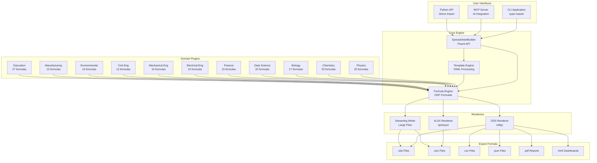
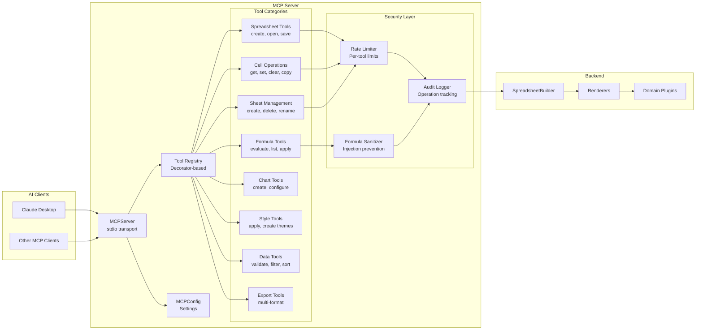
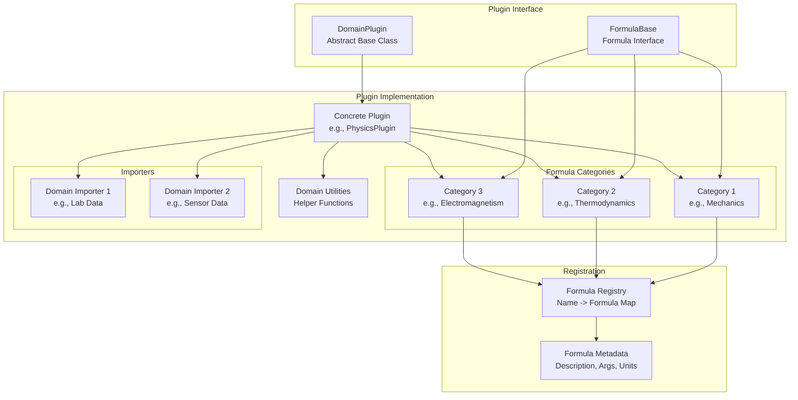
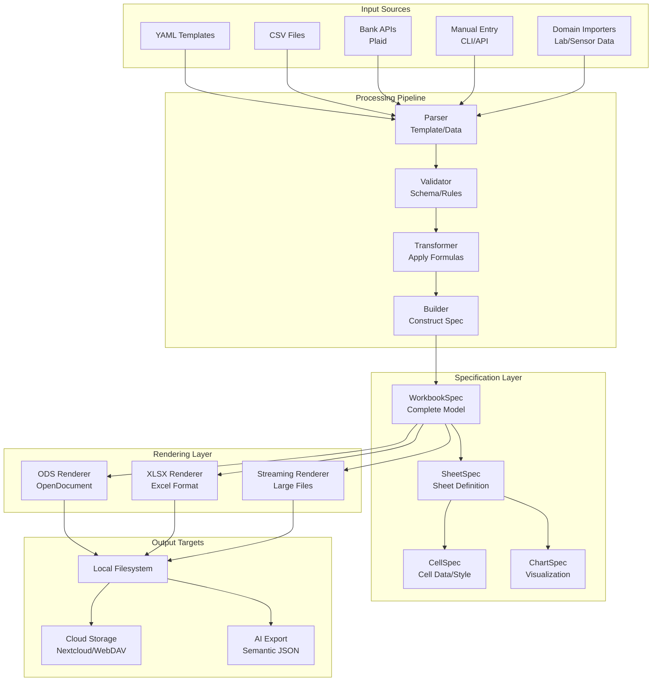
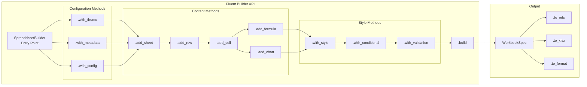
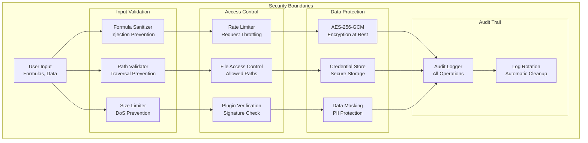

# Architecture Overview

## Version 0.1.0 - Universal Spreadsheet Definition Language

This document describes the architecture of SpreadsheetDL v0.1.0, a universal
spreadsheet definition language with LLM-optimized MCP server, multi-format support,
and professional-grade formatting capabilities.

**What's New in v0.1.0 (Initial Public Release):**

This release includes all features developed during internal iterations (v4.x series):

- **Property-Based Testing**: 103+ new tests with Hypothesis for mathematical correctness
- **Scientific Validation**: Tests against NIST CODATA 2018 reference values
- **Universal Format**: SpreadsheetDL spec works across ODS, XLSX, CSV, PDF
- **MCP Server**: Extensive tools for AI-driven spreadsheet manipulation
- **Domain Plugins**: 11 scientific/engineering domains with comprehensive formula libraries
- **Theme Variants**: Light, dark, and high-contrast themes
- **Streaming I/O**: Handle 100k+ row files efficiently
- **Round-Trip**: Import and export with 95%+ fidelity preservation
- **Format Adapters**: Pluggable export to multiple formats
- **Security Hardening**: Formula sanitization, rate limiting, audit logging

**Development History:**

The following sections document features developed during internal iterations (v0.1.0, v0.1.0) prior to public release.

**Features from v0.1.0 (Internal):**

- Property-Based Testing with Hypothesis
- Scientific Validation against NIST CODATA 2018
- ODF formula prefix consistency fixes

**Features from v0.1.0 (Internal):**

- **Universal Format**: SpreadsheetDL spec works across ODS, XLSX, CSV, PDF
- **MCP Server**: Extensive tools for AI-driven spreadsheet manipulation
- **Domain Plugins**: 11 scientific/engineering domains with comprehensive formula libraries
- **Theme Variants**: Light, dark, and high-contrast themes
- **Streaming I/O**: Handle 100k+ row files efficiently
- **Round-Trip**: Import and export with 95%+ fidelity preservation
- **Format Adapters**: Pluggable export to multiple formats
- **Security Hardening**: Formula sanitization, rate limiting, audit logging

---

## Architecture Diagrams

### High-Level System Architecture



### MCP Server Architecture



### Domain Plugin Architecture



### Data Flow Architecture



### Builder Pattern Architecture



### Security Architecture



---

## Project Structure

```
spreadsheet-dl/
├── docs/                         # Documentation
├── examples/                     # Usage examples
│   ├── 01_basics/
│   ├── 02_formulas/
│   ├── 03_charts/
│   ├── 04_advanced/
│   └── template_engine/
├── src/
│   └── spreadsheet_dl/          # Main package (250+ symbols)
│       ├── _builder/             # Builder internals
│       │   ├── __init__.py
│       │   ├── core.py
│       │   ├── models.py
│       │   └── references.py
│       ├── _cli/                 # CLI implementation
│       │   ├── __init__.py
│       │   ├── app.py
│       │   ├── commands.py
│       │   └── utils.py
│       ├── _mcp/                 # MCP server implementation (77+ tools)
│       │   ├── __init__.py
│       │   ├── config.py
│       │   ├── exceptions.py
│       │   ├── handlers.py
│       │   ├── models.py
│       │   └── registry.py
│       ├── domains/              # Domain plugins (11 domains)
│       │   ├── biology/
│       │   ├── chemistry/
│       │   ├── civil_engineering/
│       │   ├── data_science/
│       │   ├── education/
│       │   ├── electrical_engineering/
│       │   ├── environmental/
│       │   ├── finance/
│       │   ├── manufacturing/
│       │   ├── mechanical_engineering/
│       │   ├── physics/
│       │   ├── __init__.py
│       │   └── base.py
│       ├── schema/               # Schema extensions
│       │   ├── advanced.py
│       │   ├── conditional.py
│       │   ├── data_validation.py
│       │   ├── print_layout.py
│       │   ├── typography.py
│       │   └── units.py
│       ├── themes/               # Built-in themes
│       ├── __init__.py
│       ├── ai_export.py
│       ├── ai_training.py
│       ├── budget_analyzer.py
│       ├── builder.py
│       ├── charts.py
│       ├── cli.py
│       ├── export.py
│       ├── interactive.py
│       ├── mcp_server.py
│       ├── plaid_integration.py
│       ├── renderer.py
│       ├── report_generator.py
│       ├── security.py
│       ├── streaming.py
│       ├── template_engine.py
│       ├── visualization.py
│       └── xlsx_renderer.py
├── templates/                    # YAML theme templates
└── tests/                        # Test suite (3,200+ tests)
    ├── benchmarks/
    ├── domains/
    ├── integration/
    ├── mcp/
    ├── security/
    ├── unit/
    └── xlsx/
```

---

## Core Components

### 1. SpreadsheetBuilder (Fluent API)

The primary API for creating spreadsheets programmatically.

```python
from spreadsheet_dl import SpreadsheetBuilder

workbook = (
    SpreadsheetBuilder()
    .with_theme("professional")
    .add_sheet("Summary")
        .add_header_row(["Category", "Budget", "Actual", "Variance"])
        .add_data_row(["Marketing", 50000, 48500, "=B2-C2"])
        .add_data_row(["Engineering", 120000, 115000, "=B3-C3"])
        .with_conditional_format("D2:D10", "negative_red")
    .add_sheet("Details")
        .from_dataframe(df)
    .build()
)

workbook.save("budget.ods")
```

### 2. Domain Plugin System

Extensible formula system with 11 scientific/engineering domains.

**Plugin Interface:**

```python
from spreadsheet_dl.domains.base import DomainPlugin, FormulaBase

class PhysicsDomainPlugin(DomainPlugin):
    name = "physics"
    version = "1.0.0"

    def initialize(self):
        self.register_formula("KINETIC_ENERGY", KineticEnergyFormula())
        self.register_formula("VELOCITY", VelocityFormula())

class KineticEnergyFormula(FormulaBase):
    name = "KINETIC_ENERGY"
    description = "Calculate kinetic energy: KE = 0.5 * m * v^2"
    arguments = ["mass", "velocity"]
    units = {"mass": "kg", "velocity": "m/s", "result": "J"}

    def build(self, mass: str, velocity: str) -> str:
        return f"of:=0.5*{mass}*POWER({velocity},2)"
```

### 3. Renderer System

Multi-format rendering with consistent output.

```python
from spreadsheet_dl import WorkbookSpec, OdsRenderer, XlsxRenderer

# Render to ODS
ods_renderer = OdsRenderer()
ods_renderer.render(workbook_spec, "output.ods")

# Render to XLSX
xlsx_renderer = XlsxRenderer()
xlsx_renderer.render(workbook_spec, "output.xlsx")

# Streaming for large files
from spreadsheet_dl import StreamingWriter

with StreamingWriter("large.ods", chunk_size=1000) as writer:
    writer.start_sheet("Data", columns=["A", "B", "C"])
    for row in data_generator():
        writer.write_row(row)
    writer.end_sheet()
```

### 4. MCP Server Integration

Native Model Context Protocol server for AI integration.

**Configuration (Claude Desktop):**

```json
{
  "mcpServers": {
    "spreadsheet-dl": {
      "type": "stdio",
      "command": "uv",
      "args": ["run", "spreadsheet-dl-mcp"],
      "env": {
        "FINANCE_DATA_DIR": "~/Documents/Finance"
      }
    }
  }
}
```

**Tool Categories (50+ tools):**

| Category    | Tools | Purpose                                |
| ----------- | ----- | -------------------------------------- |
| Spreadsheet | 6     | Create, open, save, properties         |
| Cell        | 8     | Get, set, clear, copy, move, format    |
| Sheet       | 6     | Create, delete, rename, list, copy     |
| Formula     | 5     | Evaluate, apply, list, domain formulas |
| Chart       | 4     | Create, configure, add series          |
| Style       | 5     | Apply, create, list themes             |
| Data        | 8     | Validate, filter, sort, import         |
| Export      | 5     | Multi-format, PDF, HTML                |
| Query       | 3     | Natural language queries               |

### 5. Template Engine

YAML-based declarative spreadsheet creation.

```yaml
# templates/budget.yaml
name: monthly_budget
version: '1.0'
variables:
  month: 'January'
  year: 2026

sheets:
  - name: '{{month}} {{year}}'
    columns:
      - name: Category
        type: text
        width: 20
      - name: Budget
        type: currency
        format: '$#,##0.00'
      - name: Actual
        type: currency
      - name: Variance
        type: formula
        formula: '=B{row}-C{row}'

    rows:
      - ['Marketing', 50000, 48500]
      - ['Engineering', 120000, 115000]
      - ['Operations', 30000, 32000]

    conditional:
      - range: 'D:D'
        rule: less_than_zero
        style: negative_red
```

### 6. Chart Builder

Comprehensive charting with multiple chart types.

```python
from spreadsheet_dl import ChartBuilder, ChartType

chart = (
    ChartBuilder()
    .set_type(ChartType.COLUMN)
    .set_title("Monthly Budget vs Actual")
    .add_series("Budget", "B2:B10", "A2:A10")
    .add_series("Actual", "C2:C10", "A2:A10")
    .set_legend_position("bottom")
    .set_axis_title("x", "Category")
    .set_axis_title("y", "Amount ($)")
    .build()
)
```

### 7. Security Module

Data protection and secure operations.

**Features:**

- AES-256-GCM encryption at rest
- PBKDF2-SHA256 key derivation (600K iterations)
- Formula sanitization (injection prevention)
- Rate limiting per tool
- Audit trail logging
- Secure credential storage

```python
from spreadsheet_dl import FileEncryptor, CredentialStore

# Encrypt sensitive files
encryptor = FileEncryptor()
encryptor.encrypt_file("sensitive.ods", password="secure123")

# Secure credential storage
creds = CredentialStore()
creds.store("api_key", "secret_value")
```

---

## Technology Stack

### Core Dependencies

| Library  | Purpose            | Version |
| -------- | ------------------ | ------- |
| odfpy    | ODS file creation  | ^1.4.1  |
| openpyxl | XLSX file creation | ^3.1.0  |
| pandas   | Data analysis      | ^2.0.0  |
| pyyaml   | Configuration      | ^6.0    |
| typer    | CLI framework      | ^0.9.0  |
| rich     | Terminal output    | ^13.0.0 |

### Optional Dependencies

| Library      | Purpose             | Install Extra |
| ------------ | ------------------- | ------------- |
| reportlab    | PDF export          | `[pdf]`       |
| plaid-python | Bank integration    | `[plaid]`     |
| cryptography | Enhanced encryption | `[security]`  |

---

## Performance Characteristics

### File Size Limits

| Operation          | Recommended  | Maximum         |
| ------------------ | ------------ | --------------- |
| Standard rendering | <10,000 rows | 50,000 rows     |
| Streaming write    | Any size     | Limited by disk |
| MCP operations     | <5,000 cells | 10,000 cells    |
| Chart data points  | <1,000       | 10,000          |

### Memory Usage

- Standard: ~50 bytes/cell
- Streaming: ~1KB buffer (configurable)
- Large file mode: Chunk-based, constant memory

### Benchmarks

| Operation          | Time (1000 rows) | Time (10000 rows) |
| ------------------ | ---------------- | ----------------- |
| Create ODS         | ~100ms           | ~800ms            |
| Create XLSX        | ~150ms           | ~1.2s             |
| Streaming write    | ~50ms            | ~400ms            |
| Formula evaluation | ~5ms             | ~50ms             |

---

## Extension Points

### Custom Domain Plugin

```python
from spreadsheet_dl.domains.base import DomainPlugin

class AstronomyPlugin(DomainPlugin):
    name = "astronomy"
    version = "1.0.0"

    def initialize(self):
        self.register_formula("PARSEC_TO_LY", ParsecToLightYearFormula())
        self.register_importer("fits", FITSImporter())
```

### Custom Renderer

```python
from spreadsheet_dl.renderer import BaseRenderer

class CustomRenderer(BaseRenderer):
    def render(self, spec: WorkbookSpec, output_path: str):
        # Custom rendering logic
        pass
```

### Custom MCP Tool

```python
from spreadsheet_dl._mcp import MCPToolRegistry

@MCPToolRegistry.register("custom_analysis")
def custom_analysis_tool(file_path: str, options: dict) -> dict:
    """Custom analysis tool for MCP."""
    # Implementation
    return {"result": "analysis complete"}
```

---

## Related Documentation

- [API Reference](./api/index.md)
- [Formula Reference](./reference/formula-reference.md)
- [MCP Tools Reference](./reference/mcp-tools-reference.md)
- [Examples Index](./reference/examples-index.md)
- [Plugin Development](./guides/plugin-development.md)
- [Security Guide](../SECURITY.md)
- [CLI Reference](./cli.md)
- [Modular Structure](./architecture/modular-structure.md)
