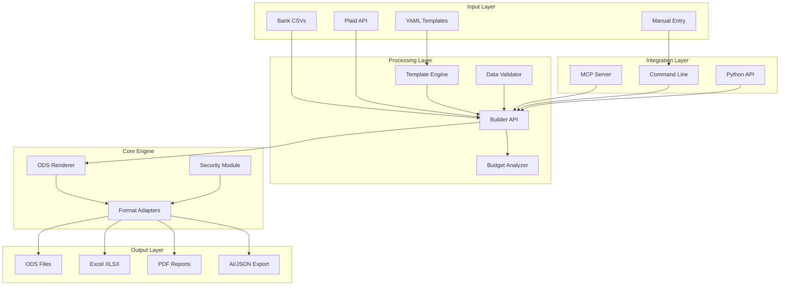
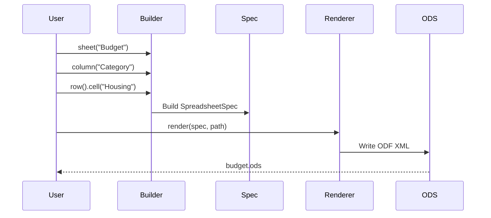
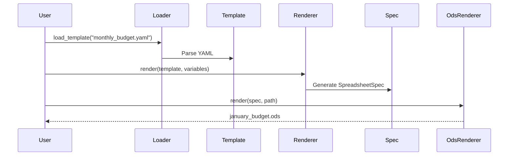
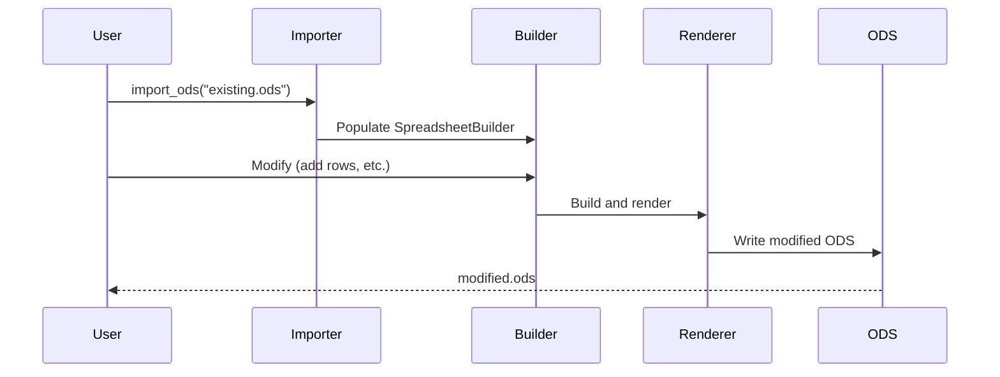

# Integration Guide

**Implements: DOC-PROF-005: Integration Guide | PHASE-12: Documentation Expansion**

This comprehensive guide explains how SpreadsheetDL's modules work together, data flows through the system, and how to integrate SpreadsheetDL into your applications.

## Table of Contents

1. [Architecture Overview](#architecture-overview)
2. [Core Components](#core-components)
3. [Data Flow](#data-flow)
4. [Integration Patterns](#integration-patterns)
5. [MCP Server Integration](#mcp-server-integration)
6. [CLI Integration](#cli-integration)
7. [Library Usage](#library-usage)
8. [Extension Points](#extension-points)
9. [Common Integration Scenarios](#common-integration-scenarios)
10. [Best Practices](#best-practices)

## Architecture Overview

SpreadsheetDL v0.1.0 follows a **hub-and-spoke architecture** with the Builder API at the center:



### Key Design Principles

1. **Single Source of Truth**: Builder API is the central abstraction
2. **Declarative Over Imperative**: Define what you want, not how to create it
3. **Format Agnostic**: One definition → multiple output formats
4. **Plugin-Based**: Extend functionality without modifying core
5. **Type-Safe**: Full type hints throughout the codebase

## Core Components

### 1. Builder API (`builder.py`)

The main entry point for creating spreadsheets programmatically.

```python
from spreadsheet_dl.builder import SpreadsheetBuilder

# Create builder with theme
builder = SpreadsheetBuilder(theme="corporate")

# Define structure
builder.sheet("Budget") \
    .column("Category", width="150pt") \
    .column("Amount", type="currency") \
    .header_row() \
    .data_rows(10)

# Export to multiple formats
builder.save("budget.ods")
builder.export_xlsx("budget.xlsx")
```

**Key Features**:

- Fluent, chainable API
- Theme-based styling
- Multi-format export
- Type-safe column definitions

**Integration Points**:

- Input: Receives data from templates, CSV imports, API calls
- Output: Generates `SpreadsheetSpec` for renderer
- Extensions: Plugins can add custom builders

### 2. Template Engine (`template_engine/`)

YAML-based declarative spreadsheet definitions.

```python
from spreadsheet_dl.template_engine import TemplateLoader, TemplateRenderer

# Load template
loader = TemplateLoader()
template = loader.load_template("monthly_budget.yaml")

# Render with variables
renderer = TemplateRenderer()
spec = renderer.render(template, variables={
    "month": "January",
    "year": 2025,
    "categories": budget_data
})

# Convert to ODS
from spreadsheet_dl.renderer import OdsRenderer
ods_renderer = OdsRenderer()
ods_renderer.render(spec, "january_budget.ods")
```

**Key Features**:

- YAML-based definitions
- Variable interpolation
- Component reuse
- Conditional sections

**Integration Points**:

- Input: YAML files, embedded YAML strings
- Output: `SpreadsheetSpec` for renderer
- Extensions: Custom template functions

### 3. Chart Builder (`charts.py`)

Professional chart creation with 60+ chart types.

```python
from spreadsheet_dl.charts import ChartBuilder

chart = ChartBuilder() \
    .column_chart() \
    .title("Budget vs Actual") \
    .series("Budget", "B2:B13", categories="A2:A13") \
    .series("Actual", "C2:C13") \
    .position(cell="E2", width="400pt", height="300pt") \
    .legend(position="bottom") \
    .build()

# Add to spreadsheet
builder.chart(chart)
```

**Key Features**:

- Fluent chart API
- Multiple chart types
- Trendlines and forecasting
- Sparklines for inline visualization

**Integration Points**:

- Input: Data ranges from sheets
- Output: Chart spec embedded in spreadsheet
- Extensions: Custom chart types via plugins

### 4. ODS Renderer (`renderer.py`)

Converts `SpreadsheetSpec` to ODS XML format.

```python
from spreadsheet_dl.renderer import OdsRenderer

renderer = OdsRenderer()
renderer.render(builder.build(), "output.ods")
```

**Key Features**:

- Full ODF 1.2 compliance
- Formula preservation
- Style optimization
- Streaming support for large files

**Integration Points**:

- Input: `SpreadsheetSpec` from builder
- Output: ODS ZIP archive
- Extensions: Custom ODF elements

### 5. Format Adapters (`adapters.py`)

Export to multiple formats from a single spec.

```python
from spreadsheet_dl.adapters import XlsxAdapter, PdfAdapter, CsvAdapter

# Export to Excel
xlsx_adapter = XlsxAdapter()
xlsx_adapter.export(spec, "output.xlsx")

# Export to PDF
pdf_adapter = PdfAdapter(page_size="A4")
pdf_adapter.export(spec, "output.pdf")

# Export to CSV (flattens to first sheet)
csv_adapter = CsvAdapter()
csv_adapter.export(spec, "output.csv")
```

**Key Features**:

- Pluggable adapter system
- Format-specific optimizations
- Consistent API across formats

**Integration Points**:

- Input: `SpreadsheetSpec`
- Output: Format-specific files
- Extensions: Custom adapters (e.g., Google Sheets API)

### 6. MCP Server (`mcp_server.py`)

Native Model Context Protocol server for AI integration.

```python
from spreadsheet_dl.mcp_server import MCPServer, MCPConfig

config = MCPConfig(
    allowed_paths=[Path("~/Documents/Finance")],
    rate_limit_per_minute=120,
)

server = MCPServer(config)
server.run()  # Exposes 18 tools to Claude
```

**Key Features**:

- 18 spreadsheet operation tools
- Natural language queries
- Safe sandboxing
- Rate limiting

**Integration Points**:

- Input: MCP protocol messages
- Output: Tool results as JSON
- Extensions: Custom MCP tools via decorators

## Data Flow

### Spreadsheet Creation Flow



### Template Rendering Flow



### Import and Modify Flow



## Integration Patterns

### Pattern 1: CLI to Library

Wrap library functionality in CLI commands:

```python
import typer
from spreadsheet_dl import SpreadsheetBuilder

app = typer.Typer()

@app.command()
def create_budget(
    output: str = "budget.ods",
    theme: str = "corporate",
):
    """Create a budget spreadsheet."""
    builder = SpreadsheetBuilder(theme=theme)
    builder.sheet("Budget")
    # ... build spreadsheet
    builder.save(output)
    typer.echo(f"Created {output}")

if __name__ == "__main__":
    app()
```

### Pattern 2: Template-Driven Application

Use templates for consistent document generation:

```python
from spreadsheet_dl.template_engine import TemplateLoader, TemplateRenderer

class ReportGenerator:
    def __init__(self, template_dir: Path):
        self.loader = TemplateLoader(template_dir)
        self.renderer = TemplateRenderer()

    def generate_monthly_report(self, month: str, data: dict) -> Path:
        template = self.loader.load_template("monthly_report.yaml")
        spec = self.renderer.render(template, variables={
            "month": month,
            "data": data,
        })

        output_path = Path(f"reports/{month}_report.ods")
        from spreadsheet_dl.renderer import OdsRenderer
        OdsRenderer().render(spec, output_path)
        return output_path
```

### Pattern 3: Web API Integration

Expose spreadsheet generation via REST API:

```python
from fastapi import FastAPI, HTTPException
from spreadsheet_dl import SpreadsheetBuilder
from fastapi.responses import FileResponse

app = FastAPI()

@app.post("/api/spreadsheets/generate")
async def generate_spreadsheet(request: SpreadsheetRequest):
    try:
        builder = SpreadsheetBuilder(theme=request.theme)
        builder.sheet(request.sheet_name)

        for col in request.columns:
            builder.column(col.name, width=col.width, type=col.type)

        builder.header_row()

        for row_data in request.data:
            builder.row()
            for value in row_data:
                builder.cell(value)

        output_path = f"/tmp/{request.sheet_name}.ods"
        builder.save(output_path)

        return FileResponse(
            output_path,
            media_type="application/vnd.oasis.opendocument.spreadsheet",
            filename=f"{request.sheet_name}.ods"
        )
    except Exception as e:
        raise HTTPException(status_code=500, detail=str(e))
```

### Pattern 4: Data Pipeline Integration

Use SpreadsheetDL in ETL pipelines:

```python
import pandas as pd
from spreadsheet_dl import SpreadsheetBuilder

class DataExporter:
    def export_dataframe_to_ods(
        self,
        df: pd.DataFrame,
        output_path: str,
        theme: str = "default",
    ):
        """Export pandas DataFrame to ODS with formatting."""
        builder = SpreadsheetBuilder(theme=theme)
        builder.sheet("Data")

        # Define columns
        for col in df.columns:
            dtype = df[col].dtype
            col_type = "currency" if "amount" in col.lower() else "string"
            builder.column(col, type=col_type)

        builder.header_row()

        # Add data
        for _, row in df.iterrows():
            builder.row()
            for value in row:
                builder.cell(value)

        # Add summary
        builder.row()  # Blank row
        builder.row()
        builder.cell("Total Rows:", style="total")
        builder.cell(len(df), style="total")

        builder.save(output_path)
```

### Pattern 5: Plugin Extension

Create custom domain plugins:

```python
from spreadsheet_dl.plugins import DomainPlugin, PluginMetadata

class SalesPlugin(DomainPlugin):
    """Sales tracking domain plugin."""

    @property
    def metadata(self) -> PluginMetadata:
        return PluginMetadata(
            name="sales",
            version="1.0.0",
            description="Sales tracking and forecasting",
        )

    def register_templates(self, registry):
        """Register custom templates."""
        registry.add_template("sales_forecast", self.sales_forecast_template)

    def register_formulas(self, registry):
        """Register custom formulas."""
        registry.add_formula("CAGR", self.calculate_cagr)

    def calculate_cagr(self, start_value, end_value, periods):
        """Calculate Compound Annual Growth Rate."""
        return f"=POWER({end_value}/{start_value},1/{periods})-1"
```

## MCP Server Integration

### Configuration for Claude Desktop

Add to `~/Library/Application Support/Claude/claude_desktop_config.json`:

```json
{
  "mcpServers": {
    "spreadsheet-dl": {
      "type": "stdio",
      "command": "uv",
      "args": ["run", "spreadsheet-dl-mcp"],
      "env": {
        "SPREADSHEET_DL_DATA_DIR": "~/Documents/Finances",
        "SPREADSHEET_DL_LOG_LEVEL": "INFO"
      }
    }
  }
}
```

### Using MCP Tools from Claude

Once configured, Claude can use natural language to manipulate spreadsheets:

**User**: "Create a budget spreadsheet for January 2025 with categories for Housing, Food, and Transportation."

**Claude** (using MCP tools):

```python
# Claude calls:
# 1. create_spreadsheet(name="January_2025_Budget")
# 2. add_sheet(name="Budget")
# 3. add_columns(["Category", "Budget", "Actual"])
# 4. add_rows([
#     ["Housing", 2000, 0],
#     ["Food", 500, 0],
#     ["Transportation", 300, 0]
# ])
# 5. save_spreadsheet(path="January_2025_Budget.ods")
```

### Custom MCP Tools

Register custom MCP tools:

```python
from spreadsheet_dl.mcp_server import mcp_tool, MCPToolCategory

@mcp_tool(
    name="calculate_roi",
    description="Calculate Return on Investment",
    category=MCPToolCategory.FINANCIAL,
)
def calculate_roi(
    initial_investment: float,
    final_value: float,
) -> dict:
    """Calculate ROI percentage."""
    roi = ((final_value - initial_investment) / initial_investment) * 100
    return {
        "roi_percentage": roi,
        "formula": f"=({final_value}-{initial_investment})/{initial_investment}*100"
    }
```

## CLI Integration

### Embedding CLI in Applications

```python
from spreadsheet_dl.cli import app as spreadsheet_cli
import typer

# Your main CLI
app = typer.Typer()

# Add spreadsheet commands as subcommand
app.add_typer(spreadsheet_cli, name="spreadsheet")

@app.command()
def process_data():
    """Your custom command."""
    typer.echo("Processing...")

if __name__ == "__main__":
    app()
```

Usage:

```bash
python my_app.py spreadsheet generate -o output.ods
python my_app.py process-data
```

### CLI Automation Scripts

```bash
#!/bin/bash
# Generate monthly reports automatically

MONTH=$(date +%B)
YEAR=$(date +%Y)

# Generate budget
uv run spreadsheet-dl generate \
    --template monthly_budget \
    --output "reports/${MONTH}_${YEAR}_budget.ods" \
    --theme corporate

# Import transactions
uv run spreadsheet-dl import \
    --file "data/transactions_${MONTH}.csv" \
    --bank chase \
    --output "reports/${MONTH}_${YEAR}_budget.ods"

# Generate summary report
uv run spreadsheet-dl analyze \
    "reports/${MONTH}_${YEAR}_budget.ods" \
    --format markdown \
    > "reports/${MONTH}_${YEAR}_summary.md"

echo "Reports generated for ${MONTH} ${YEAR}"
```

## Library Usage

### Basic Python Integration

```python
from spreadsheet_dl import (
    SpreadsheetBuilder,
    ChartBuilder,
    OdsRenderer,
)

def create_sales_report(sales_data: list[dict]) -> str:
    """Create a sales report from data."""
    builder = SpreadsheetBuilder(theme="corporate")

    # Add data sheet
    builder.sheet("Sales")
    builder.column("Month", width="100pt")
    builder.column("Revenue", type="currency")
    builder.column("Units", type="integer")
    builder.header_row()

    for record in sales_data:
        builder.row()
        builder.cell(record["month"])
        builder.cell(record["revenue"])
        builder.cell(record["units"])

    # Add chart
    chart = ChartBuilder() \
        .line_chart() \
        .title("Revenue Trend") \
        .series("Revenue", "B2:B13", categories="A2:A13") \
        .position("E2") \
        .build()

    builder.chart(chart)

    # Save
    output_path = "sales_report.ods"
    builder.save(output_path)
    return output_path
```

### Advanced Integration

```python
from spreadsheet_dl import (
    SpreadsheetBuilder,
    import_ods,
    StreamingWriter,
)
from spreadsheet_dl.adapters import XlsxAdapter, PdfAdapter

class SpreadsheetManager:
    """High-level spreadsheet management."""

    def __init__(self, theme: str = "corporate"):
        self.theme = theme

    def create_from_template(
        self,
        template_path: str,
        variables: dict,
        output_path: str,
    ):
        """Create spreadsheet from template."""
        from spreadsheet_dl.template_engine import (
            TemplateLoader,
            TemplateRenderer,
        )

        loader = TemplateLoader()
        template = loader.load_template(template_path)

        renderer = TemplateRenderer()
        spec = renderer.render(template, variables=variables)

        from spreadsheet_dl.renderer import OdsRenderer
        OdsRenderer().render(spec, output_path)

    def import_and_modify(
        self,
        input_path: str,
        modifications: callable,
        output_path: str,
    ):
        """Import ODS, modify, and save."""
        builder = import_ods(input_path)
        modifications(builder)
        builder.save(output_path)

    def export_multi_format(
        self,
        spec,
        base_name: str,
    ):
        """Export to ODS, XLSX, and PDF."""
        from spreadsheet_dl.renderer import OdsRenderer

        # ODS
        OdsRenderer().render(spec, f"{base_name}.ods")

        # XLSX
        XlsxAdapter().export(spec, f"{base_name}.xlsx")

        # PDF
        PdfAdapter(page_size="A4").export(spec, f"{base_name}.pdf")

    def create_large_file(
        self,
        data_iterator,
        output_path: str,
    ):
        """Create large spreadsheet using streaming."""
        with StreamingWriter(output_path) as writer:
            writer.write_header(["Date", "Description", "Amount"])
            for row in data_iterator:
                writer.write_row([row.date, row.description, row.amount])
```

## Extension Points

### 1. Custom Themes

```python
# themes/my_theme.yaml
name: my_custom_theme
version: '1.0'

meta:
  author: Your Name
  description: Custom theme for my application

colors:
  primary: '#1E3A8A'
  secondary: '#60A5FA'
  accent: '#F59E0B'

styles:
  header:
    extends: base
    background_color: '{colors.primary}'
    font_color: '#FFFFFF'
    font_weight: bold

  total:
    extends: base
    font_weight: bold
    border_top:
      width: '2pt'
      style: solid
      color: '#000000'
```

Load custom theme:

```python
builder = SpreadsheetBuilder(
    theme="my_custom_theme",
    theme_dir="themes/"
)
```

### 2. Custom Formulas

```python
from spreadsheet_dl.builder import FormulaBuilder

class CustomFormulas(FormulaBuilder):
    """Extended formula builder."""

    def compound_growth(self, start_value, end_value, periods):
        """Calculate compound annual growth rate."""
        return self._build_function(
            "POWER",
            [f"{end_value}/{start_value}", f"1/{periods}"]
        ) + "-1"

    def moving_average(self, range_ref, window=3):
        """Calculate moving average."""
        return self._build_function("AVERAGE", [range_ref])
```

### 3. Custom Adapters

```python
from spreadsheet_dl.adapters import BaseAdapter

class GoogleSheetsAdapter(BaseAdapter):
    """Export to Google Sheets via API."""

    def export(self, spec, sheet_id: str):
        """Export to Google Sheets."""
        from googleapiclient.discovery import build

        service = build('sheets', 'v4')

        # Convert spec to Google Sheets API format
        requests = self._convert_spec(spec)

        service.spreadsheets().batchUpdate(
            spreadsheetId=sheet_id,
            body={'requests': requests}
        ).execute()

    def _convert_spec(self, spec):
        """Convert SpreadsheetSpec to Google Sheets requests."""
        # Implementation...
        pass
```

### 4. Custom MCP Tools

```python
from spreadsheet_dl.mcp_server import mcp_tool

@mcp_tool(
    name="analyze_sales_trends",
    description="Analyze sales trends and generate forecast",
)
def analyze_sales_trends(
    data_range: str,
    forecast_periods: int = 3,
) -> dict:
    """Analyze sales data and forecast future values."""
    # Load data
    # Perform analysis
    # Generate forecast

    return {
        "trend": "increasing",
        "forecast": [1200, 1300, 1400],
        "confidence": 0.85,
    }
```

## Common Integration Scenarios

### Scenario 1: Automated Financial Reports

```python
from spreadsheet_dl import SpreadsheetBuilder
from datetime import datetime
import pandas as pd

class FinancialReportGenerator:
    def __init__(self, db_connection):
        self.db = db_connection

    def generate_monthly_report(self, month: int, year: int):
        # Fetch data from database
        df = pd.read_sql(
            f"""
            SELECT category, SUM(amount) as total
            FROM expenses
            WHERE MONTH(date) = {month} AND YEAR(date) = {year}
            GROUP BY category
            """,
            self.db
        )

        # Create spreadsheet
        builder = SpreadsheetBuilder(theme="corporate")
        builder.sheet("Expenses")

        builder.column("Category", width="150pt")
        builder.column("Amount", type="currency")
        builder.header_row()

        for _, row in df.iterrows():
            builder.row()
            builder.cell(row["category"])
            builder.cell(row["total"])

        # Add total
        builder.total_row(formulas=[
            "Total",
            f"=SUM(B2:B{len(df)+1})"
        ])

        # Save
        filename = f"expenses_{year}_{month:02d}.ods"
        builder.save(filename)
        return filename
```

### Scenario 2: Data Validation and Import

```python
from spreadsheet_dl import import_ods
from spreadsheet_dl.exceptions import ValidationError

class DataValidator:
    def validate_and_import(self, file_path: str) -> list[dict]:
        """Validate ODS file and import data."""
        try:
            builder = import_ods(file_path)
            spec = builder.build()

            # Validate structure
            if not spec.sheets:
                raise ValidationError("No sheets found")

            sheet = spec.sheets[0]

            # Validate columns
            required_columns = ["Date", "Description", "Amount"]
            actual_columns = [col.name for col in sheet.columns]

            if not all(col in actual_columns for col in required_columns):
                raise ValidationError(
                    f"Missing required columns. "
                    f"Required: {required_columns}, "
                    f"Found: {actual_columns}"
                )

            # Extract data
            data = []
            for row in sheet.rows[1:]:  # Skip header
                data.append({
                    "date": row.cells[0].value,
                    "description": row.cells[1].value,
                    "amount": row.cells[2].value,
                })

            return data

        except Exception as e:
            print(f"Validation failed: {e}")
            raise
```

### Scenario 3: Multi-Format Export Pipeline

```python
from spreadsheet_dl import SpreadsheetBuilder
from spreadsheet_dl.adapters import XlsxAdapter, PdfAdapter, CsvAdapter

class ExportPipeline:
    def __init__(self, builder: SpreadsheetBuilder):
        self.builder = builder
        self.spec = builder.build()

    def export_all_formats(self, base_name: str):
        """Export to all supported formats."""
        formats = {
            "ods": lambda: self.builder.save(f"{base_name}.ods"),
            "xlsx": lambda: XlsxAdapter().export(
                self.spec, f"{base_name}.xlsx"
            ),
            "pdf": lambda: PdfAdapter().export(
                self.spec, f"{base_name}.pdf"
            ),
            "csv": lambda: CsvAdapter().export(
                self.spec, f"{base_name}.csv"
            ),
        }

        results = {}
        for format_name, export_func in formats.items():
            try:
                export_func()
                results[format_name] = "success"
            except Exception as e:
                results[format_name] = f"failed: {e}"

        return results
```

### Scenario 4: Nextcloud Integration

```python
from spreadsheet_dl import SpreadsheetBuilder
from spreadsheet_dl.webdav_upload import WebDAVUploader

class NextcloudSync:
    def __init__(self, nextcloud_url: str, username: str, password: str):
        self.uploader = WebDAVUploader(
            url=nextcloud_url,
            username=username,
            password=password,
        )

    def create_and_upload(
        self,
        sheet_name: str,
        data: list,
        remote_path: str,
    ):
        """Create spreadsheet and upload to Nextcloud."""
        # Create locally
        builder = SpreadsheetBuilder(theme="corporate")
        builder.sheet(sheet_name)

        # Add data
        for row_data in data:
            builder.row()
            for cell_data in row_data:
                builder.cell(cell_data)

        # Save temporarily
        local_path = f"/tmp/{sheet_name}.ods"
        builder.save(local_path)

        # Upload to Nextcloud
        self.uploader.upload(local_path, remote_path)

        return remote_path
```

### Scenario 5: Batch Processing

```python
from spreadsheet_dl import SpreadsheetBuilder
from concurrent.futures import ThreadPoolExecutor
from pathlib import Path

class BatchProcessor:
    def __init__(self, max_workers: int = 4):
        self.max_workers = max_workers

    def process_batch(
        self,
        data_files: list[Path],
        output_dir: Path,
    ):
        """Process multiple data files in parallel."""
        with ThreadPoolExecutor(max_workers=self.max_workers) as executor:
            futures = []
            for data_file in data_files:
                future = executor.submit(
                    self.process_single_file,
                    data_file,
                    output_dir
                )
                futures.append(future)

            # Wait for all to complete
            results = [f.result() for f in futures]

        return results

    def process_single_file(
        self,
        data_file: Path,
        output_dir: Path,
    ) -> str:
        """Process a single data file."""
        import pandas as pd

        df = pd.read_csv(data_file)

        builder = SpreadsheetBuilder(theme="minimal")
        builder.sheet("Data")

        # Add columns
        for col in df.columns:
            builder.column(col)

        builder.header_row()

        # Add data
        for _, row in df.iterrows():
            builder.row()
            for value in row:
                builder.cell(value)

        # Save
        output_path = output_dir / f"{data_file.stem}.ods"
        builder.save(str(output_path))

        return str(output_path)
```

## Best Practices

### 1. Error Handling

Always handle SpreadsheetDL errors gracefully:

```python
from spreadsheet_dl.exceptions import (
    SpreadsheetDLError,
    FileNotFoundError,
    ValidationError,
)

try:
    builder = SpreadsheetBuilder(theme="corporate")
    builder.save("output.ods")
except FileNotFoundError as e:
    logger.error(f"File error: {e.message}")
    logger.debug(f"Error code: {e.error_code}")
    logger.info(f"Suggestion: {e.suggestion}")
except ValidationError as e:
    logger.error(f"Validation failed: {e.format_error()}")
except SpreadsheetDLError as e:
    logger.error(f"Unexpected error: {e}")
    logger.debug(f"Context: {e.context.to_dict()}")
```

### 2. Resource Management

Use context managers for streaming operations:

```python
from spreadsheet_dl.streaming import StreamingWriter

# Good: Automatically closes resources
with StreamingWriter("large_file.ods") as writer:
    writer.write_header(["A", "B", "C"])
    for row in large_dataset:
        writer.write_row(row)

# Bad: Manual resource management
writer = StreamingWriter("large_file.ods")
writer.write_header(["A", "B", "C"])
# ... might leak resources if exception occurs
writer.close()
```

### 3. Theme Reuse

Load themes once and reuse:

```python
# Good: Load theme once
from spreadsheet_dl.schema import ThemeLoader

loader = ThemeLoader()
corporate_theme = loader.load_theme("corporate")

for i in range(10):
    builder = SpreadsheetBuilder(theme=corporate_theme)
    # ... create spreadsheet

# Bad: Load theme every time
for i in range(10):
    builder = SpreadsheetBuilder(theme="corporate")  # Reloads YAML each time
```

### 4. Type Safety

Use type hints for better IDE support:

```python
from spreadsheet_dl import SpreadsheetBuilder
from spreadsheet_dl.charts import ChartBuilder, ChartSpec

def create_chart(data_range: str) -> ChartSpec:
    """Create a chart with type safety."""
    return ChartBuilder() \
        .column_chart() \
        .series("Sales", data_range) \
        .build()

def build_spreadsheet(theme: str = "default") -> SpreadsheetBuilder:
    """Build spreadsheet with type hints."""
    builder = SpreadsheetBuilder(theme=theme)
    builder.sheet("Data")
    return builder
```

### 5. Performance Optimization

For large files, use streaming:

```python
# Small files (<10K rows): Use builder
builder = SpreadsheetBuilder()
builder.sheet("Data")
for row in data:  # OK for small datasets
    builder.row()
    for cell in row:
        builder.cell(cell)

# Large files (>10K rows): Use streaming
from spreadsheet_dl.streaming import StreamingWriter

with StreamingWriter("large.ods") as writer:
    writer.write_header(columns)
    for row in large_data:  # Efficient for 100K+ rows
        writer.write_row(row)
```

### 6. Testing Integration

Test your integrations thoroughly:

```python
import pytest
from spreadsheet_dl import SpreadsheetBuilder

def test_spreadsheet_creation():
    """Test basic spreadsheet creation."""
    builder = SpreadsheetBuilder(theme="default")
    builder.sheet("Test")
    builder.column("A")
    builder.header_row()
    builder.row().cell("Value")

    spec = builder.build()

    assert len(spec.sheets) == 1
    assert spec.sheets[0].name == "Test"
    assert len(spec.sheets[0].columns) == 1

def test_integration_with_pandas():
    """Test pandas integration."""
    import pandas as pd

    df = pd.DataFrame({"A": [1, 2, 3], "B": [4, 5, 6]})

    builder = SpreadsheetBuilder()
    builder.sheet("Data")

    for col in df.columns:
        builder.column(col)

    builder.header_row()

    for _, row in df.iterrows():
        builder.row()
        for value in row:
            builder.cell(value)

    spec = builder.build()
    assert len(spec.sheets[0].rows) == len(df) + 1  # +1 for header
```

## See Also

- [API Reference](../api/index.md)
- [Best Practices Guide](best-practices.md)
- [Plugin Development Guide](./plugin-development.md)
- [MCP Integration Documentation](../MCP_INTEGRATION.md)
- [Architecture Overview](../ARCHITECTURE.md)
