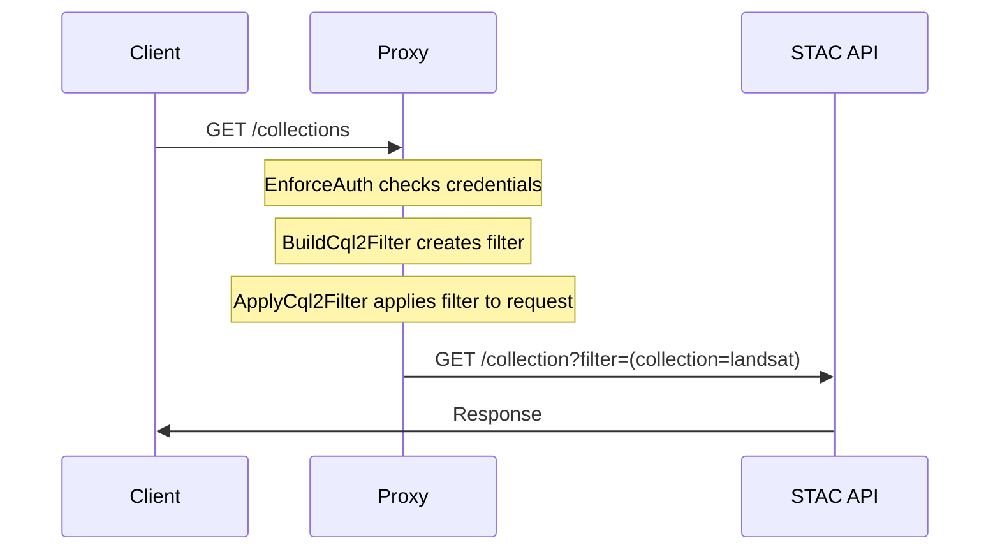
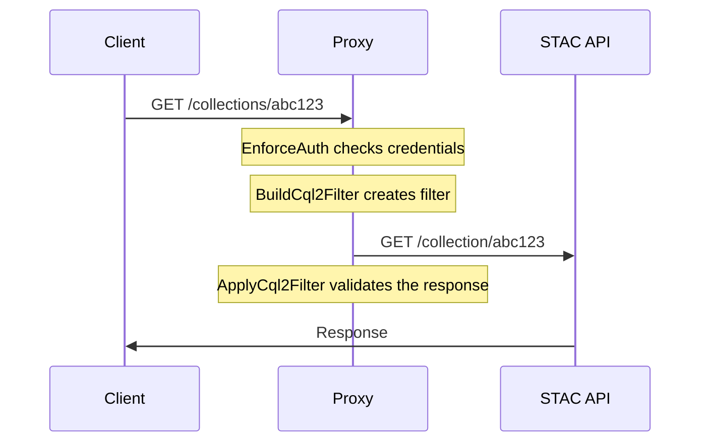

# Filtering Data

> [!NOTE]
>
> For more information on using filters to solve authorization needs, more information can be found in the [user guide](../user-guide/record-level-auth.md).

## Example Request Flow for multi-record endpoints

## Example Request Flow for single-record endpoints

The Filter Extension does not apply to fetching individual records. As such, we must validate the record _after_ it is returned from the upstream API but _before_ it is returned to the user:

