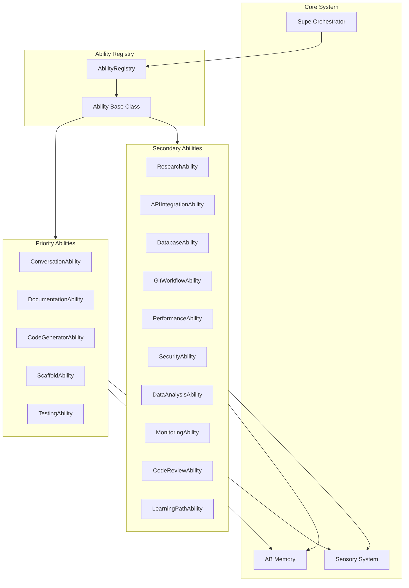

# Full Supe Abilities Implementation

## Architecture Overview




## Phase 1: Infrastructure (Ability Registry)

### 1.1 Create Ability Registry

Create [`tascer/abilities/registry.py`](tascer/abilities/registry.py) with auto-discovery:

```python
class AbilityRegistry:
    """Manages ability discovery and lifecycle."""
    
    def register(self, ability: Ability) -> None
    def get(self, name: str) -> Optional[Ability]
    def list_abilities(self) -> List[AbilityInfo]
    def discover_abilities(self) -> None  # Auto-load from package
```


### 1.2 Update Ability Base Class

Enhance [`tascer/abilities/base.py`](tascer/abilities/base.py):

- Add `name`, `description`, `required_organs` class attributes
- Add `validate_requirements()` method
- Add `AbilityInfo` dataclass for metadata

### 1.3 Update Supe Plugin Loading

Modify [`supe/supe.py`](supe/supe.py) `_load_plugins()` to use AbilityRegistry.---

## Phase 2: Priority Abilities (5 Full Implementations)

### 2.1 ConversationAbility

**File:** `tascer/abilities/conversation.py`

```python
class ConversationAbility(Ability):
    """Conversation memory and context management."""
    
    def plan(self, message: str, context_id: str = None) -> TascPlan
    async def execute(self, plan: TascPlan) -> PlanVerificationReport
    
    # Core features:
    # - Store conversation turns in AB Memory (episodic track)
    # - Recall context from past conversations
    # - Generate conversation summaries
    # - Track user preferences
    # - Link related conversations
```

Uses: AB Memory episodic track, ClaudeOrgan for summarization

### 2.2 DocumentationAbility

**File:** `tascer/abilities/documentation.py`

```python
class DocumentationAbility(Ability):
    """Documentation synthesis and generation."""
    
    def plan(self, sources: List[str], output_format: str = "markdown") -> TascPlan
    async def execute(self, plan: TascPlan) -> PlanVerificationReport
    
    # Core features:
    # - Ingest multiple documentation sources (URLs, files)
    # - Synthesize unified guides
    # - Generate API docs from code
    # - Answer questions from docs
    # - Create tutorials
```

Uses: BrowserOrgan, FileOrgan, ClaudeOrgan, INGEST mode

### 2.3 CodeGeneratorAbility

**File:** `tascer/abilities/code_generator.py`

```python
class CodeGeneratorAbility(Ability):
    """Code generation from natural language."""
    
    def plan(self, description: str, language: str = "python") -> TascPlan
    async def execute(self, plan: TascPlan) -> PlanVerificationReport
    
    # Core features:
    # - Generate code from descriptions
    # - Refactor existing code
    # - Generate tests for code
    # - Create API documentation
    # - Framework/language migrations
```

Uses: ClaudeOrgan, FileOrgan, TerminalOrgan (for validation)

### 2.4 ScaffoldAbility

**File:** `tascer/abilities/scaffold.py`

```python
class ScaffoldAbility(Ability):
    """Project scaffolding and template generation."""
    
    def plan(self, project_type: str, name: str, options: Dict = None) -> TascPlan
    async def execute(self, plan: TascPlan) -> PlanVerificationReport
    
    # Core features:
    # - Generate project structures (React, FastAPI, CLI, etc.)
    # - Create boilerplate code
    # - Set up CI/CD pipelines
    # - Initialize documentation
    # - Create starter templates
```

Uses: FileOrgan, TerminalOrgan, template system

### 2.5 TestingAbility

**File:** `tascer/abilities/testing.py`

```python
class TestingAbility(Ability):
    """Test generation and execution."""
    
    def plan(self, target: str, test_type: str = "unit") -> TascPlan
    async def execute(self, plan: TascPlan) -> PlanVerificationReport
    
    # Core features:
    # - Generate test cases from code/requirements
    # - Create test data/fixtures
    # - Run tests and analyze coverage
    # - Generate test reports
    # - Suggest edge cases
```

Uses: FileOrgan, TerminalOrgan, ClaudeOrgan (EXPLORE mode)---

## Phase 3: Secondary Abilities (10 Full Implementations)

### 3.1 ResearchAbility

**File:** `tascer/abilities/research.py`

- Multi-source research on topics
- Compare sources/approaches
- Generate reports with citations
- Uses: BrowserOrgan, ClaudeOrgan

### 3.2 APIIntegrationAbility

**File:** `tascer/abilities/api_integration.py`

- Discover and test APIs
- Generate API clients
- Create integration tests
- Uses: BrowserOrgan (OpenAPI specs), TerminalOrgan

### 3.3 DatabaseAbility

**File:** `tascer/abilities/database.py`

- Analyze schemas
- Generate migrations/ORM models
- Natural language to SQL
- Uses: TerminalOrgan, FileOrgan

### 3.4 GitWorkflowAbility

**File:** `tascer/abilities/git_workflow.py`

- Analyze commit history
- Generate commit messages/PR descriptions
- Track technical debt
- Uses: TerminalOrgan (git commands), existing git primitives

### 3.5 PerformanceAbility

**File:** `tascer/abilities/performance.py`

- Profile applications
- Generate optimization suggestions
- Track metrics over time
- Uses: TerminalOrgan, FileOrgan

### 3.6 SecurityAbility

**File:** `tascer/abilities/security.py`

- Scan for vulnerabilities
- Analyze dependencies
- Generate security reports
- Uses: TerminalOrgan, BrowserOrgan (CVE lookups)

### 3.7 DataAnalysisAbility

**File:** `tascer/abilities/data_analysis.py`

- Analyze CSV/JSON files
- Generate visualizations
- Answer data questions
- Uses: FileOrgan, ClaudeOrgan

### 3.8 MonitoringAbility

**File:** `tascer/abilities/monitoring.py`

- Set up monitoring
- Analyze logs
- Generate alerts
- Uses: TerminalOrgan, FileOrgan

### 3.9 CodeReviewAbility

**File:** `tascer/abilities/code_review.py`

- Review PRs
- Check style/best practices
- Generate review comments
- Uses: GitWorkflow, ClaudeOrgan

### 3.10 LearningPathAbility

**File:** `tascer/abilities/learning_path.py`

- Create personalized learning paths
- Track progress
- Generate exercises
- Uses: AB Memory, INGEST mode

---

## Phase 4: CLI Integration

### 4.1 Add Ability Commands to CLI

Update [`supe/cli.py`](supe/cli.py):

```bash
supe ability list              # List all abilities
supe ability run <name> ...    # Run an ability
supe ability info <name>       # Show ability details

# Shortcuts for common abilities
supe generate <description>    # CodeGeneratorAbility
supe scaffold <type> <name>    # ScaffoldAbility
supe test <target>             # TestingAbility
supe docs <sources...>         # DocumentationAbility
supe chat <message>            # ConversationAbility
```

---

## Phase 5: Testing

### 5.1 Test Files

Create tests in `tests/`:

- `test_ability_registry.py`
- `test_conversation_ability.py`
- `test_documentation_ability.py`
- `test_code_generator_ability.py`
- `test_scaffold_ability.py`
- `test_testing_ability.py`
- Integration tests for each secondary ability

---

## File Structure After Implementation

```javascript
tascer/abilities/
├── __init__.py           # Export all abilities
├── base.py               # Enhanced base class
├── registry.py           # NEW: Ability registry
├── web_scraper.py        # Existing
├── conversation.py       # NEW: Priority
├── documentation.py      # NEW: Priority
├── code_generator.py     # NEW: Priority
├── scaffold.py           # NEW: Priority
├── testing.py            # NEW: Priority
├── research.py           # NEW: Secondary
├── api_integration.py    # NEW: Secondary
├── database.py           # NEW: Secondary
├── git_workflow.py       # NEW: Secondary
├── performance.py        # NEW: Secondary
├── security.py           # NEW: Secondary
├── data_analysis.py      # NEW: Secondary
├── monitoring.py         # NEW: Secondary
├── code_review.py        # NEW: Secondary
└── learning_path.py      # NEW: Secondary
```

---

## Implementation Order

1. **Infrastructure** - Registry + base class enhancements
2. **ConversationAbility** - Simplest, uses existing memory patterns
3. **DocumentationAbility** - Uses existing INGEST mode
4. **CodeGeneratorAbility** - High value, uses ClaudeOrgan
5. **ScaffoldAbility** - File generation patterns