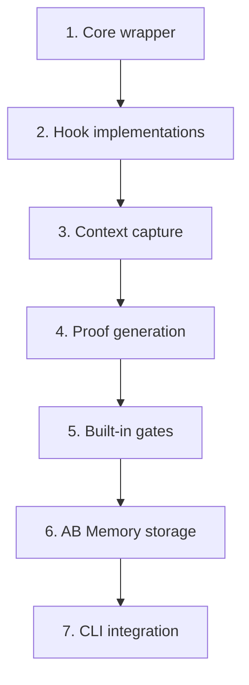

# SPEC: Tascer Agent SDK Integration

**Version:** 1.0.0
**Status:** DISCOVERY_COMPLETE
**Last Updated:** 2026-01-09

---

## Executive Summary

Integrate Claude Agent SDK with Tascer's validation framework, enabling any Agent SDK tool to be wrapped with pre/post validation gates, context capture, and proof-of-work generation. This creates auditable, validated AI agent execution without building custom tool implementations.

---

## Phase 1: Discovery

### Problem Statement

AI agents need auditable execution with proof-of-work validation, but current approaches require custom tool implementations that duplicate Agent SDK capabilities.

### User Personas

| Persona | Demographics | Pain Points | Goals |
|---------|--------------|-------------|-------|
| **AI Developer** | Building production agents, 2-5 years experience | No audit trail for agent actions, can't prove what agent did | Validated, reproducible agent execution |
| **Security Engineer** | Reviewing AI systems, compliance-focused | No way to verify agent didn't take unsafe actions | Cryptographic proof of all actions |

### Value Proposition

Wrap any Claude Agent SDK tool with Tascer validation in one line, getting audit trails, proofs, and gates without reimplementing tools.

### Success Metrics

| Metric | Target | Measurement |
|--------|--------|-------------|
| Integration overhead | < 50ms per tool call | Benchmark validation wrapper |
| Adoption complexity | < 10 lines to integrate | Code example size |
| Proof verification | 100% reproducible | Hash verification tests |

### User Confirmed

- [ ] Awaiting user confirmation

---

## Phase 2: Research

### Competitor Analysis

| Solution | Approach | Limitations |
|----------|----------|-------------|
| Raw Agent SDK | Built-in tools, hooks | No proof generation, no persistent audit |
| LangChain callbacks | Event logging | No validation gates, no proof-of-work |
| Custom MCP servers | Per-tool implementation | Duplication, maintenance burden |
| Guardrails AI | Input/output validation | No context capture, no proofs |
| Tascer (current) | Full validation | No Agent SDK integration |

### Differentiation Strategy

- **Transparent wrapper**: Agent SDK tools work unchanged, validation added invisibly
- **Proof-of-work**: Cryptographic hashes prove execution happened as claimed
- **Context snapshots**: Git state, environment captured automatically
- **Gate system**: Pre/post validation with customizable rules

### Architecture Integration

```
┌─────────────────────────────────────────────────────────────┐
│                    Claude Agent SDK                          │
│  query(prompt, options=ClaudeAgentOptions(                  │
│      hooks={                                                 │
│          "PreToolUse": [tascer_pre_hook],                   │
│          "PostToolUse": [tascer_post_hook]                  │
│      }                                                       │
│  ))                                                          │
└─────────────────────────┬───────────────────────────────────┘
                          │
                          ▼
┌─────────────────────────────────────────────────────────────┐
│                  Tascer Validation Layer                     │
│                                                              │
│  ┌─────────────┐    ┌─────────────┐    ┌─────────────┐     │
│  │ Pre-Hooks   │───▶│  SDK Tool   │───▶│ Post-Hooks  │     │
│  │ • Context   │    │  Execution  │    │ • Proof gen │     │
│  │ • Gates     │    │             │    │ • Evidence  │     │
│  │ • Perms     │    │             │    │ • Gates     │     │
│  └─────────────┘    └─────────────┘    └─────────────┘     │
│         │                                      │            │
│         └──────────────┬───────────────────────┘            │
│                        ▼                                    │
│              ┌─────────────────┐                            │
│              │  AB Memory      │                            │
│              │  (audit store)  │                            │
│              └─────────────────┘                            │
└─────────────────────────────────────────────────────────────┘
```

### Risks & Mitigations

| Risk | Probability | Impact | Mitigation |
|------|-------------|--------|------------|
| Hook overhead too high | Medium | High | Async context capture, lazy proof generation |
| SDK API changes | Low | High | Abstract hook interface, version pinning |
| Context capture fails | Medium | Medium | Graceful degradation, continue without context |

### User Confirmed

- [ ] Awaiting user confirmation

---

## Phase 3: Technical Specification

### Data Models

```python
from dataclasses import dataclass, field
from typing import Any, Callable, Dict, List, Optional
from datetime import datetime

@dataclass
class ToolValidationConfig:
    """Configuration for validating a specific tool."""
    tool_name: str
    pre_gates: List[str] = field(default_factory=list)  # Gate names to run before
    post_gates: List[str] = field(default_factory=list)  # Gate names to run after
    required_permissions: List[str] = field(default_factory=list)
    evidence_types: List[str] = field(default_factory=list)  # stdout, file, diff
    timeout_ms: int = 30000
    require_proof: bool = True

@dataclass
class ToolExecutionRecord:
    """Record of a validated tool execution."""
    tool_use_id: str
    tool_name: str
    timestamp_start: str
    timestamp_end: Optional[str] = None

    # Input/output
    tool_input: Dict[str, Any] = field(default_factory=dict)
    tool_output: Any = None

    # Validation
    context: Optional["Context"] = None  # From contracts.py
    pre_gate_results: List["GateResult"] = field(default_factory=list)
    post_gate_results: List["GateResult"] = field(default_factory=list)

    # Proof
    proof_hash: str = ""
    evidence_paths: List[str] = field(default_factory=list)

    # Status
    status: str = "pending"  # pending | validated | failed | blocked

@dataclass
class TascerAgentOptions:
    """Options for Tascer-validated agent execution."""
    # Tool validation configs (tool_name -> config)
    tool_configs: Dict[str, ToolValidationConfig] = field(default_factory=dict)

    # Default gates for all tools
    default_pre_gates: List[str] = field(default_factory=list)
    default_post_gates: List[str] = field(default_factory=list)

    # Context capture
    capture_git_state: bool = True
    capture_env: bool = True
    env_allowlist: List[str] = field(default_factory=lambda: ["PATH", "HOME", "USER"])

    # Storage
    store_to_ab: bool = True
    evidence_dir: str = ".tascer/evidence"

    # Proof settings
    generate_proofs: bool = True
    proof_algorithm: str = "sha256"
```

### Core API

```python
# tascer/sdk_wrapper.py

from claude_agent_sdk import ClaudeAgentOptions, HookMatcher
from typing import AsyncIterator, Any

class TascerAgent:
    """Claude Agent with Tascer validation."""

    def __init__(
        self,
        tascer_options: TascerAgentOptions = None,
        sdk_options: ClaudeAgentOptions = None,
    ):
        self.tascer_options = tascer_options or TascerAgentOptions()
        self.sdk_options = sdk_options or ClaudeAgentOptions()
        self._execution_records: List[ToolExecutionRecord] = []

    async def query(
        self,
        prompt: str,
        **kwargs
    ) -> AsyncIterator[Any]:
        """Execute agent with Tascer validation hooks."""

        # Inject Tascer hooks into SDK options
        hooks = self._build_hooks()
        merged_options = self._merge_options(hooks)

        async for message in query(prompt, options=merged_options):
            yield message

    def _build_hooks(self) -> dict:
        """Build PreToolUse and PostToolUse hooks."""
        return {
            "PreToolUse": [HookMatcher(
                matcher=".*",  # All tools
                hooks=[self._pre_tool_hook]
            )],
            "PostToolUse": [HookMatcher(
                matcher=".*",
                hooks=[self._post_tool_hook]
            )]
        }

    async def _pre_tool_hook(
        self,
        input_data: dict,
        tool_use_id: str,
        context: Any
    ) -> dict:
        """Pre-execution validation hook."""
        tool_name = input_data.get("tool_name", "unknown")
        tool_input = input_data.get("tool_input", {})

        # Create execution record
        record = ToolExecutionRecord(
            tool_use_id=tool_use_id,
            tool_name=tool_name,
            timestamp_start=datetime.utcnow().isoformat(),
            tool_input=tool_input,
        )

        # Capture context
        if self.tascer_options.capture_git_state:
            record.context = await self._capture_context()

        # Run pre-gates
        config = self._get_tool_config(tool_name)
        for gate_name in config.pre_gates:
            result = await self._run_gate(gate_name, record, "pre")
            record.pre_gate_results.append(result)
            if not result.passed:
                record.status = "blocked"
                return {"block": True, "message": result.message}

        self._execution_records.append(record)
        return {}  # Allow execution to proceed

    async def _post_tool_hook(
        self,
        input_data: dict,
        tool_use_id: str,
        context: Any
    ) -> dict:
        """Post-execution validation and proof generation."""
        # Find the record
        record = self._find_record(tool_use_id)
        if not record:
            return {}

        record.timestamp_end = datetime.utcnow().isoformat()
        record.tool_output = input_data.get("tool_result")

        # Run post-gates
        config = self._get_tool_config(record.tool_name)
        for gate_name in config.post_gates:
            result = await self._run_gate(gate_name, record, "post")
            record.post_gate_results.append(result)

        # Generate proof
        if self.tascer_options.generate_proofs:
            record.proof_hash = self._generate_proof(record)

        # Store to AB Memory
        if self.tascer_options.store_to_ab:
            await self._store_record(record)

        # Update status
        all_passed = (
            all(g.passed for g in record.pre_gate_results) and
            all(g.passed for g in record.post_gate_results)
        )
        record.status = "validated" if all_passed else "failed"

        return {}

    def get_validation_report(self) -> List[ToolExecutionRecord]:
        """Get all execution records from this session."""
        return self._execution_records

    def verify_proofs(self) -> bool:
        """Verify all proof hashes are valid."""
        return all(
            self._verify_proof(r)
            for r in self._execution_records
            if r.proof_hash
        )
```

### Usage Example

```python
import asyncio
from tascer.sdk_wrapper import TascerAgent, TascerAgentOptions, ToolValidationConfig

async def main():
    # Configure validation
    tascer_options = TascerAgentOptions(
        tool_configs={
            "Edit": ToolValidationConfig(
                tool_name="Edit",
                pre_gates=["file_exists", "not_protected"],
                post_gates=["syntax_valid", "tests_pass"],
                evidence_types=["diff"],
            ),
            "Bash": ToolValidationConfig(
                tool_name="Bash",
                pre_gates=["command_allowed"],
                post_gates=["exit_code_zero"],
                evidence_types=["stdout", "stderr"],
            ),
        },
        default_post_gates=["no_secrets_leaked"],
        capture_git_state=True,
    )

    # Create validated agent
    agent = TascerAgent(tascer_options=tascer_options)

    # Execute with validation
    async for message in agent.query(
        prompt="Fix the bug in auth.py and run tests",
        allowed_tools=["Read", "Edit", "Bash", "Glob"]
    ):
        if hasattr(message, "result"):
            print(message.result)

    # Get validation report
    report = agent.get_validation_report()
    for record in report:
        print(f"{record.tool_name}: {record.status} (proof: {record.proof_hash[:8]}...)")

    # Verify all proofs
    assert agent.verify_proofs(), "Proof verification failed!"

asyncio.run(main())
```

### File Structure

```
tascer/
├── sdk_wrapper.py          # Main integration (TascerAgent)
├── sdk_hooks.py            # Hook implementations
├── sdk_context.py          # Context capture for SDK
├── sdk_proofs.py           # Proof generation for SDK tools
└── sdk_gates/              # SDK-specific gates
    ├── __init__.py
    ├── command_allowed.py  # Bash command validation
    ├── file_protected.py   # Protected file check
    ├── syntax_valid.py     # Post-edit syntax check
    └── secrets_check.py    # No secrets in output
```

### Built-in Gates

| Gate | Type | Purpose |
|------|------|---------|
| `command_allowed` | pre | Validate Bash commands against allowlist |
| `file_protected` | pre | Block edits to protected files |
| `file_exists` | pre | Ensure file exists before edit |
| `exit_code_zero` | post | Bash command succeeded |
| `syntax_valid` | post | Edited file has valid syntax |
| `tests_pass` | post | Run tests after code change |
| `no_secrets_leaked` | post | Check output for secrets |
| `diff_size_limit` | post | Limit size of changes |

### User Confirmed

- [ ] Awaiting user confirmation

---

## Phase 4: Testing Strategy

### Test Structure

```
tests/
├── test_sdk_wrapper.py       # Core TascerAgent tests
├── test_sdk_hooks.py         # Hook behavior tests
├── test_sdk_context.py       # Context capture tests
├── test_sdk_proofs.py        # Proof generation/verification
├── test_sdk_gates.py         # Built-in gate tests
└── test_sdk_integration.py   # End-to-end with real SDK
```

### Unit Tests (Mocked SDK)

```python
# tests/test_sdk_wrapper.py
"""Tests for TascerAgent SDK wrapper."""

import pytest
from unittest.mock import AsyncMock, patch, MagicMock
from tascer.sdk_wrapper import (
    TascerAgent,
    TascerAgentOptions,
    ToolValidationConfig,
    ToolExecutionRecord,
)


class TestToolValidationConfig:
    """Tests for ToolValidationConfig dataclass."""

    def test_default_values(self):
        """Config should have sensible defaults."""
        config = ToolValidationConfig(tool_name="Edit")

        assert config.tool_name == "Edit"
        assert config.pre_gates == []
        assert config.post_gates == []
        assert config.timeout_ms == 30000
        assert config.require_proof is True

    def test_custom_gates(self):
        """Config should accept custom gate lists."""
        config = ToolValidationConfig(
            tool_name="Bash",
            pre_gates=["command_allowed"],
            post_gates=["exit_code_zero", "no_secrets"],
        )

        assert "command_allowed" in config.pre_gates
        assert len(config.post_gates) == 2


class TestTascerAgentOptions:
    """Tests for TascerAgentOptions."""

    def test_default_options(self):
        """Default options should be safe and useful."""
        opts = TascerAgentOptions()

        assert opts.capture_git_state is True
        assert opts.generate_proofs is True
        assert opts.store_to_ab is True
        assert "PATH" in opts.env_allowlist

    def test_tool_config_lookup(self):
        """Should retrieve tool-specific config."""
        opts = TascerAgentOptions(
            tool_configs={
                "Edit": ToolValidationConfig(
                    tool_name="Edit",
                    post_gates=["syntax_valid"],
                )
            }
        )

        assert "Edit" in opts.tool_configs
        assert "syntax_valid" in opts.tool_configs["Edit"].post_gates


class TestToolExecutionRecord:
    """Tests for ToolExecutionRecord."""

    def test_basic_creation(self):
        """Record should capture tool execution basics."""
        record = ToolExecutionRecord(
            tool_use_id="tu_123",
            tool_name="Read",
            timestamp_start="2026-01-09T00:00:00",
            tool_input={"file_path": "/test.py"},
        )

        assert record.tool_use_id == "tu_123"
        assert record.status == "pending"
        assert record.proof_hash == ""

    def test_to_dict_roundtrip(self):
        """Record should serialize/deserialize correctly."""
        record = ToolExecutionRecord(
            tool_use_id="tu_456",
            tool_name="Bash",
            timestamp_start="2026-01-09T00:00:00",
            tool_input={"command": "ls"},
            tool_output="file1.py\nfile2.py",
            status="validated",
            proof_hash="abc123",
        )

        data = record.to_dict()
        restored = ToolExecutionRecord.from_dict(data)

        assert restored.tool_use_id == record.tool_use_id
        assert restored.proof_hash == record.proof_hash


class TestTascerAgentHooks:
    """Tests for TascerAgent hook behavior."""

    @pytest.fixture
    def agent(self):
        """Create agent with test config."""
        return TascerAgent(
            tascer_options=TascerAgentOptions(
                tool_configs={
                    "Edit": ToolValidationConfig(
                        tool_name="Edit",
                        pre_gates=["file_exists"],
                        post_gates=["syntax_valid"],
                    )
                },
                capture_git_state=False,  # Skip for unit tests
            )
        )

    @pytest.mark.asyncio
    async def test_pre_hook_creates_record(self, agent):
        """Pre-hook should create execution record."""
        input_data = {
            "tool_name": "Edit",
            "tool_input": {"file_path": "/test.py", "content": "x = 1"},
        }

        result = await agent._pre_tool_hook(input_data, "tu_001", None)

        assert len(agent._execution_records) == 1
        assert agent._execution_records[0].tool_name == "Edit"
        assert result == {}  # No block

    @pytest.mark.asyncio
    async def test_pre_hook_blocks_on_failed_gate(self, agent):
        """Pre-hook should block when gate fails."""
        # Mock gate to fail
        with patch.object(agent, '_run_gate') as mock_gate:
            mock_gate.return_value = GateResult(
                gate_name="file_exists",
                passed=False,
                message="File not found",
            )

            input_data = {"tool_name": "Edit", "tool_input": {}}
            result = await agent._pre_tool_hook(input_data, "tu_002", None)

            assert result.get("block") is True
            assert "File not found" in result.get("message", "")

    @pytest.mark.asyncio
    async def test_post_hook_generates_proof(self, agent):
        """Post-hook should generate proof hash."""
        # Create a record first
        record = ToolExecutionRecord(
            tool_use_id="tu_003",
            tool_name="Edit",
            timestamp_start="2026-01-09T00:00:00",
        )
        agent._execution_records.append(record)

        # Mock successful gate
        with patch.object(agent, '_run_gate') as mock_gate:
            mock_gate.return_value = GateResult(
                gate_name="syntax_valid",
                passed=True,
                message="OK",
            )

            input_data = {"tool_result": "File edited successfully"}
            await agent._post_tool_hook(input_data, "tu_003", None)

            assert record.proof_hash != ""
            assert record.status == "validated"


class TestProofVerification:
    """Tests for proof generation and verification."""

    def test_proof_hash_deterministic(self):
        """Same input should produce same proof hash."""
        agent = TascerAgent()

        record1 = ToolExecutionRecord(
            tool_use_id="tu_100",
            tool_name="Read",
            timestamp_start="2026-01-09T12:00:00",
            tool_input={"file_path": "/test.py"},
            tool_output="content",
        )

        record2 = ToolExecutionRecord(
            tool_use_id="tu_100",
            tool_name="Read",
            timestamp_start="2026-01-09T12:00:00",
            tool_input={"file_path": "/test.py"},
            tool_output="content",
        )

        hash1 = agent._generate_proof(record1)
        hash2 = agent._generate_proof(record2)

        assert hash1 == hash2

    def test_proof_changes_with_input(self):
        """Different input should produce different proof."""
        agent = TascerAgent()

        record1 = ToolExecutionRecord(
            tool_use_id="tu_101",
            tool_name="Read",
            timestamp_start="2026-01-09T12:00:00",
            tool_input={"file_path": "/test.py"},
        )

        record2 = ToolExecutionRecord(
            tool_use_id="tu_101",
            tool_name="Read",
            timestamp_start="2026-01-09T12:00:00",
            tool_input={"file_path": "/other.py"},  # Different file
        )

        hash1 = agent._generate_proof(record1)
        hash2 = agent._generate_proof(record2)

        assert hash1 != hash2

    def test_verify_proofs_all_valid(self):
        """verify_proofs should return True when all valid."""
        agent = TascerAgent()

        # Add records with valid proofs
        for i in range(3):
            record = ToolExecutionRecord(
                tool_use_id=f"tu_{i}",
                tool_name="Read",
                timestamp_start="2026-01-09T12:00:00",
            )
            record.proof_hash = agent._generate_proof(record)
            agent._execution_records.append(record)

        assert agent.verify_proofs() is True

    def test_verify_proofs_detects_tampering(self):
        """verify_proofs should detect tampered records."""
        agent = TascerAgent()

        record = ToolExecutionRecord(
            tool_use_id="tu_999",
            tool_name="Bash",
            timestamp_start="2026-01-09T12:00:00",
            tool_input={"command": "ls"},
        )
        record.proof_hash = agent._generate_proof(record)

        # Tamper with the record after proof generation
        record.tool_input = {"command": "rm -rf /"}

        agent._execution_records.append(record)

        assert agent.verify_proofs() is False
```

### Integration Tests (Real SDK)

```python
# tests/test_sdk_integration.py
"""Integration tests with real Claude Agent SDK."""

import pytest
import asyncio
import os
from tascer.sdk_wrapper import TascerAgent, TascerAgentOptions, ToolValidationConfig

# Skip if no API key
pytestmark = pytest.mark.skipif(
    not os.environ.get("ANTHROPIC_API_KEY"),
    reason="ANTHROPIC_API_KEY not set"
)


class TestRealSDKIntegration:
    """Tests against real Claude Agent SDK."""

    @pytest.fixture
    def agent(self, tmp_path):
        """Create agent with test workspace."""
        # Create test file
        test_file = tmp_path / "test.py"
        test_file.write_text("x = 1\n")

        return TascerAgent(
            tascer_options=TascerAgentOptions(
                tool_configs={
                    "Read": ToolValidationConfig(tool_name="Read"),
                    "Bash": ToolValidationConfig(
                        tool_name="Bash",
                        post_gates=["exit_code_zero"],
                    ),
                },
                evidence_dir=str(tmp_path / ".tascer"),
            )
        ), tmp_path

    @pytest.mark.asyncio
    @pytest.mark.slow
    async def test_read_file_creates_validated_record(self, agent):
        """Reading a file should create validated execution record."""
        agent, tmp_path = agent

        results = []
        async for msg in agent.query(
            prompt=f"Read the file at {tmp_path}/test.py",
            allowed_tools=["Read"],
        ):
            results.append(msg)

        records = agent.get_validation_report()
        assert len(records) >= 1

        read_record = next(r for r in records if r.tool_name == "Read")
        assert read_record.status == "validated"
        assert read_record.proof_hash != ""

    @pytest.mark.asyncio
    @pytest.mark.slow
    async def test_bash_command_captures_output(self, agent):
        """Bash commands should capture stdout as evidence."""
        agent, tmp_path = agent

        async for msg in agent.query(
            prompt="Run: echo 'hello world'",
            allowed_tools=["Bash"],
        ):
            pass

        records = agent.get_validation_report()
        bash_record = next(r for r in records if r.tool_name == "Bash")

        assert "hello world" in str(bash_record.tool_output)
        assert bash_record.status == "validated"

    @pytest.mark.asyncio
    @pytest.mark.slow
    async def test_failed_gate_blocks_execution(self, agent):
        """Failed pre-gate should block tool execution."""
        agent, tmp_path = agent

        # Add a gate that always fails
        agent.tascer_options.tool_configs["Bash"] = ToolValidationConfig(
            tool_name="Bash",
            pre_gates=["always_fail"],  # Custom gate that fails
        )

        # Register the failing gate
        agent.register_gate("always_fail", lambda r, phase: GateResult(
            gate_name="always_fail",
            passed=False,
            message="This gate always fails for testing",
        ))

        async for msg in agent.query(
            prompt="Run: ls",
            allowed_tools=["Bash"],
        ):
            pass

        records = agent.get_validation_report()
        bash_record = next((r for r in records if r.tool_name == "Bash"), None)

        if bash_record:
            assert bash_record.status == "blocked"

    @pytest.mark.asyncio
    @pytest.mark.slow
    async def test_multiple_tools_all_validated(self, agent):
        """Multiple tool calls should all be validated."""
        agent, tmp_path = agent

        async for msg in agent.query(
            prompt=f"First read {tmp_path}/test.py, then run 'echo done'",
            allowed_tools=["Read", "Bash"],
        ):
            pass

        records = agent.get_validation_report()

        # Should have at least 2 records
        assert len(records) >= 2

        # All should be validated
        for record in records:
            assert record.status in ["validated", "blocked"]
            assert record.proof_hash != ""

        # All proofs should verify
        assert agent.verify_proofs() is True
```

### Running Tests

```bash
# Unit tests (fast, no API needed)
pytest tests/test_sdk_wrapper.py tests/test_sdk_hooks.py -v

# Integration tests (requires ANTHROPIC_API_KEY)
ANTHROPIC_API_KEY=your-key pytest tests/test_sdk_integration.py -v -m slow

# All SDK tests
pytest tests/test_sdk*.py -v

# With coverage
pytest tests/test_sdk*.py --cov=tascer --cov-report=html
```

---

## Phase 5: Usage Scenarios

### Scenario 1: Basic Validated Agent

```python
"""Minimal setup - validate all tool calls with proofs."""

import asyncio
from tascer.sdk_wrapper import TascerAgent

async def main():
    agent = TascerAgent()  # Default options

    async for msg in agent.query(
        prompt="What files are in this directory?",
        allowed_tools=["Bash", "Glob"]
    ):
        if hasattr(msg, "result"):
            print(msg.result)

    # Check what happened
    for record in agent.get_validation_report():
        print(f"✓ {record.tool_name}: {record.proof_hash[:8]}...")

asyncio.run(main())
```

### Scenario 2: Code Review with Safety Gates

```python
"""Code review agent that can read but not modify."""

import asyncio
from tascer.sdk_wrapper import TascerAgent, TascerAgentOptions, ToolValidationConfig

async def main():
    agent = TascerAgent(
        tascer_options=TascerAgentOptions(
            tool_configs={
                # Read-only tools - no gates needed
                "Read": ToolValidationConfig(tool_name="Read"),
                "Glob": ToolValidationConfig(tool_name="Glob"),
                "Grep": ToolValidationConfig(tool_name="Grep"),
                # Block any write attempts
                "Edit": ToolValidationConfig(
                    tool_name="Edit",
                    pre_gates=["always_block"],  # Never allow
                ),
                "Write": ToolValidationConfig(
                    tool_name="Write",
                    pre_gates=["always_block"],
                ),
            }
        )
    )

    async for msg in agent.query(
        prompt="Review the code in src/ for security issues",
        allowed_tools=["Read", "Glob", "Grep", "Edit", "Write"]
    ):
        if hasattr(msg, "result"):
            print(msg.result)

    # Audit trail
    print("\n--- Audit Trail ---")
    for r in agent.get_validation_report():
        status = "✓" if r.status == "validated" else "✗"
        print(f"{status} {r.tool_name}: {r.status}")

asyncio.run(main())
```

### Scenario 3: CI/CD Pipeline with Proof Export

```python
"""CI agent that exports proofs for audit."""

import asyncio
import json
from tascer.sdk_wrapper import TascerAgent, TascerAgentOptions, ToolValidationConfig

async def run_ci_agent():
    agent = TascerAgent(
        tascer_options=TascerAgentOptions(
            tool_configs={
                "Bash": ToolValidationConfig(
                    tool_name="Bash",
                    pre_gates=["command_allowed"],
                    post_gates=["exit_code_zero"],
                    evidence_types=["stdout", "stderr"],
                ),
                "Edit": ToolValidationConfig(
                    tool_name="Edit",
                    pre_gates=["not_protected"],
                    post_gates=["syntax_valid", "tests_pass"],
                    evidence_types=["diff"],
                ),
            },
            capture_git_state=True,
            evidence_dir=".ci/evidence",
        )
    )

    async for msg in agent.query(
        prompt="Run tests, fix any failures, then run tests again",
        allowed_tools=["Read", "Edit", "Bash", "Glob"]
    ):
        if hasattr(msg, "result"):
            print(msg.result)

    # Export proofs for CI artifact
    report = {
        "success": agent.verify_proofs(),
        "records": [r.to_dict() for r in agent.get_validation_report()],
    }

    with open(".ci/proof-report.json", "w") as f:
        json.dump(report, f, indent=2)

    return report["success"]

if __name__ == "__main__":
    success = asyncio.run(run_ci_agent())
    exit(0 if success else 1)
```

### Scenario 4: Custom Gates

```python
"""Agent with custom validation gates."""

import asyncio
from tascer.sdk_wrapper import TascerAgent, TascerAgentOptions, ToolValidationConfig
from tascer.contracts import GateResult

async def main():
    agent = TascerAgent(
        tascer_options=TascerAgentOptions(
            tool_configs={
                "Bash": ToolValidationConfig(
                    tool_name="Bash",
                    pre_gates=["no_destructive_commands"],
                    post_gates=["output_not_empty"],
                ),
            }
        )
    )

    # Register custom pre-gate
    @agent.register_gate("no_destructive_commands")
    def check_destructive(record, phase):
        cmd = record.tool_input.get("command", "")
        dangerous = ["rm -rf", "drop table", "format", "> /dev/"]

        for pattern in dangerous:
            if pattern in cmd.lower():
                return GateResult(
                    gate_name="no_destructive_commands",
                    passed=False,
                    message=f"Blocked: '{pattern}' is not allowed",
                )

        return GateResult(
            gate_name="no_destructive_commands",
            passed=True,
            message="Command is safe",
        )

    # Register custom post-gate
    @agent.register_gate("output_not_empty")
    def check_output(record, phase):
        output = record.tool_output or ""
        return GateResult(
            gate_name="output_not_empty",
            passed=len(str(output).strip()) > 0,
            message="Output present" if output else "No output",
        )

    async for msg in agent.query(
        prompt="List all Python files",
        allowed_tools=["Bash"]
    ):
        if hasattr(msg, "result"):
            print(msg.result)

asyncio.run(main())
```

### Scenario 5: Resumable Sessions with Validation History

```python
"""Resume a session and continue validation history."""

import asyncio
from tascer.sdk_wrapper import TascerAgent, TascerAgentOptions

async def main():
    agent = TascerAgent()
    session_id = None

    # First query
    async for msg in agent.query(prompt="Read config.py"):
        if hasattr(msg, 'subtype') and msg.subtype == 'init':
            session_id = msg.session_id

    print(f"Session: {session_id}")
    print(f"Records so far: {len(agent.get_validation_report())}")

    # Resume with full context + validation history
    async for msg in agent.query(
        prompt="Now update the timeout value to 30",
        resume=session_id,
    ):
        if hasattr(msg, "result"):
            print(msg.result)

    # All records from both queries
    print(f"\nTotal records: {len(agent.get_validation_report())}")
    for r in agent.get_validation_report():
        print(f"  {r.tool_name}: {r.status}")

asyncio.run(main())
```

---

## Phase 6: Implementation Plan

### Build Sequence



### Step Details

| Step | Files | Acceptance Criteria |
|------|-------|---------------------|
| 1. Core wrapper | `sdk_wrapper.py` | TascerAgent wraps query() successfully |
| 2. Hook implementations | `sdk_hooks.py` | Pre/post hooks inject without errors |
| 3. Context capture | `sdk_context.py` | Git state, env captured correctly |
| 4. Proof generation | `sdk_proofs.py` | Proofs verify with hash |
| 5. Built-in gates | `sdk_gates/*.py` | All 8 gates implemented |
| 6. AB Memory storage | `sdk_wrapper.py` | Records stored and retrievable |
| 7. CLI integration | `cli.py` | `tascer agent` command works |

### User Confirmed

- [ ] Awaiting user confirmation

---

## Phase 5: Acceptance Criteria

### Core Functionality

```gherkin
GIVEN a TascerAgent with default options
WHEN I execute query("List files in current directory")
THEN the agent returns file listing
AND an execution record is created
AND the record has a valid proof hash

GIVEN a TascerAgent with pre_gates=["command_allowed"]
WHEN I execute query("Run rm -rf /")
THEN the pre-hook blocks execution
AND the record status is "blocked"
AND the block message explains why

GIVEN a TascerAgent with post_gates=["exit_code_zero"]
WHEN the Bash tool returns exit code 1
THEN the post-hook marks validation failed
AND the record status is "failed"
AND all evidence is captured

GIVEN multiple tool executions in one session
WHEN I call get_validation_report()
THEN all records are returned in order
AND all proof hashes are unique
AND verify_proofs() returns True
```

### Performance

```gherkin
GIVEN a tool execution without validation
WHEN I measure baseline execution time
THEN validation overhead is < 50ms per call

GIVEN 100 sequential tool executions
WHEN I capture context for each
THEN total context capture time < 2 seconds
```

### Integration

```gherkin
GIVEN an existing Claude Agent SDK project
WHEN I replace query() with TascerAgent().query()
THEN all existing functionality continues to work
AND validation is transparently added
```

---

## Approval Status

| Phase | Status | Approved By | Date |
|-------|--------|-------------|------|
| Discovery | COMPLETE | - | - |
| Research | COMPLETE | - | - |
| Technical | COMPLETE | - | - |
| Testing | COMPLETE | - | - |
| Usage | COMPLETE | - | - |
| Implementation | PENDING | - | - |

**Overall Status:** Awaiting user approval to proceed with implementation.

---

## Quick Reference

### Minimal Usage
```python
from tascer.sdk_wrapper import TascerAgent

agent = TascerAgent()
async for msg in agent.query("Do something"):
    print(msg)

# Every tool call now has proofs
assert agent.verify_proofs()
```

### Run Tests
```bash
# Unit tests (no API key needed)
pytest tests/test_sdk_wrapper.py -v

# Integration tests
ANTHROPIC_API_KEY=xxx pytest tests/test_sdk_integration.py -v -m slow
```

### Key Files to Create
1. `tascer/sdk_wrapper.py` - TascerAgent class
2. `tascer/sdk_hooks.py` - Pre/post hook implementations
3. `tests/test_sdk_wrapper.py` - Unit tests
4. `tests/test_sdk_integration.py` - Integration tests
