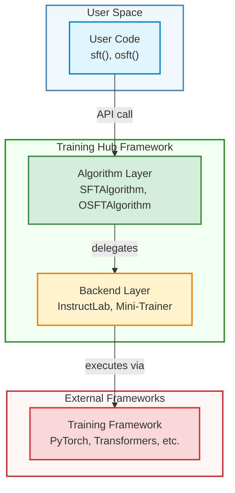

# Backends Overview

Training Hub uses a pluggable backend architecture that separates algorithm logic from framework-specific implementation details. This allows you to choose the best training framework for your needs while maintaining a consistent API.

## What are Backends?

A **backend** is the underlying training framework that executes the actual model training. Each backend implementation:

- Handles framework-specific code (e.g., PyTorch training loops, distributed setup)
- Manages hardware utilization (GPU, multi-GPU, multi-node)
- Provides optimizations specific to that framework
- Implements the training logic for specific algorithms

## Available Backends

### InstructLab Training

**Class:** [`InstructLabTrainingSFTBackend`](/api/backends/instructlab-training)

**Algorithm Support:** SFT (Supervised Fine-Tuning)

**Package:** `instructlab-training`

**Use Case:** Production-grade supervised fine-tuning with robust distributed training support 

Features:
- Battle-tested distributed training
- Optimized for instruction-tuned models
- Full multi-node support via `torchrun`
- Comprehensive checkpointing and resumption

**Learn more:** [InstructLab Training Backend Documentation](/api/backends/instructlab-training)

### RHAI Innovation Mini-Trainer

**Class:** [`MiniTrainerOSFTBackend`](/api/backends/mini-trainer)

**Algorithm Support:** OSFT (Orthogonal Subspace Fine-Tuning)

**Package:** `rhai-innovation-mini-trainer`

**Use Case:** High-performance distributed training implementation of the OSFT algorithm.

Features:
- Specialized for OSFT algorithm
- Efficient orthogonal subspace computations
- Supports Liger kernels for performance
- Multi-GPU and multi-node capable

**Learn more:** [Mini-Trainer Backend Documentation](/api/backends/mini-trainer)

### Unsloth

**Class:** [`UnslothLoRABackend`](/api/backends/unsloth)

**Algorithm Support:** LoRA (Low-Rank Adaptation)

**Package:** `unsloth`

**Use Case:** Optimized parameter-efficient fine-tuning with LoRA

Features:
- 2x faster training compared to standard LoRA implementations
- 70% less VRAM usage
- QLoRA support with 4-bit quantization
- Single-GPU and multi-GPU support (data-parallel via torchrun, or model splitting via `enable_model_splitting`)
- Optimized for memory efficiency

**Learn more:** [Unsloth Backend Documentation](/api/backends/unsloth)

## Backend Architecture



## How Backends are Selected

### Automatic Selection (Default)

When you don't specify a backend, Training Hub uses the default backend for that algorithm:

```python
from training_hub import sft

# Uses default backend (instructlab-training)
result = sft(
    model_path="./model",
    data_path="./data.jsonl",
    ckpt_output_dir="./output",
    num_epochs=3,
    effective_batch_size=8,
    learning_rate=2e-5,
    max_seq_len=2048,
    max_tokens_per_gpu=45000
)
```

### Explicit Backend Selection

You can specify a backend explicitly using the `backend` parameter. In this example, we use the `instructlab-training` backend when invoking the `sft()` function.

```python
from training_hub import sft

# Explicitly use instructlab-training backend
result = sft(
    model_path="./model",
    data_path="./data.jsonl",
    ckpt_output_dir="./output",
    num_epochs=3,
    effective_batch_size=8,
    learning_rate=2e-5,
    max_seq_len=2048,
    max_tokens_per_gpu=45000,
    backend="instructlab-training"
)
```

### Using `create_algorithm()`

The `create_algorithm()` function is a factory function that creates an algorithm instance with a specified backend. In this example, we create an SFT algorithm instance with the `instructlab-training` backend.

```python
from training_hub import create_algorithm

# Create algorithm with specific backend
algorithm = create_algorithm("sft", backend_name="instructlab-training")
```

## Creating Custom Backends

You can create custom backends by inheriting from the [`Backend`](/api/classes/Backend) base class and implementing the `execute_training()` method.

**Example:**

```python
from training_hub import Backend, AlgorithmRegistry
from typing import Dict, Any

class MyCustomBackend(Backend):
    """Custom backend for a specific training framework."""

    def execute_training(self, algorithm_params: Dict[str, Any]) -> Any:
        """Execute training with custom framework."""
        # Your implementation here
        pass

# Register the backend
AlgorithmRegistry.register_backend("sft", "my_backend", MyCustomBackend)
```

See the [Extending the Framework Guide](/guides/extending-framework) for detailed instructions.

## Backend-Specific Parameters

Each backend may support additional parameters beyond the standard algorithm parameters. These can be passed via `**kwargs`:

```python
from training_hub import sft

result = sft(
    model_path="./model",
    data_path="./data.jsonl",
    ckpt_output_dir="./output",
    num_epochs=3,
    effective_batch_size=8,
    learning_rate=2e-5,
    max_seq_len=2048,
    max_tokens_per_gpu=45000,
    # Backend-specific parameter
    custom_optimization_flag=True
)
```

Check individual backend documentation for supported parameters:
- [InstructLab Training Parameters](/api/backends/instructlab-training#additional-parameters)
- [Mini-Trainer Parameters](/api/backends/mini-trainer#additional-parameters)

## Switching Backends

Training Hub's architecture makes it easy to switch between backends for the same algorithm:

```python
from training_hub import create_algorithm

# Try backend A
algo_a = create_algorithm("sft", backend_name="instructlab-training")
result_a = algo_a.train(model_path="./model", data_path="./data.jsonl", ckpt_output_dir="./out_a")

# Try backend B (when available)
# algo_b = create_algorithm("sft", backend_name="alternative_backend")
# result_b = algo_b.train(model_path="./model", data_path="./data.jsonl", ckpt_output_dir="./out_b")
```

## Performance Considerations

Different backends may have different performance characteristics:

- **Memory usage:** Some backends are more memory-efficient
- **Training speed:** Optimization levels vary between frameworks
- **Distributed scaling:** Multi-node efficiency differs
- **Hardware support:** GPU utilization and CUDA kernel optimizations

**Recommendation:** Start with the default backend for each algorithm, which represents the recommended choice for most use cases.

## See Also

- [**InstructLab Training Backend**](/api/backends/instructlab-training) - SFT backend documentation
- [**Mini-Trainer Backend**](/api/backends/mini-trainer) - OSFT backend documentation
- [**Unsloth Backend**](/api/backends/unsloth) - LoRA backend documentation
- [**Backend Base Class**](/api/classes/Backend) - Backend interface specification
- [**AlgorithmRegistry**](/api/classes/AlgorithmRegistry) - Registry for backends
- [**Extending the Framework**](/guides/extending-framework) - Creating custom backends
