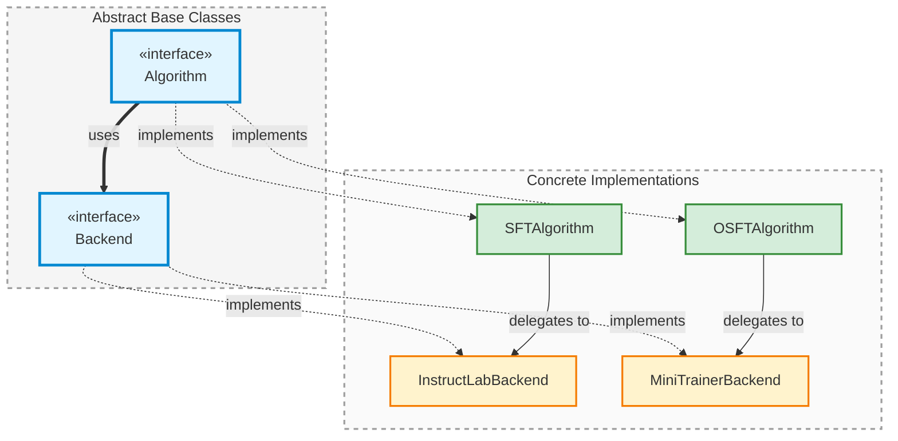

# `Backend` - Base Class for Backend Implementations

> Abstract base class that defines the interface for all backend implementations in Training Hub.

## Class Signature

```python
from training_hub import Backend
from abc import ABC, abstractmethod
from typing import Dict, Any

class Backend(ABC):
    """Base class for all backend implementations."""

    @abstractmethod
    def execute_training(self, algorithm_params: Dict[str, Any]) -> Any:
        """Execute training with the given parameters."""
        pass
```

## Overview

The `Backend` class provides a common interface for all training backend implementations. A backend is responsible for the actual execution of training using a specific framework or library (e.g., InstructLab Training, RHAI Innovation Mini-Trainer).

This separation of concerns allows:
- Algorithms to focus on high-level training logic
- Backends to handle framework-specific implementation details
- Easy addition of new backends without modifying algorithms
- Flexibility to switch between backends for the same algorithm

## Abstract Methods

All classes inheriting from `Backend` **must** implement this method:

### `execute_training(algorithm_params: Dict[str, Any]) -> Any`

Executes the training process using the backend's specific framework.

**Parameters:**
- `algorithm_params` (`Dict[str, Any]`): Dictionary containing all training parameters

**Returns:**
- `Any`: Training result (structure depends on the backend implementation)

**Raises:**
- `RuntimeError`: If training fails
- `ValueError`: If required parameters are missing or invalid

## Concrete Implementations

Training Hub provides these concrete `Backend` implementations:

| Class | Framework | Algorithm Support |
|-------|-----------|-------------------|
| [`InstructLabTrainingSFTBackend`](/api/backends/instructlab-training) | InstructLab Training | SFT |
| [`MiniTrainerOSFTBackend`](/api/backends/mini-trainer) | RHAI Innovation Mini-Trainer | OSFT |

## Examples

### Using an Existing Backend

```python
from training_hub import SFTAlgorithm, InstructLabTrainingSFTBackend

# Create backend instance
backend = InstructLabTrainingSFTBackend()

# Create algorithm with this backend
algorithm = SFTAlgorithm(backend=backend)

# Train
result = algorithm.train(
    model_path="./model",
    data_path="./data.jsonl",
    ckpt_output_dir="./checkpoints",
    num_epochs=3
)
```

### Creating a Custom Backend

```python
from training_hub import Backend
from typing import Dict, Any
import subprocess

class MyCustomBackend(Backend):
    """Custom backend implementation using a specific training framework."""

    def execute_training(self, algorithm_params: Dict[str, Any]) -> Any:
        """Execute training with custom framework."""

        # Extract parameters
        model_path = algorithm_params["model_path"]
        data_path = algorithm_params["data_path"]
        output_dir = algorithm_params["ckpt_output_dir"]

        # Prepare command for your training framework
        cmd = [
            "python", "-m", "my_training_framework.train",
            "--model", model_path,
            "--data", data_path,
            "--output", output_dir
        ]

        # Add optional parameters
        if "num_epochs" in algorithm_params:
            cmd.extend(["--epochs", str(algorithm_params["num_epochs"])])

        if "learning_rate" in algorithm_params:
            cmd.extend(["--lr", str(algorithm_params["learning_rate"])])

        # Execute training
        try:
            result = subprocess.run(cmd, check=True, capture_output=True, text=True)
            return {"status": "success", "output": result.stdout}
        except subprocess.CalledProcessError as e:
            raise RuntimeError(f"Training failed: {e.stderr}")

# Register your backend
from training_hub import AlgorithmRegistry

AlgorithmRegistry.register_backend("sft", "my_backend", MyCustomBackend)
```

### Switching Backends at Runtime

```python
from training_hub import create_algorithm

# Create SFT algorithm with default backend
sft_default = create_algorithm("sft")

# Create SFT algorithm with specific backend
sft_instructlab = create_algorithm("sft", backend_name="instructlab-training")

# Both can be used identically
result1 = sft_default.train(
    model_path="./model",
    data_path="./data.jsonl",
    ckpt_output_dir="./output1"
)

result2 = sft_instructlab.train(
    model_path="./model",
    data_path="./data.jsonl",
    ckpt_output_dir="./output2"
)
```

## Design Pattern

The `Backend` class follows the **Strategy Pattern** in combination with the [`Algorithm`](/api/classes/Algorithm) class:



**Key Design Principles:**
- Algorithms delegate training execution to backends
- Backends can be swapped without changing algorithm code
- New backends can be added by implementing the `execute_training()` method
- Follows the Open/Closed Principle: open for extension, closed for modification

## Implementation Guidelines

When creating a custom backend, consider:

1. **Parameter Validation**: Validate all required parameters in `execute_training()`
2. **Error Handling**: Raise clear errors with helpful messages
3. **Logging**: Provide informative logging for debugging
4. **Resource Cleanup**: Clean up temporary files and resources
5. **Return Consistency**: Return predictable result structures

## Implementation Notes

?> **For Users**: You typically don't need to interact with backends directly. Use the convenience functions ([`sft()`](/api/functions/sft), [`osft()`](/api/functions/osft)) which handle backend selection automatically.

?> **For Framework Developers**: When creating a custom backend, inherit from this class and implement `execute_training()`. See the [Extending the Framework Guide](/guides/extending-framework).

!> **Important**: Backend implementations should be stateless when possible. All state should be passed via `algorithm_params`.

> **Note**: Backends are responsible for handling distributed training setup (e.g., `torchrun` for multi-GPU/multi-node training).

## See Also

- [**Algorithm Class**](/api/classes/Algorithm) - Base class for training algorithms
- [**InstructLabTrainingSFTBackend**](/api/backends/instructlab-training) - InstructLab backend for SFT
- [**MiniTrainerOSFTBackend**](/api/backends/mini-trainer) - Mini-Trainer backend for OSFT
- [**AlgorithmRegistry Class**](/api/classes/AlgorithmRegistry) - Registry for backends
- [**Extending the Framework Guide**](/guides/extending-framework) - Creating custom backends

## Source

[View source on GitHub](https://github.com/Red-Hat-AI-Innovation-Team/training_hub/blob/main/src/training_hub/algorithms/__init__.py)
