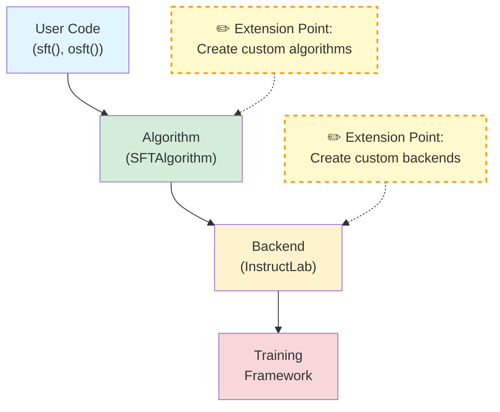

# Extending the Framework

This guide shows you how to extend Training Hub with custom algorithms and backends.

## Overview

Training Hub's pluggable architecture allows you to:

1. **Create custom algorithms** - Implement new training techniques
2. **Create custom backends** - Integrate new training frameworks
3. **Register components** - Make them available via Training Hub's API

## Architecture Review



## Creating Custom Backends

### Step 1: Understand the Backend Interface

All backends must implement the [`Backend`](/api/classes/Backend) abstract class:

```python
from training_hub import Backend
from typing import Dict, Any

class Backend(ABC):
    @abstractmethod
    def execute_training(self, algorithm_params: Dict[str, Any]) -> Any:
        """Execute training with the given parameters."""
        pass
```

### Step 2: Implement Your Backend

Create a new backend class:

```python
from training_hub import Backend
from typing import Dict, Any
import subprocess

class MyCustomBackend(Backend):
    """Custom backend using my training framework."""

    def execute_training(self, algorithm_params: Dict[str, Any]) -> Any:
        """Execute training with custom framework."""

        # Extract parameters
        model_path = algorithm_params["model_path"]
        data_path = algorithm_params["data_path"]
        output_dir = algorithm_params["ckpt_output_dir"]

        # Optional parameters
        num_epochs = algorithm_params.get("num_epochs", 3)
        learning_rate = algorithm_params.get("learning_rate", 1e-5)

        print(f"Training {model_path} with custom backend...")

        # Option 1: Call external training script
        cmd = [
            "python", "-m", "my_framework.train",
            "--model", model_path,
            "--data", data_path,
            "--output", output_dir,
            "--epochs", str(num_epochs),
            "--lr", str(learning_rate)
        ]

        result = subprocess.run(cmd, check=True, capture_output=True, text=True)

        # Option 2: Use Python API
        # from my_framework import Trainer
        # trainer = Trainer(model_path=model_path, data_path=data_path)
        # result = trainer.train(epochs=num_epochs, lr=learning_rate)

        return {
            "status": "success",
            "checkpoint_path": f"{output_dir}/final_checkpoint",
            "output": result.stdout
        }
```

### Step 3: Register Your Backend

Register with an existing algorithm:

```python
from training_hub import AlgorithmRegistry

# Register for SFT algorithm
AlgorithmRegistry.register_backend("sft", "my_backend", MyCustomBackend)

# Verify registration
print(AlgorithmRegistry.list_backends("sft"))
# Output: ['instructlab-training', 'my_backend']
```

### Step 4: Use Your Backend

```python
from training_hub import create_algorithm

# Create algorithm instance with your custom backend
algorithm = create_algorithm("sft", backend_name="my_backend")

# Use it to train
result = algorithm.train(
    model_path="./model",
    data_path="./data.jsonl",
    ckpt_output_dir="./output",
    num_epochs=5
)
```

**Note:** The convenience functions like `sft()` only work with backends that are registered at import time. For dynamically registered backends, you must use `create_algorithm()`.

## Creating Custom Algorithms

### Step 1: Understand the Algorithm Interface

All algorithms must implement the [`Algorithm`](/api/classes/Algorithm) abstract class:

```python
from training_hub import Algorithm
from typing import Dict, Type, Any

class Algorithm(ABC):
    @abstractmethod
    def train(self, **kwargs) -> Any:
        """Execute the training algorithm."""
        pass

    @abstractmethod
    def get_required_params(self) -> Dict[str, Type]:
        """Return required parameter names and types."""
        pass

    @abstractmethod
    def get_optional_params(self) -> Dict[str, Type]:
        """Return optional parameter names and types."""
        pass
```

For a complete working example of creating a custom algorithm, see the DPO example below.

## Complete Example: Custom DPO Algorithm

This example demonstrates implementing Direct Preference Optimization (DPO) as a custom algorithm with a TRL backend. We'll walk through each component step-by-step.

### Step 1: Create the Backend

The backend implements the actual training logic using the TRL library. It extracts parameters, loads the model, configures the DPO trainer, and executes training.

```python
from training_hub import Backend
from typing import Dict, Any

class DPOBackend(Backend):
    """Backend for DPO using TRL library."""

    def execute_training(self, algorithm_params: Dict[str, Any]) -> Any:
        """Execute DPO training."""
        from trl import DPOTrainer
        from transformers import AutoModelForCausalLM, AutoTokenizer

        model_path = algorithm_params["model_path"]
        data_path = algorithm_params["data_path"]
        output_dir = algorithm_params["ckpt_output_dir"]

        # Load model and tokenizer
        model = AutoModelForCausalLM.from_pretrained(model_path)
        tokenizer = AutoTokenizer.from_pretrained(model_path)

        # Load preference pairs from data_path
        # ... data loading logic ...

        # Configure DPO with beta parameter
        beta = algorithm_params.get("beta", 0.1)

        # Create and run trainer
        trainer = DPOTrainer(
            model=model,
            # ... trainer configuration ...
        )
        trainer.train()

        # Save the trained model
        trainer.save_model(output_dir)

        return {"checkpoint_path": output_dir}
```

### Step 2: Create the Algorithm Class

The algorithm class defines the interface and validates parameters before delegating to the backend. It specifies what parameters are required versus optional for DPO training.

```python
from training_hub import Algorithm
from typing import Dict, Type, Any

class DPOAlgorithm(Algorithm):
    """Direct Preference Optimization algorithm."""

    def __init__(self, backend: Backend, **kwargs):
        self.backend = backend
        self.kwargs = kwargs

    def train(self, **kwargs) -> Any:
        """Execute DPO training."""
        # Validate that all required parameters are provided
        required = self.get_required_params()
        for param in required:
            if param not in kwargs:
                raise ValueError(f"Missing required parameter: {param}")

        # Merge configuration and delegate to backend
        all_params = {**self.kwargs, **kwargs}
        return self.backend.execute_training(all_params)

    def get_required_params(self) -> Dict[str, Type]:
        return {
            "model_path": str,
            "data_path": str,  # Preference pairs
            "ckpt_output_dir": str
        }

    def get_optional_params(self) -> Dict[str, Type]:
        return {
            "beta": float,
            "num_epochs": int,
            "learning_rate": float,
            "max_length": int
        }
```

### Step 3: Register the Components

Register both the algorithm and backend with Training Hub's registry system. This makes them discoverable via `create_algorithm()` and other framework APIs.

```python
from training_hub import AlgorithmRegistry

# Register the algorithm
AlgorithmRegistry.register_algorithm("dpo", DPOAlgorithm)

# Register the backend for this algorithm
AlgorithmRegistry.register_backend("dpo", "trl", DPOBackend)
```

### Step 4: Create a Convenience Function (Optional)

A convenience function provides a simple, top-level API similar to `sft()` and `osft()`. This is optional but recommended for better user experience.

```python
from training_hub import create_algorithm
from typing import Any

def dpo(
    model_path: str,
    data_path: str,
    ckpt_output_dir: str,
    beta: float = 0.1,
    **kwargs
) -> Any:
    """Convenience function for DPO training."""
    algorithm = create_algorithm("dpo", backend_name="trl")
    return algorithm.train(
        model_path=model_path,
        data_path=data_path,
        ckpt_output_dir=ckpt_output_dir,
        beta=beta,
        **kwargs
    )
```

### Step 5: Use Your Custom Algorithm

Once registered, you can use your custom algorithm either through the convenience function or via `create_algorithm()`.

```python
# Using the convenience function
result = dpo(
    model_path="./base_model",
    data_path="./preference_data.jsonl",
    ckpt_output_dir="./dpo_model",
    beta=0.1,
    num_epochs=3
)

# Or using create_algorithm directly
from training_hub import create_algorithm

algorithm = create_algorithm("dpo", backend_name="trl")
result = algorithm.train(
    model_path="./base_model",
    data_path="./preference_data.jsonl",
    ckpt_output_dir="./dpo_model",
    beta=0.1,
    num_epochs=3
)
```

## Best Practices

### 1. Error Handling

Provide clear error messages:

```python
class MyBackend(Backend):
    def execute_training(self, algorithm_params: Dict[str, Any]) -> Any:
        try:
            # Training logic
            pass
        except FileNotFoundError as e:
            raise FileNotFoundError(f"Model or data not found: {e}")
        except RuntimeError as e:
            raise RuntimeError(f"Training failed: {e}")
```

### 2. Parameter Validation

Validate parameters before training:

```python
def train(self, **kwargs) -> Any:
    # Check required parameters
    for param in self.get_required_params():
        if param not in kwargs:
            raise ValueError(f"Missing required parameter: {param}")

    # Validate types
    if "learning_rate" in kwargs:
        lr = kwargs["learning_rate"]
        if not isinstance(lr, (int, float)) or lr <= 0:
            raise ValueError(f"learning_rate must be positive, got {lr}")

    # Execute training
    return self.backend.execute_training(kwargs)
```

### 3. Logging

Add informative logging:

```python
import logging

class MyBackend(Backend):
    def __init__(self):
        self.logger = logging.getLogger(__name__)

    def execute_training(self, algorithm_params: Dict[str, Any]) -> Any:
        self.logger.info(f"Starting training with {len(algorithm_params)} parameters")
        # Training logic
        self.logger.info("Training completed successfully")
```

### 4. Return Consistency

Return predictable structures:

```python
def execute_training(self, algorithm_params: Dict[str, Any]) -> Any:
    # Training logic

    return {
        "status": "success",
        "checkpoint_path": output_path,
        "metrics": {
            "final_loss": loss,
            "epochs": num_epochs
        }
    }
```

## Packaging and Distribution

### Create a Package

```
my_training_extension/
├── setup.py
├── README.md
├── my_extension/
│   ├── __init__.py
│   ├── algorithm.py
│   └── backend.py
└── tests/
    └── test_extension.py
```

**setup.py:**

```python
from setuptools import setup, find_packages

setup(
    name="my-training-extension",
    version="0.1.0",
    packages=find_packages(),
    install_requires=[
        "training-hub>=0.1.0",
        # Your dependencies
    ]
)
```

**my_extension/__init__.py:**

```python
from training_hub import AlgorithmRegistry
from .algorithm import MyAlgorithm
from .backend import MyBackend

# Auto-register on import
AlgorithmRegistry.register_algorithm("my_algo", MyAlgorithm)
AlgorithmRegistry.register_backend("my_algo", "my_backend", MyBackend)

__all__ = ["MyAlgorithm", "MyBackend"]
```

### Usage

```bash
pip install my-training-extension
```

```python
import my_extension  # Auto-registers
from training_hub import create_algorithm

algo = create_algorithm("my_algo")
```

## See Also

- [**Algorithm Class**](/api/classes/Algorithm) - Algorithm interface
- [**Backend Class**](/api/classes/Backend) - Backend interface
- [**AlgorithmRegistry**](/api/classes/AlgorithmRegistry) - Registration system
- [**SFTAlgorithm Source**](/api/classes/SFTAlgorithm) - Example algorithm implementation
- [**InstructLab Backend Source**](/api/backends/instructlab-training) - Example backend implementation
