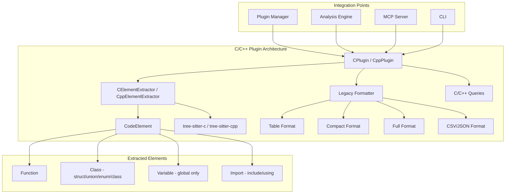

# Design: C/C++ Language Plugins

## Overview

Implements `CPlugin` and `CppPlugin` following the existing `languages/*_plugin.py` pattern. Each plugin contains an element extractor and `analyze_file` method, registered via entry points. Follows Rust/Python plugin structure with unified `AnalysisResult` output.

## Architecture



## Components

- `tree_sitter_analyzer/languages/c_plugin.py` - C language plugin
- `tree_sitter_analyzer/languages/cpp_plugin.py` - C++ language plugin
- `tree_sitter_analyzer/queries/c.py` - C tree-sitter queries
- `tree_sitter_analyzer/queries/cpp.py` - C++ tree-sitter queries

## Plugin Interface

- `get_language_name()`: Returns `"c"` or `"cpp"`
- `get_file_extensions()`: C `['.c', '.h']`; C++ `['.cpp', '.cxx', '.cc', '.hpp', '.hxx', '.hh']`
- `create_extractor()`: Returns respective `ElementExtractor`
- `get_tree_sitter_language()`: Wraps `tree_sitter_{lang}.language()` with caching
- `analyze_file(file_path, request)`: Reads file, parses, aggregates elements

## Element Extractor Design

### Common Features

- **BFS Identifier Search**: Uses breadth-first search (`collections.deque`) to find identifiers, ensuring function/type names are found before parameter names
- **Node Text Caching**: Caches extracted text by node ID for performance
- **Encoding Support**: Uses `safe_encode` and `extract_text_slice` for proper UTF-8 handling

### C Element Extraction Rules

| Element | AST Node Type | Extraction Logic |
|---------|---------------|------------------|
| Function | `function_definition` | Name from `declarator` child's first `identifier` (BFS) |
| Struct | `struct_specifier` | Only if has `field_declaration_list` body and parent is not `declaration` |
| Union | `union_specifier` | Only if has `field_declaration_list` body and parent is not `declaration` |
| Enum | `enum_specifier` | Only if has `enumerator_list` body and parent is not `declaration` |
| Variable | `declaration` | Only if parent is `translation_unit` (global scope) |
| Import | `preproc_include` | Full include statement as raw text |

### C++ Element Extraction Rules

| Element | AST Node Type | Extraction Logic |
|---------|---------------|------------------|
| Function | `function_definition`, `function_declaration` | Name from first `identifier` or `field_identifier` (BFS) |
| Class | `class_specifier` | Only if has `field_declaration_list` body and parent is not `declaration` |
| Struct | `struct_specifier` | Only if has body and parent is not `declaration` |
| Variable | `declaration` | Only if parent is `translation_unit`, `namespace_definition`, or `declaration_list` |
| Import (include) | `preproc_include` | Full include statement |
| Import (using) | `using_declaration` | Full using statement |
| Import (namespace) | `namespace_definition` | Namespace name only (not full body) |

### Filtering Rules

1. **Type Specifiers in Declarations**: Skip `struct_specifier`/`union_specifier`/`class_specifier` when parent is `declaration` (these are type references, not definitions)
2. **Local Variables**: Skip variables when parent is not top-level scope
3. **Type References**: Skip type specifiers without bodies (forward declarations or type usage)

## Error Handling

### Graceful Degradation Strategy

```python
try:
    import tree_sitter_c as ts_c
    C_AVAILABLE = True
except ImportError:
    C_AVAILABLE = False
    # Plugin will return error result when analyze_file is called
```

### Error Categories

| Category | Handling | User Message |
|----------|----------|--------------|
| Import Error | Graceful degradation | "C/C++ support not available: tree-sitter-c/cpp not installed" |
| Parse Error | Return error result | "Failed to parse C/C++ file" |
| Encoding Error | Use safe_encode | Handled internally with fallback |
| Empty File | Return empty result | (No error) |

- `get_tree_sitter_language()`: Catches import/wrapper exceptions, returns `None`
- `analyze_file()`: Returns `AnalysisResult` with error info when language unavailable or parse fails
- `_traverse_and_extract()`: Individual element extraction failures are logged but don't stop processing

## Query Modules

### C Queries (`queries/c.py`)

- `function`: Function definitions
- `struct`, `union`, `enum`: Type definitions
- `variable`: Variable declarations
- `import`: Preprocessor include directives
- Common aliases: `functions`, `classes`, `variables`, `imports`

### C++ Queries (`queries/cpp.py`)

- `function`, `method`: Function/method definitions
- `class`, `struct`: Type definitions
- `namespace`: Namespace definitions
- `variable`: Variable declarations
- `import`: Include and using declarations
- Common aliases: `functions`, `methods`, `classes`, `variables`, `imports`

## Dependencies and Registration

### Dependencies (`pyproject.toml`)

```toml
dependencies = [
    "tree-sitter-c>=0.20.0,<0.25.0",   # Required for C support
    "tree-sitter-cpp>=0.23.4,<0.25.0", # Required for C++ support
]
```

### Entry Points

```toml
[project.entry-points."tree_sitter_analyzer.plugins"]
c = "tree_sitter_analyzer.languages.c_plugin:CPlugin"
cpp = "tree_sitter_analyzer.languages.cpp_plugin:CppPlugin"
```

### Formatter Configuration

Both C and C++ use the legacy formatting strategy:

```python
"c": {"table": "legacy", "compact": "legacy", "full": "legacy", "csv": "legacy", "json": "legacy"},
"cpp": {"table": "legacy", "compact": "legacy", "full": "legacy", "csv": "legacy", "json": "legacy"},
```

## Performance Considerations

- Language object caching via `_cached_language` to avoid repeated imports
- Node text caching via `_node_text_cache` dictionary
- Single-pass traversal for element extraction

## Testing Strategy

### Test Categories

1. **Unit Tests** (`tests/test_c/test_c_plugin.py`, `tests/test_cpp/test_cpp_plugin.py`)
   - Plugin metadata verification (language name, extensions)
   - Element extractor coverage (all element types implemented)
   - analyze_file execution without errors

2. **Golden Master Tests** (`tests/test_golden_master_regression.py`)
   - Output stability across versions
   - Full/compact/CSV format verification
   - Regression prevention

3. **Integration Tests**
   - CLI integration with C/C++ files
   - MCP tool compatibility
   - Plugin manager registration

### Sample Test Files

- `examples/sample.c`: Comprehensive C constructs
- `examples/sample.cpp`: Comprehensive C++ constructs

