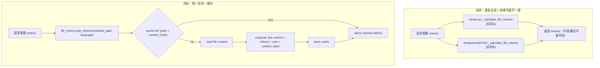
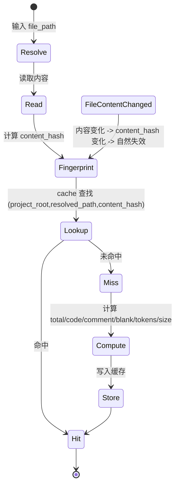

# 设计方案（Phase 1 / 要件3）：文件 Metrics 计算的统一与缓存（Best Practice）

## 目标

- **统一实现**：把文件 metrics 计算逻辑收敛到单一模块，避免 `server.py` 与 `analyze_scale_tool.py` 的重复实现与不一致。
- **统一字段**：输出必须包含：
  - `total_lines` / `code_lines` / `comment_lines` / `blank_lines` / `estimated_tokens` / `file_size_bytes`
- **可缓存且可失效**：同一文件多次请求时返回缓存；文件内容变化时必须失效缓存。
- **跨平台稳定**：避免仅依赖 `mtime` 造成的误命中（Windows/macOS/Linux、文件系统粒度差异等）。

## 现状（事实依据）

当前仓库中存在两套 metrics 计算实现：

- `tree_sitter_analyzer/mcp/server.py`：`_calculate_file_metrics(file_path, language)`  
  - 更偏“准确行分类”（注释规则较完整，且会用 language 分支处理 Python/SQL/HTML 等）。
  - 只返回行统计：`total_lines/code_lines/comment_lines/blank_lines`（不含 tokens、file size）。
- `tree_sitter_analyzer/mcp/tools/analyze_scale_tool.py`：`_calculate_file_metrics(file_path)`  
  - 返回行统计 + `estimated_tokens/file_size_bytes`（满足要件字段更接近）。
  - 但注释行判定更粗略（基本按 `// /* *` 等前缀）。

结果：同一文件在不同入口得到的 metrics **可能不一致**，且存在重复读取/重复计算。

## Best Practice：统一模块 + 以 content hash 作为缓存指纹

### 核心思想

- 统一入口：创建 `mcp/utils/file_metrics.py`（仓库实际路径应为 `tree_sitter_analyzer/mcp/utils/file_metrics.py`）。
- 缓存 key：`(project_root, resolved_path, content_hash)` 或等价字符串编码。
- 指纹来源：**content_hash**（必要时可用 `file_size_bytes` 辅助）  
  - 优点：内容变更必失效；跨平台一致。
  - 代价：需要读取内容/计算 hash（但 metrics 计算本身也需要读取内容；总体不额外增加 IO）。

## Mermaid：流程图（现状 vs 目标）

## Mermaid：数据/状态图（缓存与失效）

## 统一实现的输出规范（Schema）

统一模块返回：

- `total_lines: int`
- `code_lines: int`
- `comment_lines: int`
- `blank_lines: int`
- `estimated_tokens: int`
- `file_size_bytes: int`
- `content_hash: str`（用于缓存与调试；对外可选暴露）

> 注：要件没有要求返回 `content_hash`，但建议内部保留用于缓存与诊断。

### 字段命名映射（避免调用方不一致）

当前代码中不同入口对“行数”字段命名并不统一（例如 server 侧输出里出现 `lines_total/lines_code/...`，tool 侧使用 `total_lines/code_lines/...`）。

Phase 1 统一模块的**内部标准**建议使用要件中的字段名：

- `total_lines/code_lines/comment_lines/blank_lines/estimated_tokens/file_size_bytes`

各调用方（server/tool）如需保持既有对外结构，可在组装响应时做**薄映射**，但**不要再各自计算**。

## 行分类规则（建议）

以 `server.py` 现有实现为基准，统一到一个“更准确”的版本：

- 处理：
  - 末尾空行的 `total_lines` 修正
  - 多行注释状态（如 `/* ... */`、`<!-- ... -->`）
  - 语言相关的单行注释（Python `#`、SQL `--` 等）
- 保证恒等关系：  
  \[
  total\_lines = code\_lines + comment\_lines + blank\_lines
  \]

## Token 估算规则（建议）

为保持行为稳定，Phase 1 建议沿用现有 `AnalyzeScaleTool` 的估算方式（regex 分词计数），并在统一模块内实现：

- `estimated_tokens = len([t for t in re.findall(...) if t.strip()])`

> 注：这是“估算”，不追求绝对精确，但要求在不同入口保持一致。

## 缓存位置与生命周期（Phase 1）

Phase 1 推荐使用现有 `tree_sitter_analyzer/mcp/utils/shared_cache.py` 的 `SharedCache._metrics_cache`：

- key：包含 `project_root` + `resolved_path` + `content_hash`
- value：上面的 metrics dict（不含临时对象）
- 失效：
  - **内容变化**：content_hash 变化 -> 自然 miss
  - **project_root 变化**：`set_project_path` 时 clear（与要件1一致）

### 缓存容量（风险提示）

Phase 1 允许先做“无上限 dict 缓存”（与现有 `SharedCache` 形态一致），但应在文档中明确风险：

- 大项目 + 长时间运行可能导致缓存增长

后续 Phase 2/4（SharedToolCache/LRU）可引入：

- LRU/容量上限
- 或按语言/文件大小做分级缓存策略

## 影响范围（实施层面指引）

- 新增：`tree_sitter_analyzer/mcp/utils/file_metrics.py`
- 修改：
  - `tree_sitter_analyzer/mcp/server.py`：删除/替换 `_calculate_file_metrics`，改调用新模块
  - `tree_sitter_analyzer/mcp/tools/analyze_scale_tool.py`：删除/替换 `_calculate_file_metrics`，改调用新模块
- 测试：
  - 覆盖“同一文件多次调用命中缓存”
  - 覆盖“文件内容变化 -> hash 变化 -> 缓存失效”

## 错误处理策略（建议）

统一模块在读取文件失败时应遵循现有行为（保持兼容）：

- **推荐**：抛出异常（由上层 tool/server 统一捕获并返回错误）
- **仅在兼容性要求强时**：返回全 0 的 metrics（但这会掩盖真实问题，不建议作为默认）

## 受け入れ基準（对齐 requirements.md）

1. ファイルメトリクスを算出する場合、システムは単一の統合実装を使用しなければならない  
2. 同一ファイルのメトリクスが複数回要求された場合、システムはキャッシュ済み結果を返さなければならない  
3. メトリクス算出では、`total_lines` / `code_lines` / `comment_lines` / `blank_lines` / `estimated_tokens` / `file_size_bytes` を必ず含めなければならない  
4. ファイル内容が変更された場合、システムはキャッシュされたメトリクスを無効化しなければならない（content_hash の変化で担保）

