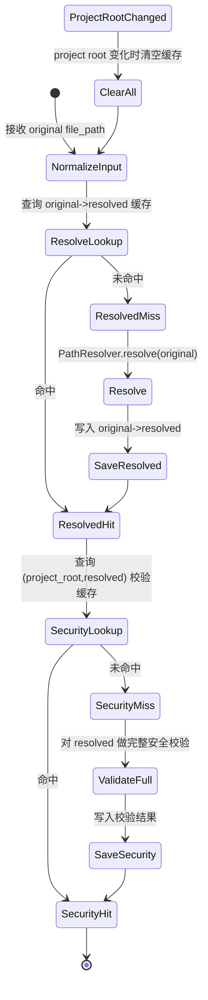
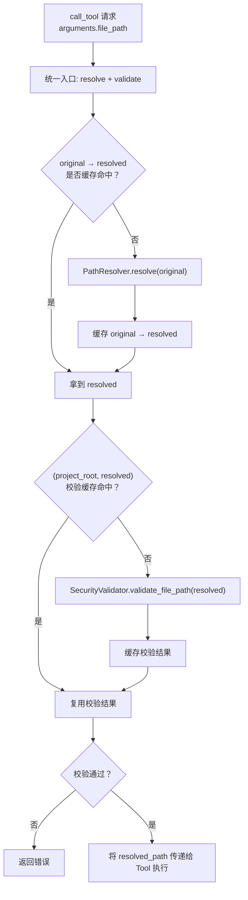

# 设计方案（Phase 1 / 要件1）：重複セキュリティ検証の排除（安全校验去重与缓存）

## 目标与范围

### 目标

- **减少同一文件路径在同一会话内被重复执行的安全校验**，降低 MCP 工具整体开销。
- **不降低安全性**：必须仍然保证 project boundary、path traversal、防符号链接/Windows junction/reparse point 等检查不会被绕过。

### 范围（Phase 1）

- 覆盖 `arguments.file_path` 相关的 tool（例如 `check_code_scale` 等）。
- 引入/完善会话级缓存：安全校验结果缓存 + original->resolved 的映射缓存。
- 明确 cache 失效条件：当 project root 变更时必须全部失效。

## 背景：现状问题（为何会“重复验证”）

当前一次请求中，安全校验可能被重复执行多次：

- **Server 层**：`tree_sitter_analyzer/mcp/server.py` 在 `handle_call_tool` 对 `arguments["file_path"]` 做一次 `SecurityValidator.validate_file_path(...)`。
- **Tool 层**：例如 `tree_sitter_analyzer/mcp/tools/analyze_scale_tool.py`：
  - 对原始 `file_path` 先校验一次（“BEFORE path resolution”）。
  - `PathResolver.resolve(file_path)` 后，对 `resolved_file_path` 再校验一次（“Additional security validation on resolved path”）。

这会导致“同一最终目标文件”在一个请求链路内被校验 2-3 次，且跨工具时重复更明显。

## 设计原则（最佳实践）

1. **单一入口**：尽量在 server/pipeline 层完成“路径解析 + 完整安全校验”，tool 内避免重复做同一件事。
2. **分层校验**：
   - **轻量校验（original input）**：纯字符串、低成本检查（如空字节、明显 `..`、长度/字符集）。
   - **完整校验（resolved target）**：依赖 filesystem/真实路径与 boundary 的关键安全检查（包含 symlink/junction/reparse point、project boundary）。
3. **缓存必须可失效**：project root 变化时必须清空缓存，避免跨项目污染。
4. **缓存键必须包含边界信息**：至少 `(project_root, resolved_path)`，确保同一路径字符串在不同项目根下不会误命中。
5. **安全优先**：任何不确定（无法确认 symlink/junction 状态、异常）应倾向于 **不缓存或判定失败**，并保持原有错误行为。

## 关键定义

### “同一会话（same session）”

Phase 1 推荐定义为：

- **同一 MCP server 进程生命周期内**（即同一个 Python 进程运行期间）。

> 注：如果后续引入真正的 client session 概念，可进一步细化为“同一 client session id”，但 Phase 1 不要求。

### “resolved path”

- 指 `PathResolver.resolve(original_path)` 得到的 **绝对路径**（字符串）。
- 设计要求：同一 original 的 resolved 结果应可缓存，避免重复 resolve。

## 方案概述

### 数据结构（缓存）

复用现有实现：`tree_sitter_analyzer/mcp/utils/shared_cache.py` 已提供 `SharedCache`：

- `_security_cache: dict[str, (bool, str)]`：用于保存安全校验结果。
- `_resolved_paths: dict[str, str]`：用于保存 original -> resolved 的映射。

本设计要求在 Phase 1 将其用于 **安全校验去重**：

- `resolved_paths[(project_root, original)] -> resolved`
- `security_cache[(project_root, resolved)] -> (is_valid, error_msg)`

> 说明：当前 `SharedCache` 的 key 是 `str`，Phase 1 可用字符串拼接/结构化编码实现复合 key，例如：`f"{project_root}::{resolved_path}"`。

### 数据/状态图（给初学者）

### 执行流程（目标形态）

## 受け入れ基準（建议版，避免歧义）

为保持与 `requirements.md` 的风格一致，以下用日式规范句表达：

1. **ファイルパスを検証した場合、システムは同一プロセス内の後続リクエストのために検証結果をキャッシュしなければならない**  
   - キャッシュキーは少なくとも `(project_root, resolved_path)` を含まなければならない
2. **解決済み（resolved）パスを検証した場合、システムは同一の最終 resolved 目標に対して重複して“完全な検証”を実行してはならない**  
   - ただし original 入力に対する軽量なサニタイズ/形式検査は許可される（安全性維持のため）
3. **複数のツールが同一ファイルへアクセスする場合、システムはキャッシュ済みの検証結果を再利用しなければならない**
4. **プロジェクトパスが変更された場合、システムはキャッシュされた検証結果をすべて無効化しなければならない**

## 影响范围与拟改动点（实现层面指引）

> 本节是“设计对实现的约束与建议”，实际代码改动将放到后续 task.md 与开发阶段。

### 1) Server 层（推荐）

- 在 `server.py` 中对 `file_path` 的校验应尽量基于 **resolved_path**，并通过 shared cache 去重。
- Tool 执行前，将 `arguments["file_path"]` 规范化为 **resolved_path**（或新增字段如 `resolved_file_path`），以便 tool 层不再重复 resolve/validate。

### 1.1) “轻量校验 vs 完整校验”如何落地（关键）

为避免要件1.2 的歧义（“resolved 后不再验证 original”）导致安全回退，Phase 1 推荐明确分层：

- **轻量校验（original input）**：只做“字符串层”的廉价检查，目的在于快速拒绝明显恶意输入，同时避免依赖 filesystem 的昂贵检查重复发生。
  - 包含：空值/类型、null byte、Windows drive letter 跨平台限制、path traversal（如 `..`）等。
- **完整校验（resolved target）**：对最终将被访问的目标路径做完整安全校验（project boundary + symlink/junction/reparse point 等）。

实现建议（两选一，优先选 A）：

- **A（推荐）**：在 `SecurityValidator` 增加轻量校验方法（例如 `validate_path_input_only(...)`），并在 server/pipeline 统一调用：
  - original 走轻量校验
  - resolved 走 `validate_file_path(...)`（完整校验）
- **B（最小改动）**：不引入新 API，只对现有 `validate_file_path(...)` 做缓存封装，确保“original 校验”和“resolved 校验”都只做一次；并在文档/代码中明确：original 校验属于“轻量校验等价物”（仍是完整校验，但被缓存去重）。

### 2) Tool 层（Phase 1 最小化策略）

- 在 Phase 1 可先在高频 tool（如 `AnalyzeScaleTool`）移除“第二次/第三次”重复校验（以缓存复用替代），但必须确保安全性不回退。
- 更推荐的最终形态：tool 只做“存在性检查/业务检查”，不再重复做安全校验。

### 3) Base 工具抽象层（BaseMCPTool）

- 在 `BaseMCPTool` 添加一个通用 helper（例如 `resolve_and_validate_file_path(...)`）：
  - 内部使用 `SharedCache`
  - 输出 resolved_path
  - 统一负责 cache key 与失效策略（project_root 变化时 clear）

### 4) 路径命名对齐（避免“改错文件”）

`requirements.md` 的“対象ファイル”里写的是 `mcp/...`（不带包前缀）；但当前仓库实际路径为 `tree_sitter_analyzer/mcp/...`。

Phase 1 的实际改动目标（以仓库现状为准）应是：

- `tree_sitter_analyzer/mcp/tools/base_tool.py`
- `tree_sitter_analyzer/mcp/tools/analyze_scale_tool.py`
- `tree_sitter_analyzer/mcp/server.py`

## 失效策略

- **当 project_root 改变（set_project_path 被调用）时**：
  - 必须调用 `SharedCache.clear()`（或等价机制）清空所有缓存项。
- 可选：对 security 校验失败的结果设置短 TTL（Phase 1 可不实现 TTL，但应在设计中预留）。

## 风险与对策（Phase 1）

- **风险：缓存导致安全性回退**  
  - 对策：缓存只复用“对同一 (project_root,resolved_path) 的完整校验结果”，不跳过关键校验；任何异常情况不缓存并按原逻辑报错/失败。
- **风险：key 设计不当导致跨项目污染**  
  - 对策：key 必须包含 project_root；project_root 变化必须 clear。
- **风险：多线程/并发访问**  
  - 对策：Phase 1 如果运行模型为单线程可先接受；否则需在 `SharedCache` 内加锁（后续 task.md 决定是否纳入 Phase 1）。

## 验证方式（建议）

- 增加日志/计数（后续实现时）：
  - cache hit/miss（security、resolve）
  - 每次请求的 validate 次数
- 以实际工作流对比：
  - 优化前后同一请求链路中 `validate_file_path` 调用次数应明显下降

