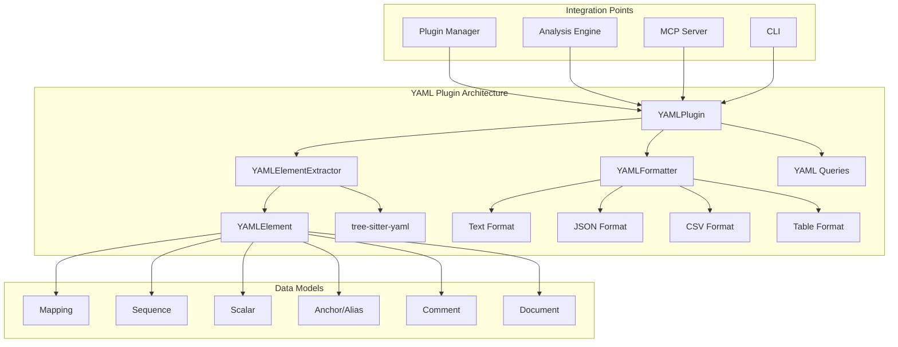

# Design Document: YAML Language Support

## Overview

本設計は、tree-sitter-analyzerにYAML言語サポートを追加するための詳細な技術設計を提供します。tree-sitter-yaml（v0.7.2）を使用し、既存のプラグインアーキテクチャ（CSS、Markdown等）に従った実装を行います。

SQL言語サポートで得た教訓（クロスプラットフォーム互換性、エラーハンドリング、言語分離）を活かし、他の言語プラグインに影響を与えない堅牢な実装を目指します。

## Architecture



## Components and Interfaces

### 1. YAMLPlugin (`tree_sitter_analyzer/languages/yaml_plugin.py`)

```python
class YAMLPlugin(LanguagePlugin):
    """YAML language plugin using tree-sitter-yaml"""
    
    def get_language_name(self) -> str:
        return "yaml"
    
    def get_file_extensions(self) -> list[str]:
        return [".yaml", ".yml"]
    
    def create_extractor(self) -> ElementExtractor:
        return YAMLElementExtractor()
    
    def get_supported_element_types(self) -> list[str]:
        return ["mapping", "sequence", "scalar", "anchor", "alias", "comment", "document"]
    
    def get_queries(self) -> dict[str, str]:
        from ..queries.yaml import YAML_QUERIES
        return YAML_QUERIES
    
    async def analyze_file(self, file_path: str, request: AnalysisRequest) -> AnalysisResult:
        # Implementation with graceful degradation
        pass
```

### 2. YAMLElementExtractor (`tree_sitter_analyzer/languages/yaml_plugin.py`)

```python
class YAMLElementExtractor(ElementExtractor):
    """YAML-specific element extractor"""
    
    def extract_functions(self, tree: "tree_sitter.Tree", source_code: str) -> list[CodeElement]:
        # YAML doesn't have functions, return empty
        return []
    
    def extract_classes(self, tree: "tree_sitter.Tree", source_code: str) -> list[CodeElement]:
        # YAML doesn't have classes, return empty
        return []
    
    def extract_yaml_elements(self, tree: "tree_sitter.Tree", source_code: str) -> list[YAMLElement]:
        # Main extraction method
        pass
    
    def extract_mappings(self, tree: "tree_sitter.Tree", source_code: str) -> list[YAMLElement]:
        pass
    
    def extract_sequences(self, tree: "tree_sitter.Tree", source_code: str) -> list[YAMLElement]:
        pass
    
    def extract_scalars(self, tree: "tree_sitter.Tree", source_code: str) -> list[YAMLElement]:
        pass
    
    def extract_anchors(self, tree: "tree_sitter.Tree", source_code: str) -> list[YAMLElement]:
        pass
    
    def extract_comments(self, tree: "tree_sitter.Tree", source_code: str) -> list[YAMLElement]:
        pass
    
    def extract_documents(self, tree: "tree_sitter.Tree", source_code: str) -> list[YAMLElement]:
        pass
```

### 3. YAMLElement (`tree_sitter_analyzer/models.py` extension)

```python
class YAMLElement(CodeElement):
    """YAML-specific code element"""
    
    def __init__(
        self,
        name: str,
        start_line: int,
        end_line: int,
        raw_text: str,
        language: str = "yaml",
        element_type: str = "yaml",
        key: str | None = None,
        value: str | None = None,  # スカラー値のみ格納、複合構造はNone
        value_type: str | None = None,  # string, number, boolean, null, mapping, sequence
        anchor_name: str | None = None,
        alias_target: str | None = None,  # エイリアスの参照先名（展開しない）
        nesting_level: int = 0,  # AST上の論理的な深さ（インデントではない）
        document_index: int = 0,
        child_count: int | None = None,  # 複合構造の子要素数
        **kwargs
    ):
        super().__init__(...)
```

### 4. YAMLFormatter (`tree_sitter_analyzer/formatters/yaml_formatter.py`)

```python
class YAMLFormatter(BaseFormatter):
    """Formatter specialized for YAML documents"""
    
    def format_summary(self, analysis_result: dict) -> str:
        pass
    
    def format_structure(self, analysis_result: dict) -> str:
        pass
    
    def format_advanced(self, analysis_result: dict, output_format: str = "json") -> str:
        pass
    
    def format_table(self, analysis_result: dict, table_type: str = "full") -> str:
        pass
```

### 5. YAML Queries (`tree_sitter_analyzer/queries/yaml.py`)

```python
YAML_QUERIES: dict[str, str] = {
    "document": "(document) @document",
    "stream": "(stream) @stream",
    "block_mapping": "(block_mapping) @block_mapping",
    "block_mapping_pair": "(block_mapping_pair) @block_mapping_pair",
    "block_sequence": "(block_sequence) @block_sequence",
    "block_sequence_item": "(block_sequence_item) @block_sequence_item",
    "flow_mapping": "(flow_mapping) @flow_mapping",
    "flow_sequence": "(flow_sequence) @flow_sequence",
    "plain_scalar": "(plain_scalar) @plain_scalar",
    "double_quote_scalar": "(double_quote_scalar) @double_quote_scalar",
    "single_quote_scalar": "(single_quote_scalar) @single_quote_scalar",
    "block_scalar": "(block_scalar) @block_scalar",
    "anchor": "(anchor) @anchor",
    "alias": "(alias) @alias",
    "tag": "(tag) @tag",
    "comment": "(comment) @comment",
    # ... more queries
}
```

## Data Models

### YAMLElement Types

| Type | Description | Attributes |
|------|-------------|------------|
| `mapping` | Key-value pair | key, value (scalar only), value_type, child_count |
| `sequence` | List/array | child_count |
| `scalar` | Single value | value, value_type |
| `anchor` | Reference definition | anchor_name |
| `alias` | Reference usage | alias_target (名前のみ、展開しない) |
| `comment` | Comment text | text |
| `document` | YAML document | document_index, child_count |

### Design Decisions

#### 1. 複合構造における `value` の扱い
- **方針**: 複合構造（mapping, sequence）の場合、`value` は `None` とし、`child_count` で子要素数を保持
- **理由**: 循環参照やメモリ効率の問題を回避し、tree-sitterの処理モデルと整合性を保つ
- **子要素**: フラットなリストとして抽出され、`nesting_level` で階層を表現

#### 2. アンカーとエイリアスの解決
- **方針**: 静的な特定のみ行い、参照先の値を**展開（Resolve）しない**
- **理由**: セキュリティ（Billion Laughs攻撃回避）と静的解析の目的に適合
- **実装**: `alias_target` には参照先のアンカー名のみを格納

#### 3. `nesting_level` の計算
- **方針**: インデントの深さではなく、**AST上の論理的な深さ**を使用
- **理由**: Flow style (`{ key: val }`) と Block style が混在した場合でも一貫性を保つ

### Value Types

| Type | Examples |
|------|----------|
| `string` | "hello", 'world', plain text |
| `number` | 42, 3.14, 1e10 |
| `boolean` | true, false, yes, no |
| `null` | null, ~, (empty) |

## Correctness Properties

*A property is a characteristic or behavior that should hold true across all valid executions of a system-essentially, a formal statement about what the system should do. Properties serve as the bridge between human-readable specifications and machine-verifiable correctness guarantees.*

### Property Reflection

After analyzing the acceptance criteria, the following redundancies were identified:
- Properties 2.4 and 2.5 (line numbers and raw_text) can be combined into a single "element metadata completeness" property
- Properties 5.2, 5.3, 5.4 (query for mappings, sequences, keys) can be combined into a single "query result correctness" property
- Properties 1.2, 1.3, 1.4 (mappings, sequences, nested) can be tested together as "structure extraction completeness"

### Final Properties

**Property 1: Parsing Round-Trip Consistency**
*For any* valid YAML content, parsing and extracting elements SHALL produce consistent results across multiple invocations.
**Validates: Requirements 1.1**

**Property 2: Structure Extraction Completeness**
*For any* YAML file containing mappings, sequences, or nested structures, the extractor SHALL extract all structural elements with correct hierarchy information.
**Validates: Requirements 1.2, 1.3, 1.4**

**Property 3: Multi-Document Separation**
*For any* YAML file containing multiple documents (separated by ---), the extractor SHALL extract each document as a separate element with correct document_index.
**Validates: Requirements 1.5**

**Property 4: Element Metadata Completeness**
*For any* extracted YAML element, the element SHALL have accurate start_line, end_line, and raw_text that matches the source content.
**Validates: Requirements 2.4, 2.5**

**Property 5: Scalar Type Identification**
*For any* YAML scalar value, the extractor SHALL correctly identify its type (string, number, boolean, null).
**Validates: Requirements 2.1**

**Property 6: Anchor and Alias Detection**
*For any* YAML file containing anchors (&name) and aliases (*name), the extractor SHALL identify all anchors and aliases with their names.
**Validates: Requirements 2.2**

**Property 7: File Extension Selection**
*For any* file with .yaml or .yml extension, the analyzer SHALL automatically select the YAMLPlugin for processing.
**Validates: Requirements 3.2**

**Property 8: Language Isolation**
*For any* analysis session using the YAMLPlugin, other language plugins (Java, Python, etc.) SHALL continue to function correctly without interference.
**Validates: Requirements 3.5**

**Property 9: Output Schema Consistency**
*For any* YAML analysis result, the output SHALL conform to the standard AnalysisResult schema with all required fields present.
**Validates: Requirements 4.1, 4.2**

**Property 10: Output Format Support**
*For any* YAML analysis result, formatting to text, json, and csv SHALL produce valid output in each respective format.
**Validates: Requirements 4.3, 4.5**

**Property 11: Query Result Correctness**
*For any* tree-sitter query executed on YAML content, the results SHALL contain only elements matching the query pattern.
**Validates: Requirements 5.1, 5.2, 5.3, 5.4**

**Property 12: Error Handling Robustness**
*For any* invalid YAML syntax, the plugin SHALL return an error result with a descriptive message without crashing.
**Validates: Requirements 6.1**

**Property 13: Encoding Resilience**
*For any* YAML file with non-UTF-8 encoding, the plugin SHALL attempt multiple encodings before failing.
**Validates: Requirements 6.2**

## Error Handling

### Graceful Degradation Strategy

```python
try:
    import tree_sitter_yaml as ts_yaml
    YAML_AVAILABLE = True
except ImportError:
    YAML_AVAILABLE = False
    log_warning("tree-sitter-yaml not installed, YAML support disabled")
```

### Error Categories

| Category | Handling | User Message |
|----------|----------|--------------|
| Import Error | Graceful degradation | "YAML support not available" |
| Parse Error | Return error result | "Invalid YAML syntax at line X" |
| Encoding Error | Try multiple encodings | "Unable to decode file" |
| Empty File | Return empty result | (No error) |

## Testing Strategy

### Dual Testing Approach

本実装では、ユニットテストとプロパティベーステストの両方を使用します：

- **ユニットテスト**: 特定の例、エッジケース、エラー条件を検証
- **プロパティベーステスト**: すべての入力に対して普遍的なプロパティを検証

### Property-Based Testing Framework

- **Library**: Hypothesis (Python)
- **Minimum Iterations**: 100 per property
- **Test Annotation Format**: `**Feature: yaml-language-support, Property {number}: {property_text}**`

### Test Categories

1. **Unit Tests**
   - Basic parsing of simple YAML
   - Each element type extraction
   - Error handling scenarios
   - Edge cases (empty file, comments only)

2. **Property-Based Tests**
   - Parsing consistency (Property 1)
   - Structure extraction (Property 2)
   - Multi-document handling (Property 3)
   - Element metadata (Property 4)
   - Type identification (Property 5)
   - Anchor/alias detection (Property 6)
   - File extension selection (Property 7)
   - Language isolation (Property 8)
   - Output schema (Property 9)
   - Format support (Property 10)
   - Query correctness (Property 11)
   - Error handling (Property 12)
   - Encoding resilience (Property 13)

3. **Integration Tests**
   - MCP tool compatibility
   - CLI command integration
   - Plugin manager registration

4. **Golden Master Tests**
   - Output stability for sample YAML files
   - Regression prevention

### Sample Test Fixtures

```yaml
# examples/sample_config.yaml
---
# Application configuration
app:
  name: "MyApp"
  version: 1.0
  debug: true
  
database:
  host: localhost
  port: 5432
  credentials: &db_creds
    username: admin
    password: secret

cache:
  enabled: true
  credentials: *db_creds

servers:
  - name: web1
    port: 8080
  - name: web2
    port: 8081

---
# Second document
metadata:
  created: 2024-01-01
  author: ~
```

## Dependency Management

### pyproject.toml への追加

```toml
# dependencies セクション（コア依存）
"tree-sitter-yaml>=0.7.0",

# optional-dependencies セクション
yaml = ["tree-sitter-yaml>=0.7.0"]

# all-languages セクション
"tree-sitter-yaml>=0.7.0",

# entry-points セクション
yaml = "tree_sitter_analyzer.languages.yaml_plugin:YAMLPlugin"
```

### インストール方法

```bash
# YAMLサポートのみ
uv add "tree-sitter-analyzer[yaml]"

# 全言語サポート
uv add "tree-sitter-analyzer[all-languages]"
```
