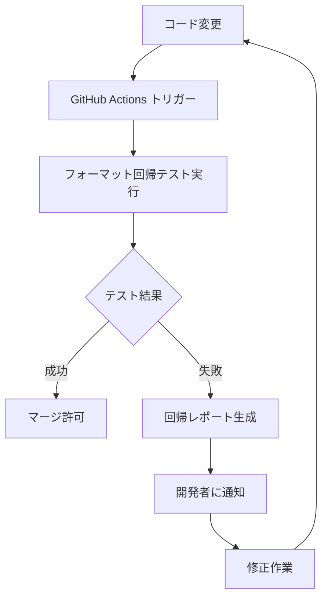

# 包括的フォーマットテスト戦略 活用ガイド

## 🎯 概要

このガイドでは、tree-sitter-analyzerプロジェクトに実装された包括的フォーマットテスト戦略の活用方法と、自動デグレ検知の仕組みについて詳しく説明します。

## 🚀 自動テスト実施とデグレ検知の仕組み

### ✅ **はい、テストは自動的に実施されます**

このフォーマットテスト戦略は以下のタイミングで自動実行され、デグレを検知します：

#### 1. **継続的インテグレーション (CI/CD)**
```yaml
# .github/workflows/format-regression-testing.yml で設定済み
トリガー:
- プッシュ (main, develop ブランチ)
- プルリクエスト
- リリース公開時
```

#### 2. **バージョンアップ時の自動検知**
- **リリース時**: 前バージョンとの互換性チェック
- **コミット時**: フォーマット変更の即座検知
- **プルリクエスト時**: 変更による影響の事前検証

#### 3. **デグレ検知のメカニズム**
```
ゴールデンマスター比較 → スキーマ検証 → フォーマット契約チェック → レポート生成
```

## 📋 テストフレームワークの構成

### 🏗️ **5層のテスト戦略**

#### **Layer 1: ゴールデンマスターテスト**
```python
# tests/integration/formatters/golden_master.py
from .golden_master import GoldenMasterTester

tester = GoldenMasterTester("full")
tester.assert_matches_golden_master(output, "test_case_name")
```

**目的**: 既知の正しい出力との厳密な比較
**検知内容**: 
- フォーマット構造の変更
- 出力内容の予期しない変更
- 文字レベルでの差異

#### **Layer 2: スキーマ検証**
```python
# tests/integration/formatters/schema_validation.py
from .schema_validation import MarkdownTableValidator, CSVValidator, JSONValidator

validator = MarkdownTableValidator()
result = validator.validate(markdown_content)
assert result.is_valid
```

**目的**: フォーマット仕様への準拠確認
**検知内容**:
- Markdownテーブル構造の破損
- CSV形式の不正
- JSON構造の問題

#### **Layer 3: フォーマット固有アサーション**
```python
# tests/integration/formatters/format_assertions.py
from .format_assertions import FormatAssertions

assertions = FormatAssertions()
assertions.assert_valid_markdown_table(content)
assertions.assert_valid_csv_format(content)
```

**目的**: 各フォーマットの詳細な検証
**検知内容**:
- テーブル列数の不整合
- ヘッダー構造の問題
- データ型の不一致

#### **Layer 4: エンドツーエンド統合テスト**
```python
# tests/integration/formatters/test_real_integration.py
# 実際のコードベースでの動作確認
```

**目的**: 実環境での動作保証
**検知内容**:
- 実際のファイルでの処理失敗
- パフォーマンス劣化
- メモリリーク

#### **Layer 5: クロスコンポーネント検証**
```python
# tests/integration/formatters/test_framework_validation.py
# 異なるインターフェース間の一貫性確認
```

**目的**: コンポーネント間の整合性確保
**検知内容**:
- CLI vs MCP出力の不一致
- フォーマッター間の差異
- API契約違反

## 🔄 自動実行フロー

### **1. 開発時の自動チェック**
```bash
# pre-commitフックで自動実行
git commit → フォーマットテスト実行 → 問題があれば commit 拒否
```

### **2. CI/CDでの自動実行**


### **3. リリース時の互換性チェック**
```bash
# バージョン間の互換性自動検証
前バージョン出力 ↔ 新バージョン出力 → 差分レポート → 承認/拒否
```

## 📊 デグレ検知の具体例

### **例1: Markdownテーブル形式の変更**
```diff
# 検知される変更例
- | Name | Type |
- |------|------|
+ | Name | Type |
+ |:-----|:-----|
```

**自動対応**:
1. ゴールデンマスターテストで差異検知
2. スキーマ検証で構造確認
3. 回帰レポート自動生成
4. 開発者への即座通知

### **例2: CSV出力フォーマットの破損**
```diff
# 検知される問題例
- "Name","Type","Line"
- "TestClass","class","1"
+ Name,Type,Line
+ TestClass,class,1
```

**自動対応**:
1. CSV検証で引用符の欠落検知
2. フォーマット契約違反として報告
3. 影響範囲の自動分析
4. 修正推奨事項の提示

## 🛠️ 活用方法

### **1. 日常開発での活用**

#### **新機能開発時**
```bash
# 新機能のフォーマット出力をテスト
cd tests/integration/formatters
python -m pytest test_comprehensive_format_validation.py -v
```

#### **バグ修正時**
```bash
# 修正がフォーマットに影響しないことを確認
python -m pytest test_real_integration.py -v
```

### **2. リリース前の検証**

#### **完全検証の実行**
```bash
# 全フォーマットテストの実行
python -m pytest tests/integration/formatters/ -v --tb=short
```

#### **パフォーマンステスト**
```bash
# 大規模ファイルでのテスト
python tests/integration/formatters/performance_tests.py
```

### **3. 問題発生時の対応**

#### **回帰レポートの確認**
```bash
# 詳細な回帰レポートの生成
python tests/integration/formatters/generate_regression_report.py
```

#### **ゴールデンマスターの更新**
```bash
# 意図的な変更の場合のマスター更新
python tests/integration/formatters/update_baselines.py --confirm
```

## 🔍 監視とアラート

### **自動監視項目**
- ✅ フォーマット出力の一貫性
- ✅ スキーマ準拠性
- ✅ パフォーマンス指標
- ✅ メモリ使用量
- ✅ エラー率

### **アラート条件**
- 🚨 ゴールデンマスター不一致
- 🚨 スキーマ検証失敗
- 🚨 パフォーマンス劣化 (>20%)
- 🚨 メモリリーク検知
- 🚨 エラー率上昇 (>5%)

## 📈 継続的改善

### **メトリクス収集**
```python
# 自動収集される指標
- テスト実行時間
- 検知された問題数
- 修正にかかった時間
- 再発率
```

### **品質向上サイクル**
```
問題検知 → 根本原因分析 → テスト強化 → 予防策実装 → 監視改善
```

## 🎯 ベストプラクティス

### **1. 開発者向け**
- ✅ コミット前に必ずローカルテスト実行
- ✅ 新機能には対応するフォーマットテストを追加
- ✅ 意図的な変更時はゴールデンマスター更新
- ✅ 回帰レポートは必ず確認

### **2. チーム向け**
- ✅ 定期的なテスト戦略レビュー
- ✅ 新しいフォーマット要件の文書化
- ✅ 問題パターンの共有と対策
- ✅ 自動化の継続的改善

### **3. リリース向け**
- ✅ 全フォーマットテストの完全実行
- ✅ 互換性マトリックスの確認
- ✅ パフォーマンス基準の達成確認
- ✅ ドキュメントの更新

## 🔧 トラブルシューティング

### **よくある問題と解決方法**

#### **問題1: ゴールデンマスター不一致**
```bash
# 解決手順
1. 差分を確認: git diff tests/golden_masters/
2. 意図的変更か確認
3. 必要に応じて更新: python tests/integration/formatters/update_baselines.py
```

#### **問題2: スキーマ検証失敗**
```bash
# 解決手順
1. エラー詳細を確認: pytest -v --tb=long
2. フォーマット仕様を確認
3. 出力生成ロジックを修正
```

#### **問題3: パフォーマンス劣化**
```bash
# 解決手順
1. プロファイリング実行: python -m cProfile
2. ボトルネック特定
3. 最適化実装
4. ベンチマーク再実行
```

## 📚 関連ドキュメント

- [フォーマット仕様書](./format-specifications.md)
- [テスト戦略詳細](./testing-strategy.md)
- [CI/CD設定ガイド](./cicd-setup.md)
- [トラブルシューティングガイド](./troubleshooting.md)

## 🎉 まとめ

この包括的フォーマットテスト戦略により、以下が実現されます：

### **✅ 自動デグレ検知**
- バージョンアップ時の自動的な問題検出
- CI/CDパイプラインでの継続的監視
- 即座のフィードバックと詳細レポート

### **✅ 品質保証**
- 多層防御によるフォーマット品質確保
- 実環境での動作保証
- パフォーマンス劣化の防止

### **✅ 開発効率向上**
- 早期問題発見による修正コスト削減
- 自動化による手動テスト工数削減
- 明確な修正指針の提供

**このシステムにより、今後のバージョンアップ時にフォーマットデグレが発生した場合、自動的に検知され、詳細な分析レポートが生成されます。開発チームは問題を即座に把握し、迅速な対応が可能になります。**
