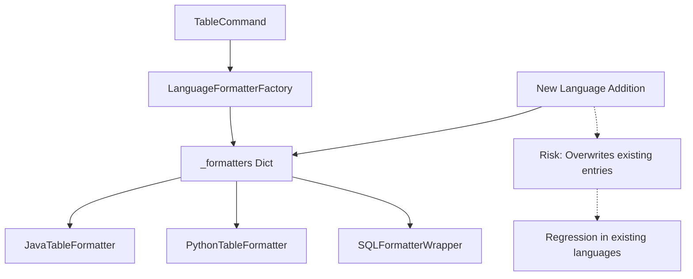
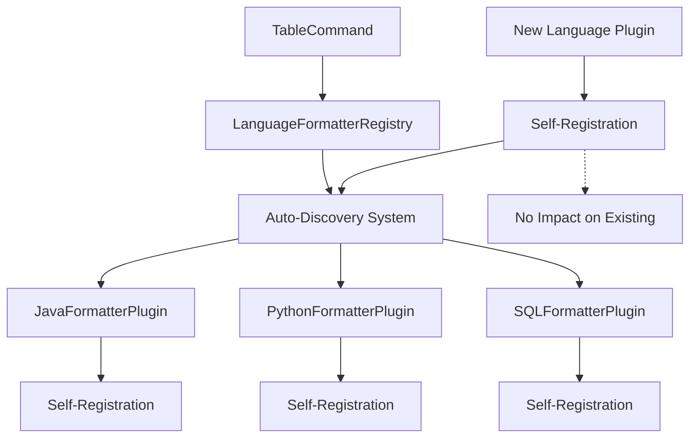

# Design: Improve Language Formatter Isolation

**Change ID**: improve-language-formatter-isolation  
**Version**: 1.0  
**Last Updated**: 2025-11-07

## Architecture Overview

### Current Architecture Problems



**問題点:**
1. 中央集権的な辞書による脆弱性
2. 新言語追加時の既存言語への影響
3. 型安全性の欠如

### Proposed Architecture



## Detailed Design

### 1. Plugin-Based Formatter System

#### Base Formatter Protocol
```python
from typing import Protocol, runtime_checkable
from abc import ABC, abstractmethod

@runtime_checkable
class FormatterPlugin(Protocol):
    """Protocol for language formatter plugins"""
    
    @classmethod
    def get_supported_languages(cls) -> list[str]:
        """Return list of supported language identifiers"""
        ...
    
    @classmethod
    def get_priority(cls) -> int:
        """Return priority for language conflicts (higher = preferred)"""
        ...
    
    def format_analysis_result(self, result: AnalysisResult, format_type: str) -> str:
        """Format analysis result to string output"""
        ...
    
    def format_structure(self, data: dict[str, Any]) -> str:
        """Format structured data to string output (legacy compatibility)"""
        ...
```

#### Auto-Registration Mechanism
```python
class FormatterPluginMeta(type):
    """Metaclass for automatic formatter registration"""
    
    def __new__(mcs, name, bases, namespace, **kwargs):
        cls = super().__new__(mcs, name, bases, namespace)
        
        # Auto-register if it's a concrete formatter
        if (hasattr(cls, 'get_supported_languages') and 
            not getattr(cls, '_is_abstract', False)):
            LanguageFormatterRegistry.register_plugin(cls)
        
        return cls

class BaseFormatterPlugin(ABC, metaclass=FormatterPluginMeta):
    """Base class for formatter plugins with auto-registration"""
    _is_abstract = True
    
    @classmethod
    @abstractmethod
    def get_supported_languages(cls) -> list[str]:
        pass
    
    @classmethod
    def get_priority(cls) -> int:
        return 100  # Default priority
```

#### Language Formatter Registry
```python
class LanguageFormatterRegistry:
    """Registry for language formatter plugins"""
    
    _plugins: dict[str, list[type[FormatterPlugin]]] = {}
    _cache: dict[str, type[FormatterPlugin]] = {}
    
    @classmethod
    def register_plugin(cls, plugin_class: type[FormatterPlugin]) -> None:
        """Register a formatter plugin"""
        languages = plugin_class.get_supported_languages()
        
        for language in languages:
            lang_key = language.lower()
            if lang_key not in cls._plugins:
                cls._plugins[lang_key] = []
            
            cls._plugins[lang_key].append(plugin_class)
            # Sort by priority (highest first)
            cls._plugins[lang_key].sort(
                key=lambda x: x.get_priority(), 
                reverse=True
            )
        
        # Clear cache for affected languages
        for language in languages:
            cls._cache.pop(language.lower(), None)
    
    @classmethod
    def get_formatter(cls, language: str) -> FormatterPlugin | None:
        """Get formatter for language"""
        lang_key = language.lower()
        
        # Check cache first
        if lang_key in cls._cache:
            return cls._cache[lang_key]()
        
        # Find best plugin
        plugins = cls._plugins.get(lang_key, [])
        if not plugins:
            return None
        
        # Use highest priority plugin
        best_plugin = plugins[0]
        cls._cache[lang_key] = best_plugin
        
        return best_plugin()
    
    @classmethod
    def get_supported_languages(cls) -> list[str]:
        """Get all supported languages"""
        return list(cls._plugins.keys())
    
    @classmethod
    def clear_cache(cls) -> None:
        """Clear formatter cache"""
        cls._cache.clear()
```

### 2. Concrete Formatter Implementations

#### Java Formatter Plugin
```python
class JavaTableFormatter(BaseFormatterPlugin):
    """Java language formatter plugin"""
    
    @classmethod
    def get_supported_languages(cls) -> list[str]:
        return ["java"]
    
    @classmethod
    def get_priority(cls) -> int:
        return 100
    
    def format_analysis_result(self, result: AnalysisResult, format_type: str) -> str:
        # Implementation
        pass
    
    def format_structure(self, data: dict[str, Any]) -> str:
        # Legacy compatibility implementation
        pass
```

#### SQL Formatter Plugin
```python
class SQLFormatterPlugin(BaseFormatterPlugin):
    """SQL language formatter plugin"""
    
    @classmethod
    def get_supported_languages(cls) -> list[str]:
        return ["sql"]
    
    @classmethod
    def get_priority(cls) -> int:
        return 100
    
    def format_analysis_result(self, result: AnalysisResult, format_type: str) -> str:
        # Implementation
        pass
```

#### HTML Formatter Plugin
```python
class HtmlFormatterPlugin(BaseFormatterPlugin):
    """HTML language formatter plugin"""
    
    @classmethod
    def get_supported_languages(cls) -> list[str]:
        return ["html"]
    
    @classmethod
    def get_priority(cls) -> int:
        return 100
    
    def format_analysis_result(self, result: AnalysisResult, format_type: str) -> str:
        # Implementation
        pass
```

#### CSS Formatter Plugin
```python
class CSSFormatterPlugin(BaseFormatterPlugin):
    """CSS language formatter plugin"""
    
    @classmethod
    def get_supported_languages(cls) -> list[str]:
        return ["css"]
    
    @classmethod
    def get_priority(cls) -> int:
        return 100
    
    def format_analysis_result(self, result: AnalysisResult, format_type: str) -> str:
        # Implementation
        pass
```

#### Markdown Formatter Plugin
```python
class MarkdownFormatterPlugin(BaseFormatterPlugin):
    """Markdown language formatter plugin"""
    
    @classmethod
    def get_supported_languages(cls) -> list[str]:
        return ["markdown", "md"]
    
    @classmethod
    def get_priority(cls) -> int:
        return 100
    
    def format_analysis_result(self, result: AnalysisResult, format_type: str) -> str:
        # Implementation
        pass
```

### 3. Updated TableCommand

```python
class TableCommand(BaseCommand):
    """Updated table command with plugin system"""
    
    async def execute_async(self, language: str) -> int:
        try:
            analysis_result = await self.analyze_file(language)
            if not analysis_result:
                return 1
            
            # Get formatter from registry
            formatter = LanguageFormatterRegistry.get_formatter(analysis_result.language)
            if formatter:
                table_type = getattr(self.args, "table", "full")
                
                # Use new interface
                if hasattr(formatter, 'format_analysis_result'):
                    formatted_output = formatter.format_analysis_result(analysis_result, table_type)
                else:
                    # Legacy fallback
                    formatted_data = self._convert_to_structure_format(analysis_result, language)
                    formatted_output = formatter.format_structure(formatted_data)
                
                self._output_table(formatted_output)
                return 0
            
            # Fallback to original implementation
            return self._fallback_format(analysis_result, language)
            
        except Exception as e:
            output_error(f"An error occurred during table format analysis: {e}")
            return 1
```

## Migration Strategy

### Phase 1: Infrastructure Setup
1. Create plugin system infrastructure
2. Implement auto-registration mechanism
3. Create compatibility layer for existing formatters

### Phase 2: Formatter Migration
1. Convert existing formatters to plugin system
2. Maintain backward compatibility
3. Add comprehensive tests

### Phase 3: Legacy Cleanup
1. Remove old factory system
2. Update documentation
3. Final testing and validation

## Testing Strategy

### 1. Plugin Registration Tests
```python
def test_auto_registration():
    """Test that formatters auto-register correctly"""
    
    class TestFormatter(BaseFormatterPlugin):
        @classmethod
        def get_supported_languages(cls):
            return ["test"]
    
    assert "test" in LanguageFormatterRegistry.get_supported_languages()
```

### 2. Isolation Tests
```python
def test_language_isolation():
    """Test that adding new language doesn't affect existing ones"""
    
    # Record existing languages
    existing_languages = set(LanguageFormatterRegistry.get_supported_languages())
    
    # Add new language
    class NewLanguageFormatter(BaseFormatterPlugin):
        @classmethod
        def get_supported_languages(cls):
            return ["newlang"]
    
    # Verify existing languages still work
    for lang in existing_languages:
        formatter = LanguageFormatterRegistry.get_formatter(lang)
        assert formatter is not None
```

### 3. Regression Tests
```python
def test_all_languages_after_new_addition():
    """Test all existing languages after adding new one"""
    
    test_files = {
        "java": "examples/BigService.java",
        "python": "examples/sample.py",
        "javascript": "examples/ModernJavaScript.js",
        "typescript": "examples/ComprehensiveTypeScript.ts",
        "sql": "examples/sample_database.sql",
        "html": "examples/comprehensive_sample.html",
        "css": "examples/comprehensive_sample.css",
        "markdown": "examples/test_markdown.md"
    }
    
    for language, file_path in test_files.items():
        formatter = LanguageFormatterRegistry.get_formatter(language)
        assert formatter is not None
        
        # Test actual formatting
        result = format_file(file_path, language)
        assert result is not None
        assert len(result) > 0
```

## Benefits

1. **Isolation**: 新言語追加時の既存言語への影響を完全に排除
2. **Type Safety**: Protocol型による型安全性の確保
3. **Extensibility**: プラグイン型による柔軟な拡張性
4. **Maintainability**: 各フォーマッターの独立性による保守性向上
5. **Testability**: 包括的なテストによる品質保証

## Risk Mitigation

1. **Breaking Changes**: 段階的移行による互換性維持
2. **Performance**: キャッシュ機能による性能確保
3. **Complexity**: 明確なインターフェースによる複雑性管理
4. **Testing**: 包括的テストスイートによる品質保証
