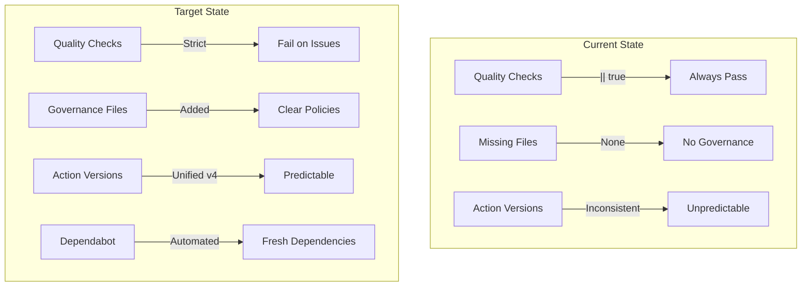

# Design: GitHub Best Practices Improvement

## Overview

Transforms the `.github` directory into an enterprise-grade CI/CD configuration by enabling strict quality enforcement, adding governance files, automating dependency updates, and standardizing workflow configurations.

## Architecture Changes



## File Changes

### Modified Files

| File | Change Summary |
|------|----------------|
| `.github/workflows/reusable-quality.yml` | Remove `|| true`, enable strict failure mode |
| `.github/workflows/sql-platform-compat.yml` | Update `setup-uv@v3` to `setup-uv@v4` |
| `.github/workflows/branch-protection.yml` | Add `require_linear_history`, conversation resolution |
| `.github/FUNDING.yml` | Remove placeholder comments, keep only active platforms |

### New Files

| File | Purpose |
|------|---------|
| `.github/CODEOWNERS` | Assign reviewers for critical code paths |
| `.github/SECURITY.md` | Security policy and vulnerability reporting |
| `.github/ISSUE_TEMPLATE/config.yml` | Issue template configuration with links |
| `.github/dependabot.yml` | Automated dependency update configuration |
| `.github/workflows/stale.yml` | Stale issue management automation |

## Component Details

### 1. Strict Quality Enforcement (`reusable-quality.yml`)

**Before:**
```yaml
- name: Run Ruff
  run: |
    uv sync --all-extras
    uv run ruff check . || true  # ❌ Never fails
```

**After:**
```yaml
- name: Run Ruff
  run: |
    uv sync --all-extras
    uv run ruff check .  # ✅ Fails on lint errors
```

Apply same pattern to MyPy and Bandit steps.

### 2. CODEOWNERS File

```text
# Default owners for everything
* @aimasteracc

# Core analyzer code requires explicit review
/tree_sitter_analyzer/ @aimasteracc

# CI/CD changes require maintainer review
/.github/ @aimasteracc

# Plugin architecture changes
/tree_sitter_analyzer/plugins/ @aimasteracc
/tree_sitter_analyzer/languages/ @aimasteracc
```

### 3. SECURITY.md Policy

Standard security policy template including:
- Supported versions table
- Vulnerability reporting process
- Expected response timeline
- Safe harbor statement

### 4. Dependabot Configuration

```yaml
version: 2
updates:
  # Python dependencies
  - package-ecosystem: "pip"
    directory: "/"
    schedule:
      interval: "weekly"
    groups:
      minor-and-patch:
        patterns: ["*"]
        update-types: ["minor", "patch"]
    
  # GitHub Actions
  - package-ecosystem: "github-actions"
    directory: "/"
    schedule:
      interval: "weekly"
    groups:
      actions:
        patterns: ["*"]
```

### 5. Issue Template Config

```yaml
blank_issues_enabled: false
contact_links:
  - name: 💬 Discussions
    url: https://github.com/aimasteracc/tree-sitter-analyzer/discussions
    about: Ask questions and discuss ideas
  - name: 📖 Documentation
    url: https://github.com/aimasteracc/tree-sitter-analyzer#readme
    about: Read the documentation first
```

### 6. Stale Workflow

```yaml
name: Stale Issues

on:
  schedule:
    - cron: '0 0 * * *'
  workflow_dispatch:

jobs:
  stale:
    runs-on: ubuntu-latest
    steps:
      - uses: actions/stale@v9
        with:
          stale-issue-message: 'This issue has been marked as stale due to inactivity.'
          close-issue-message: 'Closed due to inactivity.'
          days-before-stale: 60
          days-before-close: 7
          exempt-issue-labels: 'pinned,security,help wanted'
          stale-issue-label: 'stale'
```

### 7. Enhanced Branch Protection

Add to `branch-protection.yml`:
```javascript
required_linear_history: true,
required_conversation_resolution: true
```

## Error Handling Considerations

| Scenario | Handling |
|----------|----------|
| Ruff finds fixable errors | CI fails with clear error output |
| MyPy finds type errors | CI fails with type error details |
| Dependabot can't update | Creates issue with explanation |
| Stale action fails | Logs error, continues on next run |

## Verification Strategy

### Automated Verification

1. **Syntax Validation**: YAML lint all workflow files
2. **Action Version Check**: Grep for outdated action versions
3. **Quality Gate Test**: Create intentional lint error, verify CI fails

### Manual Verification

1. Push branch with intentional Ruff error → verify CI fails
2. Create test issue → verify stale workflow labels it after timeout
3. Verify Dependabot creates PRs when dependencies are outdated
