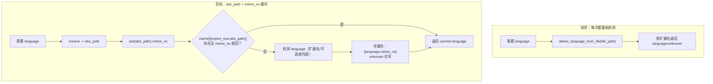
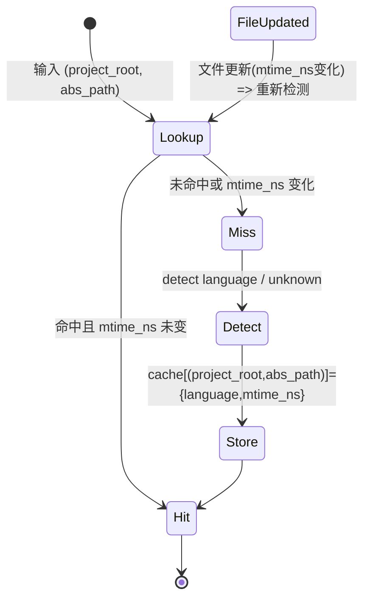

## 设计方案（Phase 1 / 要件2）：语言检测缓存（Best Practice）

### 目标

- **减少重复语言检测**：同一文件在同一会话/同一工作流被多个 MCP 工具处理时，避免重复检测语言。
- **行为一致**：所有入口（server、tools、CLI/adapter）对同一文件返回一致语言。
- **可失效**：文件更新（mtime 变化）必须失效缓存，保证结果不会长期陈旧。
- **支持 unknown**：对未支持扩展名的文件返回 `unknown`，并将 `unknown` 也缓存以避免重复检测。

### 现状（事实依据）

- `tree_sitter_analyzer/language_detector.py::detect_language_from_file()` 当前没有缓存：每次创建新的 `LanguageDetector()` 并按扩展名返回语言。
- `detect_language_from_file()` 被多处调用（例如 `tree_sitter_analyzer/mcp/server.py`、`tree_sitter_analyzer/mcp/tools/analyze_scale_tool.py`、`query_tool.py`、`table_format_tool.py` 等），存在重复检测。
- 项目内已有共享缓存容器：`tree_sitter_analyzer/mcp/utils/shared_cache.py`（含 `_language_cache` 与 `get_language/set_language`），但尚未用于语言检测。

### Best Practice 选择（B）

- **缓存 key**：`(project_root, abs_path)`（避免跨项目污染；与既有 cache 设计一致）
- **缓存 value**：`{ language: str, mtime_ns: int }`
- **失效策略**：若 `stat(abs_path).st_mtime_ns` 变化，则视为缓存失效并重新检测
- **unknown 策略**：`unknown` 也缓存（避免重复检测），但同样遵循 mtime 失效

> 注：Phase 1 可不引入 TTL；后续如发现 `unknown` 缓存导致体验问题，可为 unknown 引入短 TTL（Phase 2/4）。

### 边界条件（必须写清楚）

- **文件不存在/无权限 stat 时**：
  - 推荐：**不写入缓存**，直接返回扩展名检测结果（或 `unknown`），避免“文件后来出现但缓存仍然使用旧 mtime=0”之类的误命中。
  - 工具侧仍会在后续的“文件存在性校验”阶段报错（如果该工具要求文件必须存在）。

---

## 设计概要

### 统一入口

将“解析路径 -> 检查缓存 -> 检测语言 -> 写缓存”的逻辑统一到一个单点（建议放在 `language_detector.py` 的简单 API 层），使工具侧只调用：

- `detect_language_from_file(file_path: str, *, project_root: str | None = None) -> str`

其中：
- `project_root` 用于参与 cache key（来自 `BaseMCPTool.project_root` 或 server 的 boundary project_root）
- 工具侧在拿到 `resolved_path` 后调用该 API（或 API 内部自己 resolve，二选一实现，但必须保证使用 **abs_path** 做 key）

---

## Mermaid（给初学者）

### 流程图：无缓存 vs 有缓存

### 数据/状态图：缓存项与失效

---

## 数据结构与接口

### SharedCache 扩展建议（实现指引）

当前 `SharedCache._language_cache` 仅保存 `str`，无法表达 mtime。Best Practice 建议改为保存结构化值：

- `language_cache[(project_root, abs_path)] -> { "language": str, "mtime_ns": int }`

实现方式（Phase 1 二选一）：

- **方案1（推荐）**：在 `SharedCache` 内新增专用 dict，例如 `_language_meta_cache: dict[str, dict[str, Any]]`
  - 好处：不破坏旧的 `get_language/set_language` 语义，可兼容逐步迁移
- **方案2（最小改动）**：将 `_language_cache` 的 value 从 `str` 升级为 `dict`
  - 需要同步改 `get_language/set_language` 的返回类型（影响面更大）

### Cache Key 编码

沿用项目内 `SharedCache._make_key()` 的风格（字符串编码）：

- `key = f"{project_root}::language::{abs_path}"`

其中 `project_root` 允许为空字符串（无 project_root 场景），但工具侧优先传入 project_root。

> 注：仓库现状中 `SharedCache` 的 key 构造会额外包含 kind（例如 `language`），且会把 `project_root` 参与编码；实现时应复用现有 `_make_key`，避免出现两套 key 编码逻辑。

---

## 受け入れ基準（对齐 requirements.md）

1. **文件语言被检测时**，系统必须以 **绝对路径** 为 key 缓存结果（在 Best Practice 中表现为：abs_path 参与 key）  
2. **同一文件被不同工具处理时**，系统必须复用缓存结果，避免重复检测  
3. **文件更新（mtime 变化）时**，系统必须使缓存失效（Best Practice 用 `mtime_ns` 判定）  
4. **遇到未支持扩展名**，系统必须缓存 `unknown`，避免反复检测  

---

## 风险与对策

- **风险：mtime 粒度不一致导致偶发误命中**
  - 对策：使用 `st_mtime_ns`（纳秒级）而不是 `st_mtime`（秒级）
- **风险：cache key 不包含 project_root 导致跨项目污染**
  - 对策：key 强制包含 `project_root`（为空也显式编码）
- **风险：缓存无限增长**
  - 对策：Phase 1 接受；后续 Phase 2 引入 LRU/容量上限（SharedToolCache）

