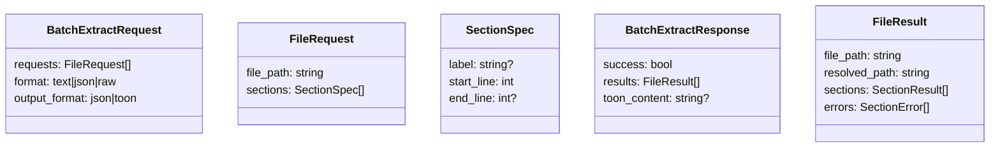

## 设计方案（Batch Enhancement / A 方案）：多文件×多范围一括抽出 + 多文件メトリクス一括取得（制限事項込み）

### 背景 / 目的

MCP 作業では「同一ファイルから複数箇所を抜きたい」「複数ファイルのサイズ/行数などをまとめて見たい」が頻発します。現状はツール呼び出しが分割されがちで、**呼び出し回数・前処理（検証/解決/言語推定/IO）**が増えます。

本設計は **既存ツールを拡張**して、**1回の MCP 呼び出しでバッチ取得**できるようにします（新規ツールは作らない：A 方針）。

---

## 対象（A：既存ツール拡張）

### 1) `extract_code_section`（`ReadPartialTool`）拡張：多ファイル×多範囲

- **現状**: `file_path + start_line (+ end_line …)` で単一範囲のみ
- **目標**: `requests` により、複数ファイルの複数範囲を一括抽出

### 2) `list_files`（`ListFilesTool`）/ `check_code_scale`（`AnalyzeScaleTool`）活用：多ファイルメトリクス

要望の「大きさ情報」は用途が2種類あります：
- **サイズだけ欲しい**: 既に `list_files` が `size_bytes` を返す（高速）
- **行数/トークン等も欲しい**: `compute_file_metrics` を複数ファイルに適用するバッチ入口を既存ツールに追加

本フェーズでは「最小追加」で実現するため、`AnalyzeScaleTool` に **metrics_only + file_paths** を追加する案を採用します。

---

## CLI（コマンドライン）との仕様統一（追加）

CLI は既存の単発実装（`--partial-read` 等）を維持しつつ、バッチ仕様を **MCP ツールの引数スキーマに揃える**形で追加します。

- **Batch partial read（extract）**:
  - `--partial-read --partial-read-requests-json '<json>'`
  - `--partial-read --partial-read-requests-file <path>`
- **Batch metrics**:
  - `--metrics-only --file-paths a.py b.py ...`
  - `--metrics-only --files-from <list.txt>`

出力は CLI 側の `--output-format toon/json` に合わせ、内部的には `ReadPartialTool.execute()` / `AnalyzeScaleTool.execute()` を呼ぶ（= 仕様/制限/TOONポリシーはツール側に集約）。

---

## 入出力仕様（案）

### 1) `extract_code_section` バッチ入力（追加）

既存の単一入力と **排他的**にします（互換性維持）。

#### output_format（デフォルト方針）

- **デフォルト**: `output_format="toon"`（トークン削減を優先）
- `output_format="toon"` の場合、レスポンスは **TOON + 最小メタ情報のみ**（詳細 JSON は返さない）
- `output_format="json"` の場合のみ、詳細（results/sections/content 等）を返す

```json
{
  "requests": [
    {
      "file_path": "src/a.py",
      "sections": [
        {"start_line": 10, "end_line": 40, "label": "funcA"},
        {"start_line": 100, "end_line": 130, "label": "funcB"}
      ]
    },
    {
      "file_path": "src/b.py",
      "sections": [
        {"start_line": 1, "end_line": 60, "label": "header"}
      ]
    }
  ],
  "format": "text",
  "output_format": "toon"
}
```

### 1) `extract_code_section` バッチ出力（例）

```json
{
  "success": true,
  "count_files": 2,
  "count_sections": 3,
  "limits": {"max_files": 20, "max_sections_total": 200, "max_total_bytes": 1048576},
  "format": "toon",
  "toon_content": "..."
}
```

> 注: 上の例は **TOON出力時の最小レスポンス**例です。詳細（results/sections/content 等）が必要な場合は `output_format="json"` を明示してください。

> 重要: **トークン削減を最優先**するため、本設計では `output_format="toon"` をデフォルトとし、TOON 指定時は **JSON の詳細フィールド（results / sections / content 等）を同時に返さない**。
> - `output_format="toon"`: `toon_content` + 最小メタ情報のみ（count / limits / エラー要約など）
> - `output_format="json"`: 構造化 JSON を返す（プログラム処理向け）

---

## 制限事項（必須定義）

初心者向けに「なぜ制限が必要か」も明記します：大量抽出はトークン/メモリ/IO を一気に消費し、MCP 全体が遅くなります。

### 共通制限（提案）

- **max_files**: 20（1リクエスト）
- **max_sections_per_file**: 50
- **max_sections_total**: 200
- **max_total_bytes（抽出合計）**: 1 MiB（超過時は **デフォルトで fail**）
- **max_total_lines（抽出合計）**: 5000（超過時は **デフォルトで fail**）
- **max_file_size_bytes（単ファイル）**: 5 MiB（巨大ファイルは拒否し、より絞った範囲指定を促す）

#### 上限超過ポリシー（確定）

- **デフォルト**: fail（`success=false` + どの上限に抵触したかを error に明示）
- **オプション**: `allow_truncate=true` の場合のみ truncate（上限内に収まる範囲までで結果を返し、`truncated=true` を付与）

### エラー時の扱い（提案）

- **partial_success を許可**（デフォルト）
  - あるファイル/セクションが失敗しても、他は継続
  - 失敗は `errors[]` に格納
- **fail_fast オプション**（必要なら追加）
  - 最初の失敗で中断したいケース向け

---

## キャッシュ/前処理の再利用

既に Phase 1 で導入した以下を前提に、バッチでも活用します：
- **Security validation cache**（同一ファイル/解決済みパスの再検証を回避）
- **Language detection cache**（mtime で失効）
- **File metrics cache**（content hash で失効）

バッチでは「ループ内で同じ前処理を何度も呼ぶ」構造になりがちなので、**必ず共通ヘルパー（`BaseMCPTool.resolve_and_validate_file_path`）経由**に統一します。

---

## Mermaid（初心者向け）

### フロー：バッチ抽出

```mermaid
flowchart TD
  A[リクエスト: requests[]] --> B{各 file_path}
  B --> C[resolve + security validate\n(キャッシュ利用)]
  C --> D[ファイル存在/サイズチェック]
  D --> E{各 section}
  E --> F[行範囲チェック\n(上限/整合性)]
  F --> G[部分読み出し\n(read_file_partial)]
  G --> H[結果に追加\nsections[] or errors[]]
  H --> E
  H --> B
  B --> Z[集約レスポンス + toon_content]
```

### データ図：入出力



---

## `check_code_scale`（`AnalyzeScaleTool`）拡張案：メトリクス一括取得

### 追加入力（案）

- `file_paths: string[]`（複数）
- `metrics_only: true`（構造解析をスキップし `compute_file_metrics` のみ）

### 制限

- max_files: 200（メトリクスのみなら上げられる）
- 並列度: 4（Windows/CI 安定性を優先）

---

## 受け入れ基準（本設計の追加分）

1. `extract_code_section` に `requests[]` が指定された場合、システムは単一呼び出しで複数ファイル/複数範囲の抽出を実行しなければならない  
2. `requests[]` と `file_path/start_line/end_line...` が同時に指定された場合、システムは **入力不正としてエラー**を返さなければならない（排他ルール）  
3. 上限（max_files / max_sections_total / max_total_bytes / max_total_lines）を超える要求が来た場合、システムは **デフォルトで fail** しなければならない（`allow_truncate=true` の場合のみ truncate を許可）  
4. 一部の範囲抽出が失敗しても、システムは残りを継続し、失敗情報を `errors[]` に含めなければならない（fail_fast を指定した場合を除く）  
5. `output_format="toon"` の場合、システムは `toon_content` を返し、**JSON の詳細フィールドを同時に返してはならない**（token 増加を防止）  


