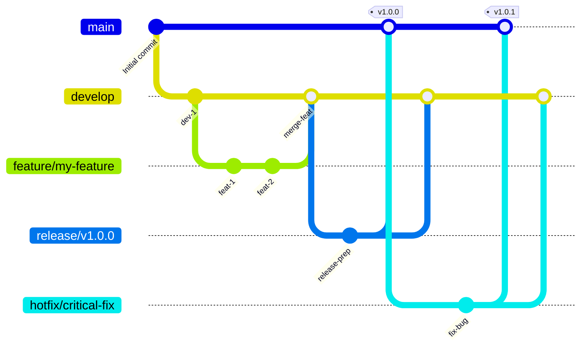

# GitFlow ブランチ戦略 (日本語説明)

本ドキュメントでは、`tree-sitter-analyzer` プロジェクトで実装されている GitFlow ブランチ戦略を Mermaid 図表と日本語で説明します。

## GitFlow フロー図



## ブランチ構造

### メインブランチ

- **`main`**: 本番環境対応のコード。常に最新の安定版を含みます。いつでもデプロイ可能な状態を保ちます。
- **`develop`**: 機能統合ブランチ。最新の開発変更を含み、すべての機能開発の起点となります。

### サポートブランチ

- **`feature/*`**: 機能開発ブランチ。
    - **起点**: `develop`
    - **マージ先**: `develop`
    - **命名**: `feature/descriptive-name` (例: `feature/user-authentication`)
- **`release/*`**: リリース準備ブランチ。新しい本番版の準備に使用し、軽微なバグ修正やドキュメント生成などリリース向けタスクのみを行います。
    - **起点**: `develop`
    - **マージ先**: `main` と `develop`
    - **命名**: `release/v1.2.0`
- **`hotfix/*`**: 緊急本番バグ修正ブランチ。本番環境の重要な問題を迅速に修正するために使用します。
    - **起点**: `main`
    - **マージ先**: `main` と `develop`
    - **命名**: `hotfix/critical-bug-fix`

## ワークフロー

### 1. 機能開発 (Feature Development)

1.  **`develop` から `feature` ブランチを作成**: 
    ```bash
    git fetch origin
    git checkout -b feature/your-feature-name origin/develop
    ```
2.  **機能開発**を行い、定期的にコミットします。
3.  **開発完了後**、`feature` ブランチをリモートにプッシュし、`develop` ブランチへのプルリクエスト (Pull Request) を作成します。
4.  コードレビューと継続的インテグレーション (CI) チェックが通過後、**`develop` にマージ**します。

### 2. リリースプロセス (Release Process)

プロジェクトでは自動化リリースフローを推奨していますが、手動プロセスは以下の通りです：

1.  **`develop` から `release` ブランチを作成**: 
    ```bash
    git fetch origin
    git checkout -b release/v1.0.0 origin/develop
    ```
2.  **リリース準備**: バージョン番号の更新、ドキュメント生成など。
    ```bash
    # pyproject.toml のバージョン番号を更新
    # server_version を更新
    # __init__.py にバージョン番号を同期
    uv run python scripts/sync_version_minimal.py

    # 現在のテスト数統計を取得：
    # テスト数: uv run python -m pytest --collect-only -q | findstr /C:"collected"
    # 注意：カバレッジはCodecov自動バッジを使用、手動更新不要

    # ドキュメントを更新：
    # - README.md のバージョン番号とテスト数を更新
    # - バージョンバッジ、テストバッジを更新（カバレッジバッジはCodecov自動更新）
    # - "最新品質成果"セクションのバージョン参照を更新
    # - テスト環境セクションのバージョン参照を更新
    # - ドキュメント内のその他すべてのバージョン参照を更新
    # - README_zh.md と README_ja.md の翻訳版を更新
    # - ワークフロー変更がある場合、GITFLOW_zh.md と GITFLOW_ja.md を更新
    # - CHANGELOG.md のリリース詳細を更新
    ```
3.  **`release` ブランチをリモートにプッシュして PyPI リリースをトリガー**:
    ```bash
    git checkout release/v1.0.0
    git push origin release/v1.0.0
    ```
4.  **PyPI リリース完了を待機・検証**:
    ```bash
    # 自動化ワークフローの PyPI リリース完了を待機
    # GitHub Actions ページでリリース状況を監視可能
    # PyPI パッケージが正常にリリースされたかを検証：
    # pip install tree-sitter-analyzer==1.0.0 --dry-run
    ```
5.  **PyPI リリース成功後、`main` と `develop` にマージ**:
    ```bash
    # main ブランチに切り替えてマージ
    git checkout main
    git merge release/v1.0.0
    git tag -a v1.0.0 -m "Release v1.0.0" # バージョンタグを付与
    git push origin main --tags

    # develop ブランチに切り替えてマージ
    git checkout develop
    git merge release/v1.0.0
    git push origin develop
    ```
6.  **GitHub Release を作成**:
    ```bash
    # 一時的なリリースメッセージファイルを作成（エンコーディングと記号エラーを回避）
    cat > release_message.md << 'EOF'
    ## v1.7.2 - ファイル出力最適化とROOルールドキュメント

    ### 🎯 新機能
    - **ファイル出力最適化**: MCP検索ツールに`suppress_output`と`output_file`パラメータを追加、トークン消費を大幅削減
    - **自動フォーマット検出**: コンテンツタイプに基づいてファイル形式（JSON/Markdown）を自動選択
    - **ROOルールドキュメント**: tree-sitter-analyzer MCP最適化使用ガイドを新規追加

    ### 📊 品質指標
    - テスト数: 2675個のテスト（100%パス）
    - コードカバレッジ: 78.85%
    - 新機能: ファイル出力最適化により、AI対話のトークン消費を大幅削減

    ### 🔧 技術改善
    - 大型検索結果のファイル出力時、レスポンスサイズを最大99%削減
    - 後方互換性を維持、既存機能の使用に影響なし
    - ファイル出力最適化機能の検証を含む完全なテストカバレッジ
    EOF

    # gh CLI を使用してリリースを作成
    gh release create v1.7.2 \
        --title "Release v1.7.2: File Output Optimization and ROO Rules Documentation" \
        --notes-file release_message.md \
        --target main

    # 一時ファイルを削除
    rm release_message.md
    ```
7.  **`release` ブランチを削除**:
    ```bash
    # ローカルブランチを削除
    git branch -d release/v1.0.0
    # リモートブランチを削除
    git push origin --delete release/v1.0.0
    ```

**重要説明**: このフローは「PyPI優先」戦略を採用し、パッケージリリース成功後にmainブランチを更新することで、コードは公開されているがパッケージが利用できないリスクを回避します。

### 3. ホットフィックスプロセス (Hotfix Process)

1.  **`main` から `hotfix` ブランチを作成**: 
    ```bash
    git fetch origin
    git checkout -b hotfix/critical-bug-fix origin/main
    ```
2.  **バグを修正**してコミットします。
3.  **バージョンとドキュメントを更新**:
    ```bash
    # pyproject.toml のバージョン番号を更新 (例: 1.0.0 -> 1.0.1)
    # server_version を更新
    # __init__.py にバージョン番号を同期
    uv run python scripts/sync_version_minimal.py

    # 現在のテスト数とカバレッジ統計を取得：
    # テスト数: uv run python -m pytest --collect-only -q | findstr /C:"collected"
    # カバレッジ: uv run python -m pytest --cov=tree_sitter_analyzer --cov-report=term-missing --cov-report=json -x -q | findstr "TOTAL"

    # ドキュメントを更新：
    # - CHANGELOG.md にホットフィックス詳細を追加
    # - README.md のバージョン番号、テスト数、カバレッジを更新
    # - バージョンバッジ、テストバッジ、カバレッジバッジを更新
    # - "最新品質成果"セクションのバージョン参照を更新
    # - テスト環境セクションのバージョン参照を更新
    # - ドキュメント内のその他すべてのバージョン参照を更新
    # - README_zh.md と README_ja.md の翻訳版を更新
    # - ワークフロー変更がある場合、GITFLOW_zh.md と GITFLOW_ja.md を更新
    ```
4.  **`hotfix` ブランチをリモートにプッシュして PyPI リリースをトリガー**:
    ```bash
    git checkout hotfix/critical-bug-fix
    git push origin hotfix/critical-bug-fix
    ```
5.  **PyPI リリース完了を待機・検証**:
    ```bash
    # 自動化ワークフローの PyPI リリース完了を待機
    # GitHub Actions ページでリリース状況を監視可能
    # PyPI パッケージが正常にリリースされたかを検証：
    # pip install tree-sitter-analyzer==1.0.1 --dry-run
    ```
6.  **PyPI リリース成功後、`main` と `develop` にマージ**:
    ```bash
    # main ブランチに切り替えてマージ
    git checkout main
    git merge hotfix/critical-bug-fix
    git tag -a v1.0.1 -m "Hotfix v1.0.1" # 修正バージョンタグを付与
    git push origin main --tags

    # develop ブランチに切り替えてマージ
    git checkout develop
    git merge hotfix/critical-bug-fix
    git push origin develop
    ```
7.  **GitHub Release を作成**:
    ```bash
    # 一時的なホットフィックスリリースメッセージファイルを作成
    cat > hotfix_release_message.md << 'EOF'
    ## v1.0.1 - 緊急修正

    ### 🐛 修正内容
    - 重要な本番環境問題を修正
    - システムの安定性とセキュリティを向上

    ### 📊 品質指標
    - すべてのテストが通過
    - 緊急修正の検証完了

    ### ⚡ デプロイメント説明
    - このバージョンは緊急修正のため、本番環境への即座のデプロイを推奨
    - 完全なテスト検証済み
    EOF

    # gh CLI を使用してホットフィックスリリースを作成
    gh release create v1.0.1 \
        --title "Hotfix v1.0.1: Critical Production Fix" \
        --notes-file hotfix_release_message.md \
        --target main

    # 一時ファイルを削除
    rm hotfix_release_message.md
    ```
8.  **`hotfix` ブランチを削除**:
    ```bash
    # ローカルブランチを削除
    git branch -d hotfix/critical-bug-fix
    # リモートブランチを削除
    git push origin --delete hotfix/critical-bug-fix
    ```

**重要説明**: このhotfixフローも同様に「PyPI優先」戦略を採用し、パッケージリリース成功後にmainブランチを更新することで、緊急修正コードは公開されているがパッケージが利用できないリスクを回避します。

**注意**: 実際の自動化ワークフローによると、hotfixブランチ**は**自動的にPyPIリリースをトリガーします。ただし、これはバージョン競合を引き起こす可能性があるため、hotfixブランチを使用する前にバージョン番号が正しく更新されていることを確認することを推奨します。

## 自動化ワークフロー (Authority CI/CD Pipeline)

`tree-sitter-analyzer` プロジェクトは、エンタープライズグレードの CI/CD パイプラインを実装しています。私たちの「Authority Pipeline」は、モジュール化された再利用可能なコンポーネントに基づいて構築されており、すべてのリリースが最高水準の品質、セキュリティ、パフォーマンスを満たすことを保証します。

### 🏗️ パイプラインアーキテクチャ
- **モジュール設計**: すべてのコアロジックは `reusable-*.yml` ワークフローにカプセル化され、一貫性を確保しています。
- **統一された品質ゲート (Unified Quality Gate)**: `ci.yml` 内の集約ポイントが、ブランチの健全性に関する唯一の信頼できる情報源として機能します。
- **環境セキュリティ**: デプロイメントは GitHub Environments を通じて管理され、シークレットへのアクセスが制限されています。
- **高い可視性**: 高度なステップサマリーにより、テスト結果、コードカバレッジ、セキュリティスキャンの即時フィードバックが提供されます。

### 🛡️ コアワークフロー

#### 1. 統一CIコーディネーター (`ci.yml`)
すべてのプッシュとプルリクエストで実行されます。以下を並行して調整します：
- **品質チェック**: Ruff (Linting)、MyPy (静的解析)、Bandit (セキュリティ) の同時実行。
- **テストマトリックス**: 完全なクロスプラットフォーム (Linux, Windows, macOS) およびマルチバージョンPythonテスト。
- **ビルド検証**: Pythonパッケージの構造的検証。
- **Quality Gate**: 最終的な集約ジョブ。**これがブランチ保護ルールで要求される唯一のチェックです。**

#### 2. Develop 自動化 (`develop-automation.yml`)
機能の継続的インテグレーションを促進します：
- パッケージビルドの完全性を検証。
- 標準化された `main` ブランチへのプルリクエストを自動作成。

#### 3. Release & Hotfix デリバリー (`release-automation.yml`, `hotfix-automation.yml`)
本番対応コードの安全なデリバリーを処理します：
- コードベースの網羅的な検証を実行。
- **自動化された PyPI デプロイメント**: 検証済みパッケージを安全に公開。
- 変更を `main` および `develop` にマージして GitFlow サイクルを完了。

---

*私たちの Authority Pipeline は、ユーザーに届く前にすべてのコード行がテストされ、検証され、保護されていることを保証します。*
