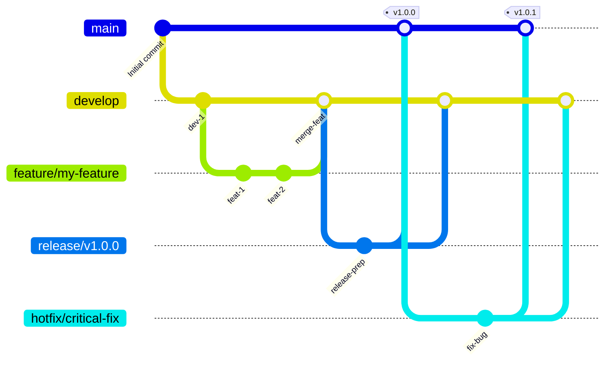

# GitFlow Branching Strategy (English Documentation)

This document explains the GitFlow branching strategy implemented in the `tree-sitter-analyzer` project using Mermaid diagrams and English descriptions.

## GitFlow Diagram



## Branch Structure

### Main Branches

- **`main`**: Production-ready code. Always contains the latest stable version. Should be deployable at any time.
- **`develop`**: Feature integration branch. Contains the latest delivered development changes and serves as the starting point for all feature development.

### Supporting Branches

- **`feature/*`**: Feature development branches.
    - **Origin**: `develop`
    - **Merge back to**: `develop`
    - **Naming**: `feature/descriptive-name` (e.g., `feature/user-authentication`)
- **`release/*`**: Release preparation branches. Used to prepare new production releases, performing only minor bug fixes and release-oriented tasks like documentation generation.
    - **Origin**: `develop`
    - **Merge back to**: `main` and `develop`
    - **Naming**: `release/v1.2.0`
- **`hotfix/*`**: Emergency production bug fix branches. Used to quickly fix critical issues in the production environment.
    - **Origin**: `main`
    - **Merge back to**: `main` and `develop`
    - **Naming**: `hotfix/critical-bug-fix`

## Workflow

### 1. Feature Development

1.  **Create `feature` branch from `develop`**: 
    ```bash
    git fetch origin
    git checkout -b feature/your-feature-name origin/develop
    ```
2.  **Develop the feature** and commit regularly.
3.  **After development completion**, push the `feature` branch to remote and create a Pull Request to the `develop` branch.
4.  After code review and continuous integration (CI) checks pass, **merge to `develop`**.

### 2. Release Process

The project recommends using automated release workflows, but the manual process is as follows:

1.  **Create `release` branch from `develop`**: 
    ```bash
    git fetch origin
    git checkout -b release/v1.0.0 origin/develop
    ```
2.  **Prepare release**: Update version numbers, generate documentation, etc.
    ```bash
    # Update version number in pyproject.toml
    # Update server_version
    # Sync version number to __init__.py
    uv run python scripts/sync_version_minimal.py

    # Get current test count statistics:
    # Test count: uv run python -m pytest --collect-only -q | findstr /C:"collected"
    # Note: Coverage uses Codecov automatic badge, no manual update needed

    # Update documentation:
    # - Update version number and test count in README.md
    # - Update version badge, test badge (coverage badge auto-updated by Codecov)
    # - Update version references in "Latest Quality Achievements" section
    # - Update version references in test environment section
    # - Update all other version references in documentation
    # - Update translated versions README_zh.md and README_ja.md
    # - If workflow changes exist, update GITFLOW_zh.md and GITFLOW_ja.md
    # - Update CHANGELOG.md release details
    ```
3.  **Push `release` branch to remote to trigger PyPI release**:
    ```bash
    git checkout release/v1.0.0
    git push origin release/v1.0.0
    ```
4.  **After PyPI release completion, merge to `main` and `develop`**:
    ```bash
    # Switch to main branch and merge
    git checkout main
    git merge release/v1.0.0
    git tag -a v1.0.0 -m "Release v1.0.0" # Add version tag
    git push origin main --tags

    # Switch to develop branch and merge
    git checkout develop
    git merge release/v1.0.0
    git push origin develop
    ```
5.  **Create GitHub Release**:
    ```bash
    # Create temporary release message file (avoid encoding and symbol errors)
    cat > release_message.md << 'EOF'
    ## v1.7.2 - File Output Optimization and ROO Rules Documentation

    ### 🎯 New Features
    - **File Output Optimization**: Added `suppress_output` and `output_file` parameters to MCP search tools, significantly reducing token consumption
    - **Automatic Format Detection**: Intelligent file format selection (JSON/Markdown) based on content type
    - **ROO Rules Documentation**: Added comprehensive tree-sitter-analyzer MCP optimization usage guide

    ### 📊 Quality Metrics
    - Test count: 2675 tests (100% pass rate)
    - Code coverage: 78.85%
    - New features: File output optimization significantly reduces AI conversation token consumption

    ### 🔧 Technical Improvements
    - Response size reduction up to 99% (when outputting large search results to files)
    - Backward compatible, no impact on existing functionality usage
    - Complete test coverage including file output optimization feature verification
    EOF

    # Create release using gh CLI
    gh release create v1.7.2 \
        --title "Release v1.7.2: File Output Optimization and ROO Rules Documentation" \
        --notes-file release_message.md \
        --target main

    # Delete temporary file
    rm release_message.md
    ```
6.  **Delete `release` branch**:
    ```bash
    # Delete local branch
    git branch -d release/v1.0.0
    # Delete remote branch
    git push origin --delete release/v1.0.0
    ```

**Important Explanation**: This release workflow adopts a "PyPI-first" strategy, ensuring the package is successfully published before updating the main branch. This approach avoids the risk of code being published on GitHub but packages being unavailable on PyPI, providing a safer release process.

### 3. Hotfix Process

1.  **Create `hotfix` branch from `main`**: 
    ```bash
    git fetch origin
    git checkout -b hotfix/critical-bug-fix origin/main
    ```
2.  **Fix the bug** and commit.
3.  **Update version and documentation**:
    ```bash
    # Update version number in pyproject.toml (e.g., 1.0.0 -> 1.0.1)
    # Update server_version
    # Sync version number to __init__.py
    uv run python scripts/sync_version_minimal.py

    # Get current test count statistics:
    # Test count: uv run python -m pytest --collect-only -q | findstr /C:"collected"
    # Note: Coverage uses Codecov automatic badge, no manual update needed

    # Update documentation:
    # - Add hotfix details to CHANGELOG.md
    # - Update version number and test count in README.md
    # - Update version badge, test badge (coverage badge auto-updated by Codecov)
    # - Update version references in "Latest Quality Achievements" section
    # - Update version references in test environment section
    # - Update all other version references in documentation
    # - Update translated versions README_zh.md and README_ja.md
    # - If workflow changes exist, update GITFLOW_zh.md and GITFLOW_ja.md
    ```
4.  **Push `hotfix` branch to remote to trigger PyPI release**:
    ```bash
    git checkout hotfix/critical-bug-fix
    git push origin hotfix/critical-bug-fix
    ```

5.  **After PyPI release completion, merge to `main` and `develop`**:
    ```bash
    # Switch to main branch and merge
    git checkout main
    git merge hotfix/critical-bug-fix
    git tag -a v1.0.1 -m "Hotfix v1.0.1" # Add fix version tag
    git push origin main --tags

    # Switch to develop branch and merge
    git checkout develop
    git merge hotfix/critical-bug-fix
    git push origin develop
    ```
6.  **Create GitHub Release**:
    ```bash
    # Create temporary hotfix release message file
    cat > hotfix_release_message.md << 'EOF'
    ## v1.0.1 - Emergency Fix

    ### 🐛 Fix Details
    - Fixed critical production environment issue
    - Improved system stability and security

    ### 📊 Quality Metrics
    - All tests passing
    - Emergency fix verification completed

    ### ⚡ Deployment Notes
    - This version is an emergency fix, immediate deployment to production environment recommended
    - Verified through complete testing
    EOF

    # Create hotfix release using gh CLI
    gh release create v1.0.1 \
        --title "Hotfix v1.0.1: Critical Production Fix" \
        --notes-file hotfix_release_message.md \
        --target main

    # Delete temporary file
    rm hotfix_release_message.md
    ```
7.  **Delete `hotfix` branch**:
    ```bash
    # Delete local branch
    git branch -d hotfix/critical-bug-fix
    # Delete remote branch
    git push origin --delete hotfix/critical-bug-fix
    ```

**Important Explanation**: This hotfix workflow also adopts the "PyPI-first" strategy, updating the main branch after successful package release to avoid the risk of emergency fix code being published but packages being unavailable.

**Note**: According to the actual automated workflow, hotfix branches **do** automatically trigger PyPI releases. However, this may cause version conflicts, so it's recommended to ensure version numbers are correctly updated before using hotfix branches.

## Automation Workflows

### Develop Branch Automation (`develop-automation.yml`)
When code is pushed to the `develop` branch, automatically executes:

1. **Test Job**:
   - Run complete test suite using pytest with detailed traceback and failure limits
   - Generate coverage reports (XML and terminal formats)
   - Upload coverage to Codecov

2. **Build Job**:
   - Build Python package using `python -m build`
   - Validate package using `twine check`
   - Upload build artifacts (retained for 1 day)

3. **Create Release PR Job**:
   - Automatically create PR from develop to main
   - Include quality metrics and test results
   - Ready for production deployment

**Important**: Pushes to develop branch do **not** trigger PyPI deployment.

### Release Branch Automation (`release-automation.yml`)
When code is pushed to `release/v*` branches, automatically executes:

1. **Test Job**:
   - Run complete test suite using pytest with detailed traceback and failure limits
   - Generate coverage reports (XML and terminal formats)
   - Upload coverage to Codecov

2. **Build and Deploy Job**:
   - Build Python package
   - Validate package using `twine check`
   - **Deploy to PyPI using `twine upload`**

3. **Create Main PR Job**:
   - Create PR to main branch after successful PyPI deployment
   - Marked as critical hotfix, ready for immediate production

### Hotfix Branch Automation (`hotfix-automation.yml`)
When code is pushed to `hotfix/*` branches, automatically executes:

1. **Test Job**:
   - Run complete test suite using pytest with detailed traceback and failure limits
   - Generate coverage reports (XML and terminal formats)

2. **Build and Deploy Job**:
   - Build Python package
   - Validate package using `twine check`
   - **Deploy to PyPI using `twine upload`**

3. **Create Main PR Job**:
   - Create PR to main branch after successful PyPI deployment
   - Marked as critical hotfix, ready for immediate production

**Important**: According to the actual automated workflow, hotfix branches **do** automatically trigger PyPI deployment, same as release branches. This may cause version conflicts, so careful use of hotfix branches is recommended.

### CI Workflow (`ci.yml`)
Runs on all branches (`main`, `develop`, `hotfix/*`, `feature/*`, `release/*`) and PRs:

1. **Quality Check Job**:
   - Multi-Python version testing (3.10, 3.11, 3.12, 3.13)
   - Code quality checks using `check_quality.py`

2. **Test Matrix Job**:
   - Cross-platform testing (Ubuntu, Windows, macOS)
   - Multi-Python version compatibility testing

**PyPI Deployment Strategy**: Both `release/*` and `hotfix/*` branches automatically deploy to PyPI. However, hotfix branches may cause version conflicts, so careful usage is recommended.

---

*This English documentation aims to help understand the core concepts in [`GITFLOW.md`](GITFLOW.md). For more detailed information on automation workflows, quality checks, and CI/CD integration, please refer to the original [GITFLOW.md](GITFLOW.md) file.*