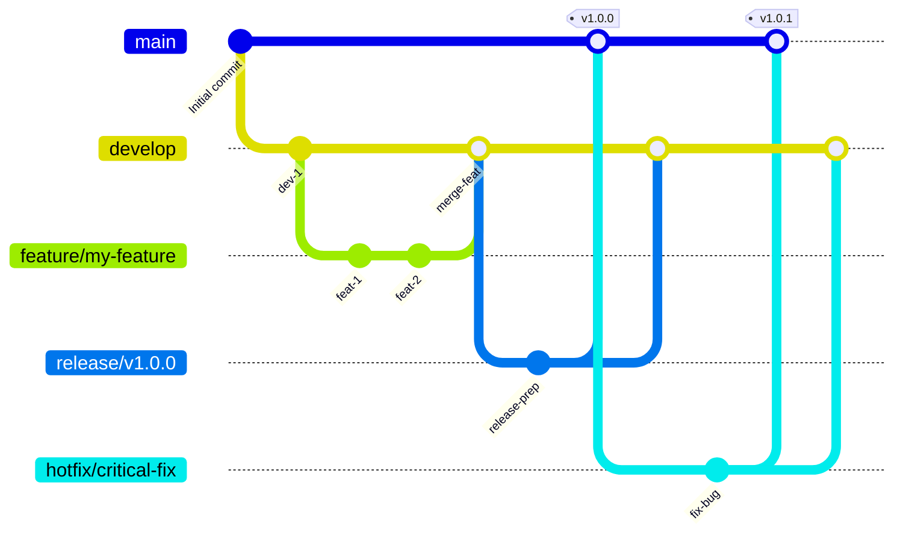

# GitFlow 分支策略 (中文说明)

本文档使用 Mermaid 图表和中文解释了 `tree-sitter-analyzer` 项目中实施的 GitFlow 分支策略。

## GitFlow 流程图



## 分支结构

### 主要分支

- **`main`**: 生产就绪的代码。始终包含最新的稳定版本。任何时候都应该是可部署的状态。
- **`develop`**: 功能集成分支。包含最新的已交付开发变更，是所有功能开发的起点。

### 支持分支

- **`feature/*`**: 功能开发分支。
    - **来源**: `develop`
    - **合并回**: `develop`
    - **命名**: `feature/descriptive-name` (例如: `feature/user-authentication`)
- **`release/*`**: 版本发布准备分支。用于准备新的生产版本，只进行少量 Bug 修复和文档生成等面向发布的任务。
    - **来源**: `develop`
    - **合并回**: `main` 和 `develop`
    - **命名**: `release/v1.2.0`
- **`hotfix/*`**: 紧急生产 Bug 修复分支。用于快速修复生产环境中的关键问题。
    - **来源**: `main`
    - **合并回**: `main` 和 `develop`
    - **命名**: `hotfix/critical-bug-fix`

## 工作流程

### 1. 功能开发 (Feature Development)

1.  **从 `develop` 创建 `feature` 分支**: 
    ```bash
    git fetch origin
    git checkout -b feature/your-feature-name origin/develop
    ```
2.  **进行功能开发**并定期提交。
3.  **开发完成后**，将 `feature` 分支推送到远程，并创建拉取请求 (Pull Request) 到 `develop` 分支。
4.  经过代码审查和持续集成 (CI) 检查通过后，**合并到 `develop`**。

### 2. 版本发布 (Release Process)

项目推荐使用自动化发布流程，但手动流程如下：

1.  **从 `develop` 创建 `release` 分支**: 
    ```bash
    git fetch origin
    git checkout -b release/v1.0.0 origin/develop
    ```
2.  **准备发布**: 更新版本号、生成文档等。
    ```bash
    # 更新 pyproject.toml 中的版本号
    # 更新 server_version
    # 同步版本号到 __init__.py
    uv run python scripts/sync_version_minimal.py

    # 获取当前测试数量统计：
    # 测试数量: uv run python -m pytest --collect-only -q | findstr /C:"collected"
    # 注意：覆盖率使用Codecov自动徽章，无需手动更新

    # 更新文档：
    # - 更新 README.md 中的版本号和测试数量
    # - 更新版本徽章、测试徽章（覆盖率徽章使用Codecov自动更新）
    # - 更新"最新质量成就"部分的版本引用
    # - 更新测试环境部分的版本引用
    # - 更新文档中的所有其他版本引用
    # - 更新 README_zh.md 和 README_ja.md 翻译版本
    # - 如有工作流更改，更新 GITFLOW_zh.md 和 GITFLOW_ja.md
    # - 更新 CHANGELOG.md 发布详情
    ```
3.  **推送 `release` 分支到远程以触发 PyPI 发布**:
    ```bash
    git checkout release/v1.0.0
    git push origin release/v1.0.0
    ```
4.  **等待 PyPI 发布完成并验证**:
    ```bash
    # 等待自动化工作流完成PyPI发布
    # 可以通过GitHub Actions页面监控发布状态
    # 验证PyPI包是否成功发布：
    # pip install tree-sitter-analyzer==1.0.0 --dry-run
    ```
5.  **PyPI 发布成功后，合并到 `main` 和 `develop`**:
    ```bash
    # 切换到 main 分支并合并
    git checkout main
    git merge release/v1.0.0
    git tag -a v1.0.0 -m "Release v1.0.0" # 打上版本标签
    git push origin main --tags

    # 切换到 develop 分支并合并
    git checkout develop
    git merge release/v1.0.0
    git push origin develop
    ```
6.  **创建GitHub Release**:
    ```bash
    # 创建临时的release消息文件（避免编码和符号错误）
    cat > release_message.md << 'EOF'
    ## v1.7.2 - 文件输出优化和ROO规则文档

    ### 🎯 新增功能
    - **文件输出优化**: MCP搜索工具新增`suppress_output`和`output_file`参数，大幅节省token消耗
    - **自动格式检测**: 智能选择文件格式（JSON/Markdown），基于内容类型自动决定
    - **ROO规则文档**: 新增完整的tree-sitter-analyzer MCP优化使用指南

    ### 📊 质量指标
    - 测试数量: 2675个测试（100%通过）
    - 代码覆盖率: 78.85%
    - 新增功能: 文件输出优化，大幅节省AI对话token消耗

    ### 🔧 技术改进
    - 响应大小减少高达99%（大型搜索结果文件输出时）
    - 向后兼容，不影响现有功能使用
    - 完整的测试覆盖，包含文件输出优化功能验证
    EOF

    # 使用gh CLI创建release
    gh release create v1.7.2 \
        --title "Release v1.7.2: File Output Optimization and ROO Rules Documentation" \
        --notes-file release_message.md \
        --target main

    # 删除临时文件
    rm release_message.md
    ```
7.  **删除 `release` 分支**:
    ```bash
    # 删除本地分支
    git branch -d release/v1.0.0
    # 删除远程分支
    git push origin --delete release/v1.0.0
    ```

**重要说明**: 此流程采用"PyPI优先"策略，确保包发布成功后再更新main分支，避免代码已发布但包不可用的风险。

### 3. 紧急修复 (Hotfix Process)

1.  **从 `main` 创建 `hotfix` 分支**: 
    ```bash
    git fetch origin
    git checkout -b hotfix/critical-bug-fix origin/main
    ```
2.  **修复 Bug** 并提交。
3.  **更新版本和文档**:
    ```bash
    # 更新 pyproject.toml 版本号 (例如: 1.0.0 -> 1.0.1)
    # 更新 server_version
    # 同步版本号到 __init__.py
    uv run python scripts/sync_version_minimal.py

    # 获取当前测试数量统计：
    # 测试数量: uv run python -m pytest --collect-only -q | findstr /C:"collected"
    # 注意：覆盖率使用Codecov自动徽章，无需手动更新

    # 更新文档：
    # - 更新 CHANGELOG.md 添加 hotfix 详情
    # - 更新 README.md 中的版本号和测试数量
    # - 更新版本徽章、测试徽章（覆盖率徽章使用Codecov自动更新）
    # - 更新"最新质量成就"部分的版本引用
    # - 更新测试环境部分的版本引用
    # - 更新文档中的所有其他版本引用
    # - 更新 README_zh.md 和 README_ja.md 翻译版本
    # - 如有工作流更改，更新 GITFLOW_zh.md 和 GITFLOW_ja.md
    ```
4.  **推送 `hotfix` 分支到远程以触发 PyPI 发布**:
    ```bash
    git checkout hotfix/critical-bug-fix
    git push origin hotfix/critical-bug-fix
    ```
5.  **等待 PyPI 发布完成并验证**:
    ```bash
    # 等待自动化工作流完成PyPI发布
    # 可以通过GitHub Actions页面监控发布状态
    # 验证PyPI包是否成功发布：
    # pip install tree-sitter-analyzer==1.0.1 --dry-run
    ```
6.  **PyPI 发布成功后，合并到 `main` 和 `develop`**:
    ```bash
    # 切换到 main 分支并合并
    git checkout main
    git merge hotfix/critical-bug-fix
    git tag -a v1.0.1 -m "Hotfix v1.0.1" # 打上修复版本标签
    git push origin main --tags

    # 切换到 develop 分支并合并
    git checkout develop
    git merge hotfix/critical-bug-fix
    git push origin develop
    ```
7.  **创建GitHub Release**:
    ```bash
    # 创建临时的hotfix release消息文件
    cat > hotfix_release_message.md << 'EOF'
    ## v1.0.1 - 紧急修复

    ### 🐛 修复内容
    - 修复了关键的生产环境问题
    - 提高了系统稳定性和安全性

    ### 📊 质量指标
    - 所有测试通过
    - 紧急修复验证完成

    ### ⚡ 部署说明
    - 此版本为紧急修复，建议立即部署到生产环境
    - 已通过完整的测试验证
    EOF

    # 使用gh CLI创建hotfix release
    gh release create v1.0.1 \
        --title "Hotfix v1.0.1: Critical Production Fix" \
        --notes-file hotfix_release_message.md \
        --target main

    # 删除临时文件
    rm hotfix_release_message.md
    ```
8.  **删除 `hotfix` 分支**:
    ```bash
    # 删除本地分支
    git branch -d hotfix/critical-bug-fix
    # 删除远程分支
    git push origin --delete hotfix/critical-bug-fix
    ```

**重要说明**: 此hotfix流程同样采用"PyPI优先"策略，确保包发布成功后再更新main分支，避免紧急修复代码已发布但包不可用的风险。

**注意**: 根据实际的自动化工作流，hotfix分支**会**自动触发PyPI发布。但这可能导致版本冲突，建议在使用hotfix分支前确保版本号正确更新。

## 自动化流程

### Develop 分支自动化 (`develop-automation.yml`)
当代码推送到 `develop` 分支时，自动执行：

1. **测试作业**：
   - 使用pytest运行完整测试套件，包含详细回溯和失败限制
   - 生成覆盖率报告（XML和终端格式）
   - 上传覆盖率到Codecov

2. **构建作业**：
   - 使用 `python -m build` 构建Python包
   - 使用 `twine check` 验证包
   - 上传构建产物（保留1天）

3. **创建发布PR作业**：
   - 自动创建从develop到main的PR
   - 包含质量指标和测试结果
   - 为生产部署做好准备

**重要**：develop分支推送**不会**触发PyPI部署。

### Release 分支自动化 (`release-automation.yml`)
当代码推送到 `release/v*` 分支时，自动执行：

1. **测试作业**：
   - 使用pytest运行完整测试套件，包含详细回溯和失败限制
   - 生成覆盖率报告（XML和终端格式）
   - 上传覆盖率到Codecov

2. **构建和部署作业**：
   - 构建Python包
   - 使用 `twine check` 验证包
   - **使用 `twine upload` 部署到PyPI**

3. **创建Main PR作业**：
   - PyPI部署成功后创建到main分支的PR
   - 标记为关键热修复，准备立即投入生产

### Hotfix 分支自动化 (`hotfix-automation.yml`)
当代码推送到 `hotfix/*` 分支时，自动执行：

1. **测试作业**：
   - 使用pytest运行完整测试套件
   - 生成覆盖率报告
   - 上传覆盖率到Codecov

2. **构建和部署作业**：
   - 构建Python包
   - 使用 `twine check` 验证包
   - **使用 `twine upload` 部署到PyPI**

3. **创建Main PR作业**：
   - PyPI部署成功后创建到main分支的PR
   - 标记为关键热修复，准备立即投入生产

**重要**: 实际上hotfix分支**会**自动触发PyPI部署，与release分支相同。这可能导致版本冲突，建议谨慎使用hotfix分支。

### CI 工作流 (`ci.yml`)
在所有分支（`main`、`develop`、`hotfix/*`、`feature/*`、`release/*`）和PR上运行：

1. **质量检查作业**：
   - 多Python版本测试（3.10、3.11、3.12、3.13）
   - 使用 `check_quality.py` 进行代码质量检查

2. **测试矩阵作业**：
   - 跨平台测试（Ubuntu、Windows、macOS）
   - 多Python版本兼容性测试

**PyPI部署策略**：`release/*` 和 `hotfix/*` 分支都会自动部署到PyPI。但需要注意hotfix分支可能导致版本冲突，建议谨慎使用。

---

*此中文说明旨在帮助理解 `GITFLOW.md` 中的核心概念。更详细的自动化流程、质量检查和 CI/CD 集成信息，请参阅原始的 [GITFLOW.md](GITFLOW.md) 文件。*
