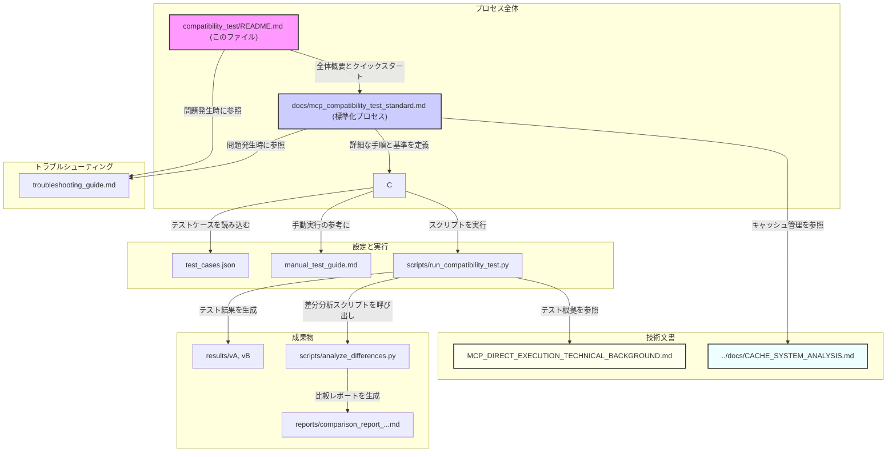

# tree-sitter-analyzer MCP互換性テスト 標準化プロセス

このディレクトリには、`tree-sitter-analyzer` の異なるバージョン間におけるMCP（Model Context Protocol）ツールの互換性を、一貫性と再現性をもって評価するための標準化されたプロセスとツールが含まれています。

## 📋 概要

このプロセスは、v1.6.1.2とv1.9.2の比較テストで得られた知見（`capture_name` フィールドの変更など）を基に設計されており、将来的な任意のバージョン間比較（例：v1.9.2 vs v1.9.3）を効率的かつ正確に実施できます。

## 🎯 主な特徴

- **3段階のテストアプローチ**: 自動実行 → 機械的差分検出 → 専門家レビュー
- **標準化されたテストケース**: JSON形式で定義された再利用可能なテストケース
- **自動差分分析**: JSONの構造的変更やパフォーマンス変動を自動検出
- **詳細なレポート生成**: 標準フォーマットでの比較レポート自動生成
- **包括的なトラブルシューティング**: 実際の問題と解決方法を文書化

## 📁 ディレクトリ構造

```
compatibility_test/
├── README.md                                    # このファイル
├── test_cases.json                              # テストケース定義
├── troubleshooting_guide.md                     # トラブルシューティングガイド
├── manual_test_guide.md                         # 手動テストガイド
├── MCP_DIRECT_EXECUTION_TECHNICAL_BACKGROUND.md # MCP直接実行の技術的背景
├── mcp_compatibility_test.py                    # 互換性テストメインスクリプト
├── mcp_compatibility_final_report_*.md          # 最終テストレポート（自動生成）
├── mcp_test_results_*.json                      # テスト結果JSON（自動生成）
├── version_comparison_detailed_analysis_*.md    # 詳細分析レポート（自動生成）
├── v1.6.1.1_test_cases.md                      # 旧バージョンテストケース
├── scripts/                                     # 自動化スクリプト
│   ├── run_compatibility_test.py                # メインテストスクリプト
│   └── analyze_differences.py                   # 差分分析スクリプト
├── templates/                                   # 設定テンプレート
│   ├── mcp_settings.json.template               # MCPサーバー設定テンプレート
│   └── comparison_report_template.md            # レポートテンプレート
├── utils/                                       # ユーティリティモジュール
│   ├── __init__.py                              # パッケージ初期化
│   ├── cache_manager.py                         # キャッシュ管理
│   └── cache_reporter.py                        # キャッシュレポート生成
├── results/                                     # テスト結果（自動生成）
│   ├── v1.6.1.2/                               # バージョン1.6.1.2の出力
│   ├── v1.9.2/                                 # バージョン1.9.2の出力
│   └── v{VERSION}/                              # その他のバージョンの出力
└── reports/                                     # 分析レポート（自動生成）
    └── comparison_report_*.md                   # バージョン比較レポート
```

## 🚀 クイックスタート

### 前提条件

- Python 3.10以上
- `uv` パッケージマネージャー
- Windows環境（他のOSでも動作しますが、パス設定の調整が必要）

### 1. 基本的な使用方法

```bash
# v1.9.2とv1.9.3を比較する場合
python compatibility_test/scripts/run_compatibility_test.py --version-a 1.9.2 --version-b 1.9.3
```

### 2. 詳細な差分分析

```bash
# テスト実行後、詳細な差分分析を実行
python compatibility_test/scripts/analyze_differences.py --version-a 1.9.2 --version-b 1.9.3
```

### 3. 結果の確認

- **テスト結果**: `compatibility_test/results/v{VERSION}/` に各バージョンの出力ファイル
- **比較レポート**: `compatibility_test/reports/` に自動生成されたマークダウンレポート

## 📖 詳細ドキュメント

### 標準化プロセスの詳細

完全な標準化プロセスについては、以下のドキュメントを参照してください：

- **[MCP互換性テスト標準化プロセス](../docs/mcp_compatibility_test_standard.md)**: 基本方針、環境設定、テスト手順、評価基準の詳細

### テストケースのカスタマイズ

`test_cases.json` を編集することで、テストケースをカスタマイズできます：

```json
{
  "analyze_code_structure": [
    {
      "id": "custom_test",
      "params": {
        "file_path": "path/to/your/file.py",
        "format_type": "full"
      },
      "output_file": "custom_analysis.txt"
    }
  ]
}
```

### MCPサーバー設定

`templates/mcp_settings.json.template` を参考に、比較したいバージョンのMCPサーバー設定を追加してください。

## 🔧 高度な使用方法

### カスタムプロジェクトルートの指定

```bash
python compatibility_test/scripts/run_compatibility_test.py \
  --version-a 1.9.2 \
  --version-b 1.9.3 \
  --project-root /path/to/your/project
```

### JSON形式での差分結果出力

```bash
python compatibility_test/scripts/analyze_differences.py \
  --version-a 1.9.2 \
  --version-b 1.9.3 \
  --output-json analysis_results.json
```

### 特定のツールのみテスト

`test_cases.json` を編集して、不要なツールのセクションを削除またはコメントアウトしてください。

## 📊 テスト対象ツール

以下の8つの主要MCPツールがテスト対象です：

1. **analyze_code_structure** - コード構造の詳細分析
2. **query_code** - tree-sitterクエリによるコード要素抽出
3. **check_code_scale** - コードスケールと複雑度分析
4. **extract_code_section** - 指定範囲のコード抽出
5. **set_project_path** - プロジェクトルートパスの設定
6. **list_files** - ファイル一覧の取得
7. **find_and_grep** - ファイル検索とコンテンツ検索の組み合わせ
8. **search_content** - コンテンツ内検索

## 🔍 差分分析の評価基準

検出された差分は以下の基準で分類されます：

| 分類 | 説明 | 例 |
|------|------|-----|
| **破壊的変更** | 既存実装に影響する変更 | JSONキー名変更（`methods`→`method`） |
| **非破壊的変更** | 機能追加や改善 | 新フィールドの追加 |
| **バグ/意図しない変更** | 明らかに誤った出力 | 不正なJSON形式 |
| **一致** | 完全に同一の出力 | テキスト/JSONが完全一致 |

## 🛠️ トラブルシューティング

問題が発生した場合は、[トラブルシューティングガイド](troubleshooting_guide.md) を参照してください。

### よくある問題

- **"No tools available" エラー**: MCPサーバーの設定または起動に問題
- **ファイルが見つからない**: パス設定やプロジェクトルートの問題
- **テストが遅い**: 大きなファイルやネットワークの問題
- **テスト結果が一致しない**: キャッシュが原因で、古いバージョンの結果が返されている可能性があります。テスト前にキャッシュをクリアしてください。

### キャッシュ管理

本テストプロセスでは、結果の信頼性を確保するために、テスト実行前にキャッシュを自動的にクリアする仕組みを備えています。

- **キャッシュクリア**: `compatibility_test/utils/cache_manager.py` が、`UnifiedAnalysisEngine`と`SearchContentTool`の両方のキャッシュをクリアします。
- **状態レポート**: `compatibility_test/utils/cache_reporter.py` は、キャッシュの状態を分析し、レポートを生成します。

テストが予期せぬ動作をした場合は、まずキャッシュが正しくクリアされているか確認してください。手動でキャッシュをクリアするには、以下のコマンドを実行します。

```bash
python compatibility_test/utils/cache_manager.py clear
```

## 📈 継続的改善

### フィードバックの提供

テストプロセスの改善点や新しい問題を発見した場合は、以下の情報を含めて報告してください：

1. 環境情報（OS、Pythonバージョン等）
2. 実行したコマンドと設定
3. エラーメッセージやログ
4. 期待される結果と実際の結果

### プロセスの拡張

新しいツールやテストケースを追加する場合：

1. `test_cases.json` に新しいテストケースを追加
2. 必要に応じて評価基準を更新
3. ドキュメントを更新

## 📚 関連ドキュメントと情報フロー

この互換性テストプロセスは、複数のドキュメントとスクリプト、設定ファイルから構成されています。以下の図は、それらの関係性と情報の流れを示しています。



### 主要ドキュメント一覧

- **[標準化プロセス詳細](../docs/mcp_compatibility_test_standard.md)**: 完全な標準化プロセスの説明。**最初に読むべき最も重要なドキュメント**です。
- **[トラブルシューティングガイド](troubleshooting_guide.md)**: 問題解決の手順。
- **[手動テストガイド](manual_test_guide.md)**: 自動化スクリプトを使わずに手動でテストを実行する手順。
- **[過去のテスト結果](version_comparison_detailed_analysis_20251021_015957.md)**: v1.6.1.2 vs v1.9.2の詳細分析。

### 技術文書

- **[MCP直接実行の技術的背景](MCP_DIRECT_EXECUTION_TECHNICAL_BACKGROUND.md)**: なぜ互換性テストでMCPサーバーを経由せずに直接ツールクラスを実行できるのか、その技術的根拠を詳しく説明。
- **[キャッシュシステム設計分析](../docs/CACHE_SYSTEM_ANALYSIS.md)**: 2つのキャッシュシステムの設計妥当性と改善提案。

## 🎯 今後の展望

このプロセスは以下の方向で継続的に改善されます：

1. **自動化の拡張**: CI/CDパイプラインとの統合
2. **テストカバレッジの向上**: より多くのエッジケースのテスト
3. **パフォーマンス最適化**: 大規模プロジェクトでの実行時間短縮
4. **レポートの充実**: より詳細で分かりやすい分析レポート

## 📄 ライセンス

このテストプロセスは、tree-sitter-analyzerプロジェクトと同じライセンスの下で提供されます。

---

**注意**: このプロセスは実際のv1.6.1.2とv1.9.2の比較テストで発見された問題と知見に基づいて設計されています。新しいバージョンや異なる環境では、追加の調整が必要になる場合があります。

## 🔧 スマートJSON比較機能

### 基本的な使用方法
```bash
# スマート比較モード（推奨）
python compatibility_test/scripts/analyze_differences.py \
  --version-a 1.9.2 \
  --version-b 1.6.1.2 \
  --smart-compare \
  --generate-normalized
```

### 設定のカスタマイズ
`compatibility_test/config/comparison_config.json`で比較ルールをカスタマイズできます：
- パフォーマンス関連フィールドの無視
- 配列のソート基準の指定
- フィールド順序の正規化
