# Tree-sitter Chunker

A high-performance semantic code chunker that leverages [Tree-sitter](https://tree-sitter.github.io/) parsers to intelligently split source code into meaningful chunks like functions, classes, and methods.

[](https://www.python.org/downloads/)
[](https://tree-sitter.github.io/)
[](https://pypi.org/project/treesitter-chunker/)
[](LICENSE)
[]()
[]()
[]()
[]()

**🚀 Production Ready**: Version 2.0.1 is now available on PyPI with prebuilt wheels, no local compilation required for basic usage!

## 🏗️ Architecture Overview

Tree-sitter Chunker is designed as a modular, high-performance semantic code analysis system. The following C4-style diagram illustrates how the major components fit together:

```mermaid
flowchart TB
    subgraph "External Systems"
        DEV[👤 Developer<br/>CLI/SDK User]
        AGENT[🤖 LLM/Agent<br/>REST API Consumer]
    end

    subgraph chunker["Tree-sitter Chunker System"]
        subgraph interface["Interface Layer"]
            CLI[CLI Interface<br/>treesitter-chunker]
            API[REST API<br/>FastAPI :8000]
            SDK[Python SDK<br/>import chunker]
        end

        subgraph core["Core Processing"]
            CORE[Core Chunker<br/>chunk_file・chunk_text]
            TOKEN[Token-Aware Chunker<br/>pack_hint・max_tokens]
            REPO[Repository Processor<br/>parallel・git-aware]
        end

        subgraph lang["Language Support"]
            PARSER[Parser Factory<br/>caching・pooling]
            PLUGINS[Language Plugins<br/>36+ built-in]
            GRAMMAR[Grammar Manager<br/>100+ auto-download]
        end

        subgraph graph["Graph & Analysis"]
            XREF[XRef Builder<br/>build_xref]
            CUT[Graph Cut<br/>BFS・scoring]
            META[Metadata Extractor<br/>calls・symbols・complexity]
        end

        subgraph export["Export Layer"]
            PG[(PostgreSQL)]
            NEO[(Neo4j)]
            FILES[JSON・JSONL<br/>Parquet・GraphML]
        end
    end

    subgraph external["External Dependencies"]
        TS[🌳 Tree-sitter<br/>AST Parsing]
        TIK[🔢 tiktoken<br/>Token Counting]
    end

    DEV --> CLI & SDK
    AGENT --> API

    CLI & API & SDK --> CORE
    CORE --> TOKEN
    REPO --> CORE

    CORE --> PARSER
    PARSER --> PLUGINS
    PARSER --> GRAMMAR
    PARSER --> TS

    CORE --> META
    META --> XREF
    XREF --> CUT

    TOKEN --> TIK

    XREF --> PG & NEO & FILES
    CUT --> API
```



### Data Flow: From Code to Chunks

```mermaid
flowchart LR
    subgraph input["📥 Input"]
        FILE[Source Files]
        TEXT[Code Text]
    end

    subgraph process["⚙️ Processing Pipeline"]
        PARSE[1. Parse<br/>Tree-sitter AST]
        WALK[2. Walk<br/>Extract Nodes]
        CHUNK[3. Chunk<br/>Create CodeChunk]
        ENRICH[4. Enrich<br/>Metadata・Tokens]
    end

    subgraph output["📤 Output"]
        CHUNKS[CodeChunks<br/>with stable IDs]
        GRAPH[Graph Model<br/>nodes・edges]
        SPANS[Byte Spans<br/>file_id・symbol_id]
    end

    FILE & TEXT --> PARSE --> WALK --> CHUNK --> ENRICH
    ENRICH --> CHUNKS --> GRAPH & SPANS
```



For detailed architecture documentation, see [docs/architecture.md](docs/architecture.md).

---

## 📊 Performance Benchmarks

Tree-sitter Chunker is designed for high-performance code analysis:

| Metric | Performance | Comparison |
|--------|-------------|------------|
| **Speed** | 11.9x faster with AST caching | vs. repeated parsing |
| **Memory** | Streaming support for 10GB+ files | vs. loading entire files |
| **Languages** | 36+ built-in, 100+ auto-download | vs. manual grammar setup |
| **Parallel** | 8x speedup on 8-core systems | vs. single-threaded |
| **Cache Hit** | 95%+ for repeated files | vs. no caching |

## ✨ Key Features

- 🎯 **Semantic Understanding** - Extracts functions, classes, methods based on AST
- 🚀 **Blazing Fast** - 11.9x speedup with intelligent AST caching
- 🌍 **Universal Language Support** - Auto-download and support for 100+ Tree-sitter grammars
- 🔌 **Plugin Architecture** - Built-in plugins for 29 languages + auto-download support for 100+ more including all major programming languages
- 🎛️ **Flexible Configuration** - TOML/YAML/JSON config files with per-language settings
- 📊 **14 Export Formats** - JSON, JSONL, Parquet, CSV, XML, GraphML, Neo4j, DOT, SQLite, PostgreSQL, and more
- ⚡ **Parallel Processing** - Process entire codebases with configurable workers
- 🌊 **Streaming Support** - Handle files larger than memory
- 🎨 **Rich CLI** - Progress bars, batch processing, and filtering
- 🤖 **LLM-Ready** - Token counting, chunk optimization, and context-aware splitting
- 📝 **Text File Support** - Markdown, logs, config files with intelligent chunking
- 🔍 **Advanced Query** - Natural language search across your codebase
- 📈 **Graph Export** - Visualize code structure in yEd, Neo4j, or Graphviz
- 🐛 **Debug Tools** - AST visualization, chunk inspection, performance profiling
- 🔧 **Developer Tools** - Pre-commit hooks, CI/CD generation, quality metrics
- 📦 **Multi-Platform Distribution** - PyPI, Docker, Homebrew packages
- 🌐 **Zero-Configuration** - Automatic language detection and grammar download
- 🚀 **Production Ready** - Prebuilt wheels with embedded grammars, no local compilation required

## 📦 Installation

### Prerequisites
- Python 3.8+ (for Python usage)
- C compiler (for building Tree-sitter grammars - only needed if using languages not included in prebuilt wheels)

### Installation Methods

#### From PyPI (Recommended)
```bash
# Install the latest stable version
pip install treesitter-chunker

# With REST API support
pip install "treesitter-chunker[api]"

# With visualization tools (requires graphviz system package)
pip install "treesitter-chunker[viz]"

# With all optional dependencies
pip install "treesitter-chunker[all]"
```

#### Using UV (Fast Python Package Manager)
```bash
# Install UV if you haven't already
curl -LsSf https://astral.sh/uv/install.sh | sh

# Install the latest stable version
uv pip install treesitter-chunker

# With REST API support
uv pip install "treesitter-chunker[api]"

# With visualization tools
uv pip install "treesitter-chunker[viz]"

# With all optional dependencies
uv pip install "treesitter-chunker[all]"
```

**Note**: Prebuilt wheels include compiled Tree-sitter grammars for common languages (Python, JavaScript, Rust, C, C++), so no local compilation is required for basic usage.

### No Local Builds Required

Starting with version 1.0.7+, `treesitter-chunker` wheels include precompiled Tree-sitter grammars for common languages. This means:

- ✅ **Immediate Use**: No C compiler or build tools required for basic languages
- ✅ **Faster Installation**: Wheels install instantly without compilation
- ✅ **Consistent Performance**: Same grammar versions across all installations
- ✅ **Offline Capable**: Works without internet access after installation

**Supported Languages in Prebuilt Wheels:**
- Python, JavaScript, TypeScript, JSX, TSX
- C, C++, Rust
- Additional languages can be built on-demand if needed

### 🌍 Language Support Matrix

| Language | Status | Plugin | Auto-Download | Prebuilt |
|----------|--------|--------|---------------|----------|
| **Python** | ✅ Production | ✅ Built-in | ✅ Available | ✅ Included |
| **JavaScript/TypeScript** | ✅ Production | ✅ Built-in | ✅ Available | ✅ Included |
| **Rust** | ✅ Production | ✅ Built-in | ✅ Available | ✅ Included |
| **C/C++** | ✅ Production | ✅ Built-in | ✅ Available | ✅ Included |
| **Go** | ✅ Production | ✅ Built-in | ✅ Available | 🔧 Buildable |
| **Java** | ✅ Production | ✅ Built-in | ✅ Available | 🔧 Buildable |
| **Ruby** | ✅ Production | ✅ Built-in | ✅ Available | 🔧 Buildable |
| **PHP** | ✅ Production | ✅ Built-in | ✅ Available | 🔧 Buildable |
| **C#** | ✅ Production | ✅ Built-in | ✅ Available | 🔧 Buildable |
| **Swift** | ✅ Production | ✅ Built-in | ✅ Available | 🔧 Buildable |
| **Kotlin** | ✅ Production | ✅ Built-in | ✅ Available | 🔧 Buildable |
| **+ 26 more** | ✅ Production | ✅ Built-in | ✅ Available | 🔧 Buildable |

**Legend**: ✅ Production Ready, 🔧 Buildable on-demand, 🚧 Experimental

**For Advanced Usage:**
If you need languages not included in prebuilt wheels, the package can still build them locally using the same build system used during wheel creation.

#### For Other Languages
See [Cross-Language Usage Guide](docs/cross-language-usage.md) for using from JavaScript, Go, Ruby, etc.

#### Using Docker
```bash
docker pull ghcr.io/consiliency/treesitter-chunker:latest
docker run -v $(pwd):/workspace treesitter-chunker chunk /workspace/example.py -l python
```

#### Using Homebrew (macOS/Linux)
```bash
brew tap consiliency/treesitter-chunker
brew install treesitter-chunker
```

#### For Debian/Ubuntu
```bash
# Download .deb package from releases
sudo dpkg -i python3-treesitter-chunker_1.0.0-1_all.deb
```

#### For Fedora/RHEL
```bash
# Download .rpm package from releases
sudo rpm -i python-treesitter-chunker-1.0.0-1.noarch.rpm
```

### Quick Install (Development)

```bash
# Clone the repository
git clone https://github.com/Consiliency/treesitter-chunker.git
cd treesitter-chunker

# Install with uv (recommended)
uv venv
source .venv/bin/activate  # On Windows: .venv\Scripts\activate
uv pip install -e ".[dev]"
uv pip install git+https://github.com/tree-sitter/py-tree-sitter.git

# Build language grammars
python scripts/fetch_grammars.py
python scripts/build_lib.py

# Verify installation
python -c "from chunker.parser import list_languages; print(list_languages())"
# Output: ['c', 'cpp', 'javascript', 'python', 'rust']
```

### Grammar Setup

Tree-sitter Chunker requires compiled grammar libraries for parsing. Prebuilt wheels include common languages (Python, JavaScript, Rust), but you can set up additional grammars using the CLI.

#### CLI Setup (Recommended)

```bash
# Set up default languages (python, javascript, rust)
treesitter-chunker setup grammars

# Set up specific languages
treesitter-chunker setup grammars python go java typescript

# Set up all extended languages (10 common languages)
treesitter-chunker setup grammars --all

# Check setup status
treesitter-chunker setup status

# List all available grammars
treesitter-chunker setup list-available

# Clean up grammar files
treesitter-chunker setup clean --builds  # Remove built libraries only
treesitter-chunker setup clean --all     # Remove sources and builds
```

#### Environment Configuration

You can customize where grammars are stored:

```bash
# Set custom build directory (persists across installations)
export CHUNKER_GRAMMAR_BUILD_DIR="$HOME/.cache/treesitter-chunker/build"
```

#### Programmatic Setup

For advanced use cases, you can set up grammars programmatically:

```python
from pathlib import Path
from chunker.grammar.manager import TreeSitterGrammarManager

cache = Path.home() / ".cache" / "treesitter-chunker"
gm = TreeSitterGrammarManager(grammars_dir=cache / "grammars", build_dir=cache / "build")
gm.add_grammar("python", "https://github.com/tree-sitter/tree-sitter-python")
gm.fetch_grammar("python")
gm.build_grammar("python")
```

#### Requirements for Building Grammars

Building grammars from source requires:
- **C compiler** (gcc, clang, or MSVC)
- **Git** (for fetching grammar sources)
- **Python development headers** (usually included with Python installation)

## 🚀 Quick Start

### Python Usage

```python
from chunker import chunk_file, chunk_text, chunk_directory

# Extract chunks from a Python file
chunks = chunk_file("example.py", "python")

# Or chunk text directly
chunks = chunk_text(code_string, "javascript")

for chunk in chunks:
    print(f"{chunk.node_type} at lines {chunk.start_line}-{chunk.end_line}")
    print(f"  Context: {chunk.parent_context or 'module level'}")
```

### Incremental Processing

Efficiently detect changes after edits and update only what changed:

```python
from chunker import DefaultIncrementalProcessor, chunk_file
from pathlib import Path

processor = DefaultIncrementalProcessor()

file_path = Path("example.py")
old_chunks = chunk_file(file_path, "python")
processor.store_chunks(str(file_path), old_chunks)

# ... modify example.py ...
new_chunks = chunk_file(file_path, "python")

# API 1: file path + new chunks
diff = processor.compute_diff(str(file_path), new_chunks)
for added in diff.added:
    print("Added:", added.chunk_id)

# API 2: old chunks + new text + language
# diff = processor.compute_diff(old_chunks, file_path.read_text(), "python")
```

### Smart Context and Natural-Language Query (optional)

Advanced features are optional at import time (NumPy/PyArrow heavy deps); when available:

```python
from chunker import (
    TreeSitterSmartContextProvider,
    InMemoryContextCache,
    AdvancedQueryIndex,
    NaturalLanguageQueryEngine,
)
from chunker import chunk_file

chunks = chunk_file("api/server.py", "python")

# Semantic context
ctx = TreeSitterSmartContextProvider(cache=InMemoryContextCache(ttl=3600))
context, metadata = ctx.get_semantic_context(chunks[0])

# Query
index = AdvancedQueryIndex()
index.build_index(chunks)
engine = NaturalLanguageQueryEngine()
results = engine.search("API endpoints", chunks)
for r in results[:3]:
    print(r.score, r.chunk.node_type)
```

### Streaming Large Files

```python
from chunker import chunk_file_streaming

for chunk in chunk_file_streaming("big.sql", language="sql"):
    print(chunk.node_type, chunk.start_line, chunk.end_line)
```

### Cross-Language Usage

```bash
# CLI with JSON output (callable from any language)
treesitter-chunker chunk file.py --lang python --json

# REST API
curl -X POST http://localhost:8000/chunk/text \
  -H "Content-Type: application/json" \
  -d '{"content": "def hello(): pass", "language": "python"}'
```

See [Cross-Language Usage Guide](docs/cross-language-usage.md) for JavaScript, Go, and other language examples.

> **Note**: By default, chunks smaller than 3 lines are filtered out. Adjust `min_chunk_size` in configuration if needed.

### Zero-Configuration Usage (New!)

```python
from chunker.auto import ZeroConfigAPI

# Create API instance - no setup required!
api = ZeroConfigAPI()

# Automatically detects language and downloads grammar if needed
result = api.auto_chunk_file("example.rs")

for chunk in result.chunks:
    print(f"{chunk.node_type} at lines {chunk.start_line}-{chunk.end_line}")

# Preload languages for offline use
api.preload_languages(["python", "rust", "go", "typescript"])
```

### Using Plugins

```python
from chunker.core import chunk_file
from chunker.plugin_manager import get_plugin_manager

# Load built-in language plugins
manager = get_plugin_manager()
manager.load_built_in_plugins()

# Now chunking uses plugin-based rules
chunks = chunk_file("example.py", "python")
```

### Parallel Processing

```python
from chunker.parallel import chunk_files_parallel, chunk_directory_parallel

# Process multiple files in parallel
results = chunk_files_parallel(
    ["file1.py", "file2.py", "file3.py"],
    "python",
    max_workers=4,
    show_progress=True
)

# Process entire directory
results = chunk_directory_parallel(
    "src/",
    "python",
    pattern="**/*.py"
)
```

### Build Wheels (for contributors)

The build system supports environment flags to speed up or stabilize local builds:

```bash
# Limit grammars included in combined wheels (comma-separated subset)
export CHUNKER_WHEEL_LANGS=python,javascript,rust

# Verbose build logs
export CHUNKER_BUILD_VERBOSE=1

# Optional build timeout in seconds (per compilation unit)
export CHUNKER_BUILD_TIMEOUT=240
```

### Export Formats

```python
from chunker.core import chunk_file
from chunker.export.json_export import JSONExporter, JSONLExporter
from chunker.export.formatters import SchemaType
from chunker.exporters.parquet import ParquetExporter

chunks = chunk_file("example.py", "python")

# Export to JSON with nested schema
json_exporter = JSONExporter(schema_type=SchemaType.NESTED)
json_exporter.export(chunks, "chunks.json")

# Export to JSONL for streaming
jsonl_exporter = JSONLExporter()
jsonl_exporter.export(chunks, "chunks.jsonl")

# Export to Parquet for analytics
parquet_exporter = ParquetExporter(compression="snappy")
parquet_exporter.export(chunks, "chunks.parquet")
```

### CLI Usage

```bash
# Basic chunking
treesitter-chunker chunk example.py -l python

# Process directory with progress bar
treesitter-chunker batch src/ --recursive

# Export as JSON
treesitter-chunker chunk example.py -l python --json > chunks.json

# With configuration file
treesitter-chunker chunk src/ --config .chunkerrc

# Override exclude patterns (default excludes files with 'test' in name)
treesitter-chunker batch src/ --exclude "*.tmp,*.bak" --include "*.py"

# List available languages
treesitter-chunker languages

# Get help for specific commands
treesitter-chunker chunk --help
treesitter-chunker batch --help
```

### Zero-Config CLI (auto-detection)

```bash
# Automatically detect language and chunk a file
treesitter-chunker auto-chunk example.rs

# Auto-chunk a directory using detection + intelligent fallbacks
treesitter-chunker auto-batch repo/
```

### Debug and Visualization

```bash
# Debug commands (requires graphviz or install with [viz] extra)
treesitter-chunker debug --help

# AST visualization (requires graphviz system package)
python scripts/visualize_ast.py example.py --lang python --out example.svg
```

### VS Code Extension

The Tree-sitter Chunker VS Code extension provides integrated chunking capabilities:

1. **Install the extension**: Search for "TreeSitter Chunker" in VS Code marketplace
2. **Commands available**:
   - `TreeSitter Chunker: Chunk Current File` - Analyze the active file
   - `TreeSitter Chunker: Chunk Workspace` - Process all supported files
   - `TreeSitter Chunker: Show Chunks` - View chunks in a webview
   - `TreeSitter Chunker: Export Chunks` - Export to JSON/JSONL/Parquet

3. **Features**:
   - Visual chunk boundaries in the editor
   - Context menu integration
   - Configurable chunk types per language
   - Progress tracking for large operations

## 🎯 Features

### Plugin Architecture

The chunker uses a flexible plugin system for language support:

- **Built-in Plugins**: 29 languages with dedicated plugins: Python, JavaScript (includes TypeScript/TSX), Rust, C, C++, Go, Ruby, Java, Dockerfile, SQL, MATLAB, R, Julia, OCaml, Haskell, Scala, Elixir, Clojure, Dart, Vue, Svelte, Zig, NASM, WebAssembly, XML, YAML, TOML
- **Auto-Download Support**: 100+ additional languages via automatic grammar download including PHP, Kotlin, C#, Swift, CSS, HTML, JSON, and many more
- **Custom Plugins**: Easy to add new languages using the TemplateGenerator
- **Configuration**: Per-language chunk types and rules
- **Hot Loading**: Load plugins from directories

### Performance Features

- **AST Caching**: 11.9x speedup for repeated processing
- **Parallel Processing**: Utilize multiple CPU cores
- **Streaming**: Process files larger than memory
- **Progress Tracking**: Rich progress bars with ETA

### Configuration System

Support for multiple configuration formats:

```toml
# .chunkerrc
min_chunk_size = 3
max_chunk_size = 300

[languages.python]
chunk_types = ["function_definition", "class_definition", "async_function_definition"]
min_chunk_size = 5
```

### Export Formats

- **JSON**: Human-readable, supports nested/flat/relational schemas
- **JSONL**: Line-delimited JSON for streaming
- **Parquet**: Columnar format for analytics with compression

### Recent Feature Additions

#### Phase 9 Features (Completed)
- **Token Integration**: Count tokens for LLM context windows
- **Chunk Hierarchy**: Build hierarchical chunk relationships
- **Metadata Extraction**: Extract TODOs, complexity metrics, etc.
- **Semantic Merging**: Intelligently merge related chunks
- **Custom Rules**: Define custom chunking rules per language
- **Repository Processing**: Process entire repositories efficiently
- **Overlapping Fallback**: Handle edge cases with smart fallbacks
- **Cross-Platform Packaging**: Distribute as wheels for all platforms

#### Phase 14: Universal Language Support (Completed)
- **Automatic Grammar Discovery**: Discovers 100+ Tree-sitter grammars from GitHub
- **On-Demand Download**: Downloads and compiles grammars automatically when needed
- **Zero-Configuration API**: Simple API that just works without setup
- **Smart Caching**: Local cache with 24-hour refresh for offline use
- **Language Detection**: Automatic language detection from file extensions

#### Phase 15: Production Readiness & Comprehensive Testing (Completed)
- **900+ Tests**: All tests passing across unit, integration, and language-specific test suites
- **Test Fixes**: Fixed fallback warnings, CSV header inclusion, and large file streaming
- **Comprehensive Methodology**: Full testing coverage for security, performance, reliability, and operations
- **36+ Languages**: Production-ready support for all programming languages

#### Phase 19: Comprehensive Language Expansion (Completed)
- **Template Generator**: Automated plugin and test generation with Jinja2
- **Grammar Manager**: Dynamic grammar source management with parallel compilation
- **36+ Built-in Languages**: Added 22 new language plugins across 4 tiers
- **Contract-Driven Development**: Clean component boundaries for parallel implementation
- **ExtendedLanguagePluginContract**: Enhanced contract for consistent plugin behavior

## 🔧 Troubleshooting

### Common Issues & Solutions

#### **Grammar Build Failures**
```bash
# If you encounter grammar compilation errors:
export CHUNKER_GRAMMAR_BUILD_DIR="$HOME/.cache/treesitter-chunker/build"
python -c "from chunker.grammar.manager import TreeSitterGrammarManager; gm = TreeSitterGrammarManager(); gm.build_grammar('python')"
```

#### **Memory Issues with Large Files**
```python
# Use streaming for files larger than memory:
from chunker import chunk_file_streaming
chunks = chunk_file_streaming("large_file.py", "python", chunk_size=1000)
```

#### **Language Detection Issues**
```python
# Force language detection:
from chunker import chunk_file
chunks = chunk_file("file.xyz", language="python", force_language=True)
```

#### **Performance Optimization**
```python
# Enable AST caching for repeated processing:
from chunker import ASTCache
cache = ASTCache(max_size=1000)
# Cache is automatically used by chunk_file()
```

### Getting Help

- **Documentation**: [Full documentation](https://treesitter-chunker.readthedocs.io/)
- **Issues**: [GitHub Issues](https://github.com/Consiliency/treesitter-chunker/issues)
- **Discussions**: [GitHub Discussions](https://github.com/Consiliency/treesitter-chunker/discussions)
- **Examples**: [Cookbook](docs/cookbook.md) with working examples

## 📚 API Overview

Tree-sitter Chunker exports 110+ APIs organized into logical groups:

### Core Functions
- `chunk_file()` - Extract chunks from a file
- `CodeChunk` - Data class representing a chunk
- `chunk_text()` - Chunk raw source text (convenience wrapper)
- `chunk_directory()` - Parallel directory chunking (convenience alias)

### Parser Management
- `get_parser()` - Get parser for a language
- `list_languages()` - List available languages
- `get_language_info()` - Get language metadata
- `return_parser()` - Return parser to pool
- `clear_cache()` - Clear parser cache

### Plugin System
- `PluginManager` - Manage language plugins
- `LanguagePlugin` - Base class for plugins
- `PluginConfig` - Plugin configuration
- `get_plugin_manager()` - Get global plugin manager

### Performance Features
- `chunk_files_parallel()` - Process files in parallel
- `chunk_directory_parallel()` - Process directories
- `chunk_file_streaming()` - Stream large files
- `ASTCache` - Cache parsed ASTs
- `StreamingChunker` - Streaming chunker class
- `ParallelChunker` - Parallel processing class

### Incremental Processing
- `DefaultIncrementalProcessor` - Compute diffs between old/new chunks
- `DefaultChangeDetector`, `DefaultChunkCache` - Helpers and caching

### Advanced Query (optional)
- `AdvancedQueryIndex` - Text/AST/embedding indexes
- `NaturalLanguageQuery` - Query code using natural language
- `SemanticSearch` - Find code by meaning, not just text

## 🤝 Contributing

We welcome contributions! Tree-sitter Chunker is built by the community for the community.

### How to Contribute

1. **Fork the repository** and create a feature branch
2. **Make your changes** following our coding standards
3. **Add tests** for new functionality
4. **Update documentation** as needed
5. **Submit a pull request** with a clear description

### Development Setup

```bash
# Clone and setup development environment
git clone https://github.com/Consiliency/treesitter-chunker.git
cd treesitter-chunker
uv venv
source .venv/bin/activate  # On Windows: .venv\Scripts\activate
uv pip install -e ".[dev]"

# Run tests
pytest

# Build documentation
mkdocs serve
```

### Contribution Guidelines

- **Code Style**: Follow PEP 8 and use Black for formatting
- **Testing**: Maintain 95%+ test coverage
- **Documentation**: Update docs for all new features
- **Performance**: Consider performance impact of changes

### Getting Help

- **Issues**: [GitHub Issues](https://github.com/Consiliency/treesitter-chunker/issues)
- **Discussions**: [GitHub Discussions](https://github.com/Consiliency/treesitter-chunker/discussions)
- **Documentation**: [Contributing Guide](CONTRIBUTING.md)

## 🔐 Stable IDs & Spans

Tree-sitter Chunker generates stable, deterministic identifiers for all code entities, enabling reliable cross-referencing and incremental processing.

### ID Generation

```python
from chunker.types import CodeChunk

chunk = chunk_file("example.py", "python")[0]

# Stable identifiers (SHA1-based, deterministic)
chunk.node_id     # Unique ID based on file + language + route + content hash
chunk.file_id     # Hash of the file path
chunk.symbol_id   # Hash of language + file + symbol name
chunk.chunk_id    # Full 40-char SHA1 for backward compatibility

# Hierarchical context
chunk.parent_route  # ["module", "ClassName", "method_name"]
chunk.parent_context  # "ClassName" (immediate parent)
```

### Byte-Accurate Spans

Every chunk includes precise byte offsets for source mapping:

```python
chunk.byte_start  # Start byte offset in file
chunk.byte_end    # End byte offset in file
chunk.start_line  # 1-indexed start line
chunk.end_line    # 1-indexed end line
```

These spans are propagated through:
- Repository processing and incremental watch
- Graph exporters (PostgreSQL, Neo4j)
- REST API responses
- XRef graph nodes

---

## 📊 Unified Graph Model

The chunker uses a unified graph model for cross-reference analysis, graph export, and agent platform integration.

### Graph Node Schema

```python
@dataclass
class UnifiedGraphNode:
    id: str                    # Stable node ID (node_id from CodeChunk)
    file: str                  # Source file path
    lang: str                  # Language identifier
    symbol: str | None         # Symbol name (function/class name)
    kind: str                  # Node type (function_definition, class_definition)
    attrs: dict[str, Any]      # Metadata (token_count, complexity, change_freq)
```

### Graph Edge Schema

```python
@dataclass
class UnifiedGraphEdge:
    src: str                   # Source node ID
    dst: str                   # Destination node ID
    type: str                  # Relationship type (CALLS, DEFINES, IMPORTS, INHERITS)
    weight: float              # Edge weight (default 1.0)
```

### Building Cross-Reference Graphs

```python
from chunker import chunk_file
from chunker.graph.xref import build_xref

chunks = chunk_file("src/app.py", "python")
nodes, edges = build_xref(chunks)

# nodes: list of dicts with {id, file, lang, symbol, kind, attrs}
# edges: list of dicts with {src, dst, type, weight}
```

### Graph Cut for Context Selection

Extract minimal subgraphs for LLM context:

```python
from chunker.graph.cut import graph_cut

# Select nodes within 2 hops of seeds, up to 200 nodes
selected_ids, induced_edges = graph_cut(
    seeds=["function_abc_node_id"],
    nodes=nodes,
    edges=edges,
    radius=2,          # BFS depth
    budget=200,        # Max nodes to return
    weights={
        "distance": 1.0,    # Favor nodes closer to seeds
        "publicness": 0.5,  # Favor high out-degree nodes
        "hotspots": 0.3,    # Favor frequently changed nodes
    }
)
```

---

## 🤖 Agent Platform REST API

Tree-sitter Chunker provides a REST API for LLM agents and external tools.

### Starting the Server

```bash
# Install with API support
pip install "treesitter-chunker[api]"

# Start server
uvicorn api.server:app --host 0.0.0.0 --port 8000

# Or run directly
python -m api.server
```

### Available Endpoints

| Endpoint | Method | Description |
|----------|--------|-------------|
| `/` | GET | API info and available endpoints |
| `/health` | GET | Health check |
| `/languages` | GET | List supported languages |
| `/chunk/text` | POST | Chunk source code text |
| `/chunk/file` | POST | Chunk file from filesystem |
| `/graph/xref` | POST | Build cross-reference graph |
| `/graph/cut` | POST | Extract subgraph via BFS |
| `/export/postgres` | POST | Export to PostgreSQL |
| `/nearest-tests` | POST | Find related test files |

### Example: Chunk Code via API

```bash
curl -X POST http://localhost:8000/chunk/text \
  -H "Content-Type: application/json" \
  -d '{
    "content": "def hello():\n    return \"world\"",
    "language": "python"
  }'
```

### Example: Build Graph and Cut

```bash
# Step 1: Build cross-reference graph
curl -X POST http://localhost:8000/graph/xref \
  -H "Content-Type: application/json" \
  -d '{"paths": ["/path/to/file.py"]}'

# Step 2: Extract subgraph around seeds
curl -X POST http://localhost:8000/graph/cut \
  -H "Content-Type: application/json" \
  -d '{
    "seeds": ["node_id_1", "node_id_2"],
    "nodes": [...],
    "edges": [...],
    "params": {"radius": 2, "budget": 100}
  }'
```

### API Documentation

Interactive API docs available at:
- Swagger UI: `http://localhost:8000/docs`
- ReDoc: `http://localhost:8000/redoc`

---

## 🛡️ Security Posture

Tree-sitter Chunker follows security best practices for production deployments.

### Exception Handling

- **No bare `except:` clauses** - All exception handlers specify explicit exception types
- **Structured error logging** - Errors are logged with context for debugging
- **Graceful degradation** - Failures in non-critical paths don't crash the system

### SQL Injection Prevention

- **Parameterized queries** - Database exporters use parameterized SQL for all user data
- **Safe script generation** - SQL file exports use proper escaping for string literals
- **Separated concerns** - Direct DB access uses `executemany()` with parameters; file export uses escaped literals

```python
# Internal parameterized query pattern
cursor.executemany(
    "INSERT INTO chunks (id, content) VALUES (%s, %s)",
    [(chunk.id, chunk.content) for chunk in chunks]
)
```

### Shell Command Safety

- **Argument lists** - Subprocess calls use `shell=False` with argument lists
- **Input validation** - File paths and language names are validated before use
- **No string interpolation** - Commands are built from safe argument arrays

```python
# Safe subprocess pattern
subprocess.run(
    ["git", "diff", "--name-only", commit_hash],
    capture_output=True,
    check=True,
)
```

### Input Validation

- **File size limits** - Streaming mode for large files prevents memory exhaustion
- **Parser timeouts** - Tree-sitter parsing has configurable timeouts
- **Path validation** - File operations validate paths exist and are accessible
- **Encoding safety** - Text decoding uses `errors="replace"` for malformed input

### Thread Safety

- **Immutable registries** - Language registry is read-only after initialization
- **Synchronized access** - Parser factory uses locks for thread-safe caching
- **No shared mutable state** - CodeChunk objects are independent

---

## 🔢 LLM Token Packing

The `pack_hint` metadata helps prioritize chunks for LLM context windows.

### Pack Hint Calculation

```python
from chunker.packing import compute_pack_hint

# Returns float in [0.0, 1.0] - higher = more important
hint = compute_pack_hint(chunk)

# Factors considered:
# - token_count (smaller = higher hint)
# - complexity (higher cyclomatic = higher hint)
# - degree (more xref connections = higher hint)
# - recent_changes (frequently modified = higher hint)
```

### Automatic Token Enrichment

```python
from chunker.token.chunker import TreeSitterTokenAwareChunker

chunker = TreeSitterTokenAwareChunker()
chunks = chunker.chunk_file("app.py", "python")

for chunk in chunks:
    print(f"{chunk.node_type}: {chunk.metadata['token_count']} tokens")
    print(f"  pack_hint: {chunk.metadata['pack_hint']:.2f}")
```

### Token-Limited Chunking

```python
from chunker import chunk_text_with_token_limit

# Automatically split chunks exceeding token limit
chunks = chunk_text_with_token_limit(
    code,
    language="python",
    max_tokens=4000,  # GPT-4 context budget
    model="gpt-4"
)
```

---

## 📄 License

This project is licensed under the MIT License - see the [LICENSE](LICENSE) file for details.

## 🙏 Acknowledgments

- **Tree-sitter**: For the excellent parsing infrastructure
- **Contributors**: Everyone who has helped improve this project
- **Community**: Users and developers who provide feedback and ideas

---

**Made with ❤️ by the Tree-sitter Chunker community**