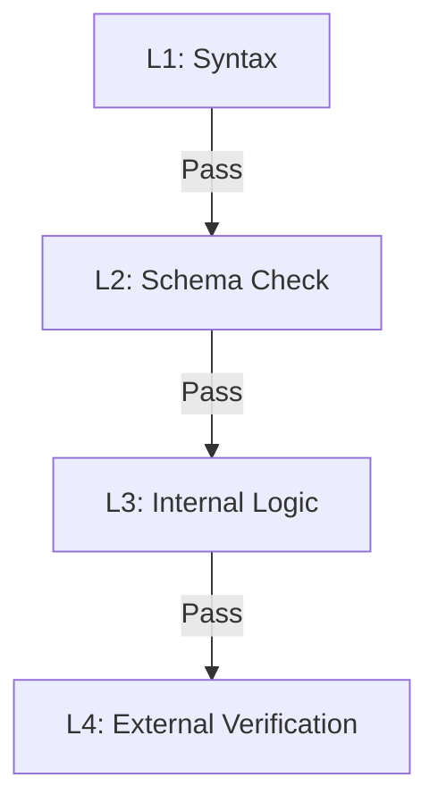

# Quality Control

Typedown's quality control system is layered. We build a tight defense network ranging from low-level syntax validation to high-level external fact verification. Simultaneously, this system defines standardized lifecycle Hooks.

## 1. QC Layer Model

### L1: Syntax & Format

- **Command**: `td lint`
- **Timing**: Editing / Pre-commit
- **Check Content**:
  - Markdown AST structure validity.
  - YAML format correctness (indentation, special characters).
  - **Does not load Python environment**.

### L2: Schema Compliance

- **Command**: `td check`
- **Timing**: Editing / Save
- **Core Engine**: Pydantic Runtime
- **Check Content**:
  - Load `model` definitions.
  - Instantiate `entity`. Execute all Pydantic native validations:
    - Type Checking.
    - Field Validators (`@field_validator`).
    - Model Validators (`@model_validator`).
    - Computed Fields (`@computed_field`).
    - Reference Format.
  - **Boundary**: Ensures data is "structurally" perfect. **Does not run Specs**.

### L3: Business Logic Integrity

- **Command**: `td validate` (Defaults to include L1+L2)
- **Timing**: Compile Time / Pre-Build
- **Core Engine**: Typedown Runtime + Spec System
- **Check Content**:
  - **Graph Resolution**: Ensure all references point to existing entities.
  - **Selector Binding**: Run `spec` blocks.
  - **Complex Rules**: Verify cross-entity constraints or complex domain-specific rules.
  - **Goal**: Internal Consistency. **Never** initiates network requests.

### L4: External Verification

- **Command**: `td test`
- **Timing**: CI / Release
- **Core Engine**: Oracles
- **Check Content**:
  - **Oracle Interaction**: Call external oracles (Government API, CRM, DNS, etc.).
  - **Reality Check**: Verify consistency between data and the real world.
  - **Goal**: External Consistency. **Has side effects**.

## 2. Isolation Principle

To ensure development efficiency and local safety, Typedown strictly enforces **Environment Isolation**:

- **Fast Loop (L1/L2)**: Purely local, millisecond response. IDE plugins should execute in real-time.
- **Safe Loop (L3)**: Purely local, second-level response. Mandatory before build and commit.
- **Trusted Loop (L4)**: Executed only in trusted environments (CI/CD) or under explicit authorization. Involves external interactions.

## 3. Standard Build

Besides the above validation hooks, Typedown also defines a `build` hook for artifact generation.

- **Command**: `td build`
- **Responsibility**: Idempotently output JSON Schema, SQL, HTML, etc.
- **Preconditions**: Usually requires passing L3 (validate) checks.
