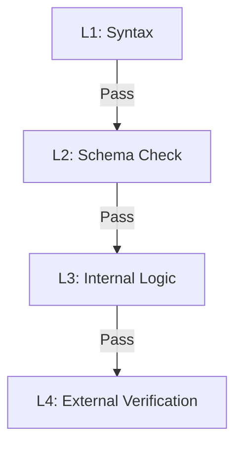

# 质量控制 (Quality Control)

Typedown 的质量控制体系分为四层，从底层的语法校验到顶层的外部事实核验。

## 1. QC 层级模型

### L1: 语法与格式 (Syntax & Format)

- **对应命令**: `td lint`
- **运行时机**: 编辑时 / Pre-commit
- **检查内容**:
  - Markdown AST 结构合法性。
  - YAML 格式正确性（缩进、特殊字符）。
  - **不加载 Python 环境**。

### L2: 数据合规性 (Schema Compliance)

- **对应命令**: `td check`
- **运行时机**: 编辑时 / Save
- **核心引擎**: Pydantic Runtime
- **检查内容**:
  - 加载 `model` 定义。
  - 实例化 `entity`。执行所有 Pydantic 原生校验：
    - 类型检查 (Type Checking)。
    - 字段校验器 (`@field_validator`)。
    - 模型校验器 (`@model_validator`)。
    - 计算字段 (`@computed_field`)。
    - 引用格式校验 (Reference Format)。
  - **边界**: 确保数据在“结构上”是完美的。**不运行 Spec**。

### L3: 业务逻辑完整性 (Business Logic)

- **对应命令**: `td validate` (默认包含 L1+L2)
- **运行时机**: 编译时 / Build 前
- **核心引擎**: Typedown Runtime + Spec System
- **检查内容**:
  - **Graph Resolution**: 确保所有引用指引向存在的实体。
  - **Selector Binding**: 运行 `spec` 块。
  - **Complex Rules**: 验证跨实体约束或复杂的特定领域规则。
  - **目标**: 逻辑自洽 (Internal Consistency)。**绝不**发起网络请求。

### L4: 外部事实核验 (External Verification)

- **对应命令**: `td test`
- **运行时机**: CI / Release
- **核心引擎**: Oracles
- **检查内容**:
  - **Oracle Interaction**: 调用外部预言机（Government API, CRM, DNS 等）。
  - **Reality Check**: 验证数据与现实世界的一致性。
  - **目标**: 事实正确 (External Consistency)。**有副作用**。

## 2. 隔离原则

为了保证开发效率和本地安全性，Typedown 严格执行**环境隔离**：

- **Fast Loop (L1/L2)**: 纯本地，毫秒级响应。IDE 插件应实时执行。
- **Safe Loop (L3)**: 纯本地，秒级响应。构建和提交前的必选项。
- **Trusted Loop (L4)**: 仅在受信任环境（CI/CD）或显式授权下执行。涉及外部交互。

## 3. 标准构建

除了上述校验钩子，Typedown 还定义了 `build` 钩子用于产物生成。

- **Command**: `td build`
- **职责**: 幂等地输出 JSON Schema, SQL, HTML 等交付物。
- **前置条件**: 通常需要通过 L3 (validate) 检查。
