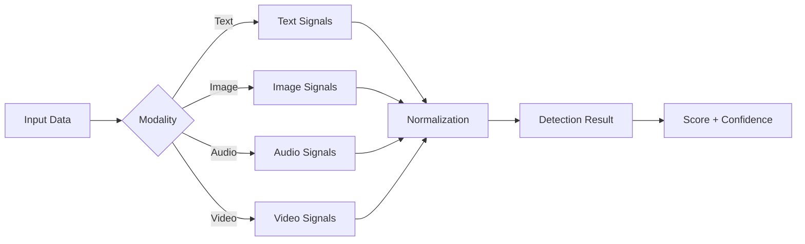

# Veridex Documentation

<div align="center">
  
  <p><strong>A modular, probabilistic, and research-grounded AI content detection library</strong></p>
</div>

---

## Welcome

Veridex is a production-ready library for detecting AI-generated content across multiple modalities: **text**, **image**, **audio**, and **video**. Unlike binary classifiers, Veridex provides **probabilistic detection** with confidence estimates and **interpretable signals**.

<div class="feature-grid">

<div class="feature-card">
  <h3>🎯 Multi-Modal</h3>
  <p>Detect AI-generated text, images, audio, and video with a unified API</p>
</div>

<div class="feature-card">
  <h3>📊 Probabilistic</h3>
  <p>Get confidence scores and probabilities, not just binary labels</p>
</div>

<div class="feature-card">
  <h3>🔍 Interpretable</h3>
  <p>Access individual detection signals for transparency</p>
</div>

<div class="feature-card">
  <h3>🧩 Modular</h3>
  <p>Easy to extend with new detection methods</p>
</div>

<div class="feature-card">
  <h3>🚀 Production-Ready</h3>
  <p>Robust error handling and graceful degradation</p>
</div>

<div class="feature-card">
  <h3>📖 Research-Grounded</h3>
  <p>Based on state-of-the-art academic papers</p>
</div>

</div>

---

## Quick Start

Get started with Veridex in under 5 minutes:

=== "Text Detection"

    ```python
    from veridex.text import PerplexitySignal
    
    # Initialize detector
    detector = PerplexitySignal()
    
    # Analyze text
    result = detector.run("Your text here...")
    
    print(f"AI Probability: {result.score:.2f}")
    print(f"Confidence: {result.confidence:.2f}")
    ```

=== "Image Detection"

    ```python
    from veridex.image import FrequencySignal
    
    # Initialize detector
    detector = FrequencySignal()
    
    # Analyze image
    result = detector.run("image.png")
    
    print(f"AI Probability: {result.score:.2f}")
    ```

=== "Audio Detection"

    ```python
    from veridex.audio import SpectralSignal
    
    # Initialize detector
    detector = SpectralSignal()
    
    # Analyze audio
    result = detector.run("audio.wav")
    
    print(f"AI Probability: {result.score:.2f}")
    ```

=== "Video Detection"

    ```python
    from veridex.video import VideoEnsemble
    
    # Initialize detector
    detector = VideoEnsemble()
    
    # Analyze video
    result = detector.run("video.mp4")
    
    print(f"AI Probability: {result.score:.2f}")
    print(f"Confidence: {result.confidence:.2f}")
    ```

[📚 Full Installation Guide →](getting_started.md){ .md-button .md-button--primary }

---

## How It Works



Veridex uses a **signal-based architecture** where each detector:

1. **Analyzes** specific features or artifacts
2. **Returns** a standardized `DetectionResult`
3. **Operates** independently for transparency
4. **Declares** its limitations explicitly

[🏗️ Learn More About Architecture →](concepts/index.md){ .md-button }

---

## Choose Your Path

<div class="quick-links">
  <a href="tutorials/quick_start/" class="quick-link">
    <strong>🚀 Quick Start</strong><br>
    Get running in 5 minutes
  </a>
  <a href="tutorials/text_detection_guide/" class="quick-link">
    <strong>📝 Text Detection</strong><br>
    Analyze LLM outputs
  </a>
  <a href="tutorials/image_detection_guide/" class="quick-link">
    <strong>🖼️ Image Detection</strong><br>
    Spot AI-generated images
  </a>
  <a href="tutorials/audio_detection_guide/" class="quick-link">
    <strong>🎵 Audio Detection</strong><br>
    Detect voice deepfakes
  </a>
  <a href="tutorials/video_detection/" class="quick-link">
    <strong>🎥 Video Detection</strong><br>
    Detect deepfake videos
  </a>
</div>

---

## Available Detectors

### Text Detection

| Signal | Method | Speed | Accuracy | Best For |
|--------|--------|-------|----------|----------|
| `PerplexitySignal` | Statistical (LLM) | Medium | ⭐⭐ | General purpose |
| `BinocularsSignal` | Contrastive | Medium | ⭐⭐⭐ | High accuracy |
| `ZlibEntropySignal` | Compression | Fast | ⭐ | Quick screening |
| `StylometricSignal` | Linguistic | Fast | ⭐ | Style analysis |

### Image Detection

| Signal | Method | Speed | Accuracy | Best For |
|--------|--------|-------|----------|----------|
| `FrequencySignal` | Spectral | Fast | ⭐⭐ | Quick screening |
| `DIRESignal` | Diffusion | Slow | ⭐⭐⭐ | High accuracy |
| `ELASignal` | Error Level | Fast | ⭐⭐ | Manipulation detection |

### Audio Detection

| Signal | Method | Speed | Accuracy | Best For |
|--------|--------|-------|----------|----------|
| `SpectralSignal` | Frequency | Fast | ⭐⭐ | Lightweight |
| `AASISTSignal` | Spectro-Temporal | Medium | ⭐⭐⭐ | Anti-spoofing |
| `Wav2VecSignal` | Foundation Model | Slow | ⭐⭐⭐⭐ | Production |
| `SilenceSignal` | Pause Analysis | Fast | ⭐ | Speech patterns |

### Video Detection

| Signal | Method | Speed | Accuracy | Best For |
|--------|--------|-------|----------|----------|
| `RPPGSignal` | Biological | Medium | ⭐⭐⭐ | Face swaps |
| `I3DSignal` | Spatiotemporal | Medium | ⭐⭐⭐ | General deepfakes |
| `LipSyncSignal` | Audio-Visual | Medium | ⭐⭐⭐ | Dubbing |
| `VideoEnsemble` | Fusion | Medium | ⭐⭐⭐⭐ | Production use |

[📦 See All Detectors →](api/core.md){ .md-button }

---

## Popular Guides

<div class="feature-grid">

<div class="feature-card">
  <h3>📖 Tutorials</h3>
  <p>Step-by-step guides for each modality</p>
  <a href="tutorials/index/">Browse Tutorials →</a>
</div>

<div class="feature-card">
  <h3>🔍 Concepts</h3>
  <p>Understand the architecture and signals</p>
  <a href="concepts/index/">Learn Concepts →</a>
</div>

<div class="feature-card">
  <h3>📘 API Reference</h3>
  <p>Complete API documentation</p>
  <a href="api/core/">View API Docs →</a>
</div>

<div class="feature-card">
  <h3>❓ FAQ & Troubleshooting</h3>
  <p>Common questions and solutions</p>
  <a href="faq/">Get Help →</a>
</div>

<div class="feature-card">
  <h3>🎯 Use Cases</h3>
  <p>Real-world applications</p>
  <a href="use_cases/">Explore Use Cases →</a>
</div>

<div class="feature-card">
  <h3>⚡ Performance</h3>
  <p>Optimization and benchmarking</p>
  <a href="performance/">Optimize Performance →</a>
</div>

</div>

---

## What's New

!!! info "Latest Updates"
    - ✅ Added `SilenceSignal` for audio detection
    - ✅ Added `StylometricSignal` for text analysis
    - ✅ Added `ELASignal` for image manipulation detection
    - ✅ Added Video Detection support (`RPPG`, `I3D`, `LipSync`)
    - ✅ Improved test coverage to 80%+
    - ✅ Enhanced documentation with tutorials

[📝 View Full Changelog](CHANGELOG.md){ .md-button }

---

## Community & Support

Have questions or want to contribute?

- 💬 [GitHub Discussions](https://github.com/ADITYAMAHAKALI/veridex/discussions) - Ask questions and share ideas
- 🐛 [Issue Tracker](https://github.com/ADITYAMAHAKALI/veridex/issues) - Report bugs or request features
- 📧 [Email](mailto:adityamahakali@aisolve.org) - Direct contact
- 🤝 [Contributing Guide](CONTRIBUTING.md) - Learn how to contribute

---

## Quick Links

- [Installation Guide](getting_started.md)
- [5-Minute Quick Start](tutorials/quick_start.md)
- [Text Detection Tutorial](tutorials/text_detection_guide.md)
- [Image Detection Tutorial](tutorials/image_detection_guide.md)
- [Audio Detection Tutorial](tutorials/audio_detection_guide.md)
- [Video Detection Tutorial](tutorials/video_detection.md)
- [API Reference](api/core.md)
- [FAQ](faq.md)
- [GitHub Repository](https://github.com/ADITYAMAHAKALI/veridex)

---

**Connect with Me:** [Aditya Mahakali on LinkedIn](https://www.linkedin.com/in/aditya-mahakali-b81758168/)

**Built with ❤️ for transparency in the age of generative AI**
